# PostgreSQL Advanced Best Practices (PostgreSQL 18+)

## Architecture at a Glance

```mermaid
flowchart LR
    APP["🖥️ Application"]
    
    subgraph DB["PostgreSQL Database"]
        API["api schema<br/>─────────────<br/>get_customer()<br/>insert_order()"]
        PRIV["private schema<br/>─────────────<br/>set_updated_at()<br/>hash_password()"]
        DATA[("data schema<br/>─────────────<br/>customers<br/>orders")]
    end
    
    APP -->|"EXECUTE"| API
    API -->|"SECURITY DEFINER"| DATA
    API --> PRIV
    PRIV -->|"triggers"| DATA
    
    APP x-.-x|"❌ blocked"| DATA
    
    style API fill:#c8e6c9
    style PRIV fill:#fff3e0
    style DATA fill:#e3f2fd
```



## Skill Contents

### 🚀 Getting Started (Read These First)

| Document | Purpose |
|----------|---------|
| [quick-reference.md](references/quick-reference.md) | **QUICK LOOKUP** - Single-page cheat sheet (print this!) |
| [schema-architecture.md](references/schema-architecture.md) | **START HERE** - Schema separation pattern (data/private/api) |
| [coding-standards-trivadis.md](references/coding-standards-trivadis.md) | Coding standards & naming conventions (l_, g_, co_) |

### 📚 Core Reference (Use Daily)

| Document | Purpose |
|----------|---------|
| [plpgsql-table-api.md](references/plpgsql-table-api.md) | Table API functions, procedures, triggers |
| [schema-naming.md](references/schema-naming.md) | Naming conventions for all objects |
| [data-types.md](references/data-types.md) | Data type selection (UUIDv7, text, timestamptz) |
| [indexes-constraints.md](references/indexes-constraints.md) | Index types, strategies, constraints |
| [migrations.md](references/migrations.md) | Native migration system documentation |
| [anti-patterns.md](references/anti-patterns.md) | Common mistakes to avoid |
| [checklists-troubleshooting.md](references/checklists-troubleshooting.md) | Project checklists & problem solutions |

### 🔧 Advanced Topics (When Needed)

| Document | Purpose |
|----------|---------|
| [testing-patterns.md](references/testing-patterns.md) | pgTAP unit testing, test factories |
| [performance-tuning.md](references/performance-tuning.md) | EXPLAIN ANALYZE, query optimization, JIT |
| [row-level-security.md](references/row-level-security.md) | RLS patterns, multi-tenant isolation |
| [jsonb-patterns.md](references/jsonb-patterns.md) | JSONB indexing, queries, validation |
| [audit-logging.md](references/audit-logging.md) | Generic audit triggers, change tracking |
| [bulk-operations.md](references/bulk-operations.md) | COPY, batch inserts, upserts |
| [session-management.md](references/session-management.md) | Session variables, connection pooling |
| [transaction-patterns.md](references/transaction-patterns.md) | Isolation levels, locking, deadlock prevention |
| [full-text-search.md](references/full-text-search.md) | tsvector, tsquery, ranking, multi-language |
| [partitioning.md](references/partitioning.md) | Range, list, hash partitioning strategies |
| [window-functions.md](references/window-functions.md) | Frames, ranking, running calculations |
| [time-series.md](references/time-series.md) | Time-series data patterns, BRIN indexes |
| [event-sourcing.md](references/event-sourcing.md) | Event store, projections, CQRS |
| [queue-patterns.md](references/queue-patterns.md) | Job queues, SKIP LOCKED, LISTEN/NOTIFY |
| [encryption.md](references/encryption.md) | pgcrypto, column encryption, TLS |
| [vector-search.md](references/vector-search.md) | pgvector, embeddings, similarity search |
| [postgis-patterns.md](references/postgis-patterns.md) | Spatial data, geographic queries |

### 🚀 DevOps & Migration

| Document | Purpose |
|----------|---------|
| [oracle-migration-guide.md](references/oracle-migration-guide.md) | PL/SQL to PL/pgSQL conversion |
| [cicd-integration.md](references/cicd-integration.md) | GitHub Actions, GitLab CI, Docker |
| [monitoring-observability.md](references/monitoring-observability.md) | pg_stat_statements, metrics, alerting |
| [backup-recovery.md](references/backup-recovery.md) | pg_dump, pg_basebackup, PITR |
| [replication-ha.md](references/replication-ha.md) | Streaming/logical replication, failover |

### 📊 Data Warehousing

| Document | Purpose |
|----------|---------|
| [data-warehousing-medallion.md](references/data-warehousing-medallion.md) | **Medallion Architecture** - Bronze/Silver/Gold, data lineage, ETL |
| [analytical-queries.md](references/analytical-queries.md) | Analytical query patterns, OLAP optimization, GROUPING SETS |

### Executable Scripts

| Script | Purpose |
|--------|---------|
| [001_install_migration_system.sql](scripts/001_install_migration_system.sql) | Install migration system (core functions) |
| [002_migration_runner_helpers.sql](scripts/002_migration_runner_helpers.sql) | Helper procedures (`run_versioned`, `run_repeatable`) |
| [003_example_migrations.sql](scripts/003_example_migrations.sql) | Example migration patterns |
| [999_uninstall_migration_system.sql](scripts/999_uninstall_migration_system.sql) | Clean removal of migration system |

---

## Core Architecture

### Schema Separation Pattern

```
Application → api schema → data schema
                ↓
            private schema (triggers, helpers)
```

| Schema | Contains | Access | Purpose |
|--------|----------|--------|---------|
| `data` | Tables, indexes | None | Data storage |
| `private` | Triggers, helpers | None | Internal logic |
| `api` | Functions, procedures | Applications | External interface |
| `app_audit` | Audit tables | Admins | Change tracking |
| `app_migration` | Migration tracking | Admins | Schema versioning |

### Security Model

All `api` functions MUST have:
```sql
SECURITY DEFINER
SET search_path = data, private, pg_temp
```

---

## Quick Reference

### Create Table Pattern

```sql
CREATE TABLE data.{table_name} (
    id              uuid PRIMARY KEY DEFAULT uuidv7(),
    -- columns...
    created_at      timestamptz NOT NULL DEFAULT now(),
    updated_at      timestamptz NOT NULL DEFAULT now()
);

CREATE TRIGGER {table}_bu_updated_trg
    BEFORE UPDATE ON data.{table_name}
    FOR EACH ROW EXECUTE FUNCTION private.set_updated_at();
```

### API Function Pattern

```sql
CREATE FUNCTION api.{action}_{entity}(in_param type)
RETURNS TABLE (col1 type, col2 type)
LANGUAGE sql STABLE
SECURITY DEFINER
SET search_path = data, private, pg_temp
AS $$
    SELECT col1, col2 FROM data.{table} WHERE ...;
$$;
```

### API Procedure Pattern

```sql
CREATE PROCEDURE api.{action}_{entity}(
    in_param type,
    INOUT io_id uuid DEFAULT NULL
)
LANGUAGE plpgsql
SECURITY DEFINER
SET search_path = data, private, pg_temp
AS $$
BEGIN
    INSERT INTO data.{table} (...) VALUES (...) RETURNING id INTO io_id;
END;
$$;
```

### Migration Pattern

```sql
SELECT app_migration.acquire_lock();

CALL app_migration.run_versioned(
    in_version := '001',
    in_description := 'Description',
    in_sql := $mig$ ... $mig$,
    in_rollback_sql := '...'
);

SELECT app_migration.release_lock();
```

---

## Naming Conventions

### Trivadis-Style Variable Prefixes

| Prefix | Type | Example |
|--------|------|---------|
| `l_` | Local variable | `l_customer_count` |
| `g_` | Session/global variable | `g_current_user_id` |
| `co_` | Constant | `co_max_retries` |
| `in_` | IN parameter | `in_customer_id` |
| `out_` | OUT parameter (functions only) | `out_total` |
| `io_` | INOUT parameter (procedures) | `io_id` |
| `c_` | Cursor | `c_active_orders` |
| `r_` | Record | `r_customer` |
| `t_` | Array/table | `t_order_ids` |
| `e_` | Exception | `e_not_found` |

> **Note**: PostgreSQL procedures only support INOUT parameters, not OUT. Use `io_` prefix for all procedure output parameters.

### Database Objects

| Object | Pattern | Example |
|--------|---------|---------|
| Table | `snake_case`, plural | `orders`, `order_items` |
| Column | `snake_case` | `customer_id`, `created_at` |
| Primary Key | `id` | `id` |
| Foreign Key | `{table_singular}_id` | `customer_id` |
| Index | `{table}_{cols}_idx` | `orders_customer_id_idx` |
| Unique | `{table}_{cols}_key` | `users_email_key` |
| Function | `{action}_{entity}` | `get_customer`, `select_orders` |
| Procedure | `{action}_{entity}` | `insert_order`, `update_status` |
| Trigger | `{table}_{timing}{event}_trg` | `orders_bu_trg` |

---

## Data Type Recommendations

| Use | Instead Of |
|-----|------------|
| `text` | `char(n)`, `varchar(n)` |
| `numeric(p,s)` | `money`, `float` |
| `timestamptz` | `timestamp` |
| `boolean` | `integer` flags |
| `uuidv7()` | `serial`, `uuid_generate_v4()` |
| `GENERATED ALWAYS AS IDENTITY` | `serial`, `bigserial` |
| `jsonb` | `json`, EAV pattern |

---

## Critical Anti-Patterns

1. ❌ Direct table access from applications
2. ❌ `RETURNS SETOF table` (exposes all columns)
3. ❌ Missing `SET search_path` with `SECURITY DEFINER`
4. ❌ `timestamp` without timezone
5. ❌ `NOT IN` with subqueries (use `NOT EXISTS`)
6. ❌ `BETWEEN` with timestamps (use `>= AND <`)
7. ❌ Missing indexes on foreign keys
8. ❌ `serial`/`bigserial` (use `IDENTITY`)
9. ❌ `varchar(n)` arbitrary limits (use `text`)
10. ❌ `SELECT FOR UPDATE` without `NOWAIT`/`SKIP LOCKED`

---

## PostgreSQL 18+ Features

| Feature | Usage |
|---------|-------|
| `uuidv7()` | `id uuid DEFAULT uuidv7()` - timestamp-ordered UUIDs |
| Virtual generated columns | `col type GENERATED ALWAYS AS (expr)` - computed at query time |
| `OLD`/`NEW` in RETURNING | `UPDATE ... RETURNING OLD.col, NEW.col` |
| Temporal constraints | `PRIMARY KEY (id) WITHOUT OVERLAPS` |
| `NOT VALID` constraints | Add constraints without full table scan |

---

## File Organization

```
db/
├── migrations/
│   ├── V001__create_schemas.sql
│   ├── V002__create_tables.sql
│   └── repeatable/
│       ├── R__private_triggers.sql
│       └── R__api_functions.sql
├── schemas/
│   ├── data/           # Table definitions
│   ├── private/        # Internal functions
│   └── api/            # External interface
└── seeds/              # Reference data
```
