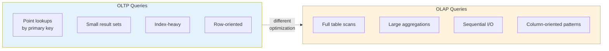

# Analytical Query Best Practices

A comprehensive guide to writing efficient analytical queries in PostgreSQL data warehouses. Covers query patterns, optimization techniques, and performance tuning for OLAP workloads.

## Table of Contents

1. [Analytical Query Fundamentals](#analytical-query-fundamentals)
2. [Aggregation Patterns](#aggregation-patterns)
3. [Time-Based Analysis](#time-based-analysis)
4. [Ranking and Top-N Queries](#ranking-and-top-n-queries)
5. [Cohort and Retention Analysis](#cohort-and-retention-analysis)
6. [Star Schema Query Patterns](#star-schema-query-patterns)
7. [Query Optimization](#query-optimization)
8. [Parallel Query Execution](#parallel-query-execution)
9. [Materialized View Strategies](#materialized-view-strategies)
10. [Common Anti-Patterns](#common-anti-patterns)

---

## Analytical Query Fundamentals

### OLTP vs OLAP Query Characteristics



### Key Principles for Analytical Queries

| Principle | Description |
|-----------|-------------|
| **Minimize data movement** | Filter early, aggregate progressively |
| **Leverage pre-aggregation** | Use materialized views and summary tables |
| **Exploit parallelism** | Configure parallel query settings appropriately |
| **Use appropriate data types** | Smaller types = faster scans |
| **Partition intelligently** | Enable partition pruning for time-based queries |

---

## Aggregation Patterns

### Basic Aggregations with GROUPING SETS

```sql
-- GROUPING SETS: Multiple aggregation levels in one query
-- Instead of UNION ALL of multiple GROUP BY queries

-- Bad: Multiple queries combined
SELECT date_key, NULL AS product_category, SUM(amount)
FROM gold.fact_sales GROUP BY date_key
UNION ALL
SELECT NULL, product_category, SUM(amount)
FROM gold.fact_sales f
JOIN gold.dim_product p ON p.product_key = f.product_key
GROUP BY product_category
UNION ALL
SELECT NULL, NULL, SUM(amount)
FROM gold.fact_sales;

-- Good: Single pass with GROUPING SETS
SELECT
    d.full_date,
    p.product_category,
    SUM(f.amount) AS total_amount,
    GROUPING(d.full_date) AS is_date_subtotal,
    GROUPING(p.product_category) AS is_category_subtotal
FROM gold.fact_sales f
JOIN gold.dim_date d ON d.date_key = f.date_key
JOIN gold.dim_product p ON p.product_key = f.product_key
WHERE d.year = 2024
GROUP BY GROUPING SETS (
    (d.full_date, p.product_category),  -- Detail level
    (d.full_date),                       -- By date
    (p.product_category),                -- By category
    ()                                   -- Grand total
)
ORDER BY
    GROUPING(d.full_date),
    GROUPING(p.product_category),
    d.full_date,
    p.product_category;
```

### CUBE for All Combinations

```sql
-- CUBE: All possible grouping combinations
-- Equivalent to GROUPING SETS with all 2^n combinations

SELECT
    d.year,
    d.quarter,
    c.customer_segment,
    SUM(f.amount) AS total_sales,
    COUNT(DISTINCT f.order_id) AS order_count
FROM gold.fact_sales f
JOIN gold.dim_date d ON d.date_key = f.date_key
JOIN gold.dim_customer c ON c.customer_key = f.customer_key
WHERE d.year >= 2023
GROUP BY CUBE (d.year, d.quarter, c.customer_segment)
ORDER BY
    GROUPING(d.year),
    GROUPING(d.quarter),
    GROUPING(c.customer_segment),
    d.year, d.quarter, c.customer_segment;

-- Result includes:
-- (year, quarter, segment) - Detail
-- (year, quarter)          - By time
-- (year, segment)          - By year+segment
-- (quarter, segment)       - By quarter+segment
-- (year)                   - Year totals
-- (quarter)                - Quarter totals
-- (segment)                - Segment totals
-- ()                       - Grand total
```

### ROLLUP for Hierarchical Totals

```sql
-- ROLLUP: Hierarchical subtotals (right-to-left removal)
-- Perfect for hierarchical dimensions like geography or time

SELECT
    COALESCE(d.year::text, 'All Years') AS year,
    COALESCE(d.quarter_name, 'All Quarters') AS quarter,
    COALESCE(d.month_name, 'All Months') AS month,
    SUM(f.amount) AS total_sales,
    COUNT(*) AS transaction_count
FROM gold.fact_sales f
JOIN gold.dim_date d ON d.date_key = f.date_key
WHERE d.year = 2024
GROUP BY ROLLUP (d.year, d.quarter_name, d.month_name)
ORDER BY
    GROUPING(d.year),
    GROUPING(d.quarter_name),
    GROUPING(d.month_name),
    d.year, d.quarter_name, d.month_name;

-- Result includes:
-- (year, quarter, month) - Detail
-- (year, quarter)        - Quarter subtotals
-- (year)                 - Year subtotals
-- ()                     - Grand total
```

### Conditional Aggregation

```sql
-- Pivot-style aggregation using FILTER clause
SELECT
    d.year,
    d.month,
    SUM(f.amount) AS total_sales,
    SUM(f.amount) FILTER (WHERE c.customer_segment = 'enterprise') AS enterprise_sales,
    SUM(f.amount) FILTER (WHERE c.customer_segment = 'small_business') AS smb_sales,
    SUM(f.amount) FILTER (WHERE c.customer_segment = 'consumer') AS consumer_sales,
    COUNT(*) FILTER (WHERE f.amount > 1000) AS large_orders,
    AVG(f.amount) FILTER (WHERE c.is_new_customer) AS new_customer_avg
FROM gold.fact_sales f
JOIN gold.dim_date d ON d.date_key = f.date_key
JOIN gold.dim_customer c ON c.customer_key = f.customer_key
WHERE d.year = 2024
GROUP BY d.year, d.month
ORDER BY d.year, d.month;
```

### Percentile and Distribution Analysis

```sql
-- Percentile calculations
SELECT
    p.product_category,
    COUNT(*) AS order_count,
    ROUND(AVG(f.amount), 2) AS avg_amount,
    ROUND(PERCENTILE_CONT(0.5) WITHIN GROUP (ORDER BY f.amount), 2) AS median_amount,
    ROUND(PERCENTILE_CONT(0.25) WITHIN GROUP (ORDER BY f.amount), 2) AS p25_amount,
    ROUND(PERCENTILE_CONT(0.75) WITHIN GROUP (ORDER BY f.amount), 2) AS p75_amount,
    ROUND(PERCENTILE_CONT(0.95) WITHIN GROUP (ORDER BY f.amount), 2) AS p95_amount,
    MODE() WITHIN GROUP (ORDER BY f.amount::integer) AS mode_amount
FROM gold.fact_sales f
JOIN gold.dim_product p ON p.product_key = f.product_key
GROUP BY p.product_category
ORDER BY avg_amount DESC;

-- Distribution buckets using width_bucket
SELECT
    width_bucket(f.amount, 0, 1000, 10) AS bucket,
    COUNT(*) AS order_count,
    MIN(f.amount) AS bucket_min,
    MAX(f.amount) AS bucket_max
FROM gold.fact_sales f
GROUP BY width_bucket(f.amount, 0, 1000, 10)
ORDER BY bucket;
```

---

## Time-Based Analysis

### Period-Over-Period Comparisons

```sql
-- Year-over-Year comparison using LAG
WITH monthly_sales AS (
    SELECT
        d.year,
        d.month,
        SUM(f.amount) AS total_sales
    FROM gold.fact_sales f
    JOIN gold.dim_date d ON d.date_key = f.date_key
    GROUP BY d.year, d.month
)
SELECT
    year,
    month,
    total_sales,
    LAG(total_sales, 12) OVER (ORDER BY year, month) AS sales_last_year,
    ROUND(
        (total_sales - LAG(total_sales, 12) OVER (ORDER BY year, month))
        / NULLIF(LAG(total_sales, 12) OVER (ORDER BY year, month), 0) * 100,
        2
    ) AS yoy_growth_pct
FROM monthly_sales
WHERE year >= 2023
ORDER BY year, month;

-- Month-over-Month with running total
SELECT
    year,
    month,
    total_sales,
    LAG(total_sales, 1) OVER (ORDER BY year, month) AS sales_last_month,
    SUM(total_sales) OVER (
        PARTITION BY year
        ORDER BY month
        ROWS UNBOUNDED PRECEDING
    ) AS ytd_sales
FROM monthly_sales
ORDER BY year, month;
```

### Moving Averages and Trends

```sql
-- Moving averages with different windows
WITH daily_sales AS (
    SELECT
        d.full_date,
        SUM(f.amount) AS daily_amount
    FROM gold.fact_sales f
    JOIN gold.dim_date d ON d.date_key = f.date_key
    WHERE d.year = 2024
    GROUP BY d.full_date
)
SELECT
    full_date,
    daily_amount,
    -- 7-day moving average
    ROUND(AVG(daily_amount) OVER (
        ORDER BY full_date
        ROWS BETWEEN 6 PRECEDING AND CURRENT ROW
    ), 2) AS ma_7day,
    -- 30-day moving average
    ROUND(AVG(daily_amount) OVER (
        ORDER BY full_date
        ROWS BETWEEN 29 PRECEDING AND CURRENT ROW
    ), 2) AS ma_30day,
    -- Exponential-like weighted average (recent days weighted more)
    ROUND(
        SUM(daily_amount * (ROW_NUMBER() OVER (ORDER BY full_date))) OVER (
            ORDER BY full_date
            ROWS BETWEEN 6 PRECEDING AND CURRENT ROW
        ) / NULLIF(SUM(ROW_NUMBER() OVER (ORDER BY full_date)) OVER (
            ORDER BY full_date
            ROWS BETWEEN 6 PRECEDING AND CURRENT ROW
        ), 0),
        2
    ) AS weighted_ma_7day
FROM daily_sales
ORDER BY full_date;
```

### Gap and Island Detection

```sql
-- Find gaps in sequential data (missing dates)
WITH date_range AS (
    SELECT generate_series(
        (SELECT MIN(full_date) FROM gold.dim_date WHERE year = 2024),
        (SELECT MAX(full_date) FROM gold.dim_date WHERE year = 2024),
        '1 day'::interval
    )::date AS expected_date
),
actual_dates AS (
    SELECT DISTINCT d.full_date
    FROM gold.fact_sales f
    JOIN gold.dim_date d ON d.date_key = f.date_key
    WHERE d.year = 2024
)
SELECT expected_date AS missing_date
FROM date_range
WHERE expected_date NOT IN (SELECT full_date FROM actual_dates)
ORDER BY expected_date;

-- Islands: Find consecutive date ranges with sales
WITH sales_dates AS (
    SELECT DISTINCT d.full_date,
        full_date - (ROW_NUMBER() OVER (ORDER BY full_date))::integer AS grp
    FROM gold.fact_sales f
    JOIN gold.dim_date d ON d.date_key = f.date_key
    WHERE d.year = 2024
)
SELECT
    MIN(full_date) AS island_start,
    MAX(full_date) AS island_end,
    MAX(full_date) - MIN(full_date) + 1 AS days_in_island
FROM sales_dates
GROUP BY grp
ORDER BY island_start;
```

### Date Spine Pattern

```sql
-- Generate complete time series with zero-fill
WITH date_spine AS (
    SELECT date_key, full_date
    FROM gold.dim_date
    WHERE full_date BETWEEN '2024-01-01' AND '2024-12-31'
),
daily_totals AS (
    SELECT
        f.date_key,
        SUM(f.amount) AS daily_amount,
        COUNT(*) AS order_count
    FROM gold.fact_sales f
    GROUP BY f.date_key
)
SELECT
    ds.full_date,
    COALESCE(dt.daily_amount, 0) AS daily_amount,
    COALESCE(dt.order_count, 0) AS order_count,
    SUM(COALESCE(dt.daily_amount, 0)) OVER (
        ORDER BY ds.full_date
    ) AS cumulative_amount
FROM date_spine ds
LEFT JOIN daily_totals dt ON dt.date_key = ds.date_key
ORDER BY ds.full_date;
```

---

## Ranking and Top-N Queries

### Efficient Top-N Queries

```sql
-- Top 10 customers by revenue (optimized)
SELECT
    c.customer_id,
    c.name,
    c.customer_segment,
    SUM(f.amount) AS total_revenue
FROM gold.fact_sales f
JOIN gold.dim_customer c ON c.customer_key = f.customer_key
WHERE c.is_current = true
GROUP BY c.customer_key, c.customer_id, c.name, c.customer_segment
ORDER BY total_revenue DESC
LIMIT 10;

-- Top N per category using ROW_NUMBER
WITH ranked_products AS (
    SELECT
        p.product_category,
        p.product_name,
        SUM(f.amount) AS total_sales,
        ROW_NUMBER() OVER (
            PARTITION BY p.product_category
            ORDER BY SUM(f.amount) DESC
        ) AS rank_in_category
    FROM gold.fact_sales f
    JOIN gold.dim_product p ON p.product_key = f.product_key
    GROUP BY p.product_key, p.product_category, p.product_name
)
SELECT *
FROM ranked_products
WHERE rank_in_category <= 5
ORDER BY product_category, rank_in_category;
```

### Ranking Functions Comparison

```sql
-- Different ranking functions for ties
SELECT
    c.customer_segment,
    c.name,
    SUM(f.amount) AS total_sales,
    -- ROW_NUMBER: Unique sequential numbers (arbitrary for ties)
    ROW_NUMBER() OVER (ORDER BY SUM(f.amount) DESC) AS row_num,
    -- RANK: Same rank for ties, gaps after
    RANK() OVER (ORDER BY SUM(f.amount) DESC) AS rank_with_gaps,
    -- DENSE_RANK: Same rank for ties, no gaps
    DENSE_RANK() OVER (ORDER BY SUM(f.amount) DESC) AS dense_rank,
    -- NTILE: Distribute into N buckets
    NTILE(4) OVER (ORDER BY SUM(f.amount) DESC) AS quartile,
    -- PERCENT_RANK: Relative rank as percentage
    ROUND(PERCENT_RANK() OVER (ORDER BY SUM(f.amount) DESC) * 100, 2) AS percent_rank,
    -- CUME_DIST: Cumulative distribution
    ROUND(CUME_DIST() OVER (ORDER BY SUM(f.amount) DESC) * 100, 2) AS cumulative_dist
FROM gold.fact_sales f
JOIN gold.dim_customer c ON c.customer_key = f.customer_key
WHERE c.is_current = true
GROUP BY c.customer_key, c.customer_segment, c.name
ORDER BY total_sales DESC
LIMIT 20;
```

### Pareto Analysis (80/20 Rule)

```sql
-- Find customers contributing to 80% of revenue
WITH customer_revenue AS (
    SELECT
        c.customer_id,
        c.name,
        SUM(f.amount) AS customer_revenue
    FROM gold.fact_sales f
    JOIN gold.dim_customer c ON c.customer_key = f.customer_key
    WHERE c.is_current = true
    GROUP BY c.customer_key, c.customer_id, c.name
),
cumulative AS (
    SELECT
        customer_id,
        name,
        customer_revenue,
        SUM(customer_revenue) OVER (ORDER BY customer_revenue DESC) AS running_total,
        SUM(customer_revenue) OVER () AS grand_total,
        ROW_NUMBER() OVER (ORDER BY customer_revenue DESC) AS customer_rank,
        COUNT(*) OVER () AS total_customers
    FROM customer_revenue
)
SELECT
    customer_id,
    name,
    customer_revenue,
    ROUND(customer_revenue / grand_total * 100, 2) AS pct_of_total,
    ROUND(running_total / grand_total * 100, 2) AS cumulative_pct,
    customer_rank,
    ROUND(customer_rank::numeric / total_customers * 100, 2) AS customer_percentile
FROM cumulative
WHERE running_total <= grand_total * 0.8
   OR customer_rank = 1  -- Always include top customer
ORDER BY customer_rank;
```

---

## Cohort and Retention Analysis

### Customer Cohort Analysis

```sql
-- Monthly cohort retention analysis
WITH customer_cohorts AS (
    -- Assign customers to their first-purchase month cohort
    SELECT
        c.customer_key,
        DATE_TRUNC('month', MIN(d.full_date)) AS cohort_month
    FROM gold.fact_sales f
    JOIN gold.dim_customer c ON c.customer_key = f.customer_key
    JOIN gold.dim_date d ON d.date_key = f.date_key
    GROUP BY c.customer_key
),
monthly_activity AS (
    -- Get all months where each customer made a purchase
    SELECT DISTINCT
        c.customer_key,
        DATE_TRUNC('month', d.full_date) AS activity_month
    FROM gold.fact_sales f
    JOIN gold.dim_customer c ON c.customer_key = f.customer_key
    JOIN gold.dim_date d ON d.date_key = f.date_key
),
cohort_data AS (
    SELECT
        cc.cohort_month,
        ma.activity_month,
        EXTRACT(YEAR FROM AGE(ma.activity_month, cc.cohort_month)) * 12 +
        EXTRACT(MONTH FROM AGE(ma.activity_month, cc.cohort_month)) AS months_since_cohort,
        COUNT(DISTINCT cc.customer_key) AS customer_count
    FROM customer_cohorts cc
    JOIN monthly_activity ma ON ma.customer_key = cc.customer_key
    GROUP BY cc.cohort_month, ma.activity_month
),
cohort_sizes AS (
    SELECT
        cohort_month,
        COUNT(*) AS cohort_size
    FROM customer_cohorts
    GROUP BY cohort_month
)
SELECT
    TO_CHAR(cd.cohort_month, 'YYYY-MM') AS cohort,
    cs.cohort_size,
    cd.months_since_cohort AS month_n,
    cd.customer_count AS active_customers,
    ROUND(cd.customer_count::numeric / cs.cohort_size * 100, 1) AS retention_pct
FROM cohort_data cd
JOIN cohort_sizes cs ON cs.cohort_month = cd.cohort_month
WHERE cd.cohort_month >= DATE_TRUNC('month', CURRENT_DATE - INTERVAL '12 months')
ORDER BY cd.cohort_month, cd.months_since_cohort;
```

### Retention Matrix (Pivot Format)

```sql
-- Retention matrix with months as columns
WITH cohort_retention AS (
    -- [Use cohort_data CTE from above]
    SELECT
        cohort_month,
        months_since_cohort,
        customer_count,
        FIRST_VALUE(customer_count) OVER (
            PARTITION BY cohort_month
            ORDER BY months_since_cohort
        ) AS cohort_size
    FROM cohort_data
    WHERE months_since_cohort <= 6  -- First 6 months
)
SELECT
    TO_CHAR(cohort_month, 'YYYY-MM') AS cohort,
    cohort_size,
    MAX(CASE WHEN months_since_cohort = 0 THEN ROUND(customer_count::numeric / cohort_size * 100, 1) END) AS m0,
    MAX(CASE WHEN months_since_cohort = 1 THEN ROUND(customer_count::numeric / cohort_size * 100, 1) END) AS m1,
    MAX(CASE WHEN months_since_cohort = 2 THEN ROUND(customer_count::numeric / cohort_size * 100, 1) END) AS m2,
    MAX(CASE WHEN months_since_cohort = 3 THEN ROUND(customer_count::numeric / cohort_size * 100, 1) END) AS m3,
    MAX(CASE WHEN months_since_cohort = 4 THEN ROUND(customer_count::numeric / cohort_size * 100, 1) END) AS m4,
    MAX(CASE WHEN months_since_cohort = 5 THEN ROUND(customer_count::numeric / cohort_size * 100, 1) END) AS m5,
    MAX(CASE WHEN months_since_cohort = 6 THEN ROUND(customer_count::numeric / cohort_size * 100, 1) END) AS m6
FROM cohort_retention
GROUP BY cohort_month, cohort_size
ORDER BY cohort_month;
```

### Customer Lifetime Value (CLV)

```sql
-- Calculate customer lifetime value metrics
WITH customer_metrics AS (
    SELECT
        c.customer_key,
        c.customer_id,
        c.customer_segment,
        MIN(d.full_date) AS first_purchase_date,
        MAX(d.full_date) AS last_purchase_date,
        COUNT(DISTINCT f.order_id) AS total_orders,
        SUM(f.amount) AS total_revenue,
        AVG(f.amount) AS avg_order_value,
        MAX(d.full_date) - MIN(d.full_date) AS customer_lifespan_days
    FROM gold.fact_sales f
    JOIN gold.dim_customer c ON c.customer_key = f.customer_key
    JOIN gold.dim_date d ON d.date_key = f.date_key
    WHERE c.is_current = true
    GROUP BY c.customer_key, c.customer_id, c.customer_segment
)
SELECT
    customer_segment,
    COUNT(*) AS customer_count,
    ROUND(AVG(total_revenue), 2) AS avg_lifetime_value,
    ROUND(PERCENTILE_CONT(0.5) WITHIN GROUP (ORDER BY total_revenue), 2) AS median_ltv,
    ROUND(AVG(total_orders), 2) AS avg_orders_per_customer,
    ROUND(AVG(avg_order_value), 2) AS avg_order_value,
    ROUND(AVG(customer_lifespan_days), 0) AS avg_lifespan_days,
    ROUND(AVG(total_orders::numeric / NULLIF(customer_lifespan_days, 0) * 30), 2) AS avg_orders_per_month
FROM customer_metrics
GROUP BY customer_segment
ORDER BY avg_lifetime_value DESC;
```

---

## Star Schema Query Patterns

### Dimension Filter Pushdown

```sql
-- Efficient star schema query with dimension filters
-- Filters are pushed to dimension tables first

SELECT
    d.year,
    d.quarter_name,
    p.product_category,
    c.customer_segment,
    SUM(f.quantity) AS total_quantity,
    SUM(f.amount) AS total_revenue,
    COUNT(DISTINCT f.order_id) AS order_count
FROM gold.fact_sales f
-- Join dimensions with filters
JOIN gold.dim_date d ON d.date_key = f.date_key
    AND d.year = 2024                    -- Filter in join condition
    AND NOT d.is_weekend                 -- Weekdays only
JOIN gold.dim_product p ON p.product_key = f.product_key
    AND p.is_current = true              -- Current products only
    AND p.product_category IN ('Electronics', 'Software')
JOIN gold.dim_customer c ON c.customer_key = f.customer_key
    AND c.is_current = true              -- Current customers only
    AND c.customer_segment = 'enterprise'
GROUP BY d.year, d.quarter_name, p.product_category, c.customer_segment
ORDER BY d.year, d.quarter_name, total_revenue DESC;
```

### Snowflake Schema Optimization

```sql
-- When dimensions have sub-dimensions, flatten for analytical queries
-- Or use materialized views

-- Instead of multiple joins through hierarchy:
-- fact -> dim_product -> dim_category -> dim_department

-- Pre-flatten in dimension table or use a flattened view:
CREATE VIEW gold.v_product_flat AS
SELECT
    p.product_key,
    p.product_id,
    p.product_name,
    p.product_category,
    cat.category_name,
    cat.department_name,
    cat.division_name
FROM gold.dim_product p
JOIN gold.dim_category cat ON cat.category_key = p.category_key;

-- Query the flattened view
SELECT
    vp.division_name,
    vp.department_name,
    SUM(f.amount) AS total_sales
FROM gold.fact_sales f
JOIN gold.v_product_flat vp ON vp.product_key = f.product_key
GROUP BY vp.division_name, vp.department_name
ORDER BY total_sales DESC;
```

### Semi-Additive Measures (Snapshots)

```sql
-- For point-in-time measures like inventory or account balances
-- Only aggregate across certain dimensions, not time

-- Inventory snapshot fact table
CREATE TABLE gold.fact_inventory_snapshot (
    snapshot_key bigint GENERATED ALWAYS AS IDENTITY PRIMARY KEY,
    date_key integer NOT NULL,
    product_key bigint NOT NULL,
    warehouse_key bigint NOT NULL,
    quantity_on_hand integer NOT NULL,
    quantity_reserved integer NOT NULL,
    quantity_available integer GENERATED ALWAYS AS (quantity_on_hand - quantity_reserved) STORED
);

-- End-of-month inventory by product (semi-additive)
SELECT
    d.year,
    d.month,
    p.product_category,
    -- For inventory, take the last value of the month, don't sum across time
    SUM(last_day_inventory.quantity_on_hand) AS total_inventory
FROM (
    SELECT DISTINCT ON (product_key, warehouse_key)
        date_key,
        product_key,
        warehouse_key,
        quantity_on_hand
    FROM gold.fact_inventory_snapshot fis
    JOIN gold.dim_date d ON d.date_key = fis.date_key
    WHERE d.is_month_end = true  -- Only month-end snapshots
    ORDER BY product_key, warehouse_key, date_key DESC
) last_day_inventory
JOIN gold.dim_date d ON d.date_key = last_day_inventory.date_key
JOIN gold.dim_product p ON p.product_key = last_day_inventory.product_key
GROUP BY d.year, d.month, p.product_category
ORDER BY d.year, d.month;
```

---

## Query Optimization

### Memory Settings for Analytical Queries

```sql
-- Check current settings
SHOW work_mem;           -- Memory for sorts, hashes
SHOW hash_mem_multiplier; -- Multiplier for hash operations (PG 13+)
SHOW maintenance_work_mem; -- For VACUUM, CREATE INDEX

-- For large analytical queries, temporarily increase work_mem
-- In a session (not globally!)
SET work_mem = '256MB';  -- Increase for large sorts/aggregations
SET hash_mem_multiplier = 2.0;  -- Allow hash tables to use 2x work_mem

-- Run your query
SELECT ...

-- Reset to default
RESET work_mem;
RESET hash_mem_multiplier;
```

### EXPLAIN ANALYZE for Analytics

```sql
-- Analyze execution plan for analytical queries
EXPLAIN (ANALYZE, BUFFERS, FORMAT TEXT)
SELECT
    d.year,
    d.month,
    SUM(f.amount) AS total_sales
FROM gold.fact_sales f
JOIN gold.dim_date d ON d.date_key = f.date_key
WHERE d.year = 2024
GROUP BY d.year, d.month;

-- Key things to look for:
-- 1. Seq Scan vs Index Scan (Seq Scan often OK for analytics)
-- 2. Hash Aggregate vs Sort Aggregate
-- 3. Parallel workers used
-- 4. Buffers hit vs read (cache effectiveness)
-- 5. Rows estimated vs actual (statistics accuracy)
```

### Index Strategies for Analytics

```sql
-- BRIN indexes for large, ordered fact tables
-- Excellent for range queries on date columns
CREATE INDEX fact_sales_date_brin_idx
    ON gold.fact_sales USING brin(date_key)
    WITH (pages_per_range = 128);

-- Covering indexes for frequently queried combinations
CREATE INDEX fact_sales_covering_idx
    ON gold.fact_sales(date_key)
    INCLUDE (amount, quantity);

-- Partial indexes for common filters
CREATE INDEX fact_sales_2024_idx
    ON gold.fact_sales(customer_key, product_key)
    WHERE date_key >= 20240101 AND date_key < 20250101;

-- Bloom filter index for multiple equality conditions
CREATE EXTENSION IF NOT EXISTS bloom;
CREATE INDEX fact_sales_bloom_idx
    ON gold.fact_sales USING bloom(customer_key, product_key, date_key);
```

### Statistics Tuning

```sql
-- Increase statistics target for columns used in GROUP BY / WHERE
ALTER TABLE gold.fact_sales
    ALTER COLUMN date_key SET STATISTICS 1000;

ALTER TABLE gold.dim_customer
    ALTER COLUMN customer_segment SET STATISTICS 500;

-- Create extended statistics for correlated columns
CREATE STATISTICS fact_sales_date_product_stats (dependencies)
    ON date_key, product_key FROM gold.fact_sales;

-- Analyze to update statistics
ANALYZE gold.fact_sales;
ANALYZE gold.dim_customer;

-- Check statistics
SELECT
    schemaname,
    tablename,
    attname,
    n_distinct,
    most_common_vals,
    most_common_freqs
FROM pg_stats
WHERE schemaname = 'gold' AND tablename = 'fact_sales';
```

---

## Parallel Query Execution

### Parallel Query Configuration

```sql
-- Check parallel query settings
SHOW max_parallel_workers_per_gather;  -- Workers per query
SHOW max_parallel_workers;              -- Total parallel workers
SHOW parallel_tuple_cost;               -- Cost of transferring tuple
SHOW parallel_setup_cost;               -- Cost of starting worker
SHOW min_parallel_table_scan_size;      -- Min table size for parallel
SHOW min_parallel_index_scan_size;      -- Min index size for parallel

-- For analytical workloads, increase parallelism
-- (Do this in postgresql.conf or per-session)
SET max_parallel_workers_per_gather = 4;
SET parallel_tuple_cost = 0.001;    -- Lower = more likely parallel
SET parallel_setup_cost = 100;       -- Lower = more likely parallel
```

### Queries That Benefit from Parallelism

```sql
-- Sequential scans of large tables
EXPLAIN (ANALYZE)
SELECT SUM(amount) FROM gold.fact_sales WHERE date_key >= 20240101;
-- Look for: Parallel Seq Scan, Gather node

-- Parallel aggregations
EXPLAIN (ANALYZE)
SELECT date_key, SUM(amount), COUNT(*)
FROM gold.fact_sales
GROUP BY date_key;
-- Look for: Parallel Aggregate, Partial Aggregate

-- Parallel hash joins
EXPLAIN (ANALYZE)
SELECT f.*, c.name
FROM gold.fact_sales f
JOIN gold.dim_customer c ON c.customer_key = f.customer_key
WHERE c.customer_segment = 'enterprise';
-- Look for: Parallel Hash Join
```

### Forcing or Preventing Parallelism

```sql
-- Force parallel execution (for testing)
SET parallel_tuple_cost = 0;
SET parallel_setup_cost = 0;
SET min_parallel_table_scan_size = 0;

-- Prevent parallel execution (for comparison)
SET max_parallel_workers_per_gather = 0;

-- Reset
RESET ALL;
```

---

## Materialized View Strategies

### Aggregate Materialized Views

```sql
-- Pre-computed daily summaries
CREATE MATERIALIZED VIEW gold.mv_daily_sales_summary AS
SELECT
    f.date_key,
    d.full_date,
    d.year,
    d.month,
    d.quarter,
    d.day_of_week,
    d.is_weekend,
    COUNT(*) AS transaction_count,
    COUNT(DISTINCT f.customer_key) AS unique_customers,
    COUNT(DISTINCT f.order_id) AS order_count,
    SUM(f.quantity) AS total_quantity,
    SUM(f.amount) AS total_revenue,
    AVG(f.amount) AS avg_transaction_value
FROM gold.fact_sales f
JOIN gold.dim_date d ON d.date_key = f.date_key
GROUP BY f.date_key, d.full_date, d.year, d.month, d.quarter,
         d.day_of_week, d.is_weekend
WITH DATA;

-- Unique index for CONCURRENTLY refresh
CREATE UNIQUE INDEX mv_daily_sales_pk ON gold.mv_daily_sales_summary(date_key);

-- Additional indexes for common queries
CREATE INDEX mv_daily_sales_year_month ON gold.mv_daily_sales_summary(year, month);
```

### Refresh Strategies

```sql
-- Full refresh (blocks reads during refresh)
REFRESH MATERIALIZED VIEW gold.mv_daily_sales_summary;

-- Concurrent refresh (requires unique index, doesn't block reads)
REFRESH MATERIALIZED VIEW CONCURRENTLY gold.mv_daily_sales_summary;

-- Scheduled refresh with pg_cron
SELECT cron.schedule(
    'refresh-daily-sales-mv',
    '0 3 * * *',  -- 3 AM daily
    'REFRESH MATERIALIZED VIEW CONCURRENTLY gold.mv_daily_sales_summary'
);

-- Track last refresh time
SELECT
    schemaname,
    matviewname,
    pg_size_pretty(pg_total_relation_size(schemaname || '.' || matviewname)) AS size
FROM pg_matviews
WHERE schemaname = 'gold';
```

### Hierarchical Materialized Views

```sql
-- Layer 1: Daily grain
CREATE MATERIALIZED VIEW gold.mv_sales_daily AS
SELECT date_key, SUM(amount) AS daily_amount
FROM gold.fact_sales
GROUP BY date_key;

-- Layer 2: Monthly grain (built from daily)
CREATE MATERIALIZED VIEW gold.mv_sales_monthly AS
SELECT
    (date_key / 100) * 100 + 1 AS month_key,  -- YYYYMM01
    SUM(daily_amount) AS monthly_amount
FROM gold.mv_sales_daily
GROUP BY (date_key / 100);

-- Refresh in order
REFRESH MATERIALIZED VIEW gold.mv_sales_daily;
REFRESH MATERIALIZED VIEW gold.mv_sales_monthly;
```

### When to Use Materialized Views vs Summary Tables

| Use Case | Materialized View | Summary Table |
|----------|-------------------|---------------|
| Simple aggregations | ✅ | ✅ |
| Complex transformations | ✅ | ✅ |
| Partial refresh needed | ❌ | ✅ |
| Need historical snapshots | ❌ | ✅ |
| Ad-hoc query caching | ✅ | ❌ |
| Large result sets | ❌ (refresh slow) | ✅ |
| Lineage tracking | ❌ | ✅ |

---

## Common Anti-Patterns

### ❌ SELECT DISTINCT Instead of GROUP BY

```sql
-- Bad: Unnecessary DISTINCT with aggregation
SELECT DISTINCT
    d.year,
    d.month,
    SUM(f.amount) AS total  -- Already grouped!
FROM gold.fact_sales f
JOIN gold.dim_date d ON d.date_key = f.date_key
GROUP BY d.year, d.month;

-- Good: Just use GROUP BY
SELECT
    d.year,
    d.month,
    SUM(f.amount) AS total
FROM gold.fact_sales f
JOIN gold.dim_date d ON d.date_key = f.date_key
GROUP BY d.year, d.month;
```

### ❌ Functions on Indexed Columns

```sql
-- Bad: Function prevents index use
SELECT * FROM gold.fact_sales
WHERE EXTRACT(YEAR FROM some_date_column) = 2024;

-- Good: Use range condition
SELECT * FROM gold.fact_sales
WHERE date_key >= 20240101 AND date_key < 20250101;

-- If you must use functions, create expression index
CREATE INDEX fact_sales_year_idx
    ON gold.fact_sales (EXTRACT(YEAR FROM some_date_column));
```

### ❌ Correlated Subqueries in SELECT

```sql
-- Bad: Correlated subquery executes once per row
SELECT
    c.customer_id,
    c.name,
    (SELECT SUM(amount)
     FROM gold.fact_sales f
     WHERE f.customer_key = c.customer_key) AS total_sales
FROM gold.dim_customer c
WHERE c.is_current = true;

-- Good: Use JOIN with aggregation
SELECT
    c.customer_id,
    c.name,
    COALESCE(s.total_sales, 0) AS total_sales
FROM gold.dim_customer c
LEFT JOIN (
    SELECT customer_key, SUM(amount) AS total_sales
    FROM gold.fact_sales
    GROUP BY customer_key
) s ON s.customer_key = c.customer_key
WHERE c.is_current = true;
```

### ❌ UNION Instead of UNION ALL

```sql
-- Bad: UNION removes duplicates (sorts entire result)
SELECT date_key, amount FROM gold.fact_sales_2023
UNION
SELECT date_key, amount FROM gold.fact_sales_2024;

-- Good: UNION ALL when duplicates OK or impossible
SELECT date_key, amount FROM gold.fact_sales_2023
UNION ALL
SELECT date_key, amount FROM gold.fact_sales_2024;
```

### ❌ Over-Normalization for Analytics

```sql
-- Bad: Excessive joins for frequently needed attributes
SELECT
    f.amount,
    p.product_name,
    cat.category_name,
    subcat.subcategory_name,
    dept.department_name,
    div.division_name
FROM gold.fact_sales f
JOIN gold.dim_product p ON p.product_key = f.product_key
JOIN gold.dim_category cat ON cat.category_key = p.category_key
JOIN gold.dim_subcategory subcat ON subcat.subcategory_key = cat.subcategory_key
JOIN gold.dim_department dept ON dept.department_key = subcat.department_key
JOIN gold.dim_division div ON div.division_key = dept.division_key;

-- Good: Denormalize dimension table
-- Include category, department, division directly in dim_product
SELECT
    f.amount,
    p.product_name,
    p.category_name,
    p.department_name,
    p.division_name
FROM gold.fact_sales f
JOIN gold.dim_product p ON p.product_key = f.product_key;
```

### ❌ Not Using Partition Pruning

```sql
-- Bad: Filter in WHERE doesn't use partition key directly
SELECT * FROM gold.fact_sales_partitioned
WHERE date_key IN (SELECT date_key FROM gold.dim_date WHERE year = 2024);

-- Good: Direct partition key filter
SELECT * FROM gold.fact_sales_partitioned
WHERE date_key >= 20240101 AND date_key < 20250101;

-- Verify partition pruning
EXPLAIN SELECT * FROM gold.fact_sales_partitioned
WHERE date_key >= 20240101 AND date_key < 20250101;
-- Should show: Append with only relevant partitions
```

### ❌ Aggregating Then Filtering (vs Filtering Then Aggregating)

```sql
-- Bad: Aggregate everything, then filter
SELECT year, month, total_sales
FROM (
    SELECT
        d.year,
        d.month,
        SUM(f.amount) AS total_sales
    FROM gold.fact_sales f
    JOIN gold.dim_date d ON d.date_key = f.date_key
    GROUP BY d.year, d.month
) monthly_sales
WHERE year = 2024;

-- Good: Filter first, then aggregate
SELECT
    d.year,
    d.month,
    SUM(f.amount) AS total_sales
FROM gold.fact_sales f
JOIN gold.dim_date d ON d.date_key = f.date_key
WHERE d.year = 2024  -- Filter before aggregation
GROUP BY d.year, d.month;
```

---

## Summary

### Query Pattern Selection Guide

| Need | Pattern |
|------|---------|
| Multiple aggregation levels | GROUPING SETS / CUBE / ROLLUP |
| Time comparisons | Window functions with LAG/LEAD |
| Running totals | Window SUM with frame |
| Top-N overall | ORDER BY + LIMIT |
| Top-N per group | ROW_NUMBER window |
| Retention/cohort | Self-join with date math |
| Percentiles | PERCENTILE_CONT aggregate |
| Zero-fill time series | Date spine LEFT JOIN |

### Optimization Checklist

1. ✅ Use BRIN indexes for large date-ordered tables
2. ✅ Enable parallel query for analytical workloads
3. ✅ Increase work_mem for complex aggregations
4. ✅ Create materialized views for repeated queries
5. ✅ Ensure partition pruning is working
6. ✅ Denormalize dimensions to reduce joins
7. ✅ Use GROUPING SETS instead of UNION ALL
8. ✅ Filter before aggregating
9. ✅ Check EXPLAIN ANALYZE for plan quality
10. ✅ Keep statistics up to date with ANALYZE
