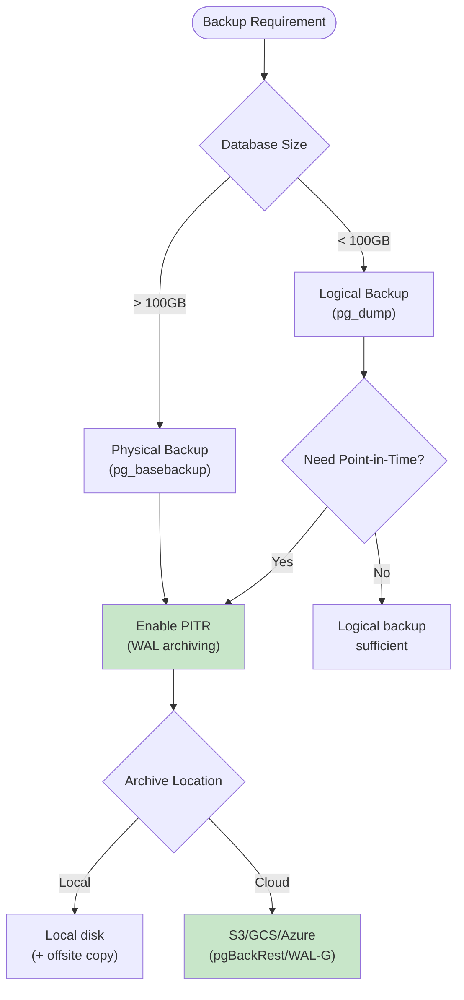

# Backup & Recovery Patterns

This document covers PostgreSQL backup strategies including logical and physical backups, point-in-time recovery (PITR), and disaster recovery procedures.

## Table of Contents

1. [Overview](#overview)
2. [Backup Types](#backup-types)
3. [Logical Backups](#logical-backups)
4. [Physical Backups](#physical-backups)
5. [Point-in-Time Recovery](#point-in-time-recovery)
6. [WAL Archiving](#wal-archiving)
7. [Backup Verification](#backup-verification)
8. [Recovery Procedures](#recovery-procedures)
9. [Automation & Scheduling](#automation--scheduling)
10. [Cloud & Container Considerations](#cloud--container-considerations)

## Overview

### Backup Strategy Decision Tree



### Backup Comparison

| Feature | pg_dump (Logical) | pg_basebackup (Physical) |
|---------|-------------------|--------------------------|
| Size | Smaller (data only) | Larger (entire cluster) |
| Speed | Slower | Faster |
| Restore | Selective possible | Full cluster only |
| PITR | Not supported | Supported with WAL |
| Cross-version | Yes | No |
| Cross-platform | Yes | No |
| Schema changes | Captured | Captured |
| Running DB | Yes (consistent) | Yes (consistent) |

## Backup Types

### 3-2-1 Backup Rule

- **3** copies of data (production + 2 backups)
- **2** different storage types (disk + cloud)
- **1** offsite backup (different location/region)

### Backup Frequency Guidelines

| Data Type | Full Backup | Incremental/WAL | Retention |
|-----------|-------------|-----------------|-----------|
| Production | Daily | Continuous | 30 days |
| Critical | Hourly | Continuous | 90 days |
| Development | Weekly | None | 7 days |
| Archive | Monthly | None | 1 year |

## Logical Backups

### pg_dump Basics

```bash
# Dump single database (custom format, compressed)
pg_dump -Fc -f backup.dump mydb

# Dump single database (plain SQL)
pg_dump -f backup.sql mydb

# Dump specific schema
pg_dump -n data -Fc -f data_schema.dump mydb

# Dump specific tables
pg_dump -t 'data.orders' -t 'data.customers' -Fc -f tables.dump mydb

# Dump with parallel jobs (faster for large DBs)
pg_dump -j 4 -Fd -f backup_dir mydb

# Exclude large tables
pg_dump --exclude-table='data.audit_logs' -Fc -f backup.dump mydb
```

### pg_dump Options Reference

```bash
# Format options
-Fc  # Custom format (compressed, recommended)
-Fd  # Directory format (parallel restore)
-Fp  # Plain SQL (readable but larger)
-Ft  # Tar format

# Content options
-a  # Data only (no schema)
-s  # Schema only (no data)
-n  # Specific schema
-t  # Specific table
-T  # Exclude table

# Other useful options
--no-owner          # Skip ownership commands
--no-privileges     # Skip GRANT/REVOKE
--no-comments       # Skip comments
--if-exists         # Add IF EXISTS to DROP
--clean             # Add DROP commands
--create            # Add CREATE DATABASE
```

### pg_dumpall (Full Cluster)

```bash
# Dump all databases including roles and tablespaces
pg_dumpall -f full_cluster.sql

# Globals only (roles, tablespaces)
pg_dumpall --globals-only -f globals.sql

# Roles only
pg_dumpall --roles-only -f roles.sql
```

### Restore from Logical Backup

```bash
# Restore custom format
pg_restore -d mydb backup.dump

# Restore to new database
createdb mydb_restored
pg_restore -d mydb_restored backup.dump

# Restore specific schema
pg_restore -n data -d mydb backup.dump

# Restore specific table
pg_restore -t orders -d mydb backup.dump

# Parallel restore (faster)
pg_restore -j 4 -d mydb backup_dir/

# List contents of backup
pg_restore -l backup.dump

# Restore with selective TOC
pg_restore -l backup.dump > toc.txt
# Edit toc.txt to comment out unwanted items
pg_restore -L toc.txt -d mydb backup.dump
```

### Scripted Logical Backup

```bash
#!/bin/bash
# logical_backup.sh

set -e

DB_NAME="${DB_NAME:-mydb}"
BACKUP_DIR="${BACKUP_DIR:-/var/backups/postgresql}"
RETENTION_DAYS="${RETENTION_DAYS:-30}"
TIMESTAMP=$(date +%Y%m%d_%H%M%S)
BACKUP_FILE="${BACKUP_DIR}/${DB_NAME}_${TIMESTAMP}.dump"

# Create backup directory
mkdir -p "${BACKUP_DIR}"

# Perform backup
echo "Starting backup of ${DB_NAME}..."
pg_dump -Fc -f "${BACKUP_FILE}" "${DB_NAME}"

# Verify backup
if pg_restore -l "${BACKUP_FILE}" > /dev/null 2>&1; then
    echo "Backup verified: ${BACKUP_FILE}"

    # Calculate and store checksum
    sha256sum "${BACKUP_FILE}" > "${BACKUP_FILE}.sha256"

    # Compress further if needed
    # gzip "${BACKUP_FILE}"

    # Cleanup old backups
    find "${BACKUP_DIR}" -name "${DB_NAME}_*.dump" -mtime +${RETENTION_DAYS} -delete
    find "${BACKUP_DIR}" -name "${DB_NAME}_*.sha256" -mtime +${RETENTION_DAYS} -delete

    echo "Backup complete"
else
    echo "ERROR: Backup verification failed"
    rm -f "${BACKUP_FILE}"
    exit 1
fi
```

## Physical Backups

### pg_basebackup Basics

```bash
# Basic backup (with WAL files)
pg_basebackup -D /var/backups/pgbase -Fp -Xs -P

# Compressed tar format
pg_basebackup -D /var/backups/pgbase -Ft -z -P

# Backup to remote location via SSH
pg_basebackup -D - -Ft | ssh backup-server 'cat > /backups/base.tar'

# With label and checkpoint
pg_basebackup -D /var/backups/pgbase \
    --label="daily_backup" \
    --checkpoint=fast \
    --progress \
    --verbose
```

### pg_basebackup Options

```bash
-D  # Destination directory
-Fp # Plain format (copy files)
-Ft # Tar format
-Fx # No WAL (rely on archive)
-Xs # Stream WAL during backup
-z  # Compress with gzip
-Z  # Compression level (0-9)
-P  # Show progress
-l  # Backup label
--checkpoint=fast  # Force immediate checkpoint
--wal-method=stream  # Stream WAL (default in PG10+)
```

### Physical Backup Script

```bash
#!/bin/bash
# physical_backup.sh

set -e

BACKUP_DIR="${BACKUP_DIR:-/var/backups/pgbase}"
TIMESTAMP=$(date +%Y%m%d_%H%M%S)
BACKUP_PATH="${BACKUP_DIR}/${TIMESTAMP}"

# Ensure backup directory exists
mkdir -p "${BACKUP_DIR}"

echo "Starting physical backup..."

# Perform backup with WAL streaming
pg_basebackup \
    -D "${BACKUP_PATH}" \
    --format=tar \
    --gzip \
    --checkpoint=fast \
    --label="backup_${TIMESTAMP}" \
    --wal-method=stream \
    --progress \
    --verbose

# Verify backup files exist
if [[ -f "${BACKUP_PATH}/base.tar.gz" ]]; then
    echo "Backup completed: ${BACKUP_PATH}"

    # Store backup metadata
    cat > "${BACKUP_PATH}/backup_info.json" << EOF
{
    "timestamp": "${TIMESTAMP}",
    "pg_version": "$(pg_config --version)",
    "backup_method": "pg_basebackup",
    "compression": "gzip"
}
EOF

    # Cleanup old backups (keep last 7)
    ls -dt "${BACKUP_DIR}"/*/ | tail -n +8 | xargs rm -rf

    echo "Physical backup complete"
else
    echo "ERROR: Backup failed"
    exit 1
fi
```

## Point-in-Time Recovery

### Configure WAL Archiving

```sql
-- postgresql.conf settings for PITR

-- Enable archiving
wal_level = replica          -- Required for PITR
archive_mode = on            -- Enable WAL archiving
archive_command = 'cp %p /var/backups/wal_archive/%f'

-- Or archive to S3 (using aws cli)
-- archive_command = 'aws s3 cp %p s3://my-bucket/wal/%f'

-- Retention settings
max_wal_senders = 3          -- For streaming replication
wal_keep_size = 1GB          -- Keep WAL for slow replicas
```

### Archive Command Examples

```bash
# Local copy
archive_command = 'test ! -f /archive/%f && cp %p /archive/%f'

# Rsync to remote
archive_command = 'rsync -a %p backup-server:/archive/%f'

# S3 with compression
archive_command = 'gzip -c %p | aws s3 cp - s3://bucket/wal/%f.gz'

# Google Cloud Storage
archive_command = 'gsutil cp %p gs://bucket/wal/%f'

# Azure Blob Storage
archive_command = 'azcopy copy %p "https://account.blob.core.windows.net/wal/%f"'
```

### PITR Recovery Process

```bash
# Step 1: Stop PostgreSQL
systemctl stop postgresql

# Step 2: Move current data directory
mv /var/lib/postgresql/data /var/lib/postgresql/data_old

# Step 3: Restore base backup
tar -xzf /var/backups/pgbase/base.tar.gz -C /var/lib/postgresql/data

# Step 4: Create recovery configuration
cat > /var/lib/postgresql/data/postgresql.auto.conf << EOF
# Recovery settings
restore_command = 'cp /var/backups/wal_archive/%f %p'
recovery_target_time = '2024-03-15 14:30:00 UTC'
recovery_target_action = 'promote'
EOF

# Step 5: Create recovery signal file
touch /var/lib/postgresql/data/recovery.signal

# Step 6: Start PostgreSQL
systemctl start postgresql

# Step 7: Monitor recovery progress
tail -f /var/log/postgresql/postgresql-*.log
```

### Recovery Target Options

```sql
-- Recover to specific time
recovery_target_time = '2024-03-15 14:30:00 UTC'

-- Recover to specific transaction ID
recovery_target_xid = '12345'

-- Recover to named restore point
recovery_target_name = 'before_migration'

-- Recover to specific LSN
recovery_target_lsn = '0/1234ABCD'

-- Recover to end of available WAL
recovery_target = 'immediate'

-- Actions after recovery target
recovery_target_action = 'promote'  -- Become primary
recovery_target_action = 'pause'    -- Pause for inspection
recovery_target_action = 'shutdown' -- Shutdown cleanly

-- Include or exclude target
recovery_target_inclusive = true    -- Include the target (default)
recovery_target_inclusive = false   -- Stop just before target
```

### Create Restore Point

```sql
-- Create named restore point (useful before major changes)
SELECT pg_create_restore_point('before_migration_v42');

-- Use in recovery:
-- recovery_target_name = 'before_migration_v42'
```

## WAL Archiving

### WAL Archiving Best Practices

```sql
-- postgresql.conf

-- Compression and efficiency
wal_compression = on              -- Compress WAL data
wal_init_zero = on               -- Zero new WAL files (security)
wal_recycle = on                 -- Recycle WAL files

-- Timeouts and retries
archive_timeout = 300            -- Archive every 5 min (even partial)

-- Monitoring
log_checkpoints = on             -- Log checkpoint activity
checkpoint_warning = 30s         -- Warn if checkpoints too frequent
```

### Monitor WAL Archiving

```sql
-- Check archive status
SELECT * FROM pg_stat_archiver;

-- Recent archive failures
SELECT
    archived_count,
    failed_count,
    last_archived_wal,
    last_archived_time,
    last_failed_wal,
    last_failed_time
FROM pg_stat_archiver;

-- Current WAL position
SELECT pg_current_wal_lsn(), pg_current_wal_insert_lsn();

-- WAL files waiting to be archived
SELECT name FROM pg_ls_waldir()
WHERE name > (SELECT last_archived_wal FROM pg_stat_archiver)
ORDER BY name;
```

### WAL Archive Cleanup

```bash
# Keep 7 days of WAL archives
find /var/backups/wal_archive -name "*.wal" -mtime +7 -delete

# Using pg_archivecleanup (safe method)
pg_archivecleanup /var/backups/wal_archive $(pg_controldata /var/lib/postgresql/data | grep "Latest checkpoint's REDO WAL file" | awk '{print $NF}')
```

## Backup Verification

### Verify Logical Backup

```sql
-- Test restore to temporary database
CREATE DATABASE backup_test;

-- Restore
-- pg_restore -d backup_test backup.dump

-- Verify row counts
SELECT
    schemaname,
    tablename,
    n_live_tup
FROM pg_stat_user_tables
WHERE schemaname = 'data'
ORDER BY schemaname, tablename;

-- Cleanup
DROP DATABASE backup_test;
```

### Automated Backup Testing

```bash
#!/bin/bash
# verify_backup.sh

set -e

BACKUP_FILE="$1"
TEST_DB="backup_verify_$(date +%s)"

echo "Verifying backup: ${BACKUP_FILE}"

# Create test database
createdb "${TEST_DB}"

# Restore backup
pg_restore -d "${TEST_DB}" "${BACKUP_FILE}"

# Run verification queries
psql -d "${TEST_DB}" << EOF
-- Check table counts
SELECT schemaname, count(*) as table_count
FROM pg_tables
WHERE schemaname NOT IN ('pg_catalog', 'information_schema')
GROUP BY schemaname;

-- Check for invalid indexes
SELECT schemaname, indexname
FROM pg_indexes i
JOIN pg_class c ON c.relname = i.indexname
JOIN pg_index idx ON idx.indexrelid = c.oid
WHERE NOT idx.indisvalid;

-- Check constraints
SELECT count(*) as constraint_count
FROM information_schema.table_constraints
WHERE constraint_schema NOT IN ('pg_catalog', 'information_schema');
EOF

# Cleanup
dropdb "${TEST_DB}"

echo "Backup verification complete"
```

### Backup Checksums

```bash
# Generate checksum during backup
pg_dump -Fc mydb | tee backup.dump | sha256sum > backup.dump.sha256

# Verify checksum before restore
sha256sum -c backup.dump.sha256

# Verify during streaming
pg_dump -Fc mydb | tee >(sha256sum > backup.sha256) | aws s3 cp - s3://bucket/backup.dump
```

## Recovery Procedures

### Complete Recovery Runbook

```markdown
# Database Recovery Runbook

## Prerequisites
- [ ] Access to backup storage
- [ ] Target server with PostgreSQL installed
- [ ] Sufficient disk space (2x database size)
- [ ] Network access to archive location

## Recovery Steps

### 1. Assess the Situation
- Identify the failure type (hardware, corruption, user error)
- Determine recovery point needed
- Verify backup availability

### 2. Prepare Recovery Environment
```bash
# Stop PostgreSQL if running
sudo systemctl stop postgresql

# Backup current state (if possible)
sudo mv /var/lib/postgresql/data /var/lib/postgresql/data_corrupted

# Create new data directory
sudo mkdir /var/lib/postgresql/data
sudo chown postgres:postgres /var/lib/postgresql/data
```

### 3. Restore from Backup
```bash
# For logical backup
createdb mydb
pg_restore -d mydb /backups/latest.dump

# For physical backup
tar -xzf /backups/base.tar.gz -C /var/lib/postgresql/data
```

### 4. Configure PITR (if needed)
```bash
# Create recovery.signal and configure restore_command
```

### 5. Start PostgreSQL
```bash
sudo systemctl start postgresql
```

### 6. Verify Recovery
- Check error logs
- Verify data integrity
- Test application connectivity

### 7. Document Incident
- Record timeline
- Root cause analysis
- Update procedures if needed
```

### Table-Level Recovery

```bash
# Restore single table from full backup
# Step 1: Extract table from backup
pg_restore -l backup.dump | grep "TABLE DATA data orders" > toc.txt
pg_restore -L toc.txt -a -t orders backup.dump -f orders_data.sql

# Step 2: Restore to main database
psql -d mydb -c "TRUNCATE data.orders"  # Optional: clear existing
psql -d mydb -f orders_data.sql
```

### Row-Level Recovery

```sql
-- Restore specific rows using backup database
-- Step 1: Restore backup to temporary database
-- Step 2: Copy needed rows

-- From backup database to production
INSERT INTO data.orders
SELECT * FROM dblink(
    'dbname=backup_restore',
    'SELECT * FROM data.orders WHERE id = ''uuid-to-restore'''
) AS t(id uuid, customer_id uuid, total numeric, created_at timestamptz);
```

## Automation & Scheduling

### Cron-Based Backup Schedule

```bash
# /etc/cron.d/postgresql-backup

# Logical backup daily at 2 AM
0 2 * * * postgres /usr/local/bin/logical_backup.sh >> /var/log/pgbackup.log 2>&1

# Physical backup weekly on Sunday at 3 AM
0 3 * * 0 postgres /usr/local/bin/physical_backup.sh >> /var/log/pgbackup.log 2>&1

# Verify latest backup daily at 4 AM
0 4 * * * postgres /usr/local/bin/verify_backup.sh /var/backups/postgresql/latest.dump >> /var/log/pgbackup.log 2>&1

# WAL archive cleanup weekly
0 5 * * 0 postgres /usr/local/bin/cleanup_wal.sh >> /var/log/pgbackup.log 2>&1
```

### Backup with pg_cron

```sql
-- Install pg_cron extension
CREATE EXTENSION pg_cron;

-- Schedule logical backup
SELECT cron.schedule('daily-backup', '0 2 * * *',
    $$COPY (SELECT 1) TO PROGRAM '/usr/local/bin/logical_backup.sh'$$);

-- Schedule ANALYZE after backup
SELECT cron.schedule('post-backup-analyze', '0 4 * * *',
    $$ANALYZE$$);

-- View scheduled jobs
SELECT * FROM cron.job;

-- View job history
SELECT * FROM cron.job_run_details ORDER BY start_time DESC LIMIT 10;
```

### Backup Monitoring Alerts

```sql
-- Create monitoring table
CREATE TABLE app_monitoring.backup_status (
    id          bigint GENERATED ALWAYS AS IDENTITY PRIMARY KEY,
    backup_type text NOT NULL,
    status      text NOT NULL,
    file_path   text,
    file_size   bigint,
    duration_ms integer,
    error_msg   text,
    created_at  timestamptz NOT NULL DEFAULT now()
);

-- Check for backup failures
CREATE FUNCTION app_monitoring.check_backup_status()
RETURNS TABLE (
    alert_level text,
    message text
)
LANGUAGE sql
STABLE
AS $$
    SELECT
        CASE
            WHEN NOT EXISTS (
                SELECT 1 FROM app_monitoring.backup_status
                WHERE backup_type = 'logical'
                  AND status = 'success'
                  AND created_at > now() - interval '25 hours'
            ) THEN 'CRITICAL'
            ELSE 'OK'
        END,
        CASE
            WHEN NOT EXISTS (
                SELECT 1 FROM app_monitoring.backup_status
                WHERE backup_type = 'logical'
                  AND status = 'success'
                  AND created_at > now() - interval '25 hours'
            ) THEN 'No successful logical backup in last 25 hours'
            ELSE 'Backup status OK'
        END;
$$;
```

## Cloud & Container Considerations

### Docker PostgreSQL Backup

```yaml
# docker-compose.yml
version: '3.8'
services:
  postgres:
    image: postgres:18
    volumes:
      - pgdata:/var/lib/postgresql/data
      - ./backups:/backups

  backup:
    image: postgres:18
    depends_on:
      - postgres
    volumes:
      - ./backups:/backups
    entrypoint: /bin/bash
    command: >
      -c 'while true; do
        pg_dump -h postgres -U postgres -Fc -f /backups/backup_$$(date +%Y%m%d).dump mydb;
        sleep 86400;
      done'

volumes:
  pgdata:
```

### Kubernetes CronJob Backup

```yaml
apiVersion: batch/v1
kind: CronJob
metadata:
  name: postgres-backup
spec:
  schedule: "0 2 * * *"
  jobTemplate:
    spec:
      template:
        spec:
          containers:
          - name: backup
            image: postgres:18
            env:
            - name: PGPASSWORD
              valueFrom:
                secretKeyRef:
                  name: postgres-secret
                  key: password
            command:
            - /bin/sh
            - -c
            - |
              pg_dump -h postgres-service -U postgres -Fc mydb | \
              aws s3 cp - s3://backup-bucket/postgres/$(date +%Y%m%d).dump
          restartPolicy: OnFailure
```

### Cloud-Native Backup Tools

```bash
# pgBackRest - Advanced backup solution
pgbackrest --stanza=main --type=full backup
pgbackrest --stanza=main --type=incr backup
pgbackrest --stanza=main restore

# WAL-G - Cloud-native WAL archiving
# archive_command in postgresql.conf:
archive_command = 'wal-g wal-push %p'

# Backup with WAL-G
wal-g backup-push /var/lib/postgresql/data

# List backups
wal-g backup-list

# Restore
wal-g backup-fetch /var/lib/postgresql/data LATEST
```

### RDS/Cloud SQL Snapshots

```bash
# AWS RDS snapshot
aws rds create-db-snapshot \
    --db-instance-identifier mydb \
    --db-snapshot-identifier mydb-$(date +%Y%m%d)

# Google Cloud SQL backup
gcloud sql backups create \
    --instance=mydb \
    --description="Daily backup $(date +%Y%m%d)"

# Azure Database backup
az postgres flexible-server backup create \
    --resource-group mygroup \
    --server-name mydb \
    --backup-name "backup-$(date +%Y%m%d)"
```
