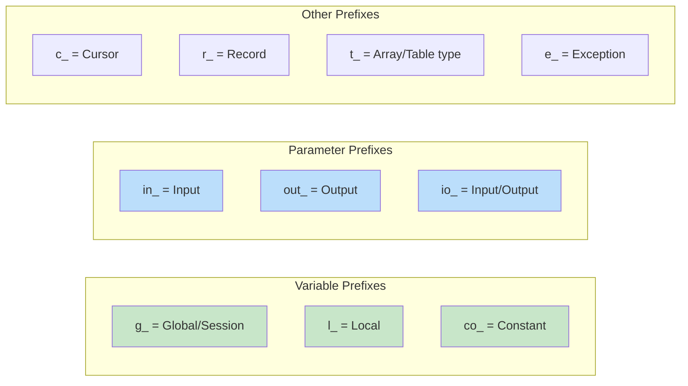
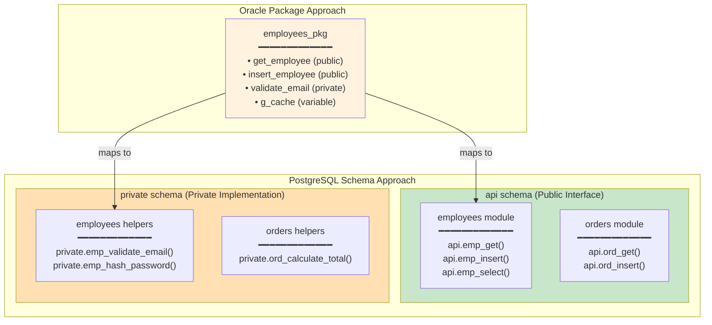

# PL/pgSQL Coding Standards (Trivadis-Style)

This document adapts the well-established [Trivadis PL/SQL & SQL Coding Guidelines v4.4](https://trivadis.github.io/plsql-and-sql-coding-guidelines/v4.4/) for PostgreSQL PL/pgSQL development. These conventions provide a consistent, readable, and maintainable codebase familiar to developers coming from Oracle backgrounds.

## Table of Contents

1. [Naming Conventions](#naming-conventions)
2. [Variable and Parameter Naming](#variable-and-parameter-naming)
3. [Code Structure](#code-structure)
4. [Package-Like Organization](#package-like-organization)
5. [Error Handling](#error-handling)
6. [SQL Guidelines](#sql-guidelines)
7. [Documentation Standards](#documentation-standards)
8. [Complete Example](#complete-example)

## Naming Conventions

### General Guidelines

1. **Always use lowercase** - PostgreSQL folds unquoted identifiers to lowercase
2. **Never use double-quoted identifiers** - Avoid case sensitivity issues
3. **Use meaningful, specific names** - Self-documenting code
4. **Avoid abbreviations** unless widely known and accepted
5. **Keep abbreviations under 5 characters**
6. **Never use PostgreSQL reserved words** as identifiers
7. **Use one spoken language** (e.g., English) consistently
8. **Use snake_case** for all identifiers

### PL/pgSQL Identifier Prefixes

Follow the `{prefix}_{content}` pattern for variables and parameters:



| Identifier Type | Prefix | Suffix | Example |
|-----------------|--------|--------|---------|
| **Global/Session Variable** | `g_` | | `g_current_user_id` |
| **Local Variable** | `l_` | | `l_customer_count` |
| **Constant** | `co_` | | `co_max_retry_count` |
| **Cursor** | `c_` | | `c_active_orders` |
| **Record** | `r_` | | `r_customer` |
| **Array/Table Variable** | `t_` | | `t_order_ids` |
| **Record Type** | `r_` | `_type` | `r_customer_type` |
| **Array Type** | `t_` | `_type` | `t_order_ids_type` |
| **Exception** | `e_` | | `e_customer_not_found` |
| **IN Parameter** | `in_` | | `in_customer_id` |
| **OUT Parameter** (functions only) | `out_` | | `out_order_total` |
| **INOUT Parameter** (procedures) | `io_` | | `io_id` |

> **PostgreSQL Note**: Procedures only support INOUT parameters (no OUT). Use `io_` prefix for all INOUT parameters in procedures, even if they're semantically output-only.

### Database Object Naming

| Object Type | Convention | Example |
|-------------|------------|---------|
| **Schema** | `snake_case` | `data`, `api`, `private` |
| **Table** | Plural, `snake_case` | `customers`, `order_items` |
| **Column** | Singular, `snake_case` | `customer_id`, `created_at` |
| **Primary Key** | `{table}_pk` | `customers_pk` |
| **Foreign Key** | `{table}_{reftable}_fk` | `orders_customers_fk` |
| **Unique Constraint** | `{table}_{columns}_uk` | `customers_email_uk` |
| **Check Constraint** | `{table}_{column}_ck` | `orders_status_ck` |
| **Index** | `{table}_{columns}_idx` | `orders_customer_id_idx` |
| **Unique Index** | `{table}_{columns}_key` | `customers_email_key` |
| **Function** | `{verb}_{noun}` or `{noun}_by_{filter}` | `calculate_total`, `customer_by_email` |
| **Procedure** | `{verb}_{noun}` | `insert_customer`, `update_status` |
| **Trigger** | `{table}_{timing}{event}_trg` | `orders_biu_trg` |
| **View** | Descriptive or `v_{name}` | `active_customers`, `v_order_summary` |
| **Sequence** | `{table}_seq` | `customers_seq` |
| **Type** | `{name}_type` | `address_type` |

## Variable and Parameter Naming

### Local Variables (l_ prefix)

```sql
CREATE FUNCTION api.calculate_order_total(in_order_id uuid)
RETURNS numeric
LANGUAGE plpgsql
SECURITY DEFINER
SET search_path = data, private, pg_temp
AS $$
DECLARE
    -- Local variables with l_ prefix
    l_subtotal      numeric;
    l_tax_rate      numeric;
    l_discount      numeric;
    l_total         numeric;
    l_customer_id   uuid;
BEGIN
    -- Get order details
    SELECT subtotal, tax_rate, customer_id
    INTO l_subtotal, l_tax_rate, l_customer_id
    FROM data.orders
    WHERE id = in_order_id;
    
    -- Calculate discount based on customer
    l_discount := private.get_customer_discount(l_customer_id);
    
    -- Calculate total
    l_total := l_subtotal * (1 - l_discount) * (1 + l_tax_rate);
    
    RETURN l_total;
END;
$$;
```

### Constants (co_ prefix)

```sql
CREATE FUNCTION api.validate_order(in_order_id uuid)
RETURNS boolean
LANGUAGE plpgsql
SECURITY DEFINER
SET search_path = data, private, pg_temp
AS $$
DECLARE
    -- Constants with co_ prefix
    co_max_order_amount     CONSTANT numeric := 100000.00;
    co_min_order_amount     CONSTANT numeric := 0.01;
    co_max_items_per_order  CONSTANT integer := 100;
    
    -- Local variables
    l_order_total   numeric;
    l_item_count    integer;
BEGIN
    SELECT total, item_count
    INTO l_order_total, l_item_count
    FROM data.orders o
    JOIN (SELECT order_id, COUNT(*) as item_count 
          FROM data.order_items GROUP BY order_id) oi 
    ON oi.order_id = o.id
    WHERE o.id = in_order_id;
    
    -- Validate against constants
    IF l_order_total > co_max_order_amount THEN
        RETURN false;
    END IF;
    
    IF l_order_total < co_min_order_amount THEN
        RETURN false;
    END IF;
    
    IF l_item_count > co_max_items_per_order THEN
        RETURN false;
    END IF;
    
    RETURN true;
END;
$$;
```

### Session/Global Variables (g_ prefix)

PostgreSQL doesn't have true package-level global variables like Oracle. Instead, use:

1. **Session variables** via `SET` and `current_setting()`
2. **Configuration parameters** for application-wide settings

```sql
-- Setting a session variable
SET myapp.current_user_id = 'user-uuid-here';
SET myapp.current_tenant_id = 'tenant-uuid-here';

-- Reading session variables in functions
CREATE FUNCTION private.get_current_user_id()
RETURNS uuid
LANGUAGE sql
STABLE
AS $$
    SELECT NULLIF(current_setting('myapp.current_user_id', true), '')::uuid;
$$;

-- Using in a function with g_ prefix for clarity
CREATE FUNCTION api.get_my_orders()
RETURNS TABLE (id uuid, total numeric, status text)
LANGUAGE plpgsql
SECURITY DEFINER
SET search_path = data, private, pg_temp
AS $$
DECLARE
    g_current_user_id uuid;  -- "global" from session context
BEGIN
    -- Get session variable
    g_current_user_id := private.get_current_user_id();
    
    IF g_current_user_id IS NULL THEN
        RAISE EXCEPTION 'No user context set'
            USING ERRCODE = 'P0001';
    END IF;
    
    RETURN QUERY
    SELECT o.id, o.total, o.status
    FROM data.orders o
    WHERE o.customer_id = g_current_user_id
    ORDER BY o.created_at DESC;
END;
$$;
```

### Records (r_ prefix)

```sql
CREATE PROCEDURE api.process_order(in_order_id uuid)
LANGUAGE plpgsql
SECURITY DEFINER
SET search_path = data, private, pg_temp
AS $$
DECLARE
    r_order     data.orders%ROWTYPE;  -- Record matching table structure
    r_customer  data.customers%ROWTYPE;
BEGIN
    -- Fetch into record
    SELECT * INTO r_order
    FROM data.orders
    WHERE id = in_order_id;
    
    IF NOT FOUND THEN
        RAISE EXCEPTION 'Order not found: %', in_order_id
            USING ERRCODE = 'P0002';
    END IF;
    
    -- Fetch related customer
    SELECT * INTO r_customer
    FROM data.customers
    WHERE id = r_order.customer_id;
    
    -- Use record fields
    IF r_order.status = 'pending' AND r_customer.is_active THEN
        UPDATE data.orders
        SET status = 'processing'
        WHERE id = in_order_id;
    END IF;
END;
$$;
```

### Cursors (c_ prefix)

```sql
CREATE PROCEDURE api.batch_process_orders(in_status text)
LANGUAGE plpgsql
SECURITY DEFINER
SET search_path = data, private, pg_temp
AS $$
DECLARE
    c_orders CURSOR FOR
        SELECT id, customer_id, total
        FROM data.orders
        WHERE status = in_status
        ORDER BY created_at;
    
    r_order RECORD;
    l_processed_count integer := 0;
BEGIN
    FOR r_order IN c_orders LOOP
        -- Process each order
        PERFORM private.process_single_order(r_order.id);
        l_processed_count := l_processed_count + 1;
        
        -- Commit every 100 records (if needed)
        IF l_processed_count % 100 = 0 THEN
            RAISE NOTICE 'Processed % orders', l_processed_count;
        END IF;
    END LOOP;
    
    RAISE NOTICE 'Total orders processed: %', l_processed_count;
END;
$$;
```

### Arrays (t_ prefix)

```sql
CREATE FUNCTION api.get_customers_by_ids(in_ids uuid[])
RETURNS TABLE (id uuid, email text, name text)
LANGUAGE plpgsql
SECURITY DEFINER
SET search_path = data, private, pg_temp
AS $$
DECLARE
    t_valid_ids uuid[];  -- Array variable with t_ prefix
    l_count integer;
BEGIN
    -- Filter to only active customer IDs
    SELECT array_agg(c.id)
    INTO t_valid_ids
    FROM data.customers c
    WHERE c.id = ANY(in_ids)
      AND c.is_active = true;
    
    l_count := COALESCE(array_length(t_valid_ids, 1), 0);
    RAISE NOTICE 'Found % valid customers out of % requested', 
        l_count, array_length(in_ids, 1);
    
    RETURN QUERY
    SELECT c.id, c.email, c.name
    FROM data.customers c
    WHERE c.id = ANY(t_valid_ids);
END;
$$;
```

### Parameters (in_, out_, io_ prefixes)

```sql
-- IN parameters (read-only input)
CREATE FUNCTION api.get_customer(in_customer_id uuid)
RETURNS TABLE (id uuid, email text, name text)
LANGUAGE sql
STABLE
SECURITY DEFINER
SET search_path = data, private, pg_temp
AS $$
    SELECT id, email, name
    FROM data.customers
    WHERE id = in_customer_id;
$$;

-- INOUT parameters (input that also returns output)
CREATE PROCEDURE api.insert_customer(
    in_email        text,
    in_name         text,
    INOUT io_id     uuid DEFAULT NULL  -- Returns generated ID
)
LANGUAGE plpgsql
SECURITY DEFINER
SET search_path = data, private, pg_temp
AS $$
BEGIN
    INSERT INTO data.customers (email, name)
    VALUES (lower(trim(in_email)), trim(in_name))
    RETURNING id INTO io_id;
END;
$$;

-- Multiple output values using INOUT (PostgreSQL has no OUT for procedures)
CREATE PROCEDURE api.get_order_summary(
    in_order_id     uuid,
    INOUT io_total      numeric DEFAULT NULL,
    INOUT io_item_count integer DEFAULT NULL,
    INOUT io_status     text DEFAULT NULL
)
LANGUAGE plpgsql
SECURITY DEFINER
SET search_path = data, private, pg_temp
AS $$
BEGIN
    SELECT o.total, COUNT(oi.id), o.status
    INTO io_total, io_item_count, io_status
    FROM data.orders o
    LEFT JOIN data.order_items oi ON oi.order_id = o.id
    WHERE o.id = in_order_id
    GROUP BY o.id;
    
    IF NOT FOUND THEN
        RAISE EXCEPTION 'Order not found: %', in_order_id
            USING ERRCODE = 'P0002';
    END IF;
END;
$$;
```

## Code Structure

### Indentation Standard

Use **3-space indentation** for PL/pgSQL code blocks (Trivadis v4.4 standard):

```sql
CREATE FUNCTION api.example_function(in_id uuid)
RETURNS text
LANGUAGE plpgsql
AS $$
DECLARE
   l_result text;  -- 3 spaces
BEGIN
   IF in_id IS NOT NULL THEN
      SELECT name INTO l_result  -- 6 spaces
      FROM data.customers
      WHERE id = in_id;
   END IF;

   RETURN l_result;
END example_function;
$$;
```

> **Note**: While 2-space and 4-space indentation are common in other languages, 3-space indentation is the Trivadis standard for PL/SQL and PL/pgSQL. This provides good readability while maintaining compact code.

### Function/Procedure Template

```sql
-- ============================================================================
-- Function: api.function_name
-- Purpose:  Brief description of what this function does
-- Parameters:
--   in_param1  - Description of first parameter
--   in_param2  - Description of second parameter (optional)
-- Returns:   Description of return value
-- Raises:    P0002 - When resource not found
--            P0001 - When business rule violated
-- ============================================================================
CREATE OR REPLACE FUNCTION api.function_name(
    in_param1   uuid,
    in_param2   text DEFAULT NULL
)
RETURNS return_type
LANGUAGE plpgsql
STABLE  -- or VOLATILE for modifications
SECURITY DEFINER
SET search_path = data, private, pg_temp
AS $$
DECLARE
    -- Constants (co_ prefix)
    co_max_value CONSTANT integer := 100;
    
    -- Local variables (l_ prefix)
    l_result    return_type;
    l_temp      integer;
BEGIN
    -- Input validation
    IF in_param1 IS NULL THEN
        RAISE EXCEPTION 'Parameter in_param1 cannot be NULL'
            USING ERRCODE = 'P0001';
    END IF;
    
    -- Main logic
    -- ...
    
    RETURN l_result;
    
EXCEPTION
    WHEN no_data_found THEN
        RAISE EXCEPTION 'Resource not found: %', in_param1
            USING ERRCODE = 'P0002';
    WHEN OTHERS THEN
        RAISE EXCEPTION 'Unexpected error in function_name: %', SQLERRM
            USING ERRCODE = 'P0003';
END;
$$;

COMMENT ON FUNCTION api.function_name(uuid, text) IS 
    'Brief description for documentation';
```

### Block Labels

Label nested blocks for clarity (Trivadis guideline G-1010):

```sql
CREATE PROCEDURE api.complex_operation(in_order_id uuid)
LANGUAGE plpgsql
SECURITY DEFINER
SET search_path = data, private, pg_temp
AS $$
DECLARE
    l_status text;
BEGIN
    -- Get current status
    SELECT status INTO l_status
    FROM data.orders WHERE id = in_order_id;
    
    <<validation_block>>
    BEGIN
        IF l_status IS NULL THEN
            RAISE EXCEPTION 'Order not found';
        END IF;
        
        IF l_status = 'cancelled' THEN
            RAISE EXCEPTION 'Cannot process cancelled order';
        END IF;
    END validation_block;
    
    <<processing_block>>
    DECLARE
        l_item_count integer;
    BEGIN
        SELECT COUNT(*) INTO l_item_count
        FROM data.order_items
        WHERE order_id = in_order_id;
        
        IF l_item_count = 0 THEN
            RAISE EXCEPTION 'Order has no items';
        END IF;
        
        -- Process the order
        UPDATE data.orders
        SET status = 'processing'
        WHERE id = in_order_id;
    END processing_block;
END;
$$;
```

### END Labels (G-7120)

Always add the function or procedure name after the END keyword for clarity:

```sql
-- Good (Trivadis G-7120)
CREATE FUNCTION api.calculate_order_total(in_order_id uuid)
RETURNS numeric
LANGUAGE plpgsql
AS $$
BEGIN
   -- function logic...
   RETURN l_total;
END calculate_order_total;
$$;

-- Avoid (unnamed END)
CREATE FUNCTION api.calculate_order_total(in_order_id uuid)
RETURNS numeric
LANGUAGE plpgsql
AS $$
BEGIN
   -- function logic...
   RETURN l_total;
END;
$$;
```

This convention:
- Improves readability in long procedures
- Makes it clear which block is ending
- Helps identify mismatched BEGIN/END pairs
- Aligns with Oracle PL/SQL best practices

### Loop Labels

Always label loops (Trivadis guideline G-4320):

```sql
CREATE PROCEDURE api.process_all_pending_orders()
LANGUAGE plpgsql
SECURITY DEFINER
SET search_path = data, private, pg_temp
AS $$
DECLARE
    r_order RECORD;
    l_success_count integer := 0;
    l_error_count integer := 0;
BEGIN
    <<order_loop>>
    FOR r_order IN 
        SELECT id, customer_id 
        FROM data.orders 
        WHERE status = 'pending'
    LOOP
        <<process_block>>
        BEGIN
            PERFORM private.process_order(r_order.id);
            l_success_count := l_success_count + 1;
        EXCEPTION
            WHEN OTHERS THEN
                l_error_count := l_error_count + 1;
                RAISE WARNING 'Failed to process order %: %', 
                    r_order.id, SQLERRM;
                CONTINUE order_loop;  -- Skip to next iteration
        END process_block;
    END LOOP order_loop;
    
    RAISE NOTICE 'Processed: % success, % errors', 
        l_success_count, l_error_count;
END;
$$;
```

## Package-Like Organization

> **Important**: This section describes how to achieve Oracle package-like organization while **preserving** the existing schema separation pattern (`data`/`private`/`api`).

### Understanding the Challenge

Oracle packages provide:
1. **Namespace grouping** - Related procedures/functions together
2. **Public vs Private** - Specification (public) vs Body (private)
3. **Session state** - Package-level variables
4. **Initialization** - One-time setup code

PostgreSQL schemas already provide #1 and #2 through our `api`/`private` separation. We need patterns for #3 and #4.

### Recommended Approach: Functional Grouping Within Schemas



### Option 1: Prefix-Based Grouping (Recommended)

Group related functions using a consistent prefix within the existing schemas:

```sql
-- ============================================================================
-- "employees" module - Public API (in api schema)
-- ============================================================================
CREATE FUNCTION api.emp_get(in_id uuid) ...;
CREATE FUNCTION api.emp_get_by_email(in_email text) ...;
CREATE FUNCTION api.emp_select(in_is_active boolean DEFAULT NULL) ...;
CREATE PROCEDURE api.emp_insert(in_email text, in_name text, INOUT io_id uuid) ...;
CREATE PROCEDURE api.emp_update(in_id uuid, in_name text DEFAULT NULL) ...;
CREATE PROCEDURE api.emp_delete(in_id uuid) ...;

-- ============================================================================
-- "employees" module - Private helpers (in private schema)
-- ============================================================================
CREATE FUNCTION private.emp_validate_email(in_email text) ...;
CREATE FUNCTION private.emp_hash_password(in_password text) ...;
CREATE FUNCTION private.emp_check_permissions(in_emp_id uuid, in_action text) ...;

-- ============================================================================
-- "orders" module - Public API (in api schema)
-- ============================================================================
CREATE FUNCTION api.ord_get(in_id uuid) ...;
CREATE FUNCTION api.ord_select_by_customer(in_customer_id uuid) ...;
CREATE PROCEDURE api.ord_insert(in_customer_id uuid, INOUT io_id uuid) ...;
CREATE PROCEDURE api.ord_update_status(in_id uuid, in_status text) ...;

-- ============================================================================
-- "orders" module - Private helpers (in private schema)
-- ============================================================================
CREATE FUNCTION private.ord_calculate_total(in_order_id uuid) ...;
CREATE FUNCTION private.ord_validate_status_transition(in_from text, in_to text) ...;
```

**Benefits:**
- Maintains `data`/`private`/`api` separation ✓
- Easy to find related functions (alphabetical sorting groups them)
- Clear public/private distinction via schema
- No additional schema complexity

### Option 2: Sub-Schema Pattern (For Large Applications)

For very large applications, create sub-schemas under `api`:

```sql
-- Create sub-schemas for major modules
CREATE SCHEMA api_employees;
CREATE SCHEMA api_orders;
CREATE SCHEMA api_inventory;

-- Keep shared private schema, or split it too
CREATE SCHEMA private_employees;
CREATE SCHEMA private_orders;
```

**Schema Structure:**
```
api_employees       -- Public employee functions
api_orders          -- Public order functions
api_inventory       -- Public inventory functions
private_employees   -- Private employee helpers
private_orders      -- Private order helpers
private             -- Shared private utilities
data                -- All tables (unchanged)
```

> ⚠️ **Warning**: This adds complexity. Only use for very large codebases (50+ tables, 200+ functions).

### Option 3: Nested Function Approach (Package Body Simulation)

For complex modules needing private helper functions visible only within the module:

```sql
CREATE FUNCTION api.emp_insert(
    in_email    text,
    in_name     text,
    in_password text,
    INOUT io_id uuid DEFAULT NULL
)
RETURNS uuid
LANGUAGE plpgsql
SECURITY DEFINER
SET search_path = data, private, pg_temp
AS $$
DECLARE
    l_password_hash text;
    l_email_valid   boolean;
    
    -- ========================================
    -- Private nested function (like package body)
    -- ========================================
    -- Note: PL/pgSQL doesn't support nested functions directly.
    -- Use private schema functions instead:
    --   l_password_hash := private.emp_hash_password(in_password);
    --   l_email_valid := private.emp_validate_email(in_email);
BEGIN
    -- Validate email using private helper
    IF NOT private.emp_validate_email(in_email) THEN
        RAISE EXCEPTION 'Invalid email format: %', in_email
            USING ERRCODE = 'P0001';
    END IF;
    
    -- Hash password using private helper
    l_password_hash := private.emp_hash_password(in_password);
    
    -- Insert employee
    INSERT INTO data.employees (email, name, password_hash)
    VALUES (lower(trim(in_email)), trim(in_name), l_password_hash)
    RETURNING id INTO io_id;
END;
$$;
```

### Package Initialization Equivalent

Oracle packages can have initialization code that runs once per session. In PostgreSQL:

```sql
-- Create an initialization function
CREATE FUNCTION private.init_app_context()
RETURNS void
LANGUAGE plpgsql
AS $$
BEGIN
    -- Set session-level configuration
    PERFORM set_config('myapp.initialized', 'true', false);
    PERFORM set_config('myapp.init_time', now()::text, false);
    
    -- Any other one-time setup
    RAISE NOTICE 'Application context initialized at %', now();
END;
$$;

-- Check if initialization needed in other functions
CREATE FUNCTION private.ensure_initialized()
RETURNS void
LANGUAGE plpgsql
AS $$
BEGIN
    IF current_setting('myapp.initialized', true) IS DISTINCT FROM 'true' THEN
        PERFORM private.init_app_context();
    END IF;
END;
$$;

-- Use in API functions if needed
CREATE FUNCTION api.some_function(in_param text)
RETURNS text
LANGUAGE plpgsql
SECURITY DEFINER
SET search_path = data, private, pg_temp
AS $$
BEGIN
    -- Ensure app is initialized
    PERFORM private.ensure_initialized();
    
    -- ... rest of function
    RETURN in_param;
END;
$$;
```

### Package Constants Equivalent

```sql
-- Create a "constants" function that returns a record
CREATE FUNCTION private.co_app_constants()
RETURNS TABLE (
    max_login_attempts  integer,
    session_timeout_min integer,
    default_page_size   integer,
    app_version         text
)
LANGUAGE sql
IMMUTABLE
PARALLEL SAFE
AS $$
    SELECT 
        5::integer,         -- max_login_attempts
        30::integer,        -- session_timeout_min
        25::integer,        -- default_page_size
        '2.1.0'::text;      -- app_version
$$;

-- Usage in other functions
CREATE FUNCTION api.get_paginated_customers(
    in_page     integer DEFAULT 1,
    in_size     integer DEFAULT NULL
)
RETURNS TABLE (id uuid, email text, name text)
LANGUAGE plpgsql
SECURITY DEFINER
SET search_path = data, private, pg_temp
AS $$
DECLARE
    l_page_size integer;
BEGIN
    -- Get default from constants if not provided
    l_page_size := COALESCE(
        in_size, 
        (SELECT default_page_size FROM private.co_app_constants())
    );
    
    RETURN QUERY
    SELECT c.id, c.email, c.name
    FROM data.customers c
    ORDER BY c.created_at DESC
    LIMIT l_page_size
    OFFSET (in_page - 1) * l_page_size;
END;
$$;
```

## Error Handling

### Named Exceptions (e_ prefix)

```sql
CREATE PROCEDURE api.transfer_funds(
    in_from_account_id  uuid,
    in_to_account_id    uuid,
    in_amount           numeric
)
LANGUAGE plpgsql
SECURITY DEFINER
SET search_path = data, private, pg_temp
AS $$
DECLARE
    -- Named exception conditions
    e_insufficient_funds    CONSTANT text := 'P0010';
    e_account_not_found     CONSTANT text := 'P0011';
    e_account_inactive      CONSTANT text := 'P0012';
    e_self_transfer         CONSTANT text := 'P0013';
    
    l_from_balance  numeric;
    l_from_active   boolean;
    l_to_active     boolean;
BEGIN
    -- Validate: not self-transfer
    IF in_from_account_id = in_to_account_id THEN
        RAISE EXCEPTION 'Cannot transfer to same account'
            USING ERRCODE = e_self_transfer;
    END IF;
    
    -- Get source account
    SELECT balance, is_active 
    INTO l_from_balance, l_from_active
    FROM data.accounts
    WHERE id = in_from_account_id
    FOR UPDATE;
    
    IF NOT FOUND THEN
        RAISE EXCEPTION 'Source account not found: %', in_from_account_id
            USING ERRCODE = e_account_not_found;
    END IF;
    
    IF NOT l_from_active THEN
        RAISE EXCEPTION 'Source account is inactive'
            USING ERRCODE = e_account_inactive;
    END IF;
    
    IF l_from_balance < in_amount THEN
        RAISE EXCEPTION 'Insufficient funds: have %, need %', 
            l_from_balance, in_amount
            USING ERRCODE = e_insufficient_funds;
    END IF;
    
    -- Validate destination
    SELECT is_active INTO l_to_active
    FROM data.accounts
    WHERE id = in_to_account_id
    FOR UPDATE;
    
    IF NOT FOUND THEN
        RAISE EXCEPTION 'Destination account not found: %', in_to_account_id
            USING ERRCODE = e_account_not_found;
    END IF;
    
    IF NOT l_to_active THEN
        RAISE EXCEPTION 'Destination account is inactive'
            USING ERRCODE = e_account_inactive;
    END IF;
    
    -- Perform transfer
    UPDATE data.accounts SET balance = balance - in_amount 
    WHERE id = in_from_account_id;
    
    UPDATE data.accounts SET balance = balance + in_amount 
    WHERE id = in_to_account_id;
END;
$$;
```

### Error Code Ranges

Define consistent error code ranges for your application:

| Range | Category | Example |
|-------|----------|---------|
| `P0001-P0009` | General validation errors | `P0001` = Invalid input |
| `P0010-P0019` | Account/Finance errors | `P0010` = Insufficient funds |
| `P0020-P0029` | Order processing errors | `P0020` = Invalid status transition |
| `P0030-P0039` | Customer errors | `P0030` = Customer not found |
| `P0040-P0049` | Authentication errors | `P0040` = Invalid credentials |
| `P0050-P0059` | Authorization errors | `P0050` = Permission denied |

## SQL Guidelines

### Always Specify Column Names (G-3110)

```sql
-- BAD: Using SELECT *
INSERT INTO data.audit_log SELECT * FROM data.orders WHERE id = in_order_id;

-- GOOD: Explicit columns
INSERT INTO data.audit_log (order_id, order_total, order_status, logged_at)
SELECT id, total, status, now()
FROM data.orders
WHERE id = in_order_id;
```

### Always Use Table Aliases (G-3120)

```sql
-- BAD: No aliases
SELECT customers.id, orders.total
FROM data.customers, data.orders
WHERE customers.id = orders.customer_id;

-- GOOD: With aliases
SELECT c.id, o.total
FROM data.customers c
JOIN data.orders o ON o.customer_id = c.id;
```

### Use ANSI SQL-92 Joins (G-3130)

```sql
-- BAD: Old-style join
SELECT c.name, o.total
FROM data.customers c, data.orders o
WHERE c.id = o.customer_id;

-- GOOD: ANSI join syntax
SELECT c.name, o.total
FROM data.customers c
INNER JOIN data.orders o ON o.customer_id = c.id;
```

### Use COALESCE Instead of Multiple NVL/NULLIF

```sql
-- Use COALESCE for NULL handling
SELECT COALESCE(nickname, first_name, 'Guest') AS display_name
FROM data.users;

-- PostgreSQL CASE instead of Oracle DECODE
SELECT 
    CASE status
        WHEN 'A' THEN 'Active'
        WHEN 'I' THEN 'Inactive'
        WHEN 'P' THEN 'Pending'
        ELSE 'Unknown'
    END AS status_name
FROM data.customers;
```

## Documentation Standards

### Function Header Comments

```sql
-- ============================================================================
-- Function: api.calculate_shipping_cost
-- 
-- Purpose:  Calculates shipping cost based on order weight, destination,
--           and shipping method. Applies customer discounts if applicable.
--
-- Parameters:
--   in_order_id       UUID of the order to calculate shipping for
--   in_shipping_method Shipping method code ('standard', 'express', 'overnight')
--
-- Returns:  Calculated shipping cost as numeric(10,2)
--
-- Raises:
--   P0002 - Order not found
--   P0020 - Invalid shipping method
--   P0021 - Shipping not available to destination
--
-- Example:
--   SELECT api.calculate_shipping_cost('order-uuid', 'standard');
--
-- History:
--   2024-01-15 - Created (jsmith)
--   2024-02-20 - Added express shipping support (jdoe)
-- ============================================================================
CREATE OR REPLACE FUNCTION api.calculate_shipping_cost(
    in_order_id         uuid,
    in_shipping_method  text DEFAULT 'standard'
)
RETURNS numeric
LANGUAGE plpgsql
STABLE
SECURITY DEFINER
SET search_path = data, private, pg_temp
AS $$
-- ... implementation
$$;
```

### Add Database Comments

```sql
-- Table comments
COMMENT ON TABLE data.customers IS 
    'Customer accounts with authentication and contact information';

-- Column comments
COMMENT ON COLUMN data.customers.password_hash IS 
    'Bcrypt hash of customer password. Never expose via API.';

COMMENT ON COLUMN data.customers.is_active IS 
    'Soft delete flag. False = customer is deactivated.';

-- Function comments
COMMENT ON FUNCTION api.emp_get(uuid) IS 
    'Retrieves employee by ID. Returns NULL if not found or inactive.';
```

## Complete Example

Here's a complete "orders" module following all conventions:

```sql
-- ============================================================================
-- ORDERS MODULE - Data Types
-- ============================================================================

-- Custom type for order status transitions
CREATE TYPE private.order_status_type AS ENUM (
    'draft', 'pending', 'confirmed', 'processing', 
    'shipped', 'delivered', 'cancelled'
);

-- ============================================================================
-- ORDERS MODULE - Private Helper Functions
-- ============================================================================

CREATE OR REPLACE FUNCTION private.ord_validate_status_transition(
    in_current_status   text,
    in_new_status       text
)
RETURNS boolean
LANGUAGE plpgsql
IMMUTABLE
AS $$
DECLARE
    co_valid_transitions CONSTANT jsonb := '{
        "draft": ["pending", "cancelled"],
        "pending": ["confirmed", "cancelled"],
        "confirmed": ["processing", "cancelled"],
        "processing": ["shipped", "cancelled"],
        "shipped": ["delivered"],
        "delivered": [],
        "cancelled": []
    }'::jsonb;
    
    t_allowed_statuses text[];
BEGIN
    SELECT array_agg(value::text)
    INTO t_allowed_statuses
    FROM jsonb_array_elements_text(
        co_valid_transitions -> in_current_status
    );
    
    RETURN in_new_status = ANY(t_allowed_statuses);
END;
$$;

CREATE OR REPLACE FUNCTION private.ord_calculate_total(in_order_id uuid)
RETURNS numeric
LANGUAGE sql
STABLE
AS $$
    SELECT COALESCE(SUM(quantity * unit_price), 0)
    FROM data.order_items
    WHERE order_id = in_order_id;
$$;

-- ============================================================================
-- ORDERS MODULE - Public API Functions
-- ============================================================================

CREATE OR REPLACE FUNCTION api.ord_get(in_id uuid)
RETURNS TABLE (
    id              uuid,
    customer_id     uuid,
    customer_email  text,
    status          text,
    total           numeric,
    item_count      bigint,
    created_at      timestamptz
)
LANGUAGE sql
STABLE
SECURITY DEFINER
SET search_path = data, private, pg_temp
AS $$
    SELECT 
        o.id,
        o.customer_id,
        c.email,
        o.status,
        o.total,
        (SELECT COUNT(*) FROM data.order_items WHERE order_id = o.id),
        o.created_at
    FROM data.orders o
    JOIN data.customers c ON c.id = o.customer_id
    WHERE o.id = in_id;
$$;

CREATE OR REPLACE FUNCTION api.ord_select_by_customer(
    in_customer_id  uuid,
    in_status       text DEFAULT NULL,
    in_limit        integer DEFAULT 50
)
RETURNS TABLE (
    id          uuid,
    status      text,
    total       numeric,
    created_at  timestamptz
)
LANGUAGE sql
STABLE
SECURITY DEFINER
SET search_path = data, private, pg_temp
AS $$
    SELECT id, status, total, created_at
    FROM data.orders
    WHERE customer_id = in_customer_id
      AND (in_status IS NULL OR status = in_status)
    ORDER BY created_at DESC
    LIMIT in_limit;
$$;

-- ============================================================================
-- ORDERS MODULE - Public API Procedures
-- ============================================================================

CREATE OR REPLACE PROCEDURE api.ord_insert(
    in_customer_id  uuid,
    INOUT io_id     uuid DEFAULT NULL
)
LANGUAGE plpgsql
SECURITY DEFINER
SET search_path = data, private, pg_temp
AS $$
DECLARE
    l_customer_active boolean;
BEGIN
    -- Validate customer exists and is active
    SELECT is_active INTO l_customer_active
    FROM data.customers
    WHERE id = in_customer_id;
    
    IF NOT FOUND THEN
        RAISE EXCEPTION 'Customer not found: %', in_customer_id
            USING ERRCODE = 'P0030';
    END IF;
    
    IF NOT l_customer_active THEN
        RAISE EXCEPTION 'Customer is inactive: %', in_customer_id
            USING ERRCODE = 'P0031';
    END IF;
    
    -- Create order
    INSERT INTO data.orders (customer_id, status, total)
    VALUES (in_customer_id, 'draft', 0)
    RETURNING id INTO io_id;
END;
$$;

CREATE OR REPLACE PROCEDURE api.ord_update_status(
    in_id           uuid,
    in_new_status   text
)
LANGUAGE plpgsql
SECURITY DEFINER
SET search_path = data, private, pg_temp
AS $$
DECLARE
    l_current_status text;
BEGIN
    -- Get current status
    SELECT status INTO l_current_status
    FROM data.orders
    WHERE id = in_id
    FOR UPDATE;
    
    IF NOT FOUND THEN
        RAISE EXCEPTION 'Order not found: %', in_id
            USING ERRCODE = 'P0020';
    END IF;
    
    -- Validate transition
    IF NOT private.ord_validate_status_transition(l_current_status, in_new_status) THEN
        RAISE EXCEPTION 'Invalid status transition: % -> %', 
            l_current_status, in_new_status
            USING ERRCODE = 'P0021';
    END IF;
    
    -- Update status
    UPDATE data.orders
    SET status = in_new_status
    WHERE id = in_id;
    
    -- Recalculate total when confirming
    IF in_new_status = 'confirmed' THEN
        UPDATE data.orders
        SET total = private.ord_calculate_total(in_id)
        WHERE id = in_id;
    END IF;
END;
$$;

-- ============================================================================
-- ORDERS MODULE - Documentation
-- ============================================================================

COMMENT ON FUNCTION api.ord_get(uuid) IS 
    'Get order details by ID including customer info and item count';

COMMENT ON FUNCTION api.ord_select_by_customer(uuid, text, integer) IS 
    'List orders for a customer, optionally filtered by status';

COMMENT ON PROCEDURE api.ord_insert(uuid, uuid) IS 
    'Create a new draft order for a customer';

COMMENT ON PROCEDURE api.ord_update_status(uuid, text) IS 
    'Update order status with validation of allowed transitions';
```
