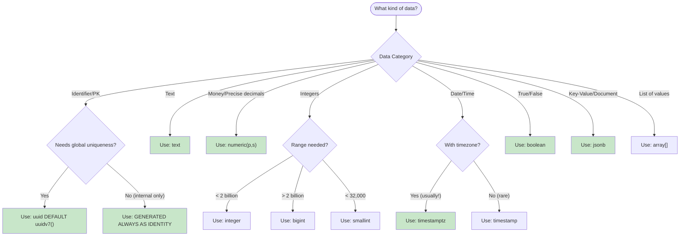
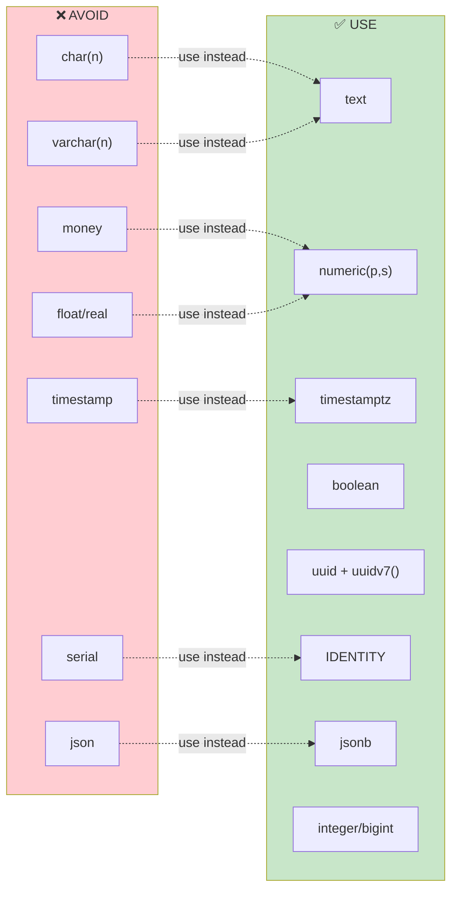

# Data Types Best Practices (PostgreSQL 18+)

## Table of Contents
1. [Primary Keys](#primary-keys)
2. [Text Types](#text-types)
3. [Numeric Types](#numeric-types)
4. [Date/Time Types](#datetime-types)
5. [Boolean Type](#boolean-type)
6. [JSON Types](#json-types)
7. [Array Types](#array-types)
8. [UUID Types](#uuid-types)
9. [Types to Avoid](#types-to-avoid)

## Data Type Selection Guide



### Types to Use vs Avoid



## Primary Keys

### Recommended: UUIDv7 (PostgreSQL 18+)

```sql
-- UUIDv7: timestamp-ordered, globally unique, excellent index locality
CREATE TABLE data.orders (
    id uuid PRIMARY KEY DEFAULT uuidv7()
);

-- Extract timestamp from UUIDv7
SELECT uuid_extract_timestamp(id) AS created FROM data.orders;
```

**Benefits of UUIDv7:**
- Globally unique without coordination
- Timestamp-ordered for B-tree index efficiency
- Better cache locality than random UUIDs
- Safe for distributed systems
- No sequence contention

### Alternative: Identity Columns

```sql
-- For internal tables where global uniqueness not needed
CREATE TABLE data.audit_log (
    id bigint GENERATED ALWAYS AS IDENTITY PRIMARY KEY
);

-- Allow override (rarely needed)
CREATE TABLE data.imported_data (
    id bigint GENERATED BY DEFAULT AS IDENTITY PRIMARY KEY
);
```

### Never Use: SERIAL

```sql
-- DEPRECATED: Don't use serial/bigserial
-- Bad
CREATE TABLE bad_example (
    id serial PRIMARY KEY  -- Don't do this
);

-- Good: Use identity instead
CREATE TABLE good_example (
    id integer GENERATED ALWAYS AS IDENTITY PRIMARY KEY
);
```

## Text Types

### Use: text

```sql
-- text: variable unlimited length, best performance
name        text NOT NULL
description text
email       text NOT NULL
```

### Use: varchar (without length) for documentation

```sql
-- varchar without length = same as text, but documents intent
country_code varchar  -- Still unlimited, but hints at short values
```

### Avoid: char(n) and varchar(n)

```sql
-- AVOID: Fixed-length and length-limited types
-- These provide no performance benefit and cause issues

-- Bad
country_code char(2)      -- Pads with spaces, causes comparison issues
username varchar(50)       -- Arbitrary limit, may need migration later

-- Good
country_code text CHECK (length(country_code) = 2)
username text CHECK (length(username) <= 50)  -- If limit truly needed
```

## Numeric Types

### Integer Types

| Type | Range | Use Case |
|------|-------|----------|
| `smallint` | -32,768 to 32,767 | Enum-like values, small counts |
| `integer` | -2.1B to 2.1B | General purpose, foreign keys |
| `bigint` | -9.2×10¹⁸ to 9.2×10¹⁸ | Large IDs, timestamps as integers |

```sql
quantity        integer NOT NULL DEFAULT 0
retry_count     smallint NOT NULL DEFAULT 0
total_records   bigint NOT NULL DEFAULT 0
```

### Decimal Types

```sql
-- numeric(precision, scale): Exact decimal arithmetic
price           numeric(15, 2) NOT NULL      -- Up to 9999999999999.99
tax_rate        numeric(5, 4) NOT NULL       -- Up to 9.9999 (99.99%)
exchange_rate   numeric(20, 10)              -- High precision rates

-- For monetary values: ALWAYS use numeric, NEVER money type
account_balance numeric(19, 4) NOT NULL DEFAULT 0
```

### Floating Point (Use Sparingly)

```sql
-- Only for scientific/statistical data where exact precision not critical
latitude    double precision
longitude   double precision
score       real  -- 6 decimal digits precision
```

## Date/Time Types

### Always Use: timestamptz

```sql
-- timestamptz: timestamp with time zone (stores UTC internally)
created_at  timestamptz NOT NULL DEFAULT now()
updated_at  timestamptz NOT NULL DEFAULT now()
expires_at  timestamptz
event_time  timestamptz NOT NULL

-- Date only (no time component)
birth_date  date
effective_date date NOT NULL

-- Time only with timezone
opening_time timetz
```

### Never Use: timestamp (without time zone)

```sql
-- NEVER use timestamp without time zone
-- It loses timezone context and causes bugs

-- Bad
created_at timestamp  -- Ambiguous: what timezone?

-- Good
created_at timestamptz  -- Always unambiguous
```

### Intervals

```sql
-- interval: for durations
duration        interval
rental_period   interval NOT NULL DEFAULT '7 days'
timeout         interval NOT NULL DEFAULT '30 minutes'

-- Interval arithmetic
SELECT now() + interval '1 hour';
SELECT age(now(), created_at);
```

### Date/Time Ranges (PostgreSQL 18 Temporal Constraints)

```sql
-- Range types for temporal data
CREATE TABLE data.reservations (
    id uuid PRIMARY KEY DEFAULT uuidv7(),
    room_id uuid NOT NULL,
    guest_id uuid NOT NULL,
    during tstzrange NOT NULL,  -- [checkin, checkout)
    
    -- Temporal primary key (PG18)
    CONSTRAINT reservations_no_double_booking 
        PRIMARY KEY (room_id, during WITHOUT OVERLAPS)
);

-- Insert with range
INSERT INTO data.reservations (room_id, guest_id, during)
VALUES (
    '...', 
    '...', 
    tstzrange('2024-03-01 14:00', '2024-03-05 11:00', '[)')
);
```

## Boolean Type

```sql
-- Always use boolean, never integer flags
is_active       boolean NOT NULL DEFAULT true
is_verified     boolean NOT NULL DEFAULT false
has_accepted    boolean NOT NULL DEFAULT false
email_confirmed boolean NOT NULL DEFAULT false

-- With check constraint for documentation
is_admin boolean NOT NULL DEFAULT false 
    CONSTRAINT users_is_admin_boolean CHECK (is_admin IN (true, false))
```

## JSON Types

### Use: jsonb (Almost Always)

```sql
-- jsonb: binary format, indexable, faster operations
metadata    jsonb NOT NULL DEFAULT '{}'
settings    jsonb NOT NULL DEFAULT '{}'
attributes  jsonb

-- With validation
CREATE TABLE data.products (
    id uuid PRIMARY KEY DEFAULT uuidv7(),
    data jsonb NOT NULL,
    CONSTRAINT products_data_valid CHECK (
        data ? 'name' AND 
        data ? 'price' AND 
        jsonb_typeof(data->'price') = 'number'
    )
);

-- GIN index for jsonb queries
CREATE INDEX idx_products_data ON data.products USING gin (data);

-- Query jsonb
SELECT * FROM data.products WHERE data @> '{"category": "electronics"}';
SELECT * FROM data.products WHERE data->>'name' ILIKE '%widget%';
```

### Rare: json (Preserve Formatting)

```sql
-- json: text format, preserves key order and whitespace
-- Only use when exact preservation required
raw_api_response json  -- Preserve original formatting
```

## Array Types

```sql
-- Array columns
tags        text[] NOT NULL DEFAULT '{}'
scores      integer[]
coordinates double precision[2]

-- With constraints
CREATE TABLE data.articles (
    id uuid PRIMARY KEY DEFAULT uuidv7(),
    tags text[] NOT NULL DEFAULT '{}',
    CONSTRAINT articles_tags_not_empty CHECK (array_length(tags, 1) > 0)
);

-- GIN index for array contains queries
CREATE INDEX idx_articles_tags ON data.articles USING gin (tags);

-- Query arrays
SELECT * FROM data.articles WHERE tags @> ARRAY['postgresql'];
SELECT * FROM data.articles WHERE 'postgresql' = ANY(tags);
```

## UUID Types

### UUIDv7 for Primary Keys (PostgreSQL 18+)

```sql
-- New in PostgreSQL 18: timestamp-ordered UUIDs
id uuid PRIMARY KEY DEFAULT uuidv7()

-- Extract timestamp
SELECT uuid_extract_timestamp(uuidv7());  -- Returns timestamptz
```

### UUIDv4 for Random Identifiers

```sql
-- Random UUID (use for tokens, not primary keys)
api_token uuid DEFAULT gen_random_uuid()

-- Note: uuidv4() is now alias for gen_random_uuid() in PG18
```

## Types to Avoid

### Never Use These Types

| Type | Problem | Use Instead |
|------|---------|-------------|
| `char(n)` | Space padding, comparison issues | `text` |
| `varchar(n)` | Arbitrary limits, no performance benefit | `text` with CHECK |
| `money` | Locale-dependent, rounding issues | `numeric(19,4)` |
| `serial` | Legacy, permission issues | `GENERATED AS IDENTITY` |
| `bigserial` | Legacy, permission issues | `bigint GENERATED AS IDENTITY` |
| `timestamp` | No timezone, ambiguous | `timestamptz` |
| `timetz` | Rarely useful, confusing semantics | Reconsider design |

### Type Migration Examples

```sql
-- Migrating from serial to identity
ALTER TABLE data.old_table 
    ALTER COLUMN id DROP DEFAULT,
    ALTER COLUMN id ADD GENERATED ALWAYS AS IDENTITY;

-- Migrating from timestamp to timestamptz
ALTER TABLE data.events 
    ALTER COLUMN event_time TYPE timestamptz 
    USING event_time AT TIME ZONE 'UTC';

-- Migrating from money to numeric
ALTER TABLE data.products
    ALTER COLUMN price TYPE numeric(15,2) 
    USING price::numeric;
```

## Generated Columns (PostgreSQL 18+)

### Virtual Generated Columns (Default in PG18)

```sql
-- Computed at query time, no storage
CREATE TABLE data.orders (
    id uuid PRIMARY KEY DEFAULT uuidv7(),
    subtotal numeric(15,2) NOT NULL,
    tax_rate numeric(5,4) NOT NULL DEFAULT 0.0875,
    -- Virtual (computed when read)
    total numeric(15,2) GENERATED ALWAYS AS (subtotal * (1 + tax_rate))
);
```

### Stored Generated Columns

```sql
-- Computed and stored on write (use when computation expensive)
CREATE TABLE data.users (
    id uuid PRIMARY KEY DEFAULT uuidv7(),
    first_name text NOT NULL,
    last_name text NOT NULL,
    -- Stored (can be indexed, replicated)
    full_name text GENERATED ALWAYS AS (first_name || ' ' || last_name) STORED
);

-- Can index stored generated columns
CREATE INDEX idx_users_full_name ON data.users(full_name);
```
