# Data Warehousing with Medallion Architecture

A comprehensive guide to implementing a modular, maintainable, and performant data warehouse in PostgreSQL using the Medallion Architecture pattern, integrated with this skill's schema separation and Table API conventions.

## Table of Contents

1. [Medallion Architecture Overview](#medallion-architecture-overview)
2. [Schema Organization](#schema-organization)
3. [Bronze Layer (Raw)](#bronze-layer-raw)
4. [Silver Layer (Cleansed)](#silver-layer-cleansed)
5. [Gold Layer (Business)](#gold-layer-business)
6. [Data Lineage Tracking](#data-lineage-tracking)
7. [ETL Orchestration](#etl-orchestration)
8. [Incremental Processing](#incremental-processing)
9. [Data Quality Framework](#data-quality-framework)
10. [Performance Optimization](#performance-optimization)
11. [Complete Implementation Example](#complete-implementation-example)

---

## Medallion Architecture Overview

The Medallion Architecture organizes data into three progressive layers of refinement, each serving a specific purpose in the data pipeline.

### Architecture Diagram


### Layer Responsibilities

| Layer | Purpose | Data Characteristics | Retention |
|-------|---------|---------------------|-----------|
| **Bronze** | Landing zone | Raw, unmodified, append-only | Long (years) |
| **Silver** | Single source of truth | Cleansed, validated, deduplicated | Medium (months) |
| **Gold** | Business consumption | Aggregated, denormalized, optimized | Configurable |

### Key Principles

1. **Immutability**: Bronze data is never modified after landing
2. **Traceability**: Every record can be traced back to its source
3. **Replayability**: Any layer can be rebuilt from the layer below
4. **Modularity**: Each layer is independent and testable
5. **Progressive Refinement**: Data quality improves through each layer

---

## Schema Organization

### Recommended Schema Structure

I recommend a **separate schema per layer** with a dedicated **lineage schema** for tracking:

```mermaid
flowchart LR
    subgraph DWH["Data Warehouse Schemas"]
        direction TB
        
        subgraph MEDAL["Medallion Layers"]
            BRONZE_S["bronze<br/>───────<br/>Raw tables<br/>Landing zone"]
            SILVER_S["silver<br/>───────<br/>Cleansed tables<br/>Conformed dims"]
            GOLD_S["gold<br/>───────<br/>Star schemas<br/>Aggregates"]
        end
        
        subgraph SUPPORT["Support Schemas"]
            LINEAGE_S["dwh_lineage<br/>───────<br/>Pipeline tracking<br/>Data lineage"]
            ETL_S["dwh_etl<br/>───────<br/>Transform functions<br/>Load procedures"]
            STAGING_S["dwh_staging<br/>───────<br/>Temp processing<br/>Work tables"]
        end
    end
    
    BRONZE_S --> SILVER_S --> GOLD_S
    ETL_S -->|"transforms"| MEDAL
    MEDAL -->|"logs to"| LINEAGE_S
    
    style BRONZE_S fill:#cd7f32,color:#fff
    style SILVER_S fill:#c0c0c0
    style GOLD_S fill:#ffd700
    style LINEAGE_S fill:#e3f2fd
    style ETL_S fill:#fff3e0
    style STAGING_S fill:#f3e5f5
```



### Why Separate Lineage Schema?

I recommend a dedicated `dwh_lineage` schema for data lineage because:

1. **Cross-cutting concern**: Lineage spans all medallion layers and shouldn't belong to any single one
2. **Different access patterns**: Data engineers need lineage access; analysts typically don't
3. **Independent lifecycle**: Lineage can be upgraded/modified without touching data schemas
4. **Clear separation**: Keeps operational metadata distinct from business data
5. **Compliance**: Makes it easy to demonstrate data provenance for audits

### Schema Creation Script

```sql
-- ============================================================================
-- Data Warehouse Schema Setup
-- ============================================================================

-- Medallion layers
CREATE SCHEMA IF NOT EXISTS bronze;
COMMENT ON SCHEMA bronze IS 'Raw data landing zone - exact copies from sources';

CREATE SCHEMA IF NOT EXISTS silver;
COMMENT ON SCHEMA silver IS 'Cleansed and validated data - single source of truth';

CREATE SCHEMA IF NOT EXISTS gold;
COMMENT ON SCHEMA gold IS 'Business-ready data - star schemas and aggregates';

-- Support schemas
CREATE SCHEMA IF NOT EXISTS dwh_lineage;
COMMENT ON SCHEMA dwh_lineage IS 'Data lineage tracking and pipeline metadata';

CREATE SCHEMA IF NOT EXISTS dwh_etl;
COMMENT ON SCHEMA dwh_etl IS 'ETL functions, procedures, and orchestration';

CREATE SCHEMA IF NOT EXISTS dwh_staging;
COMMENT ON SCHEMA dwh_staging IS 'Temporary staging tables for ETL processing';

-- Revoke public access
REVOKE ALL ON SCHEMA bronze FROM PUBLIC;
REVOKE ALL ON SCHEMA silver FROM PUBLIC;
REVOKE ALL ON SCHEMA gold FROM PUBLIC;
REVOKE ALL ON SCHEMA dwh_lineage FROM PUBLIC;
REVOKE ALL ON SCHEMA dwh_etl FROM PUBLIC;
REVOKE ALL ON SCHEMA dwh_staging FROM PUBLIC;
```

### ETL Security Model

Unlike OLTP applications (which use `SECURITY DEFINER` functions to access data through the `api` schema), ETL pipelines typically run under a **dedicated service account** with direct schema access:

```sql
-- Create ETL service role
CREATE ROLE etl_service LOGIN PASSWORD 'secure_password';

-- Grant access to all DWH schemas
GRANT USAGE ON SCHEMA bronze, silver, gold, dwh_lineage, dwh_etl, dwh_staging TO etl_service;
GRANT ALL ON ALL TABLES IN SCHEMA bronze, silver, gold, dwh_staging TO etl_service;
GRANT SELECT, INSERT ON ALL TABLES IN SCHEMA dwh_lineage TO etl_service;
GRANT EXECUTE ON ALL FUNCTIONS IN SCHEMA dwh_etl TO etl_service;
GRANT EXECUTE ON ALL PROCEDURES IN SCHEMA dwh_etl TO etl_service;

-- Default privileges for future objects
ALTER DEFAULT PRIVILEGES IN SCHEMA bronze, silver, gold 
    GRANT ALL ON TABLES TO etl_service;
```

**Why no SECURITY DEFINER for ETL?**
- ETL runs as a scheduled job, not user-initiated requests
- The service account is already trusted with full DWH access  
- Simpler debugging (no context switching)
- Better performance (no overhead from SECURITY DEFINER)

**For analyst/BI access** to the gold layer, create a separate read-only role:

```sql
CREATE ROLE analyst_role;
GRANT USAGE ON SCHEMA gold TO analyst_role;
GRANT SELECT ON ALL TABLES IN SCHEMA gold TO analyst_role;
ALTER DEFAULT PRIVILEGES IN SCHEMA gold GRANT SELECT ON TABLES TO analyst_role;
```

### Integration with OLTP Schemas

If your database has both OLTP (`data`, `api`, `private`) and DWH schemas:


---

## Bronze Layer (Raw)

The bronze layer is the **landing zone** for all source data. Data here should be:
- **Exact copies** of source systems
- **Append-only** (never updated or deleted)
- **Timestamped** with ingestion metadata
- **Unmodified** from source format

### Bronze Table Design Pattern

```sql
-- ============================================================================
-- Bronze Table Template
-- ============================================================================

CREATE TABLE bronze.raw_customers (
    -- Ingestion metadata (always first)
    _bronze_id          bigint GENERATED ALWAYS AS IDENTITY PRIMARY KEY,
    _ingested_at        timestamptz NOT NULL DEFAULT now(),
    _source_system      text NOT NULL,
    _source_file        text,                    -- For file-based sources
    _batch_id           uuid,                    -- Links to pipeline run
    _raw_payload        jsonb,                   -- Optional: store original JSON
    
    -- Source data (exact copy, nullable to handle bad data)
    id                  text,                    -- Keep as text initially
    email               text,
    name                text,
    status              text,
    created_date        text,                    -- Don't parse yet
    updated_date        text,
    extra_field_1       text,                    -- Unknown/extra fields
    extra_field_2       text
);

-- Partition by ingestion date for efficient pruning
CREATE TABLE bronze.raw_customers_partitioned (
    _bronze_id          bigint GENERATED ALWAYS AS IDENTITY,
    _ingested_at        timestamptz NOT NULL DEFAULT now(),
    _source_system      text NOT NULL,
    _batch_id           uuid,
    
    -- Source columns
    id                  text,
    email               text,
    name                text,
    created_date        text,
    
    PRIMARY KEY (_bronze_id, _ingested_at)
) PARTITION BY RANGE (_ingested_at);

-- Create monthly partitions
CREATE TABLE bronze.raw_customers_2024_01 
    PARTITION OF bronze.raw_customers_partitioned
    FOR VALUES FROM ('2024-01-01') TO ('2024-02-01');
```

### Bronze Ingestion Patterns

#### Pattern 1: Batch File Ingestion

```sql
CREATE OR REPLACE PROCEDURE dwh_etl.ingest_customers_csv(
    in_file_path    text,
    in_source       text DEFAULT 'csv_import',
    INOUT io_batch_id uuid DEFAULT NULL
)
LANGUAGE plpgsql
AS $$
DECLARE
    l_row_count integer;
BEGIN
    -- Generate batch ID
    io_batch_id := COALESCE(io_batch_id, gen_random_uuid());
    
    -- Create temp table for COPY
    CREATE TEMP TABLE temp_csv_import (
        id text,
        email text,
        name text,
        status text,
        created_date text,
        updated_date text
    ) ON COMMIT DROP;
    
    -- Load CSV
    EXECUTE format('COPY temp_csv_import FROM %L WITH CSV HEADER', in_file_path);
    
    -- Insert into bronze with metadata
    INSERT INTO bronze.raw_customers (
        _source_system, _source_file, _batch_id,
        id, email, name, status, created_date, updated_date
    )
    SELECT 
        in_source,
        in_file_path,
        io_batch_id,
        id, email, name, status, created_date, updated_date
    FROM temp_csv_import;
    
    GET DIAGNOSTICS l_row_count = ROW_COUNT;
    
    -- Log to lineage
    PERFORM dwh_lineage.log_ingestion(
        in_table_name := 'bronze.raw_customers',
        in_batch_id := io_batch_id,
        in_source := in_source,
        in_row_count := l_row_count
    );
    
    RAISE NOTICE 'Ingested % rows into bronze.raw_customers (batch: %)', 
        l_row_count, io_batch_id;
END;
$$;
```

#### Pattern 2: CDC (Change Data Capture) Ingestion

```sql
-- Bronze table for CDC events
CREATE TABLE bronze.raw_customers_cdc (
    _bronze_id          bigint GENERATED ALWAYS AS IDENTITY PRIMARY KEY,
    _ingested_at        timestamptz NOT NULL DEFAULT now(),
    _cdc_operation      text NOT NULL,           -- INSERT, UPDATE, DELETE
    _cdc_timestamp      timestamptz NOT NULL,    -- When change occurred at source
    _cdc_lsn            text,                    -- Log sequence number
    _batch_id           uuid,
    
    -- Full row data (before/after)
    before_data         jsonb,                   -- Previous values (UPDATE/DELETE)
    after_data          jsonb                    -- New values (INSERT/UPDATE)
);

-- Ingest CDC events
CREATE OR REPLACE PROCEDURE dwh_etl.ingest_cdc_event(
    in_operation    text,
    in_timestamp    timestamptz,
    in_before       jsonb,
    in_after        jsonb,
    in_batch_id     uuid DEFAULT NULL
)
LANGUAGE plpgsql
AS $$
BEGIN
    INSERT INTO bronze.raw_customers_cdc (
        _cdc_operation, _cdc_timestamp, _batch_id,
        before_data, after_data
    ) VALUES (
        in_operation, in_timestamp, COALESCE(in_batch_id, gen_random_uuid()),
        in_before, in_after
    );
END;
$$;
```

#### Pattern 3: API/JSON Ingestion

```sql
CREATE OR REPLACE PROCEDURE dwh_etl.ingest_api_response(
    in_endpoint     text,
    in_response     jsonb,
    INOUT io_batch_id uuid DEFAULT NULL
)
LANGUAGE plpgsql
AS $$
DECLARE
    l_row_count integer;
BEGIN
    io_batch_id := COALESCE(io_batch_id, gen_random_uuid());
    
    -- Store raw JSON array elements
    INSERT INTO bronze.raw_api_responses (
        _source_system, _batch_id, _raw_payload,
        id, email, name
    )
    SELECT 
        in_endpoint,
        io_batch_id,
        item,
        item->>'id',
        item->>'email',
        item->>'name'
    FROM jsonb_array_elements(in_response->'data') AS item;
    
    GET DIAGNOSTICS l_row_count = ROW_COUNT;
    
    PERFORM dwh_lineage.log_ingestion(
        in_table_name := 'bronze.raw_api_responses',
        in_batch_id := io_batch_id,
        in_source := in_endpoint,
        in_row_count := l_row_count
    );
END;
$$;
```

### Bronze Best Practices

| Practice | Rationale |
|----------|-----------|
| Never modify bronze data | Enables replay and audit |
| Use text types initially | Avoids parse errors on bad data |
| Include ingestion metadata | Enables debugging and lineage |
| Partition by ingestion date | Efficient pruning and archival |
| Store raw JSON when possible | Preserves original structure |
| Use append-only pattern | Simplifies concurrency |

---

## Silver Layer (Cleansed)

The silver layer transforms bronze data into a **cleansed, validated, and conformed** state. This is your **single source of truth**.

### Silver Layer Characteristics


### Silver Table Design Pattern

```sql
-- ============================================================================
-- Silver Table with SCD Type 2 (Slowly Changing Dimension)
-- ============================================================================

CREATE TABLE silver.customers (
    -- Surrogate key
    customer_sk         bigint GENERATED ALWAYS AS IDENTITY PRIMARY KEY,
    
    -- Natural/business key
    customer_id         uuid NOT NULL,           -- Parsed from bronze
    
    -- Cleansed attributes
    email               text NOT NULL,
    email_domain        text GENERATED ALWAYS AS (split_part(email, '@', 2)) STORED,
    name                text NOT NULL,
    status              text NOT NULL CHECK (status IN ('active', 'inactive', 'suspended')),
    
    -- SCD Type 2 tracking
    valid_from          timestamptz NOT NULL DEFAULT now(),
    valid_to            timestamptz,             -- NULL = current record
    is_current          boolean NOT NULL DEFAULT true,
    
    -- Lineage
    _source_bronze_id   bigint,                  -- Links to bronze record
    _batch_id           uuid NOT NULL,
    _loaded_at          timestamptz NOT NULL DEFAULT now(),
    
    -- Constraints
    CONSTRAINT customers_valid_range CHECK (valid_to IS NULL OR valid_to > valid_from)
);

-- Unique constraint on business key for current records
CREATE UNIQUE INDEX silver_customers_current_key 
    ON silver.customers(customer_id) 
    WHERE is_current = true;

-- Index for SCD lookups
CREATE INDEX silver_customers_history_idx 
    ON silver.customers(customer_id, valid_from, valid_to);
```

### SCD Type 2 Implementation

```sql
-- ============================================================================
-- SCD Type 2 Merge Pattern
-- ============================================================================

CREATE OR REPLACE PROCEDURE dwh_etl.load_silver_customers(
    in_batch_id uuid DEFAULT NULL
)
LANGUAGE plpgsql
AS $$
DECLARE
    l_batch_id uuid;
    l_inserted integer := 0;
    l_updated integer := 0;
    l_unchanged integer := 0;
BEGIN
    l_batch_id := COALESCE(in_batch_id, gen_random_uuid());
    
    -- Step 1: Create staging table with cleansed data
    CREATE TEMP TABLE stg_customers AS
    SELECT DISTINCT ON (id)
        -- Parse and cleanse
        id::uuid AS customer_id,
        lower(trim(email)) AS email,
        trim(name) AS name,
        CASE lower(trim(status))
            WHEN 'active' THEN 'active'
            WHEN 'inactive' THEN 'inactive'
            WHEN 'suspended' THEN 'suspended'
            ELSE 'inactive'  -- Default for unknown
        END AS status,
        _bronze_id,
        -- Hash for change detection
        md5(lower(trim(email)) || trim(name) || lower(trim(status))) AS row_hash
    FROM bronze.raw_customers
    WHERE _ingested_at > COALESCE(
        (SELECT MAX(_loaded_at) FROM silver.customers), 
        '1900-01-01'::timestamptz
    )
    ORDER BY id, _ingested_at DESC;  -- Latest record per ID
    
    -- Step 2: Identify changes
    CREATE TEMP TABLE changes AS
    SELECT 
        stg.*,
        cur.customer_sk AS existing_sk,
        CASE 
            WHEN cur.customer_sk IS NULL THEN 'INSERT'
            WHEN md5(cur.email || cur.name || cur.status) != stg.row_hash THEN 'UPDATE'
            ELSE 'UNCHANGED'
        END AS change_type
    FROM stg_customers stg
    LEFT JOIN silver.customers cur 
        ON cur.customer_id = stg.customer_id 
        AND cur.is_current = true;
    
    -- Step 3: Close existing records for updates (SCD Type 2)
    UPDATE silver.customers c
    SET valid_to = now(),
        is_current = false
    FROM changes ch
    WHERE c.customer_sk = ch.existing_sk
      AND ch.change_type = 'UPDATE';
    
    GET DIAGNOSTICS l_updated = ROW_COUNT;
    
    -- Step 4: Insert new and updated records
    INSERT INTO silver.customers (
        customer_id, email, name, status,
        valid_from, is_current,
        _source_bronze_id, _batch_id
    )
    SELECT 
        customer_id, email, name, status,
        now(), true,
        _bronze_id, l_batch_id
    FROM changes
    WHERE change_type IN ('INSERT', 'UPDATE');
    
    GET DIAGNOSTICS l_inserted = ROW_COUNT;
    
    SELECT COUNT(*) INTO l_unchanged FROM changes WHERE change_type = 'UNCHANGED';
    
    -- Log to lineage
    PERFORM dwh_lineage.log_transformation(
        in_source_table := 'bronze.raw_customers',
        in_target_table := 'silver.customers',
        in_batch_id := l_batch_id,
        in_rows_inserted := l_inserted,
        in_rows_updated := l_updated,
        in_rows_unchanged := l_unchanged
    );
    
    -- Cleanup
    DROP TABLE stg_customers;
    DROP TABLE changes;
    
    RAISE NOTICE 'Silver customers: % inserted, % updated, % unchanged', 
        l_inserted, l_updated, l_unchanged;
END;
$$;
```

### Silver Data Quality Checks

```sql
-- Apply quality checks during silver load
CREATE OR REPLACE FUNCTION dwh_etl.validate_customer(
    in_email text,
    in_name text,
    in_status text
)
RETURNS TABLE (
    is_valid boolean,
    issues text[]
)
LANGUAGE plpgsql
IMMUTABLE
AS $$
DECLARE
    l_issues text[] := '{}';
BEGIN
    -- Email validation
    IF in_email IS NULL OR in_email = '' THEN
        l_issues := array_append(l_issues, 'Email is required');
    ELSIF in_email !~ '^[^@]+@[^@]+\.[^@]+$' THEN
        l_issues := array_append(l_issues, 'Invalid email format');
    END IF;
    
    -- Name validation
    IF in_name IS NULL OR length(trim(in_name)) < 2 THEN
        l_issues := array_append(l_issues, 'Name must be at least 2 characters');
    END IF;
    
    -- Status validation
    IF in_status NOT IN ('active', 'inactive', 'suspended') THEN
        l_issues := array_append(l_issues, 'Invalid status value');
    END IF;
    
    RETURN QUERY SELECT array_length(l_issues, 1) = 0 OR l_issues = '{}', l_issues;
END;
$$;

-- Log invalid records for review
CREATE TABLE silver.quality_exceptions (
    id              bigint GENERATED ALWAYS AS IDENTITY PRIMARY KEY,
    source_table    text NOT NULL,
    source_id       text,
    bronze_id       bigint,
    issues          text[] NOT NULL,
    source_data     jsonb,
    detected_at     timestamptz NOT NULL DEFAULT now(),
    resolved_at     timestamptz,
    resolution      text
);
```

---

## Gold Layer (Business)

The gold layer provides **business-ready data** optimized for consumption by BI tools, reports, and analytics.

### Gold Layer Structure


### Dimension Table Pattern

```sql
-- ============================================================================
-- Gold Dimension: Customer
-- ============================================================================

CREATE TABLE gold.dim_customer (
    -- Surrogate key
    customer_key        bigint GENERATED ALWAYS AS IDENTITY PRIMARY KEY,
    
    -- Natural key
    customer_id         uuid NOT NULL,
    
    -- Dimension attributes (denormalized for query performance)
    email               text NOT NULL,
    email_domain        text NOT NULL,
    name                text NOT NULL,
    first_name          text GENERATED ALWAYS AS (split_part(name, ' ', 1)) STORED,
    last_name           text GENERATED ALWAYS AS (
        CASE WHEN position(' ' in name) > 0 
             THEN substring(name from position(' ' in name) + 1)
             ELSE '' 
        END
    ) STORED,
    status              text NOT NULL,
    
    -- Derived attributes for analysis
    customer_segment    text,                    -- 'high_value', 'regular', 'new'
    acquisition_date    date,
    acquisition_channel text,
    
    -- SCD Type 2
    valid_from          timestamptz NOT NULL,
    valid_to            timestamptz,
    is_current          boolean NOT NULL DEFAULT true,
    
    -- Lineage
    _silver_sk          bigint,                  -- Links to silver record
    _batch_id           uuid NOT NULL,
    _loaded_at          timestamptz NOT NULL DEFAULT now()
);

-- Business key index
CREATE UNIQUE INDEX gold_dim_customer_bk ON gold.dim_customer(customer_id) WHERE is_current;

-- Common query patterns
CREATE INDEX dim_customer_segment_idx ON gold.dim_customer(customer_segment) WHERE is_current;
CREATE INDEX dim_customer_domain_idx ON gold.dim_customer(email_domain) WHERE is_current;
```

### Date Dimension

```sql
-- ============================================================================
-- Gold Dimension: Date (Generated)
-- ============================================================================

CREATE TABLE gold.dim_date (
    date_key            integer PRIMARY KEY,     -- YYYYMMDD format
    full_date           date NOT NULL UNIQUE,
    
    -- Date parts
    year                smallint NOT NULL,
    quarter             smallint NOT NULL,
    month               smallint NOT NULL,
    week                smallint NOT NULL,
    day_of_month        smallint NOT NULL,
    day_of_week         smallint NOT NULL,
    day_of_year         smallint NOT NULL,
    
    -- Names
    month_name          text NOT NULL,
    month_short         text NOT NULL,
    day_name            text NOT NULL,
    day_short           text NOT NULL,
    quarter_name        text NOT NULL,
    
    -- Flags
    is_weekend          boolean NOT NULL,
    is_holiday          boolean NOT NULL DEFAULT false,
    holiday_name        text,
    
    -- Fiscal calendar (adjust as needed)
    fiscal_year         smallint NOT NULL,
    fiscal_quarter      smallint NOT NULL,
    fiscal_month        smallint NOT NULL,
    
    -- Relative flags (updated periodically)
    is_current_day      boolean NOT NULL DEFAULT false,
    is_current_week     boolean NOT NULL DEFAULT false,
    is_current_month    boolean NOT NULL DEFAULT false,
    is_current_quarter  boolean NOT NULL DEFAULT false,
    is_current_year     boolean NOT NULL DEFAULT false
);

-- Generate date dimension
CREATE OR REPLACE PROCEDURE dwh_etl.generate_dim_date(
    in_start_date date DEFAULT '2020-01-01',
    in_end_date date DEFAULT '2030-12-31'
)
LANGUAGE plpgsql
AS $$
DECLARE
    l_date date;
BEGIN
    l_date := in_start_date;
    
    WHILE l_date <= in_end_date LOOP
        INSERT INTO gold.dim_date (
            date_key, full_date,
            year, quarter, month, week, day_of_month, day_of_week, day_of_year,
            month_name, month_short, day_name, day_short, quarter_name,
            is_weekend,
            fiscal_year, fiscal_quarter, fiscal_month
        ) VALUES (
            to_char(l_date, 'YYYYMMDD')::integer,
            l_date,
            EXTRACT(year FROM l_date),
            EXTRACT(quarter FROM l_date),
            EXTRACT(month FROM l_date),
            EXTRACT(week FROM l_date),
            EXTRACT(day FROM l_date),
            EXTRACT(dow FROM l_date),
            EXTRACT(doy FROM l_date),
            to_char(l_date, 'Month'),
            to_char(l_date, 'Mon'),
            to_char(l_date, 'Day'),
            to_char(l_date, 'Dy'),
            'Q' || EXTRACT(quarter FROM l_date),
            EXTRACT(dow FROM l_date) IN (0, 6),
            -- Fiscal year starting July (adjust as needed)
            CASE WHEN EXTRACT(month FROM l_date) >= 7 
                 THEN EXTRACT(year FROM l_date) + 1 
                 ELSE EXTRACT(year FROM l_date) END,
            CASE WHEN EXTRACT(month FROM l_date) >= 7 
                 THEN EXTRACT(quarter FROM l_date) - 2 
                 ELSE EXTRACT(quarter FROM l_date) + 2 END,
            CASE WHEN EXTRACT(month FROM l_date) >= 7 
                 THEN EXTRACT(month FROM l_date) - 6 
                 ELSE EXTRACT(month FROM l_date) + 6 END
        )
        ON CONFLICT (date_key) DO NOTHING;
        
        l_date := l_date + 1;
    END LOOP;
END;
$$;

-- Update relative flags daily
CREATE OR REPLACE PROCEDURE dwh_etl.update_dim_date_flags()
LANGUAGE plpgsql
AS $$
BEGIN
    UPDATE gold.dim_date
    SET is_current_day = (full_date = CURRENT_DATE),
        is_current_week = (EXTRACT(week FROM full_date) = EXTRACT(week FROM CURRENT_DATE)
                          AND EXTRACT(year FROM full_date) = EXTRACT(year FROM CURRENT_DATE)),
        is_current_month = (EXTRACT(month FROM full_date) = EXTRACT(month FROM CURRENT_DATE)
                           AND EXTRACT(year FROM full_date) = EXTRACT(year FROM CURRENT_DATE)),
        is_current_quarter = (EXTRACT(quarter FROM full_date) = EXTRACT(quarter FROM CURRENT_DATE)
                             AND EXTRACT(year FROM full_date) = EXTRACT(year FROM CURRENT_DATE)),
        is_current_year = (EXTRACT(year FROM full_date) = EXTRACT(year FROM CURRENT_DATE));
END;
$$;
```

### Fact Table Pattern

```sql
-- ============================================================================
-- Gold Fact: Sales
-- ============================================================================

CREATE TABLE gold.fact_sales (
    -- Surrogate key
    sales_key           bigint GENERATED ALWAYS AS IDENTITY PRIMARY KEY,
    
    -- Dimension keys (foreign keys to dimensions)
    customer_key        bigint NOT NULL REFERENCES gold.dim_customer(customer_key),
    product_key         bigint NOT NULL REFERENCES gold.dim_product(product_key),
    date_key            integer NOT NULL REFERENCES gold.dim_date(date_key),
    
    -- Degenerate dimensions (transaction details)
    order_id            uuid NOT NULL,
    order_line_number   smallint NOT NULL,
    
    -- Measures
    quantity            integer NOT NULL,
    unit_price          numeric(10,2) NOT NULL,
    discount_amount     numeric(10,2) NOT NULL DEFAULT 0,
    tax_amount          numeric(10,2) NOT NULL DEFAULT 0,
    line_total          numeric(10,2) GENERATED ALWAYS AS (
        quantity * unit_price - discount_amount + tax_amount
    ) STORED,
    
    -- Lineage
    _silver_order_sk    bigint,
    _batch_id           uuid NOT NULL,
    _loaded_at          timestamptz NOT NULL DEFAULT now(),
    
    -- Constraints
    CONSTRAINT fact_sales_quantity_positive CHECK (quantity > 0),
    CONSTRAINT fact_sales_price_positive CHECK (unit_price >= 0)
);

-- Partition by date for time-based queries
CREATE TABLE gold.fact_sales_partitioned (
    sales_key           bigint GENERATED ALWAYS AS IDENTITY,
    customer_key        bigint NOT NULL,
    product_key         bigint NOT NULL,
    date_key            integer NOT NULL,
    order_id            uuid NOT NULL,
    order_line_number   smallint NOT NULL,
    quantity            integer NOT NULL,
    unit_price          numeric(10,2) NOT NULL,
    discount_amount     numeric(10,2) NOT NULL DEFAULT 0,
    tax_amount          numeric(10,2) NOT NULL DEFAULT 0,
    line_total          numeric(10,2),
    _batch_id           uuid NOT NULL,
    _loaded_at          timestamptz NOT NULL DEFAULT now(),
    PRIMARY KEY (sales_key, date_key)
) PARTITION BY RANGE (date_key);

-- Create yearly partitions
CREATE TABLE gold.fact_sales_2024 PARTITION OF gold.fact_sales_partitioned
    FOR VALUES FROM (20240101) TO (20250101);
```

### Aggregate Table Pattern

```sql
-- ============================================================================
-- Gold Aggregate: Daily Sales
-- ============================================================================

CREATE TABLE gold.agg_daily_sales (
    date_key            integer NOT NULL REFERENCES gold.dim_date(date_key),
    customer_segment    text,
    product_category    text,
    
    -- Aggregate measures
    order_count         integer NOT NULL,
    item_count          integer NOT NULL,
    gross_revenue       numeric(12,2) NOT NULL,
    discount_total      numeric(12,2) NOT NULL,
    tax_total           numeric(12,2) NOT NULL,
    net_revenue         numeric(12,2) NOT NULL,
    avg_order_value     numeric(10,2) NOT NULL,
    
    -- Lineage
    _batch_id           uuid NOT NULL,
    _loaded_at          timestamptz NOT NULL DEFAULT now(),
    
    PRIMARY KEY (date_key, customer_segment, product_category)
);

-- Refresh aggregate
CREATE OR REPLACE PROCEDURE dwh_etl.refresh_agg_daily_sales(
    in_date_key integer DEFAULT NULL
)
LANGUAGE plpgsql
AS $$
DECLARE
    l_batch_id uuid := gen_random_uuid();
BEGIN
    -- Delete existing data for the date(s)
    IF in_date_key IS NOT NULL THEN
        DELETE FROM gold.agg_daily_sales WHERE date_key = in_date_key;
    ELSE
        TRUNCATE gold.agg_daily_sales;
    END IF;
    
    -- Insert aggregated data
    INSERT INTO gold.agg_daily_sales (
        date_key, customer_segment, product_category,
        order_count, item_count, gross_revenue, discount_total, tax_total,
        net_revenue, avg_order_value, _batch_id
    )
    SELECT 
        f.date_key,
        COALESCE(c.customer_segment, 'Unknown'),
        COALESCE(p.product_category, 'Unknown'),
        COUNT(DISTINCT f.order_id),
        SUM(f.quantity),
        SUM(f.quantity * f.unit_price),
        SUM(f.discount_amount),
        SUM(f.tax_amount),
        SUM(f.line_total),
        AVG(f.line_total),
        l_batch_id
    FROM gold.fact_sales f
    JOIN gold.dim_customer c ON c.customer_key = f.customer_key
    JOIN gold.dim_product p ON p.product_key = f.product_key
    WHERE (in_date_key IS NULL OR f.date_key = in_date_key)
    GROUP BY f.date_key, c.customer_segment, p.product_category;
    
    -- Log to lineage
    PERFORM dwh_lineage.log_aggregation(
        in_source_table := 'gold.fact_sales',
        in_target_table := 'gold.agg_daily_sales',
        in_batch_id := l_batch_id
    );
END;
$$;
```

### Materialized Views for Performance

```sql
-- Materialized view for frequently accessed aggregates
CREATE MATERIALIZED VIEW gold.mv_customer_lifetime_value AS
SELECT 
    c.customer_key,
    c.customer_id,
    c.email,
    c.name,
    c.customer_segment,
    COUNT(DISTINCT f.order_id) AS total_orders,
    SUM(f.line_total) AS lifetime_value,
    AVG(f.line_total) AS avg_order_value,
    MIN(d.full_date) AS first_order_date,
    MAX(d.full_date) AS last_order_date,
    MAX(d.full_date) - MIN(d.full_date) AS customer_tenure_days
FROM gold.dim_customer c
LEFT JOIN gold.fact_sales f ON f.customer_key = c.customer_key
LEFT JOIN gold.dim_date d ON d.date_key = f.date_key
WHERE c.is_current = true
GROUP BY c.customer_key, c.customer_id, c.email, c.name, c.customer_segment;

-- Index for the materialized view
CREATE UNIQUE INDEX mv_customer_ltv_pk ON gold.mv_customer_lifetime_value(customer_key);
CREATE INDEX mv_customer_ltv_value ON gold.mv_customer_lifetime_value(lifetime_value DESC);

-- Refresh procedure
CREATE OR REPLACE PROCEDURE dwh_etl.refresh_customer_ltv()
LANGUAGE plpgsql
AS $$
BEGIN
    REFRESH MATERIALIZED VIEW CONCURRENTLY gold.mv_customer_lifetime_value;
    
    PERFORM dwh_lineage.log_refresh(
        in_view_name := 'gold.mv_customer_lifetime_value'
    );
END;
$$;
```

---

## Data Lineage Tracking

Data lineage tracks the **origin, transformations, and destinations** of data throughout the pipeline.

### Lineage Schema Design


### Lineage Tables Implementation

```sql
-- ============================================================================
-- Data Lineage Schema
-- ============================================================================

-- Pipeline execution tracking
CREATE TABLE dwh_lineage.pipeline_runs (
    run_id          bigint GENERATED ALWAYS AS IDENTITY PRIMARY KEY,
    batch_id        uuid NOT NULL UNIQUE DEFAULT gen_random_uuid(),
    pipeline_name   text NOT NULL,
    started_at      timestamptz NOT NULL DEFAULT now(),
    completed_at    timestamptz,
    status          text NOT NULL DEFAULT 'running' 
                    CHECK (status IN ('running', 'completed', 'failed', 'cancelled')),
    parameters      jsonb DEFAULT '{}',
    error_message   text,
    metrics         jsonb DEFAULT '{}'
);

CREATE INDEX pipeline_runs_name_idx ON dwh_lineage.pipeline_runs(pipeline_name);
CREATE INDEX pipeline_runs_status_idx ON dwh_lineage.pipeline_runs(status);
CREATE INDEX pipeline_runs_started_idx ON dwh_lineage.pipeline_runs(started_at);

-- Table-level lineage
CREATE TABLE dwh_lineage.table_lineage (
    lineage_id      bigint GENERATED ALWAYS AS IDENTITY PRIMARY KEY,
    run_id          bigint REFERENCES dwh_lineage.pipeline_runs(run_id),
    batch_id        uuid NOT NULL,
    
    -- Source and target
    source_table    text NOT NULL,
    target_table    text NOT NULL,
    operation       text NOT NULL CHECK (operation IN (
        'ingest', 'transform', 'aggregate', 'refresh', 'delete'
    )),
    
    -- Metrics
    rows_read       bigint,
    rows_inserted   bigint,
    rows_updated    bigint,
    rows_deleted    bigint,
    rows_rejected   bigint,
    
    -- Timing
    started_at      timestamptz NOT NULL DEFAULT now(),
    completed_at    timestamptz,
    duration_ms     integer GENERATED ALWAYS AS (
        EXTRACT(MILLISECONDS FROM (completed_at - started_at))::integer
    ) STORED,
    
    -- Additional context
    sql_hash        text,                        -- Hash of executed SQL
    notes           text
);

CREATE INDEX table_lineage_source_idx ON dwh_lineage.table_lineage(source_table);
CREATE INDEX table_lineage_target_idx ON dwh_lineage.table_lineage(target_table);
CREATE INDEX table_lineage_batch_idx ON dwh_lineage.table_lineage(batch_id);

-- Column-level lineage (optional, for detailed tracking)
CREATE TABLE dwh_lineage.column_lineage (
    id              bigint GENERATED ALWAYS AS IDENTITY PRIMARY KEY,
    lineage_id      bigint REFERENCES dwh_lineage.table_lineage(lineage_id),
    source_column   text NOT NULL,
    target_column   text NOT NULL,
    transformation  text,                        -- e.g., 'lower(trim($1))'
    is_key          boolean DEFAULT false,
    notes           text
);

-- Data quality metrics
CREATE TABLE dwh_lineage.quality_metrics (
    id              bigint GENERATED ALWAYS AS IDENTITY PRIMARY KEY,
    run_id          bigint REFERENCES dwh_lineage.pipeline_runs(run_id),
    batch_id        uuid NOT NULL,
    table_name      text NOT NULL,
    metric_name     text NOT NULL,
    metric_value    numeric,
    threshold       numeric,
    passed          boolean,
    details         jsonb,
    measured_at     timestamptz NOT NULL DEFAULT now()
);

-- Dependency graph (for scheduling and impact analysis)
CREATE TABLE dwh_lineage.table_dependencies (
    id              bigint GENERATED ALWAYS AS IDENTITY PRIMARY KEY,
    upstream_table  text NOT NULL,
    downstream_table text NOT NULL,
    dependency_type text NOT NULL DEFAULT 'data' 
                    CHECK (dependency_type IN ('data', 'reference', 'optional')),
    created_at      timestamptz NOT NULL DEFAULT now(),
    UNIQUE (upstream_table, downstream_table)
);
```

### Lineage Helper Functions

```sql
-- ============================================================================
-- Lineage Logging Functions
-- ============================================================================

-- Start a pipeline run
CREATE OR REPLACE FUNCTION dwh_lineage.start_pipeline(
    in_pipeline_name text,
    in_parameters jsonb DEFAULT '{}'
)
RETURNS uuid
LANGUAGE plpgsql
AS $$
DECLARE
    l_batch_id uuid := gen_random_uuid();
BEGIN
    INSERT INTO dwh_lineage.pipeline_runs (batch_id, pipeline_name, parameters)
    VALUES (l_batch_id, in_pipeline_name, in_parameters);
    
    RETURN l_batch_id;
END;
$$;

-- Complete a pipeline run
CREATE OR REPLACE PROCEDURE dwh_lineage.complete_pipeline(
    in_batch_id uuid,
    in_status text DEFAULT 'completed',
    in_error_message text DEFAULT NULL,
    in_metrics jsonb DEFAULT '{}'
)
LANGUAGE plpgsql
AS $$
BEGIN
    UPDATE dwh_lineage.pipeline_runs
    SET completed_at = now(),
        status = in_status,
        error_message = in_error_message,
        metrics = in_metrics
    WHERE batch_id = in_batch_id;
END;
$$;

-- Log ingestion (bronze layer)
CREATE OR REPLACE FUNCTION dwh_lineage.log_ingestion(
    in_table_name text,
    in_batch_id uuid,
    in_source text,
    in_row_count integer
)
RETURNS bigint
LANGUAGE plpgsql
AS $$
DECLARE
    l_lineage_id bigint;
BEGIN
    INSERT INTO dwh_lineage.table_lineage (
        batch_id, source_table, target_table, operation,
        rows_read, rows_inserted, completed_at
    ) VALUES (
        in_batch_id, in_source, in_table_name, 'ingest',
        in_row_count, in_row_count, now()
    )
    RETURNING lineage_id INTO l_lineage_id;
    
    RETURN l_lineage_id;
END;
$$;

-- Log transformation (silver/gold layers)
CREATE OR REPLACE FUNCTION dwh_lineage.log_transformation(
    in_source_table text,
    in_target_table text,
    in_batch_id uuid,
    in_rows_inserted integer DEFAULT 0,
    in_rows_updated integer DEFAULT 0,
    in_rows_unchanged integer DEFAULT 0,
    in_rows_rejected integer DEFAULT 0
)
RETURNS bigint
LANGUAGE plpgsql
AS $$
DECLARE
    l_lineage_id bigint;
BEGIN
    INSERT INTO dwh_lineage.table_lineage (
        batch_id, source_table, target_table, operation,
        rows_read, rows_inserted, rows_updated, rows_rejected,
        completed_at
    ) VALUES (
        in_batch_id, in_source_table, in_target_table, 'transform',
        in_rows_inserted + in_rows_updated + in_rows_unchanged + in_rows_rejected,
        in_rows_inserted, in_rows_updated, in_rows_rejected,
        now()
    )
    RETURNING lineage_id INTO l_lineage_id;
    
    -- Update/create dependency
    INSERT INTO dwh_lineage.table_dependencies (upstream_table, downstream_table)
    VALUES (in_source_table, in_target_table)
    ON CONFLICT (upstream_table, downstream_table) DO NOTHING;
    
    RETURN l_lineage_id;
END;
$$;

-- Log aggregation
CREATE OR REPLACE FUNCTION dwh_lineage.log_aggregation(
    in_source_table text,
    in_target_table text,
    in_batch_id uuid
)
RETURNS bigint
LANGUAGE plpgsql
AS $$
BEGIN
    RETURN dwh_lineage.log_transformation(
        in_source_table := in_source_table,
        in_target_table := in_target_table,
        in_batch_id := in_batch_id
    );
END;
$$;

-- Log materialized view refresh
CREATE OR REPLACE FUNCTION dwh_lineage.log_refresh(
    in_view_name text
)
RETURNS bigint
LANGUAGE plpgsql
AS $$
DECLARE
    l_lineage_id bigint;
BEGIN
    INSERT INTO dwh_lineage.table_lineage (
        batch_id, source_table, target_table, operation, completed_at
    ) VALUES (
        gen_random_uuid(), 'multiple', in_view_name, 'refresh', now()
    )
    RETURNING lineage_id INTO l_lineage_id;
    
    RETURN l_lineage_id;
END;
$$;
```

### Lineage Query Functions

```sql
-- ============================================================================
-- Lineage Query Functions
-- ============================================================================

-- Get upstream dependencies (what feeds this table?)
CREATE OR REPLACE FUNCTION dwh_lineage.get_upstream(in_table_name text)
RETURNS TABLE (
    level int,
    table_name text,
    dependency_type text
)
LANGUAGE sql
STABLE
AS $$
    WITH RECURSIVE upstream AS (
        SELECT 1 AS level, upstream_table AS table_name, dependency_type
        FROM dwh_lineage.table_dependencies
        WHERE downstream_table = in_table_name
        
        UNION ALL
        
        SELECT u.level + 1, d.upstream_table, d.dependency_type
        FROM upstream u
        JOIN dwh_lineage.table_dependencies d ON d.downstream_table = u.table_name
        WHERE u.level < 10  -- Prevent infinite loops
    )
    SELECT DISTINCT level, table_name, dependency_type
    FROM upstream
    ORDER BY level, table_name;
$$;

-- Get downstream dependencies (what does this table feed?)
CREATE OR REPLACE FUNCTION dwh_lineage.get_downstream(in_table_name text)
RETURNS TABLE (
    level int,
    table_name text,
    dependency_type text
)
LANGUAGE sql
STABLE
AS $$
    WITH RECURSIVE downstream AS (
        SELECT 1 AS level, downstream_table AS table_name, dependency_type
        FROM dwh_lineage.table_dependencies
        WHERE upstream_table = in_table_name
        
        UNION ALL
        
        SELECT d.level + 1, dep.downstream_table, dep.dependency_type
        FROM downstream d
        JOIN dwh_lineage.table_dependencies dep ON dep.upstream_table = d.table_name
        WHERE d.level < 10
    )
    SELECT DISTINCT level, table_name, dependency_type
    FROM downstream
    ORDER BY level, table_name;
$$;

-- Get complete lineage for a record
CREATE OR REPLACE FUNCTION dwh_lineage.trace_record(
    in_table_name text,
    in_batch_id uuid
)
RETURNS TABLE (
    step int,
    operation text,
    source_table text,
    target_table text,
    executed_at timestamptz,
    rows_affected bigint
)
LANGUAGE sql
STABLE
AS $$
    WITH RECURSIVE lineage_trace AS (
        -- Start from the target
        SELECT 
            1 AS step,
            tl.operation,
            tl.source_table,
            tl.target_table,
            tl.completed_at,
            COALESCE(tl.rows_inserted, 0) + COALESCE(tl.rows_updated, 0) AS rows_affected,
            tl.source_table AS next_target
        FROM dwh_lineage.table_lineage tl
        WHERE tl.target_table = in_table_name
          AND tl.batch_id = in_batch_id
        
        UNION ALL
        
        -- Trace back through sources
        SELECT 
            lt.step + 1,
            tl.operation,
            tl.source_table,
            tl.target_table,
            tl.completed_at,
            COALESCE(tl.rows_inserted, 0) + COALESCE(tl.rows_updated, 0),
            tl.source_table
        FROM lineage_trace lt
        JOIN dwh_lineage.table_lineage tl ON tl.target_table = lt.next_target
        WHERE lt.step < 10
          AND tl.completed_at < lt.completed_at  -- Earlier in time
    )
    SELECT step, operation, source_table, target_table, completed_at, rows_affected
    FROM lineage_trace
    ORDER BY step;
$$;

-- Pipeline execution history
CREATE OR REPLACE FUNCTION dwh_lineage.get_pipeline_history(
    in_pipeline_name text,
    in_limit integer DEFAULT 10
)
RETURNS TABLE (
    batch_id uuid,
    started_at timestamptz,
    completed_at timestamptz,
    duration_seconds numeric,
    status text,
    tables_processed bigint,
    total_rows bigint
)
LANGUAGE sql
STABLE
AS $$
    SELECT 
        pr.batch_id,
        pr.started_at,
        pr.completed_at,
        EXTRACT(EPOCH FROM (pr.completed_at - pr.started_at)),
        pr.status,
        COUNT(DISTINCT tl.target_table),
        SUM(COALESCE(tl.rows_inserted, 0) + COALESCE(tl.rows_updated, 0))
    FROM dwh_lineage.pipeline_runs pr
    LEFT JOIN dwh_lineage.table_lineage tl ON tl.batch_id = pr.batch_id
    WHERE pr.pipeline_name = in_pipeline_name
    GROUP BY pr.batch_id, pr.started_at, pr.completed_at, pr.status
    ORDER BY pr.started_at DESC
    LIMIT in_limit;
$$;
```

### Lineage Visualization View

```sql
-- View for building lineage diagrams
CREATE OR REPLACE VIEW dwh_lineage.v_dependency_graph AS
SELECT 
    upstream_table AS source,
    downstream_table AS target,
    dependency_type,
    CASE 
        WHEN upstream_table LIKE 'bronze.%' THEN 'bronze'
        WHEN upstream_table LIKE 'silver.%' THEN 'silver'
        WHEN upstream_table LIKE 'gold.%' THEN 'gold'
        ELSE 'external'
    END AS source_layer,
    CASE 
        WHEN downstream_table LIKE 'bronze.%' THEN 'bronze'
        WHEN downstream_table LIKE 'silver.%' THEN 'silver'
        WHEN downstream_table LIKE 'gold.%' THEN 'gold'
        ELSE 'external'
    END AS target_layer
FROM dwh_lineage.table_dependencies
ORDER BY source_layer, target_layer, source, target;
```

---

## ETL Orchestration

### Pipeline Execution Pattern


### Master Pipeline Procedure

```sql
-- ============================================================================
-- Daily ETL Pipeline
-- ============================================================================

CREATE OR REPLACE PROCEDURE dwh_etl.run_daily_pipeline(
    in_date date DEFAULT CURRENT_DATE - 1
)
LANGUAGE plpgsql
AS $$
DECLARE
    l_batch_id uuid;
    l_step text;
    l_start_time timestamptz;
    l_metrics jsonb := '{}';
BEGIN
    l_start_time := clock_timestamp();
    
    -- Start pipeline tracking
    l_batch_id := dwh_lineage.start_pipeline(
        'daily_etl',
        jsonb_build_object('date', in_date)
    );
    
    RAISE NOTICE 'Starting daily pipeline for % (batch: %)', in_date, l_batch_id;
    
    BEGIN
        -- ========================================
        -- BRONZE: Ingest raw data
        -- ========================================
        l_step := 'bronze_customers';
        RAISE NOTICE 'Step: %', l_step;
        CALL dwh_etl.ingest_daily_customers(in_date, l_batch_id);
        
        l_step := 'bronze_orders';
        RAISE NOTICE 'Step: %', l_step;
        CALL dwh_etl.ingest_daily_orders(in_date, l_batch_id);
        
        -- ========================================
        -- SILVER: Cleanse and validate
        -- ========================================
        l_step := 'silver_customers';
        RAISE NOTICE 'Step: %', l_step;
        CALL dwh_etl.load_silver_customers(l_batch_id);
        
        l_step := 'silver_orders';
        RAISE NOTICE 'Step: %', l_step;
        CALL dwh_etl.load_silver_orders(l_batch_id);
        
        -- ========================================
        -- GOLD: Build dimensions and facts
        -- ========================================
        l_step := 'gold_dim_customer';
        RAISE NOTICE 'Step: %', l_step;
        CALL dwh_etl.load_dim_customer(l_batch_id);
        
        l_step := 'gold_fact_sales';
        RAISE NOTICE 'Step: %', l_step;
        CALL dwh_etl.load_fact_sales(in_date, l_batch_id);
        
        -- ========================================
        -- AGGREGATES: Refresh summaries
        -- ========================================
        l_step := 'agg_daily_sales';
        RAISE NOTICE 'Step: %', l_step;
        CALL dwh_etl.refresh_agg_daily_sales(
            to_char(in_date, 'YYYYMMDD')::integer
        );
        
        l_step := 'mv_customer_ltv';
        RAISE NOTICE 'Step: %', l_step;
        CALL dwh_etl.refresh_customer_ltv();
        
        -- Calculate metrics
        l_metrics := jsonb_build_object(
            'duration_seconds', EXTRACT(EPOCH FROM (clock_timestamp() - l_start_time)),
            'date_processed', in_date
        );
        
        -- Complete successfully
        CALL dwh_lineage.complete_pipeline(l_batch_id, 'completed', NULL, l_metrics);
        
        RAISE NOTICE 'Pipeline completed successfully in % seconds', 
            EXTRACT(EPOCH FROM (clock_timestamp() - l_start_time));
        
    EXCEPTION
        WHEN OTHERS THEN
            -- Log failure
            CALL dwh_lineage.complete_pipeline(
                l_batch_id, 
                'failed', 
                format('Step %s failed: %s', l_step, SQLERRM),
                l_metrics
            );
            
            RAISE EXCEPTION 'Pipeline failed at step %: %', l_step, SQLERRM;
    END;
END;
$$;
```

### Dependency-Based Execution

```sql
-- ============================================================================
-- Execute Tables in Dependency Order
-- ============================================================================

CREATE OR REPLACE PROCEDURE dwh_etl.run_pipeline_by_dependencies(
    in_target_table text,
    in_batch_id uuid DEFAULT NULL
)
LANGUAGE plpgsql
AS $$
DECLARE
    l_batch_id uuid;
    l_table RECORD;
    l_proc_name text;
BEGIN
    l_batch_id := COALESCE(in_batch_id, gen_random_uuid());
    
    -- Get tables in dependency order
    FOR l_table IN
        WITH RECURSIVE deps AS (
            SELECT 0 AS level, in_target_table AS table_name
            
            UNION ALL
            
            SELECT d.level + 1, td.upstream_table
            FROM deps d
            JOIN dwh_lineage.table_dependencies td ON td.downstream_table = d.table_name
            WHERE d.level < 10
        )
        SELECT DISTINCT table_name, MAX(level) AS execution_order
        FROM deps
        GROUP BY table_name
        ORDER BY MAX(level) DESC, table_name
    LOOP
        -- Derive procedure name from table name
        l_proc_name := 'dwh_etl.load_' || replace(l_table.table_name, '.', '_');
        
        RAISE NOTICE 'Executing: % (order: %)', l_proc_name, l_table.execution_order;
        
        -- Execute if procedure exists
        IF EXISTS (
            SELECT 1 FROM pg_proc p
            JOIN pg_namespace n ON p.pronamespace = n.oid
            WHERE n.nspname || '.' || p.proname = l_proc_name
        ) THEN
            EXECUTE format('CALL %s($1)', l_proc_name) USING l_batch_id;
        ELSE
            RAISE NOTICE 'Procedure not found: %', l_proc_name;
        END IF;
    END LOOP;
END;
$$;
```

---

## Incremental Processing

### Watermark-Based Incremental Load

```sql
-- ============================================================================
-- Watermark Tracking
-- ============================================================================

CREATE TABLE dwh_etl.watermarks (
    table_name      text PRIMARY KEY,
    watermark_column text NOT NULL,
    watermark_value timestamptz NOT NULL,
    updated_at      timestamptz NOT NULL DEFAULT now()
);

-- Get watermark
CREATE OR REPLACE FUNCTION dwh_etl.get_watermark(in_table_name text)
RETURNS timestamptz
LANGUAGE sql
STABLE
AS $$
    SELECT COALESCE(watermark_value, '1900-01-01'::timestamptz)
    FROM dwh_etl.watermarks
    WHERE table_name = in_table_name;
$$;

-- Update watermark
CREATE OR REPLACE PROCEDURE dwh_etl.set_watermark(
    in_table_name text,
    in_column text,
    in_value timestamptz
)
LANGUAGE plpgsql
AS $$
BEGIN
    INSERT INTO dwh_etl.watermarks (table_name, watermark_column, watermark_value)
    VALUES (in_table_name, in_column, in_value)
    ON CONFLICT (table_name) DO UPDATE SET
        watermark_value = EXCLUDED.watermark_value,
        updated_at = now();
END;
$$;

-- Incremental load example
CREATE OR REPLACE PROCEDURE dwh_etl.load_silver_orders_incremental(
    in_batch_id uuid DEFAULT NULL
)
LANGUAGE plpgsql
AS $$
DECLARE
    l_batch_id uuid;
    l_watermark timestamptz;
    l_new_watermark timestamptz;
    l_row_count integer;
BEGIN
    l_batch_id := COALESCE(in_batch_id, gen_random_uuid());
    l_watermark := dwh_etl.get_watermark('silver.orders');
    
    -- Find max timestamp in new data
    SELECT MAX(_ingested_at) INTO l_new_watermark
    FROM bronze.raw_orders
    WHERE _ingested_at > l_watermark;
    
    IF l_new_watermark IS NULL THEN
        RAISE NOTICE 'No new data to process';
        RETURN;
    END IF;
    
    -- Process only new records
    INSERT INTO silver.orders (...)
    SELECT ...
    FROM bronze.raw_orders
    WHERE _ingested_at > l_watermark
      AND _ingested_at <= l_new_watermark;
    
    GET DIAGNOSTICS l_row_count = ROW_COUNT;
    
    -- Update watermark
    CALL dwh_etl.set_watermark('silver.orders', '_ingested_at', l_new_watermark);
    
    -- Log lineage
    PERFORM dwh_lineage.log_transformation(
        'bronze.raw_orders', 'silver.orders', l_batch_id,
        in_rows_inserted := l_row_count
    );
    
    RAISE NOTICE 'Processed % rows (watermark: % -> %)', 
        l_row_count, l_watermark, l_new_watermark;
END;
$$;
```

### Merge Pattern for Incremental Updates

```sql
-- ============================================================================
-- Incremental Merge (Upsert) Pattern
-- ============================================================================

CREATE OR REPLACE PROCEDURE dwh_etl.merge_dim_customer(
    in_batch_id uuid DEFAULT NULL
)
LANGUAGE plpgsql
AS $$
DECLARE
    l_batch_id uuid;
    l_inserted integer := 0;
    l_updated integer := 0;
BEGIN
    l_batch_id := COALESCE(in_batch_id, gen_random_uuid());
    
    -- Create staging with changes
    CREATE TEMP TABLE stg_dim_customer AS
    SELECT 
        s.customer_sk AS silver_sk,
        s.customer_id,
        s.email,
        s.name,
        s.status,
        s.valid_from AS source_valid_from,
        md5(s.email || s.name || s.status) AS row_hash
    FROM silver.customers s
    WHERE s.is_current = true
      AND s._loaded_at > dwh_etl.get_watermark('gold.dim_customer');
    
    -- Update existing (Type 1 - overwrite)
    UPDATE gold.dim_customer g
    SET email = s.email,
        name = s.name,
        status = s.status,
        _silver_sk = s.silver_sk,
        _batch_id = l_batch_id,
        _loaded_at = now()
    FROM stg_dim_customer s
    WHERE g.customer_id = s.customer_id
      AND g.is_current = true
      AND md5(g.email || g.name || g.status) != s.row_hash;
    
    GET DIAGNOSTICS l_updated = ROW_COUNT;
    
    -- Insert new
    INSERT INTO gold.dim_customer (
        customer_id, email, name, status,
        valid_from, is_current, _silver_sk, _batch_id
    )
    SELECT 
        s.customer_id, s.email, s.name, s.status,
        s.source_valid_from, true, s.silver_sk, l_batch_id
    FROM stg_dim_customer s
    WHERE NOT EXISTS (
        SELECT 1 FROM gold.dim_customer g 
        WHERE g.customer_id = s.customer_id
    );
    
    GET DIAGNOSTICS l_inserted = ROW_COUNT;
    
    -- Update watermark
    CALL dwh_etl.set_watermark(
        'gold.dim_customer', 
        '_loaded_at',
        (SELECT MAX(_loaded_at) FROM silver.customers)
    );
    
    -- Cleanup
    DROP TABLE stg_dim_customer;
    
    -- Log
    PERFORM dwh_lineage.log_transformation(
        'silver.customers', 'gold.dim_customer', l_batch_id,
        l_inserted, l_updated
    );
    
    RAISE NOTICE 'Dim customer: % inserted, % updated', l_inserted, l_updated;
END;
$$;
```

---

## Data Quality Framework

### Quality Check Functions

```sql
-- ============================================================================
-- Data Quality Checks
-- ============================================================================

-- Generic null check
CREATE OR REPLACE FUNCTION dwh_etl.check_not_null(
    in_table text,
    in_column text,
    in_batch_id uuid DEFAULT NULL
)
RETURNS TABLE (passed boolean, null_count bigint, total_count bigint)
LANGUAGE plpgsql
AS $$
DECLARE
    l_null_count bigint;
    l_total_count bigint;
BEGIN
    EXECUTE format(
        'SELECT COUNT(*) FILTER (WHERE %I IS NULL), COUNT(*) FROM %s',
        in_column, in_table
    ) INTO l_null_count, l_total_count;
    
    IF in_batch_id IS NOT NULL THEN
        INSERT INTO dwh_lineage.quality_metrics (
            batch_id, table_name, metric_name, metric_value, threshold, passed, details
        ) VALUES (
            in_batch_id, in_table, 'null_check_' || in_column, 
            l_null_count, 0, l_null_count = 0,
            jsonb_build_object('column', in_column, 'null_count', l_null_count)
        );
    END IF;
    
    RETURN QUERY SELECT l_null_count = 0, l_null_count, l_total_count;
END;
$$;

-- Uniqueness check
CREATE OR REPLACE FUNCTION dwh_etl.check_unique(
    in_table text,
    in_columns text[],
    in_batch_id uuid DEFAULT NULL
)
RETURNS TABLE (passed boolean, duplicate_count bigint)
LANGUAGE plpgsql
AS $$
DECLARE
    l_column_list text;
    l_dup_count bigint;
BEGIN
    l_column_list := array_to_string(in_columns, ', ');
    
    EXECUTE format(
        'SELECT COUNT(*) FROM (
            SELECT %s FROM %s GROUP BY %s HAVING COUNT(*) > 1
        ) dups',
        l_column_list, in_table, l_column_list
    ) INTO l_dup_count;
    
    IF in_batch_id IS NOT NULL THEN
        INSERT INTO dwh_lineage.quality_metrics (
            batch_id, table_name, metric_name, metric_value, threshold, passed, details
        ) VALUES (
            in_batch_id, in_table, 'unique_check', 
            l_dup_count, 0, l_dup_count = 0,
            jsonb_build_object('columns', in_columns, 'duplicate_groups', l_dup_count)
        );
    END IF;
    
    RETURN QUERY SELECT l_dup_count = 0, l_dup_count;
END;
$$;

-- Referential integrity check
CREATE OR REPLACE FUNCTION dwh_etl.check_referential_integrity(
    in_child_table text,
    in_child_column text,
    in_parent_table text,
    in_parent_column text,
    in_batch_id uuid DEFAULT NULL
)
RETURNS TABLE (passed boolean, orphan_count bigint)
LANGUAGE plpgsql
AS $$
DECLARE
    l_orphan_count bigint;
BEGIN
    EXECUTE format(
        'SELECT COUNT(*) FROM %s c 
         WHERE NOT EXISTS (SELECT 1 FROM %s p WHERE p.%I = c.%I)
         AND c.%I IS NOT NULL',
        in_child_table, in_parent_table, 
        in_parent_column, in_child_column, in_child_column
    ) INTO l_orphan_count;
    
    IF in_batch_id IS NOT NULL THEN
        INSERT INTO dwh_lineage.quality_metrics (
            batch_id, table_name, metric_name, metric_value, threshold, passed, details
        ) VALUES (
            in_batch_id, in_child_table, 'referential_integrity', 
            l_orphan_count, 0, l_orphan_count = 0,
            jsonb_build_object(
                'child_column', in_child_column,
                'parent_table', in_parent_table,
                'parent_column', in_parent_column
            )
        );
    END IF;
    
    RETURN QUERY SELECT l_orphan_count = 0, l_orphan_count;
END;
$$;

-- Value range check
CREATE OR REPLACE FUNCTION dwh_etl.check_range(
    in_table text,
    in_column text,
    in_min numeric,
    in_max numeric,
    in_batch_id uuid DEFAULT NULL
)
RETURNS TABLE (passed boolean, out_of_range_count bigint)
LANGUAGE plpgsql
AS $$
DECLARE
    l_oor_count bigint;
BEGIN
    EXECUTE format(
        'SELECT COUNT(*) FROM %s WHERE %I < %s OR %I > %s',
        in_table, in_column, in_min, in_column, in_max
    ) INTO l_oor_count;
    
    IF in_batch_id IS NOT NULL THEN
        INSERT INTO dwh_lineage.quality_metrics (
            batch_id, table_name, metric_name, metric_value, threshold, passed, details
        ) VALUES (
            in_batch_id, in_table, 'range_check_' || in_column, 
            l_oor_count, 0, l_oor_count = 0,
            jsonb_build_object('column', in_column, 'min', in_min, 'max', in_max)
        );
    END IF;
    
    RETURN QUERY SELECT l_oor_count = 0, l_oor_count;
END;
$$;
```

### Quality Gate Procedure

```sql
-- Run all quality checks for a table
CREATE OR REPLACE PROCEDURE dwh_etl.run_quality_gate(
    in_table text,
    in_batch_id uuid,
    in_fail_on_error boolean DEFAULT true
)
LANGUAGE plpgsql
AS $$
DECLARE
    l_failures integer := 0;
    l_result RECORD;
BEGIN
    -- Define checks per table (could be driven by metadata table)
    CASE in_table
        WHEN 'silver.customers' THEN
            SELECT * INTO l_result FROM dwh_etl.check_not_null(in_table, 'customer_id', in_batch_id);
            IF NOT l_result.passed THEN l_failures := l_failures + 1; END IF;
            
            SELECT * INTO l_result FROM dwh_etl.check_not_null(in_table, 'email', in_batch_id);
            IF NOT l_result.passed THEN l_failures := l_failures + 1; END IF;
            
            SELECT * INTO l_result FROM dwh_etl.check_unique(in_table, ARRAY['customer_id'], in_batch_id);
            IF NOT l_result.passed THEN l_failures := l_failures + 1; END IF;
            
        WHEN 'gold.fact_sales' THEN
            SELECT * INTO l_result FROM dwh_etl.check_referential_integrity(
                in_table, 'customer_key', 'gold.dim_customer', 'customer_key', in_batch_id
            );
            IF NOT l_result.passed THEN l_failures := l_failures + 1; END IF;
            
            SELECT * INTO l_result FROM dwh_etl.check_range(in_table, 'quantity', 0, 10000, in_batch_id);
            IF NOT l_result.passed THEN l_failures := l_failures + 1; END IF;
            
        ELSE
            RAISE NOTICE 'No quality checks defined for %', in_table;
    END CASE;
    
    IF l_failures > 0 AND in_fail_on_error THEN
        RAISE EXCEPTION 'Quality gate failed for %: % check(s) failed', in_table, l_failures;
    ELSIF l_failures > 0 THEN
        RAISE WARNING 'Quality gate warning for %: % check(s) failed', in_table, l_failures;
    ELSE
        RAISE NOTICE 'Quality gate passed for %', in_table;
    END IF;
END;
$$;
```

---

## Performance Optimization

### Partitioning Strategies

```sql
-- ============================================================================
-- Fact Table Partitioning
-- ============================================================================

-- Partition by date (most common for facts)
CREATE TABLE gold.fact_sales_partitioned (
    sales_key       bigint GENERATED ALWAYS AS IDENTITY,
    date_key        integer NOT NULL,
    customer_key    bigint NOT NULL,
    product_key     bigint NOT NULL,
    quantity        integer NOT NULL,
    amount          numeric(10,2) NOT NULL,
    PRIMARY KEY (sales_key, date_key)
) PARTITION BY RANGE (date_key);

-- Automatic partition creation
CREATE OR REPLACE PROCEDURE dwh_etl.create_fact_partitions(
    in_start_year integer,
    in_end_year integer
)
LANGUAGE plpgsql
AS $$
DECLARE
    l_year integer;
    l_partition_name text;
BEGIN
    FOR l_year IN in_start_year..in_end_year LOOP
        l_partition_name := 'gold.fact_sales_' || l_year;
        
        IF NOT EXISTS (
            SELECT 1 FROM pg_tables 
            WHERE schemaname = 'gold' 
              AND tablename = 'fact_sales_' || l_year
        ) THEN
            EXECUTE format(
                'CREATE TABLE %s PARTITION OF gold.fact_sales_partitioned
                 FOR VALUES FROM (%s) TO (%s)',
                l_partition_name,
                l_year * 10000 + 101,      -- YYYYMMDD start
                (l_year + 1) * 10000 + 101  -- YYYYMMDD end
            );
            
            RAISE NOTICE 'Created partition: %', l_partition_name;
        END IF;
    END LOOP;
END;
$$;
```

### Indexing Strategies

```sql
-- ============================================================================
-- Data Warehouse Index Patterns
-- ============================================================================

-- Dimension indexes (for lookups)
CREATE INDEX dim_customer_email_idx ON gold.dim_customer(email) WHERE is_current;
CREATE INDEX dim_customer_segment_idx ON gold.dim_customer(customer_segment) WHERE is_current;

-- Fact table indexes (for aggregations)
CREATE INDEX fact_sales_date_idx ON gold.fact_sales(date_key);
CREATE INDEX fact_sales_customer_idx ON gold.fact_sales(customer_key);
CREATE INDEX fact_sales_product_idx ON gold.fact_sales(product_key);

-- Composite indexes for common query patterns
CREATE INDEX fact_sales_date_customer_idx ON gold.fact_sales(date_key, customer_key);

-- BRIN indexes for very large fact tables (ordered by date)
CREATE INDEX fact_sales_date_brin_idx ON gold.fact_sales USING brin(date_key);

-- Covering indexes for aggregate queries
CREATE INDEX fact_sales_covering_idx ON gold.fact_sales(date_key) 
    INCLUDE (quantity, amount);
```

### Statistics and Maintenance

```sql
-- Keep statistics fresh for query planner
CREATE OR REPLACE PROCEDURE dwh_etl.maintain_statistics()
LANGUAGE plpgsql
AS $$
BEGIN
    -- Analyze medallion tables
    ANALYZE bronze.raw_customers;
    ANALYZE bronze.raw_orders;
    ANALYZE silver.customers;
    ANALYZE silver.orders;
    ANALYZE gold.dim_customer;
    ANALYZE gold.fact_sales;
    
    -- Vacuum large tables
    VACUUM (ANALYZE) gold.fact_sales;
    
    RAISE NOTICE 'Statistics updated';
END;
$$;
```

---

## Complete Implementation Example

### Full Pipeline Example

```sql
-- ============================================================================
-- Complete E-Commerce Data Warehouse Implementation
-- ============================================================================

-- 1. Schema setup (run once)
-- [Include schema creation from earlier sections]

-- 2. Bronze tables
CREATE TABLE bronze.raw_customers (
    _bronze_id bigint GENERATED ALWAYS AS IDENTITY PRIMARY KEY,
    _ingested_at timestamptz NOT NULL DEFAULT now(),
    _source_system text NOT NULL,
    _batch_id uuid,
    id text,
    email text,
    name text,
    status text,
    created_date text
);

CREATE TABLE bronze.raw_orders (
    _bronze_id bigint GENERATED ALWAYS AS IDENTITY PRIMARY KEY,
    _ingested_at timestamptz NOT NULL DEFAULT now(),
    _source_system text NOT NULL,
    _batch_id uuid,
    id text,
    customer_id text,
    order_date text,
    status text,
    total text
);

-- 3. Silver tables
CREATE TABLE silver.customers (
    customer_sk bigint GENERATED ALWAYS AS IDENTITY PRIMARY KEY,
    customer_id uuid NOT NULL,
    email text NOT NULL,
    name text NOT NULL,
    status text NOT NULL,
    valid_from timestamptz NOT NULL DEFAULT now(),
    valid_to timestamptz,
    is_current boolean NOT NULL DEFAULT true,
    _source_bronze_id bigint,
    _batch_id uuid NOT NULL,
    _loaded_at timestamptz NOT NULL DEFAULT now()
);

CREATE UNIQUE INDEX silver_customers_bk ON silver.customers(customer_id) WHERE is_current;

-- 4. Gold tables
CREATE TABLE gold.dim_customer (
    customer_key bigint GENERATED ALWAYS AS IDENTITY PRIMARY KEY,
    customer_id uuid NOT NULL,
    email text NOT NULL,
    name text NOT NULL,
    status text NOT NULL,
    customer_segment text,
    valid_from timestamptz NOT NULL,
    valid_to timestamptz,
    is_current boolean NOT NULL DEFAULT true,
    _silver_sk bigint,
    _batch_id uuid NOT NULL,
    _loaded_at timestamptz NOT NULL DEFAULT now()
);

CREATE TABLE gold.dim_date (
    date_key integer PRIMARY KEY,
    full_date date NOT NULL UNIQUE,
    year smallint NOT NULL,
    quarter smallint NOT NULL,
    month smallint NOT NULL,
    day_of_month smallint NOT NULL,
    month_name text NOT NULL,
    is_weekend boolean NOT NULL
);

CREATE TABLE gold.fact_sales (
    sales_key bigint GENERATED ALWAYS AS IDENTITY PRIMARY KEY,
    date_key integer NOT NULL REFERENCES gold.dim_date(date_key),
    customer_key bigint NOT NULL REFERENCES gold.dim_customer(customer_key),
    order_id uuid NOT NULL,
    order_total numeric(10,2) NOT NULL,
    _batch_id uuid NOT NULL,
    _loaded_at timestamptz NOT NULL DEFAULT now()
);

-- 5. Daily pipeline
CREATE OR REPLACE PROCEDURE dwh_etl.run_ecommerce_pipeline(
    in_date date DEFAULT CURRENT_DATE - 1
)
LANGUAGE plpgsql
AS $$
DECLARE
    l_batch_id uuid;
BEGIN
    l_batch_id := dwh_lineage.start_pipeline('ecommerce_daily', jsonb_build_object('date', in_date));
    
    BEGIN
        -- Bronze: Ingest
        CALL dwh_etl.ingest_customers(l_batch_id);
        CALL dwh_etl.ingest_orders(in_date, l_batch_id);
        
        -- Silver: Cleanse
        CALL dwh_etl.load_silver_customers(l_batch_id);
        CALL dwh_etl.load_silver_orders(l_batch_id);
        
        -- Gold: Build
        CALL dwh_etl.load_dim_customer(l_batch_id);
        CALL dwh_etl.load_fact_sales(in_date, l_batch_id);
        
        -- Quality gate
        CALL dwh_etl.run_quality_gate('gold.fact_sales', l_batch_id, true);
        
        -- Complete
        CALL dwh_lineage.complete_pipeline(l_batch_id, 'completed');
        
    EXCEPTION
        WHEN OTHERS THEN
            CALL dwh_lineage.complete_pipeline(l_batch_id, 'failed', SQLERRM);
            RAISE;
    END;
END;
$$;

-- 6. Schedule with pg_cron
SELECT cron.schedule(
    'daily-dwh-pipeline',
    '0 2 * * *',  -- 2 AM daily
    'CALL dwh_etl.run_ecommerce_pipeline()'
);
```

---

## Summary

### Key Takeaways

1. **Schema Organization**: Use separate schemas for each medallion layer plus dedicated lineage and ETL schemas
2. **Bronze Layer**: Append-only, raw data with full ingestion metadata
3. **Silver Layer**: Cleansed data with SCD Type 2 for historical tracking
4. **Gold Layer**: Star schema with dimensions, facts, and pre-aggregated summaries
5. **Data Lineage**: Track every transformation for auditability and debugging
6. **Incremental Processing**: Use watermarks to process only new/changed data
7. **Quality Gates**: Validate data at each layer before promotion

### Integration with Existing Skill

This data warehousing pattern integrates with the existing skill:

| Existing Pattern | DWH Application |
|------------------|-----------------|
| Schema separation | Extended to bronze/silver/gold |
| Table API | ETL procedures are the "API" to DWH |
| SECURITY DEFINER | Use for ETL procedures accessing multiple schemas |
| Naming conventions | Apply l_, in_, io_ prefixes in ETL code |
| Migration system | Use for DWH schema versioning |
| Audit logging | Complemented by lineage tracking |

### Recommended Reading Order

1. [Schema Organization](#schema-organization) - Understand the structure
2. [Bronze Layer](#bronze-layer-raw) - Start with ingestion
3. [Silver Layer](#silver-layer-cleansed) - Learn SCD Type 2
4. [Gold Layer](#gold-layer-business) - Build star schemas
5. [Data Lineage](#data-lineage-tracking) - Add observability
6. [ETL Orchestration](#etl-orchestration) - Tie it all together
