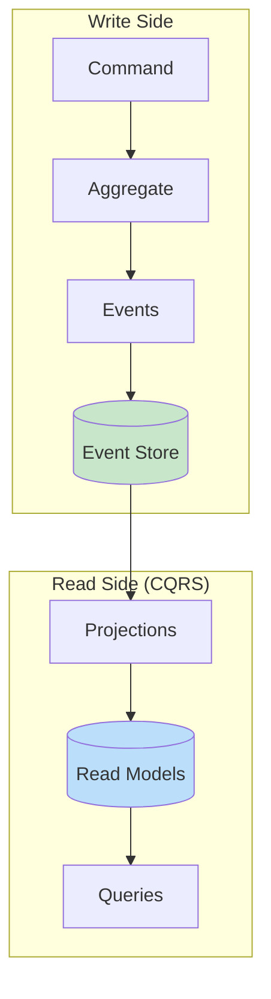

# Event Sourcing & CQRS Patterns

This document covers event sourcing implementation in PostgreSQL, including event store design, projections, snapshotting, and CQRS patterns.

## Table of Contents

1. [Overview](#overview)
2. [Event Store Design](#event-store-design)
3. [Storing Events](#storing-events)
4. [Reading Events](#reading-events)
5. [Projections](#projections)
6. [Snapshotting](#snapshotting)
7. [CQRS Implementation](#cqrs-implementation)
8. [Event Versioning](#event-versioning)
9. [Best Practices](#best-practices)

## Overview

### Event Sourcing Concepts



### When to Use Event Sourcing

| Use Case | Event Sourcing | Traditional CRUD |
|----------|---------------|------------------|
| Audit requirements | ✅ Built-in | Requires extra work |
| Time travel/replay | ✅ Natural | Not possible |
| Complex domain | ✅ Good fit | Can work |
| Simple CRUD | ❌ Overkill | ✅ Better |
| High write volume | ⚠️ Consider | ✅ Simpler |
| Debugging/forensics | ✅ Excellent | Limited |

## Event Store Design

### Core Event Store Table

```sql
-- Event store table
CREATE TABLE data.events (
    id              uuid PRIMARY KEY DEFAULT uuidv7(),
    stream_type     text NOT NULL,        -- e.g., 'Order', 'Customer'
    stream_id       uuid NOT NULL,        -- Aggregate ID
    version         integer NOT NULL,     -- Sequence within stream
    event_type      text NOT NULL,        -- e.g., 'OrderCreated'
    event_data      jsonb NOT NULL,       -- Event payload
    metadata        jsonb NOT NULL DEFAULT '{}',  -- Correlation ID, user, etc.
    created_at      timestamptz NOT NULL DEFAULT now(),

    -- Ensure optimistic concurrency
    UNIQUE (stream_type, stream_id, version)
);

-- Indexes for common access patterns
CREATE INDEX events_stream_idx ON data.events(stream_type, stream_id, version);
CREATE INDEX events_type_idx ON data.events(event_type);
CREATE INDEX events_created_idx ON data.events(created_at);

-- For global ordering (useful for projections)
CREATE INDEX events_id_idx ON data.events(id);

COMMENT ON TABLE data.events IS 'Append-only event store';
```

### Event Metadata

```sql
-- Standard metadata fields
-- {
--     "correlation_id": "uuid",      -- Links related events
--     "causation_id": "uuid",        -- Event that caused this event
--     "user_id": "uuid",             -- Who triggered it
--     "timestamp": "iso8601",        -- When it was created
--     "version": 1,                  -- Event schema version
--     "source": "api/import/saga"    -- Origin of event
-- }
```

### Stream Metadata Table (Optional)

```sql
-- Track stream state (for validation)
CREATE TABLE data.event_streams (
    stream_type     text NOT NULL,
    stream_id       uuid NOT NULL,
    current_version integer NOT NULL DEFAULT 0,
    created_at      timestamptz NOT NULL DEFAULT now(),
    updated_at      timestamptz NOT NULL DEFAULT now(),

    PRIMARY KEY (stream_type, stream_id)
);

-- Trigger to update version
CREATE FUNCTION private.update_stream_version()
RETURNS trigger
LANGUAGE plpgsql
AS $$
BEGIN
    INSERT INTO data.event_streams (stream_type, stream_id, current_version)
    VALUES (NEW.stream_type, NEW.stream_id, NEW.version)
    ON CONFLICT (stream_type, stream_id) DO UPDATE
    SET current_version = EXCLUDED.current_version,
        updated_at = now();
    RETURN NEW;
END;
$$;

CREATE TRIGGER events_stream_version_trg
    AFTER INSERT ON data.events
    FOR EACH ROW
    EXECUTE FUNCTION private.update_stream_version();
```

## Storing Events

### Append Events Procedure

```sql
CREATE PROCEDURE api.append_events(
    in_stream_type text,
    in_stream_id uuid,
    in_expected_version integer,
    in_events jsonb,  -- Array of {event_type, event_data, metadata}
    INOUT io_new_version integer DEFAULT NULL
)
LANGUAGE plpgsql
SECURITY DEFINER
SET search_path = data, private, pg_temp
AS $$
DECLARE
    l_current_version integer;
    l_event jsonb;
    l_version integer;
BEGIN
    -- Get current version (with lock)
    SELECT COALESCE(MAX(version), 0) INTO l_current_version
    FROM data.events
    WHERE stream_type = in_stream_type AND stream_id = in_stream_id
    FOR UPDATE;

    -- Optimistic concurrency check
    IF l_current_version != in_expected_version THEN
        RAISE EXCEPTION 'Concurrency conflict: expected version %, but found %',
            in_expected_version, l_current_version
            USING ERRCODE = 'P0002';
    END IF;

    -- Append each event
    l_version := l_current_version;
    FOR l_event IN SELECT * FROM jsonb_array_elements(in_events)
    LOOP
        l_version := l_version + 1;

        INSERT INTO data.events (
            stream_type, stream_id, version, event_type, event_data, metadata
        ) VALUES (
            in_stream_type,
            in_stream_id,
            l_version,
            l_event->>'event_type',
            l_event->'event_data',
            COALESCE(l_event->'metadata', '{}')
        );
    END LOOP;

    io_new_version := l_version;
END;
$$;
```

### Usage Example

```sql
-- Create a new order
CALL api.append_events(
    in_stream_type := 'Order',
    in_stream_id := 'order-uuid',
    in_expected_version := 0,  -- New stream
    in_events := '[
        {
            "event_type": "OrderCreated",
            "event_data": {
                "customer_id": "customer-uuid",
                "items": [{"product_id": "prod-1", "quantity": 2}]
            },
            "metadata": {"user_id": "user-uuid", "correlation_id": "request-uuid"}
        }
    ]'::jsonb
);

-- Add items to existing order
CALL api.append_events(
    in_stream_type := 'Order',
    in_stream_id := 'order-uuid',
    in_expected_version := 1,  -- After OrderCreated
    in_events := '[
        {
            "event_type": "ItemAdded",
            "event_data": {"product_id": "prod-2", "quantity": 1}
        }
    ]'::jsonb
);
```

## Reading Events

### Get Events for Stream

```sql
CREATE FUNCTION api.get_events(
    in_stream_type text,
    in_stream_id uuid,
    in_from_version integer DEFAULT 0
)
RETURNS TABLE (
    id uuid,
    version integer,
    event_type text,
    event_data jsonb,
    metadata jsonb,
    created_at timestamptz
)
LANGUAGE sql
STABLE
SECURITY DEFINER
SET search_path = data, private, pg_temp
AS $$
    SELECT id, version, event_type, event_data, metadata, created_at
    FROM data.events
    WHERE stream_type = in_stream_type
      AND stream_id = in_stream_id
      AND version > in_from_version
    ORDER BY version;
$$;
```

### Get Events by Type (for projections)

```sql
CREATE FUNCTION api.get_events_by_type(
    in_event_types text[],
    in_after_id uuid DEFAULT NULL,
    in_limit integer DEFAULT 1000
)
RETURNS TABLE (
    id uuid,
    stream_type text,
    stream_id uuid,
    version integer,
    event_type text,
    event_data jsonb,
    metadata jsonb,
    created_at timestamptz
)
LANGUAGE sql
STABLE
SECURITY DEFINER
SET search_path = data, private, pg_temp
AS $$
    SELECT id, stream_type, stream_id, version, event_type, event_data, metadata, created_at
    FROM data.events
    WHERE event_type = ANY(in_event_types)
      AND (in_after_id IS NULL OR id > in_after_id)
    ORDER BY id
    LIMIT in_limit;
$$;
```

### Get All Events (for global projection)

```sql
CREATE FUNCTION api.get_all_events(
    in_after_id uuid DEFAULT NULL,
    in_limit integer DEFAULT 1000
)
RETURNS TABLE (
    id uuid,
    stream_type text,
    stream_id uuid,
    version integer,
    event_type text,
    event_data jsonb,
    metadata jsonb,
    created_at timestamptz
)
LANGUAGE sql
STABLE
SECURITY DEFINER
SET search_path = data, private, pg_temp
AS $$
    SELECT id, stream_type, stream_id, version, event_type, event_data, metadata, created_at
    FROM data.events
    WHERE in_after_id IS NULL OR id > in_after_id
    ORDER BY id
    LIMIT in_limit;
$$;
```

## Projections

### Projection Tracking Table

```sql
-- Track projection positions
CREATE TABLE data.projection_checkpoints (
    projection_name text PRIMARY KEY,
    last_event_id   uuid,
    last_processed  timestamptz NOT NULL DEFAULT now(),
    status          text NOT NULL DEFAULT 'running',
    error_message   text
);
```

### Example: Order Summary Projection

```sql
-- Read model table
CREATE TABLE data.order_summaries (
    order_id        uuid PRIMARY KEY,
    customer_id     uuid NOT NULL,
    status          text NOT NULL,
    total_items     integer NOT NULL DEFAULT 0,
    total_amount    numeric(15,2) NOT NULL DEFAULT 0,
    created_at      timestamptz NOT NULL,
    updated_at      timestamptz NOT NULL
);

-- Projection handler
CREATE PROCEDURE private.project_order_events(in_batch_size integer DEFAULT 100)
LANGUAGE plpgsql
AS $$
DECLARE
    l_checkpoint uuid;
    l_event record;
    l_processed integer := 0;
BEGIN
    -- Get last checkpoint
    SELECT last_event_id INTO l_checkpoint
    FROM data.projection_checkpoints
    WHERE projection_name = 'order_summaries';

    -- Process events
    FOR l_event IN
        SELECT * FROM data.events
        WHERE stream_type = 'Order'
          AND (l_checkpoint IS NULL OR id > l_checkpoint)
        ORDER BY id
        LIMIT in_batch_size
    LOOP
        -- Apply event to read model
        CASE l_event.event_type
            WHEN 'OrderCreated' THEN
                INSERT INTO data.order_summaries (
                    order_id, customer_id, status, created_at, updated_at
                ) VALUES (
                    l_event.stream_id,
                    (l_event.event_data->>'customer_id')::uuid,
                    'created',
                    l_event.created_at,
                    l_event.created_at
                );

            WHEN 'ItemAdded' THEN
                UPDATE data.order_summaries
                SET total_items = total_items + (l_event.event_data->>'quantity')::integer,
                    updated_at = l_event.created_at
                WHERE order_id = l_event.stream_id;

            WHEN 'OrderSubmitted' THEN
                UPDATE data.order_summaries
                SET status = 'submitted',
                    updated_at = l_event.created_at
                WHERE order_id = l_event.stream_id;

            WHEN 'OrderCancelled' THEN
                UPDATE data.order_summaries
                SET status = 'cancelled',
                    updated_at = l_event.created_at
                WHERE order_id = l_event.stream_id;
        END CASE;

        l_checkpoint := l_event.id;
        l_processed := l_processed + 1;
    END LOOP;

    -- Update checkpoint
    IF l_processed > 0 THEN
        INSERT INTO data.projection_checkpoints (projection_name, last_event_id)
        VALUES ('order_summaries', l_checkpoint)
        ON CONFLICT (projection_name) DO UPDATE
        SET last_event_id = EXCLUDED.last_event_id,
            last_processed = now();
    END IF;
END;
$$;

-- Schedule projection updates
SELECT cron.schedule(
    'order-summaries-projection',
    '*/5 * * * * *',  -- Every 5 seconds
    $$CALL private.project_order_events(100)$$
);
```

### Rebuild Projection

```sql
CREATE PROCEDURE api.rebuild_projection(in_projection_name text)
LANGUAGE plpgsql
SECURITY DEFINER
SET search_path = data, private, pg_temp
AS $$
BEGIN
    CASE in_projection_name
        WHEN 'order_summaries' THEN
            -- Clear read model
            TRUNCATE data.order_summaries;

            -- Reset checkpoint
            DELETE FROM data.projection_checkpoints
            WHERE projection_name = 'order_summaries';

            -- Reprocess all events
            LOOP
                CALL private.project_order_events(1000);
                EXIT WHEN NOT EXISTS (
                    SELECT 1 FROM data.events e
                    LEFT JOIN data.projection_checkpoints p ON p.projection_name = 'order_summaries'
                    WHERE e.stream_type = 'Order'
                      AND (p.last_event_id IS NULL OR e.id > p.last_event_id)
                    LIMIT 1
                );
            END LOOP;

        ELSE
            RAISE EXCEPTION 'Unknown projection: %', in_projection_name;
    END CASE;
END;
$$;
```

## Snapshotting

### Snapshot Table

```sql
CREATE TABLE data.snapshots (
    stream_type     text NOT NULL,
    stream_id       uuid NOT NULL,
    version         integer NOT NULL,
    state           jsonb NOT NULL,
    created_at      timestamptz NOT NULL DEFAULT now(),

    PRIMARY KEY (stream_type, stream_id)
);

CREATE INDEX snapshots_version_idx ON data.snapshots(stream_type, stream_id, version);
```

### Save Snapshot

```sql
CREATE PROCEDURE private.save_snapshot(
    in_stream_type text,
    in_stream_id uuid,
    in_version integer,
    in_state jsonb
)
LANGUAGE sql
AS $$
    INSERT INTO data.snapshots (stream_type, stream_id, version, state)
    VALUES (in_stream_type, in_stream_id, in_version, in_state)
    ON CONFLICT (stream_type, stream_id) DO UPDATE
    SET version = EXCLUDED.version,
        state = EXCLUDED.state,
        created_at = now();
$$;
```

### Load Aggregate with Snapshot

```sql
CREATE FUNCTION api.get_aggregate_state(
    in_stream_type text,
    in_stream_id uuid
)
RETURNS TABLE (
    state jsonb,
    version integer,
    pending_events jsonb
)
LANGUAGE plpgsql
STABLE
SECURITY DEFINER
SET search_path = data, private, pg_temp
AS $$
DECLARE
    l_snapshot record;
    l_from_version integer := 0;
    l_state jsonb := '{}';
BEGIN
    -- Try to load snapshot
    SELECT s.version, s.state INTO l_snapshot
    FROM data.snapshots s
    WHERE s.stream_type = in_stream_type AND s.stream_id = in_stream_id;

    IF FOUND THEN
        l_from_version := l_snapshot.version;
        l_state := l_snapshot.state;
    END IF;

    -- Get events since snapshot
    RETURN QUERY
    SELECT
        l_state AS state,
        l_from_version AS version,
        COALESCE(jsonb_agg(jsonb_build_object(
            'version', e.version,
            'event_type', e.event_type,
            'event_data', e.event_data
        ) ORDER BY e.version), '[]'::jsonb) AS pending_events
    FROM data.events e
    WHERE e.stream_type = in_stream_type
      AND e.stream_id = in_stream_id
      AND e.version > l_from_version;
END;
$$;
```

### Automatic Snapshotting

```sql
-- Trigger to create snapshot every N events
CREATE FUNCTION private.maybe_create_snapshot()
RETURNS trigger
LANGUAGE plpgsql
AS $$
DECLARE
    co_snapshot_interval constant integer := 100;
BEGIN
    -- Snapshot every 100 events
    IF NEW.version % co_snapshot_interval = 0 THEN
        -- Application should compute state and call save_snapshot
        -- This is a placeholder - actual state computation depends on domain
        RAISE NOTICE 'Consider creating snapshot for %/% at version %',
            NEW.stream_type, NEW.stream_id, NEW.version;
    END IF;
    RETURN NEW;
END;
$$;

CREATE TRIGGER events_snapshot_trg
    AFTER INSERT ON data.events
    FOR EACH ROW
    EXECUTE FUNCTION private.maybe_create_snapshot();
```

## CQRS Implementation

### Command Handler Example

```sql
-- Command: Create Order
CREATE PROCEDURE api.create_order(
    in_customer_id uuid,
    in_items jsonb,  -- [{product_id, quantity, price}]
    INOUT io_order_id uuid DEFAULT NULL
)
LANGUAGE plpgsql
SECURITY DEFINER
SET search_path = data, private, pg_temp
AS $$
DECLARE
    l_order_id uuid := uuidv7();
    l_total numeric;
BEGIN
    -- Validate
    IF NOT EXISTS (SELECT 1 FROM data.customers WHERE id = in_customer_id) THEN
        RAISE EXCEPTION 'Customer not found: %', in_customer_id
            USING ERRCODE = 'P0002';
    END IF;

    -- Calculate total
    SELECT SUM((item->>'price')::numeric * (item->>'quantity')::integer)
    INTO l_total
    FROM jsonb_array_elements(in_items) AS item;

    -- Append event
    CALL api.append_events(
        in_stream_type := 'Order',
        in_stream_id := l_order_id,
        in_expected_version := 0,
        in_events := jsonb_build_array(
            jsonb_build_object(
                'event_type', 'OrderCreated',
                'event_data', jsonb_build_object(
                    'customer_id', in_customer_id,
                    'items', in_items,
                    'total', l_total
                )
            )
        )
    );

    io_order_id := l_order_id;
END;
$$;
```

### Query from Read Model

```sql
-- Query: Get customer orders
CREATE FUNCTION api.get_customer_orders(
    in_customer_id uuid,
    in_status text DEFAULT NULL,
    in_limit integer DEFAULT 20
)
RETURNS TABLE (
    order_id uuid,
    status text,
    total_items integer,
    total_amount numeric,
    created_at timestamptz
)
LANGUAGE sql
STABLE
SECURITY DEFINER
SET search_path = data, private, pg_temp
AS $$
    SELECT order_id, status, total_items, total_amount, created_at
    FROM data.order_summaries
    WHERE customer_id = in_customer_id
      AND (in_status IS NULL OR status = in_status)
    ORDER BY created_at DESC
    LIMIT in_limit;
$$;
```

## Event Versioning

### Schema Evolution

```sql
-- Event type registry
CREATE TABLE data.event_schemas (
    event_type      text NOT NULL,
    version         integer NOT NULL,
    schema          jsonb NOT NULL,  -- JSON Schema
    created_at      timestamptz NOT NULL DEFAULT now(),

    PRIMARY KEY (event_type, version)
);

-- Upcaster function example
CREATE FUNCTION private.upcast_event(
    in_event_type text,
    in_event_data jsonb,
    in_from_version integer,
    in_to_version integer
)
RETURNS jsonb
LANGUAGE plpgsql
IMMUTABLE
AS $$
BEGIN
    IF in_event_type = 'OrderCreated' THEN
        -- V1 -> V2: Add shipping_address field
        IF in_from_version = 1 AND in_to_version = 2 THEN
            RETURN in_event_data || '{"shipping_address": null}'::jsonb;
        END IF;
    END IF;

    RETURN in_event_data;
END;
$$;
```

## Best Practices

### Event Design Guidelines

```sql
-- Good event names (past tense, domain language)
-- ✅ OrderCreated, ItemAdded, PaymentReceived
-- ❌ CreateOrder, AddItem, ReceivePayment

-- Include enough context
-- ✅ {"product_id": "...", "quantity": 2, "price": 10.00, "product_name": "Widget"}
-- ❌ {"product_id": "..."}  -- Missing context for projections
```

### Idempotency

```sql
-- Use idempotency keys in metadata
CREATE PROCEDURE api.append_events_idempotent(
    in_stream_type text,
    in_stream_id uuid,
    in_expected_version integer,
    in_events jsonb,
    in_idempotency_key uuid
)
LANGUAGE plpgsql
AS $$
BEGIN
    -- Check if already processed
    IF EXISTS (
        SELECT 1 FROM data.events
        WHERE metadata->>'idempotency_key' = in_idempotency_key::text
    ) THEN
        RAISE NOTICE 'Event already processed: %', in_idempotency_key;
        RETURN;
    END IF;

    -- Add idempotency key to all events
    CALL api.append_events(
        in_stream_type,
        in_stream_id,
        in_expected_version,
        (SELECT jsonb_agg(
            event || jsonb_build_object('metadata',
                COALESCE(event->'metadata', '{}'::jsonb) ||
                jsonb_build_object('idempotency_key', in_idempotency_key)
            )
        ) FROM jsonb_array_elements(in_events) AS event)
    );
END;
$$;
```

### Partitioning Events

```sql
-- Partition by month for large event stores
CREATE TABLE data.events (
    id              uuid NOT NULL DEFAULT uuidv7(),
    stream_type     text NOT NULL,
    stream_id       uuid NOT NULL,
    version         integer NOT NULL,
    event_type      text NOT NULL,
    event_data      jsonb NOT NULL,
    metadata        jsonb NOT NULL DEFAULT '{}',
    created_at      timestamptz NOT NULL DEFAULT now(),

    PRIMARY KEY (id, created_at)
) PARTITION BY RANGE (created_at);

-- Create monthly partitions
CREATE TABLE data.events_2024_01 PARTITION OF data.events
    FOR VALUES FROM ('2024-01-01') TO ('2024-02-01');
```
