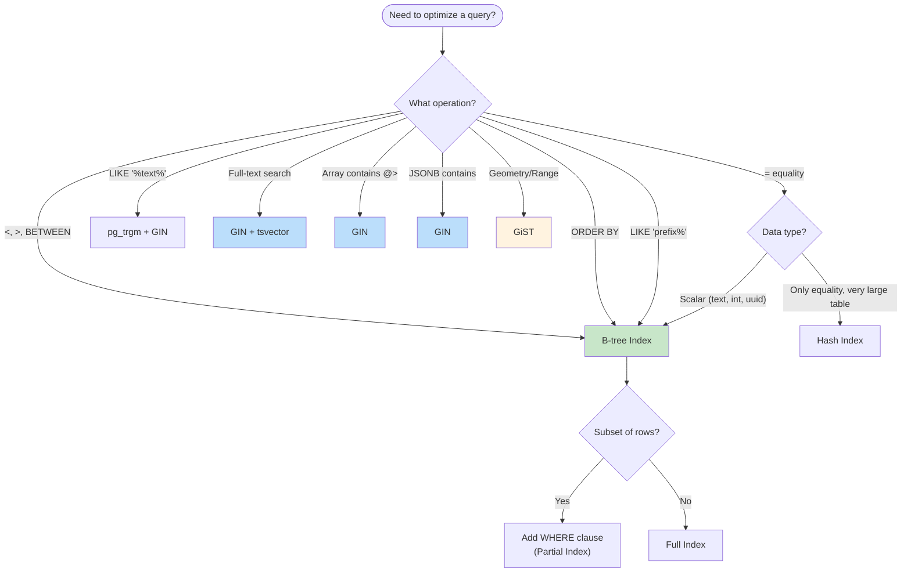
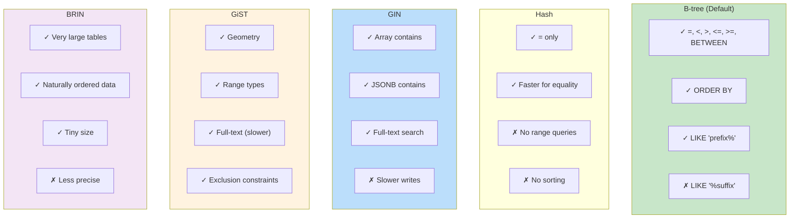

# Indexes & Constraints Best Practices

## Table of Contents
1. [Index Fundamentals](#index-fundamentals)
2. [Index Types](#index-types)
3. [Index Design Strategies](#index-design-strategies)
4. [Constraint Types](#constraint-types)
5. [Foreign Key Design](#foreign-key-design)
6. [PostgreSQL 18 Features](#postgresql-18-features)
7. [Maintenance](#maintenance)

## Index Fundamentals

### Index Selection Decision Tree



### When to Create Indexes

**Do index:**
- Columns frequently used in WHERE clauses
- Columns used in JOIN conditions
- Columns used in ORDER BY
- Foreign key columns (not automatic in PostgreSQL)
- Columns with high selectivity (many distinct values)

**Avoid over-indexing:**
- Write-heavy tables (each index slows INSERT/UPDATE/DELETE)
- Low-selectivity columns (boolean, status with few values)
- Rarely queried columns
- Small tables (sequential scan often faster)

### Index Naming

```sql
-- Standard index: {table}_{columns}_idx (Trivadis v4.4)
CREATE INDEX orders_customer_id_idx ON data.orders(customer_id);

-- Multi-column: {table}_{col1}_{col2}_idx
CREATE INDEX orders_status_created_idx ON data.orders(status, created_at);

-- Unique index: {table}_{columns}_key
CREATE UNIQUE INDEX users_email_key ON data.users(lower(email));

-- Partial index: {table}_{column}_{condition_hint}_idx
CREATE INDEX orders_pending_idx ON data.orders(created_at) WHERE status = 'pending';
```

## Index Types

### Index Type Comparison



### B-tree (Default)

Best for: equality, range queries, sorting

```sql
-- Equality
CREATE INDEX users_email_idx ON data.users(email);
SELECT * FROM data.users WHERE email = 'user@example.com';

-- Range
CREATE INDEX orders_created_idx ON data.orders(created_at);
SELECT * FROM data.orders WHERE created_at >= '2024-01-01';

-- Sorting
CREATE INDEX orders_created_desc_idx ON data.orders(created_at DESC);
SELECT * FROM data.orders ORDER BY created_at DESC LIMIT 10;

-- Multi-column (column order matters!)
CREATE INDEX orders_customer_date_idx ON data.orders(customer_id, created_at DESC);
-- Efficient for: WHERE customer_id = X ORDER BY created_at DESC
-- Also works for: WHERE customer_id = X (uses first column)
-- Skip scan (PG18): WHERE created_at > X (can use second column)
```

### Hash

Best for: equality only, faster than B-tree for simple lookups

```sql
CREATE INDEX users_email_hash_idx ON data.users USING hash(email);

-- Only useful for equality
SELECT * FROM data.users WHERE email = 'user@example.com';  -- Uses hash
SELECT * FROM data.users WHERE email LIKE 'user%';  -- Cannot use hash
```

### GIN (Generalized Inverted Index)

Best for: arrays, JSONB, full-text search

```sql
-- Array containment
CREATE INDEX products_tags_idx ON data.products USING gin(tags);
SELECT * FROM data.products WHERE tags @> ARRAY['sale'];

-- JSONB queries
CREATE INDEX products_data_idx ON data.products USING gin(data);
SELECT * FROM data.products WHERE data @> '{"category": "electronics"}';

-- Full-text search
CREATE INDEX articles_search_idx ON data.articles USING gin(to_tsvector('english', title || ' ' || body));
SELECT * FROM data.articles WHERE to_tsvector('english', title || ' ' || body) @@ to_tsquery('postgresql & index');
```

### GiST (Generalized Search Tree)

Best for: geometric data, range types, full-text search

```sql
-- Range overlaps (for temporal data)
CREATE INDEX reservations_during_idx ON data.reservations USING gist(during);
SELECT * FROM data.reservations WHERE during && tstzrange('2024-03-01', '2024-03-05');

-- Geometric (PostGIS)
CREATE INDEX locations_geom_idx ON data.locations USING gist(geom);
SELECT * FROM data.locations WHERE ST_DWithin(geom, ST_MakePoint(-122.4, 37.8), 1000);
```

### BRIN (Block Range Index)

Best for: large tables with naturally ordered data (time-series)

```sql
-- Very compact index for time-series data
CREATE INDEX events_created_brin_idx ON data.events USING brin(created_at);

-- Best when data is physically ordered by the indexed column
-- Much smaller than B-tree but less precise
```

## Index Design Strategies

### Covering Indexes with INCLUDE (PostgreSQL 11+)

Include all columns needed by query to avoid table access (index-only scans):

```sql
-- Basic covering index
-- Index key: customer_id (used for filtering/sorting)
-- Included: status, total, created_at (returned but not used for lookup)
CREATE INDEX orders_customer_covering_idx
    ON data.orders(customer_id)
    INCLUDE (status, total, created_at);

-- Query satisfied entirely from index (no heap access)
SELECT customer_id, status, total
FROM data.orders
WHERE customer_id = 'uuid-here';
```

### INCLUDE vs Multi-Column Index

```sql
-- Multi-column index: All columns in B-tree structure
CREATE INDEX orders_customer_status_idx ON data.orders(customer_id, status);
-- Can be used for: WHERE customer_id = X
--                  WHERE customer_id = X AND status = Y
--                  ORDER BY customer_id, status

-- INCLUDE index: Only key columns in B-tree, included columns stored separately
CREATE INDEX orders_customer_include_idx ON data.orders(customer_id) INCLUDE (status);
-- Can be used for: WHERE customer_id = X (returns status without heap access)
-- Cannot be used for: WHERE status = Y (status not in B-tree)
```

### When to Use INCLUDE

```sql
-- 1. High cardinality key + low cardinality included columns
CREATE INDEX orders_customer_idx ON data.orders(customer_id)
    INCLUDE (status, total);  -- status has few distinct values

-- 2. Avoid adding large columns to B-tree
CREATE INDEX products_sku_idx ON data.products(sku)
    INCLUDE (name, description);  -- Don't want text in B-tree

-- 3. Unique constraint that returns additional columns
CREATE UNIQUE INDEX users_email_key ON data.users(email)
    INCLUDE (id, name);  -- Can return id, name in index-only scan

-- 4. Foreign key lookups returning related data
CREATE INDEX order_items_order_idx ON data.order_items(order_id)
    INCLUDE (product_id, quantity, price);
```

### Verify Index-Only Scans

```sql
-- EXPLAIN should show "Index Only Scan"
EXPLAIN (ANALYZE)
SELECT customer_id, status, total
FROM data.orders
WHERE customer_id = 'uuid-here';

-- If showing "Index Scan" instead of "Index Only Scan":
-- 1. Ensure all SELECTed columns are in INCLUDE
-- 2. Run VACUUM to update visibility map
VACUUM data.orders;
```

### Partial Indexes

Index only rows matching a condition:

```sql
-- Only index active users
CREATE INDEX users_email_active_idx
    ON data.users(email)
    WHERE is_active = true;

-- Only index pending orders
CREATE INDEX orders_pending_idx
    ON data.orders(customer_id, created_at)
    WHERE status = 'pending';

-- Index for soft-deleted records lookup
CREATE INDEX customers_deleted_idx
    ON data.customers(deleted_at)
    WHERE deleted_at IS NOT NULL;
```

### Expression Indexes

Index computed values:

```sql
-- Case-insensitive email lookup
CREATE INDEX users_email_lower_idx ON data.users(lower(email));
SELECT * FROM data.users WHERE lower(email) = lower('User@Example.com');

-- Year from timestamp
CREATE INDEX orders_year_idx ON data.orders((extract(year from created_at)));
SELECT * FROM data.orders WHERE extract(year from created_at) = 2024;

-- JSONB expression
CREATE INDEX products_category_idx ON data.products((data->>'category'));
SELECT * FROM data.products WHERE data->>'category' = 'electronics';
```

### Multi-Column Index Column Order

The order of columns matters for query optimization:

```sql
-- Index: (status, customer_id, created_at)

-- ✅ Uses full index
WHERE status = 'pending' AND customer_id = X AND created_at > Y

-- ✅ Uses first two columns  
WHERE status = 'pending' AND customer_id = X

-- ✅ Uses first column
WHERE status = 'pending'

-- ⚠️ PostgreSQL 18 skip scan can help
WHERE customer_id = X  -- Skips through status values

-- ❌ Cannot use index efficiently (before PG18)
WHERE created_at > Y  -- Without status filter
```

### Concurrent Index Creation

Create indexes without blocking writes:

```sql
-- Non-blocking index creation (takes longer, allows writes)
CREATE INDEX CONCURRENTLY orders_customer_idx
    ON data.orders(customer_id);

-- Note: CONCURRENTLY cannot be used in transactions
-- If creation fails, index may be left invalid - check and retry:
SELECT indexrelid::regclass, indisvalid 
FROM pg_index 
WHERE NOT indisvalid;

-- Rebuild invalid index
REINDEX INDEX CONCURRENTLY orders_customer_idx;
```

## Constraint Types

### Primary Key

```sql
-- Inline definition
CREATE TABLE data.orders (
    id uuid PRIMARY KEY DEFAULT uuidv7()
);

-- Named constraint
CREATE TABLE data.orders (
    id uuid DEFAULT uuidv7(),
    CONSTRAINT orders_pkey PRIMARY KEY (id)
);

-- Composite primary key
CREATE TABLE data.order_items (
    order_id uuid,
    item_number integer,
    CONSTRAINT order_items_pkey PRIMARY KEY (order_id, item_number)
);
```

### Unique Constraints

```sql
-- Simple unique
ALTER TABLE data.users 
    ADD CONSTRAINT users_email_key UNIQUE (email);

-- Case-insensitive unique (use index instead)
CREATE UNIQUE INDEX users_email_lower_key ON data.users(lower(email));

-- Partial unique (unique among active only)
CREATE UNIQUE INDEX users_username_active_key 
    ON data.users(username) 
    WHERE is_active = true;

-- Unique with nulls distinct (default in PG15+)
ALTER TABLE data.products 
    ADD CONSTRAINT products_sku_key UNIQUE NULLS DISTINCT (sku);
```

### Check Constraints

```sql
-- Value range
ALTER TABLE data.orders 
    ADD CONSTRAINT orders_total_positive CHECK (total >= 0);

-- Enumeration
ALTER TABLE data.orders 
    ADD CONSTRAINT orders_status_check 
    CHECK (status IN ('draft', 'pending', 'confirmed', 'shipped', 'delivered', 'cancelled'));

-- Pattern match
ALTER TABLE data.users 
    ADD CONSTRAINT users_email_format_check 
    CHECK (email ~* '^[A-Za-z0-9._%+-]+@[A-Za-z0-9.-]+\.[A-Z]{2,}$');

-- Multi-column check
ALTER TABLE data.reservations 
    ADD CONSTRAINT reservations_dates_check 
    CHECK (check_out > check_in);

-- NOT VALID: Add constraint without scanning existing rows
ALTER TABLE data.large_table 
    ADD CONSTRAINT large_table_value_check CHECK (value > 0) NOT VALID;

-- Validate later (can run concurrently)
ALTER TABLE data.large_table VALIDATE CONSTRAINT large_table_value_check;
```

### Not Null Constraints

```sql
-- Standard NOT NULL
ALTER TABLE data.users ALTER COLUMN email SET NOT NULL;

-- NOT NULL with NOT VALID (PG18+): No immediate table scan
ALTER TABLE data.large_table 
    ADD CONSTRAINT large_table_name_not_null 
    CHECK (name IS NOT NULL) NOT VALID;

-- Validate later
ALTER TABLE data.large_table VALIDATE CONSTRAINT large_table_name_not_null;
```

### Exclusion Constraints

Prevent overlapping values:

```sql
-- Prevent overlapping reservations
CREATE TABLE data.reservations (
    id uuid PRIMARY KEY DEFAULT uuidv7(),
    room_id uuid NOT NULL,
    during tstzrange NOT NULL,
    
    CONSTRAINT reservations_no_overlap 
        EXCLUDE USING gist (room_id WITH =, during WITH &&)
);

-- Prevent overlapping employee assignments
CREATE TABLE data.assignments (
    id uuid PRIMARY KEY DEFAULT uuidv7(),
    employee_id uuid NOT NULL,
    project_id uuid NOT NULL,
    during daterange NOT NULL,
    
    CONSTRAINT assignments_no_overlap
        EXCLUDE USING gist (employee_id WITH =, during WITH &&)
);
```

## Foreign Key Design

### Basic Foreign Keys

```sql
CREATE TABLE data.orders (
    id uuid PRIMARY KEY DEFAULT uuidv7(),
    customer_id uuid NOT NULL,
    
    CONSTRAINT orders_customer_fkey 
        FOREIGN KEY (customer_id) REFERENCES data.customers(id)
);

-- Always index foreign key columns
CREATE INDEX orders_customer_id_idx ON data.orders(customer_id);
```

### Referential Actions

```sql
-- ON DELETE options:
-- - RESTRICT: Prevent deletion if referenced (default)
-- - CASCADE: Delete referencing rows
-- - SET NULL: Set FK to NULL
-- - SET DEFAULT: Set FK to default value
-- - NO ACTION: Check at end of transaction (allows deferred)

-- ON UPDATE options (same as above)

-- Example: Cascade delete order items when order deleted
ALTER TABLE data.order_items 
    ADD CONSTRAINT order_items_order_fkey 
    FOREIGN KEY (order_id) REFERENCES data.orders(id) 
    ON DELETE CASCADE;

-- Example: Set null when customer deleted (keep orphaned orders)
ALTER TABLE data.orders 
    ADD CONSTRAINT orders_customer_fkey 
    FOREIGN KEY (customer_id) REFERENCES data.customers(id) 
    ON DELETE SET NULL;

-- Example: Restrict deletion
ALTER TABLE data.accounts 
    ADD CONSTRAINT accounts_user_fkey 
    FOREIGN KEY (user_id) REFERENCES data.users(id) 
    ON DELETE RESTRICT;
```

### Self-Referential Foreign Keys

```sql
-- Tree structure (parent-child)
CREATE TABLE data.categories (
    id uuid PRIMARY KEY DEFAULT uuidv7(),
    name text NOT NULL,
    parent_id uuid,
    
    CONSTRAINT categories_parent_fkey 
        FOREIGN KEY (parent_id) REFERENCES data.categories(id) 
        ON DELETE CASCADE
);

CREATE INDEX categories_parent_id_idx ON data.categories(parent_id);
```

### Deferrable Constraints

```sql
-- Allow circular references within transaction
CREATE TABLE data.employees (
    id uuid PRIMARY KEY DEFAULT uuidv7(),
    manager_id uuid,
    
    CONSTRAINT employees_manager_fkey 
        FOREIGN KEY (manager_id) REFERENCES data.employees(id)
        DEFERRABLE INITIALLY DEFERRED
);

-- Insert circular reference in transaction
BEGIN;
INSERT INTO data.employees (id, manager_id) VALUES ('a', 'b');
INSERT INTO data.employees (id, manager_id) VALUES ('b', 'a');
COMMIT;  -- Constraint checked here
```

## PostgreSQL 18 Features

### Temporal Constraints

Primary keys, unique constraints, and foreign keys with temporal ranges:

```sql
-- Temporal primary key: no overlapping time ranges for same entity
CREATE TABLE data.employee_positions (
    employee_id uuid NOT NULL,
    position_id uuid NOT NULL,
    valid_during daterange NOT NULL,
    
    -- Temporal primary key (PG18)
    CONSTRAINT employee_positions_pk 
        PRIMARY KEY (employee_id, valid_during WITHOUT OVERLAPS)
);

-- Temporal unique constraint
CREATE TABLE data.room_rates (
    room_type text NOT NULL,
    rate numeric(10,2) NOT NULL,
    valid_during daterange NOT NULL,
    
    CONSTRAINT room_rates_unique 
        UNIQUE (room_type, valid_during WITHOUT OVERLAPS)
);

-- Temporal foreign key
CREATE TABLE data.bookings (
    id uuid PRIMARY KEY DEFAULT uuidv7(),
    room_type text NOT NULL,
    booking_period daterange NOT NULL,
    
    CONSTRAINT bookings_rate_fkey 
        FOREIGN KEY (room_type, PERIOD booking_period) 
        REFERENCES data.room_rates (room_type, PERIOD valid_during)
);
```

### NOT NULL with NOT VALID

Add NOT NULL constraints without blocking table:

```sql
-- Add constraint without scanning table
ALTER TABLE data.large_table 
    ADD CONSTRAINT large_table_name_nn CHECK (name IS NOT NULL) NOT VALID;

-- Validate in background (allows concurrent access)
ALTER TABLE data.large_table VALIDATE CONSTRAINT large_table_name_nn;
```

### Skip Scan for Multi-Column Indexes

PostgreSQL 18 can skip leading columns in multi-column B-tree indexes:

```sql
-- Index on (tenant_id, user_id, created_at)
CREATE INDEX events_tenant_user_created_idx
    ON data.events(tenant_id, user_id, created_at);

-- Before PG18: Required tenant_id filter to use index
-- PG18: Can skip tenant_id and use user_id filter
SELECT * FROM data.events WHERE user_id = 'uuid' ORDER BY created_at;
```

## Maintenance

### Monitor Index Usage

```sql
-- Find unused indexes
SELECT 
    schemaname,
    relname AS table_name,
    indexrelname AS index_name,
    idx_scan AS times_used,
    pg_size_pretty(pg_relation_size(indexrelid)) AS index_size
FROM pg_stat_user_indexes
WHERE idx_scan = 0
  AND schemaname NOT IN ('pg_catalog', 'pg_toast')
ORDER BY pg_relation_size(indexrelid) DESC;

-- Index hit ratio (should be > 99%)
SELECT 
    relname,
    round(100.0 * idx_blks_hit / nullif(idx_blks_hit + idx_blks_read, 0), 2) AS hit_ratio
FROM pg_statio_user_indexes
WHERE idx_blks_hit + idx_blks_read > 0
ORDER BY hit_ratio;
```

### Reindexing

```sql
-- Rebuild single index (blocking)
REINDEX INDEX data.orders_customer_id_idx;

-- Rebuild all indexes on table (blocking)
REINDEX TABLE data.orders;

-- Rebuild without blocking (PG12+)
REINDEX INDEX CONCURRENTLY data.orders_customer_id_idx;

-- Rebuild all indexes in schema concurrently
REINDEX SCHEMA CONCURRENTLY app;
```

### Index Bloat Detection

```sql
-- Check for bloated indexes
SELECT
    schemaname || '.' || relname AS table_name,
    indexrelname AS index_name,
    pg_size_pretty(pg_relation_size(indexrelid)) AS index_size,
    pg_size_pretty(pg_relation_size(relid)) AS table_size,
    round(100.0 * pg_relation_size(indexrelid) / nullif(pg_relation_size(relid), 0), 1) AS index_ratio
FROM pg_stat_user_indexes
WHERE schemaname = 'app'
ORDER BY pg_relation_size(indexrelid) DESC
LIMIT 20;
```

### Statistics Updates

```sql
-- Update statistics for better query planning
ANALYZE data.orders;

-- Update all tables in schema
DO $$
DECLARE
    r RECORD;
BEGIN
    FOR r IN SELECT tablename FROM pg_tables WHERE schemaname = 'app'
    LOOP
        EXECUTE 'ANALYZE data.' || quote_ident(r.tablename);
    END LOOP;
END;
$$;
```
