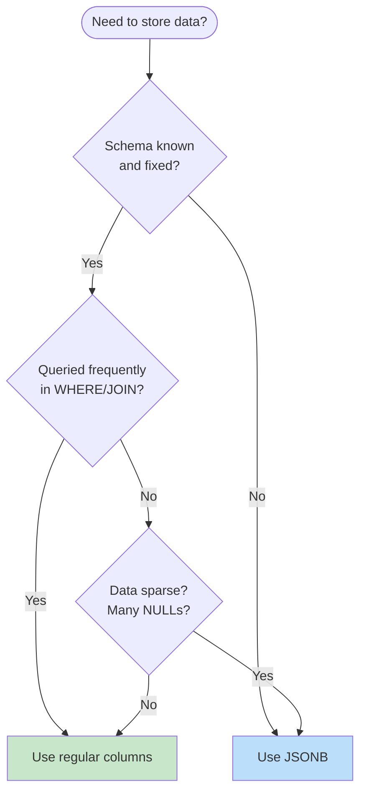

# JSON/JSONB Patterns

This document covers when to use JSONB, indexing strategies, common query patterns, and validation techniques for semi-structured data in PostgreSQL.

## Table of Contents

1. [When to Use JSONB](#when-to-use-jsonb)
2. [JSONB vs Normalized Tables](#jsonb-vs-normalized-tables)
3. [Schema Design with JSONB](#schema-design-with-jsonb)
4. [Indexing Strategies](#indexing-strategies)
5. [Query Patterns](#query-patterns)
6. [Validation Patterns](#validation-patterns)
7. [Update Patterns](#update-patterns)
8. [Performance Optimization](#performance-optimization)

## When to Use JSONB

### Good Use Cases

| Use Case | Example |
|----------|---------|
| **Flexible attributes** | Product metadata, user preferences |
| **Event data** | Audit logs, analytics events |
| **External API responses** | Cached webhook payloads |
| **Document storage** | CMS content, form submissions |
| **Schema-less MVP** | Rapid prototyping |
| **Sparse data** | Optional fields that vary widely |

### Avoid JSONB When

| Situation | Better Alternative |
|-----------|-------------------|
| Fixed, known schema | Regular columns |
| Frequent joins on values | Normalized tables with FK |
| Aggregate queries | Numeric columns |
| Unique constraints | Regular columns + indexes |
| Foreign key relationships | Proper FK columns |

### Decision Flowchart



## JSONB vs Normalized Tables

### Normalized Approach (Traditional)

```sql
-- Separate tables for product attributes
CREATE TABLE data.products (
    id          uuid PRIMARY KEY DEFAULT uuidv7(),
    name        text NOT NULL,
    price       numeric(10,2) NOT NULL,
    created_at  timestamptz NOT NULL DEFAULT now()
);

CREATE TABLE data.product_attributes (
    product_id  uuid REFERENCES data.products(id) ON DELETE CASCADE,
    key         text NOT NULL,
    value       text NOT NULL,
    PRIMARY KEY (product_id, key)
);

-- Query: Find products with color = 'red'
SELECT p.* 
FROM data.products p
JOIN data.product_attributes pa ON pa.product_id = p.id
WHERE pa.key = 'color' AND pa.value = 'red';
```

### JSONB Approach

```sql
-- Single table with JSONB attributes
CREATE TABLE data.products (
    id          uuid PRIMARY KEY DEFAULT uuidv7(),
    name        text NOT NULL,
    price       numeric(10,2) NOT NULL,
    attributes  jsonb NOT NULL DEFAULT '{}',
    created_at  timestamptz NOT NULL DEFAULT now()
);

-- Query: Find products with color = 'red'
SELECT * FROM data.products
WHERE attributes->>'color' = 'red';

-- Or using containment
SELECT * FROM data.products
WHERE attributes @> '{"color": "red"}';
```

### Comparison

| Aspect | Normalized | JSONB |
|--------|------------|-------|
| **Schema flexibility** | Rigid | Flexible |
| **Query performance** | Excellent with indexes | Good with GIN indexes |
| **Storage efficiency** | Better for sparse data | Better for dense data |
| **Referential integrity** | FK constraints | Manual validation |
| **Aggregations** | Native SQL | Requires extraction |
| **Tooling support** | Excellent | Good |

## Schema Design with JSONB

### Hybrid Approach (Recommended)

```sql
-- Core fields as columns, flexible data as JSONB
CREATE TABLE data.orders (
    id              uuid PRIMARY KEY DEFAULT uuidv7(),
    customer_id     uuid NOT NULL REFERENCES data.customers(id),
    status          text NOT NULL DEFAULT 'pending',
    total           numeric(10,2) NOT NULL,
    
    -- Structured JSONB for known flexible data
    shipping_address jsonb NOT NULL,
    
    -- Unstructured JSONB for truly flexible data
    metadata        jsonb NOT NULL DEFAULT '{}',
    
    created_at      timestamptz NOT NULL DEFAULT now(),
    updated_at      timestamptz NOT NULL DEFAULT now()
);

-- shipping_address structure:
-- {
--   "street": "123 Main St",
--   "city": "New York",
--   "state": "NY",
--   "zip": "10001",
--   "country": "US"
-- }

-- metadata can contain anything:
-- {
--   "source": "mobile_app",
--   "campaign_id": "summer2024",
--   "notes": "Gift wrap requested"
-- }
```

### Event/Audit Log Pattern

```sql
CREATE TABLE data.events (
    id          uuid PRIMARY KEY DEFAULT uuidv7(),
    event_type  text NOT NULL,
    entity_type text NOT NULL,
    entity_id   uuid NOT NULL,
    actor_id    uuid,
    payload     jsonb NOT NULL,
    occurred_at timestamptz NOT NULL DEFAULT now()
);

-- Index for common queries
CREATE INDEX idx_events_entity ON data.events(entity_type, entity_id);
CREATE INDEX idx_events_type ON data.events(event_type);
CREATE INDEX idx_events_occurred ON data.events(occurred_at);

-- GIN index for payload searches
CREATE INDEX idx_events_payload ON data.events USING gin(payload);

-- Example events:
-- { "event_type": "order.created", "entity_type": "order", "payload": {"total": 99.99} }
-- { "event_type": "order.shipped", "entity_type": "order", "payload": {"carrier": "UPS", "tracking": "1Z..."} }
```

### User Preferences Pattern

```sql
CREATE TABLE data.user_preferences (
    user_id     uuid PRIMARY KEY REFERENCES data.users(id),
    preferences jsonb NOT NULL DEFAULT '{
        "notifications": {
            "email": true,
            "push": true,
            "sms": false
        },
        "theme": "system",
        "language": "en",
        "timezone": "UTC"
    }',
    updated_at  timestamptz NOT NULL DEFAULT now()
);

-- Merge new preferences (partial update)
UPDATE data.user_preferences
SET preferences = preferences || '{"theme": "dark"}'::jsonb,
    updated_at = now()
WHERE user_id = $1;
```

## Indexing Strategies

### GIN Index (Default for JSONB)

```sql
-- Index entire JSONB document
CREATE INDEX idx_products_attributes ON data.products USING gin(attributes);

-- Supports operators: @>, ?, ?&, ?|, @?
-- @>  containment
-- ?   key exists
-- ?&  all keys exist
-- ?|  any key exists
-- @?  JSON path exists
```

### GIN with jsonb_path_ops (Faster Containment)

```sql
-- More efficient for @> containment queries only
CREATE INDEX idx_products_attrs_path 
    ON data.products USING gin(attributes jsonb_path_ops);

-- 2-3x smaller index, faster @> queries
-- Does NOT support ?, ?&, ?| operators

-- Use when you primarily search with @>
SELECT * FROM data.products 
WHERE attributes @> '{"color": "red", "size": "large"}';
```

### B-tree on Extracted Values

```sql
-- Index specific JSON path as regular B-tree
CREATE INDEX idx_products_color 
    ON data.products ((attributes->>'color'));

-- Supports =, <, >, LIKE, etc.
SELECT * FROM data.products 
WHERE attributes->>'color' = 'red';

-- Index with type cast for proper comparison
CREATE INDEX idx_products_weight 
    ON data.products (((attributes->>'weight')::numeric));

SELECT * FROM data.products 
WHERE (attributes->>'weight')::numeric > 10;
```

### Expression Index for Nested Paths

```sql
-- Index deeply nested value
CREATE INDEX idx_orders_shipping_city 
    ON data.orders ((shipping_address->>'city'));

-- Or using path extraction
CREATE INDEX idx_orders_shipping_zip 
    ON data.orders ((shipping_address #>> '{zip}'));

-- Query uses the index
SELECT * FROM data.orders 
WHERE shipping_address->>'city' = 'New York';
```

### Partial Index on JSONB Condition

```sql
-- Index only products with 'featured' flag
CREATE INDEX idx_products_featured 
    ON data.products ((attributes->>'category'))
    WHERE attributes @> '{"featured": true}';

-- Query benefits from smaller index
SELECT * FROM data.products 
WHERE attributes @> '{"featured": true}'
  AND attributes->>'category' = 'electronics';
```

## Query Patterns

### Basic Extraction

```sql
-- Get single value as text
SELECT attributes->>'color' AS color FROM data.products;

-- Get single value preserving JSON type
SELECT attributes->'price' AS price FROM data.products;  -- Returns JSON

-- Get nested value
SELECT shipping_address->'coordinates'->>'lat' AS latitude FROM data.orders;

-- Path extraction (alternative syntax)
SELECT attributes #>> '{dimensions,width}' AS width FROM data.products;
```

### Containment Queries

```sql
-- Contains key-value pair
SELECT * FROM data.products 
WHERE attributes @> '{"color": "red"}';

-- Contains multiple conditions
SELECT * FROM data.products 
WHERE attributes @> '{"color": "red", "size": "large"}';

-- Contains nested structure
SELECT * FROM data.orders 
WHERE shipping_address @> '{"country": "US", "state": "NY"}';
```

### Key Existence

```sql
-- Has specific key
SELECT * FROM data.products 
WHERE attributes ? 'color';

-- Has all keys
SELECT * FROM data.products 
WHERE attributes ?& array['color', 'size'];

-- Has any key
SELECT * FROM data.products 
WHERE attributes ?| array['discount', 'sale_price'];
```

### JSON Path Queries (PostgreSQL 12+)

```sql
-- Check if path exists with condition
SELECT * FROM data.products 
WHERE attributes @? '$.tags[*] ? (@ == "sale")';

-- Extract matching values
SELECT jsonb_path_query_array(attributes, '$.tags[*] ? (@ like_regex "^s")')
FROM data.products;

-- Filter with path expression
SELECT * FROM data.products 
WHERE jsonb_path_exists(attributes, '$.price ? (@ > 100)');
```

### Aggregation with JSONB

```sql
-- Count by JSON field
SELECT 
    attributes->>'category' AS category,
    COUNT(*) AS product_count,
    AVG((attributes->>'price')::numeric) AS avg_price
FROM data.products
GROUP BY attributes->>'category';

-- Aggregate JSON values into array
SELECT 
    customer_id,
    jsonb_agg(jsonb_build_object(
        'order_id', id,
        'total', total,
        'status', status
    )) AS orders
FROM data.orders
GROUP BY customer_id;
```

### Expanding JSONB Arrays

```sql
-- Sample data: attributes = '{"tags": ["red", "sale", "new"]}'

-- Expand array to rows
SELECT p.id, p.name, tag.value AS tag
FROM data.products p,
     jsonb_array_elements_text(p.attributes->'tags') AS tag(value);

-- Find products with specific tag
SELECT * FROM data.products
WHERE attributes->'tags' ? 'sale';

-- Or using containment
SELECT * FROM data.products
WHERE attributes @> '{"tags": ["sale"]}';
```

### Building JSONB

```sql
-- Build object
SELECT jsonb_build_object(
    'id', id,
    'name', name,
    'attributes', attributes
) AS product_json
FROM data.products;

-- Build array
SELECT jsonb_agg(name) AS product_names
FROM data.products
WHERE attributes->>'category' = 'electronics';

-- Combine objects
SELECT 
    to_jsonb(p.*) || jsonb_build_object('category_name', c.name) AS enriched
FROM data.products p
JOIN data.categories c ON c.id = (p.attributes->>'category_id')::uuid;
```

## Validation Patterns

### CHECK Constraint Validation

```sql
-- Require specific keys
ALTER TABLE data.orders ADD CONSTRAINT orders_shipping_required
    CHECK (
        shipping_address ? 'street' AND
        shipping_address ? 'city' AND
        shipping_address ? 'country'
    );

-- Validate value format
ALTER TABLE data.orders ADD CONSTRAINT orders_shipping_country_format
    CHECK (
        length(shipping_address->>'country') = 2  -- ISO country code
    );

-- Validate nested structure
ALTER TABLE data.products ADD CONSTRAINT products_dimensions_valid
    CHECK (
        attributes->'dimensions' IS NULL OR (
            attributes->'dimensions' ? 'width' AND
            attributes->'dimensions' ? 'height' AND
            (attributes->'dimensions'->>'width')::numeric > 0 AND
            (attributes->'dimensions'->>'height')::numeric > 0
        )
    );
```

### Validation Function

```sql
CREATE OR REPLACE FUNCTION private.validate_shipping_address(in_address jsonb)
RETURNS boolean
LANGUAGE plpgsql
IMMUTABLE
AS $$
BEGIN
    -- Required fields
    IF NOT (in_address ? 'street' AND in_address ? 'city' AND in_address ? 'country') THEN
        RETURN false;
    END IF;
    
    -- Country must be 2-letter code
    IF length(in_address->>'country') != 2 THEN
        RETURN false;
    END IF;
    
    -- ZIP required for US
    IF in_address->>'country' = 'US' AND NOT in_address ? 'zip' THEN
        RETURN false;
    END IF;
    
    RETURN true;
END;
$$;

-- Use in constraint
ALTER TABLE data.orders ADD CONSTRAINT orders_shipping_valid
    CHECK (private.validate_shipping_address(shipping_address));
```

### JSON Schema Validation (Extension)

```sql
-- Install pg_jsonschema extension (if available)
CREATE EXTENSION IF NOT EXISTS pg_jsonschema;

-- Define schema
CREATE TABLE data.form_schemas (
    id      uuid PRIMARY KEY DEFAULT uuidv7(),
    name    text NOT NULL UNIQUE,
    schema  jsonb NOT NULL
);

INSERT INTO data.form_schemas (name, schema) VALUES (
    'contact_form',
    '{
        "type": "object",
        "required": ["name", "email", "message"],
        "properties": {
            "name": {"type": "string", "minLength": 1},
            "email": {"type": "string", "format": "email"},
            "message": {"type": "string", "minLength": 10}
        }
    }'
);

-- Validate on insert
CREATE OR REPLACE FUNCTION private.validate_form_submission()
RETURNS trigger
LANGUAGE plpgsql
AS $$
DECLARE
    l_schema jsonb;
BEGIN
    SELECT schema INTO l_schema
    FROM data.form_schemas
    WHERE name = NEW.form_type;
    
    IF NOT jsonb_matches_schema(l_schema, NEW.data) THEN
        RAISE EXCEPTION 'Form data does not match schema for %', NEW.form_type;
    END IF;
    
    RETURN NEW;
END;
$$;
```

## Update Patterns

### Replace Entire Value

```sql
-- Replace entire JSONB column
UPDATE data.products
SET attributes = '{"color": "blue", "size": "medium"}'::jsonb
WHERE id = $1;
```

### Merge/Patch (Top-Level)

```sql
-- Merge with || (top-level keys only)
UPDATE data.products
SET attributes = attributes || '{"color": "blue"}'::jsonb
WHERE id = $1;

-- Result: existing keys preserved, color updated/added
```

### Set Nested Path

```sql
-- Set deeply nested value with jsonb_set
UPDATE data.orders
SET shipping_address = jsonb_set(
    shipping_address,
    '{coordinates,lat}',
    '40.7128'::jsonb
)
WHERE id = $1;

-- Create missing path with create_if_missing = true
UPDATE data.products
SET attributes = jsonb_set(
    attributes,
    '{dimensions,depth}',
    '10'::jsonb,
    true  -- create_if_missing
)
WHERE id = $1;
```

### Remove Key

```sql
-- Remove top-level key
UPDATE data.products
SET attributes = attributes - 'deprecated_field'
WHERE id = $1;

-- Remove nested key
UPDATE data.products
SET attributes = attributes #- '{dimensions,depth}'
WHERE id = $1;

-- Remove multiple keys
UPDATE data.products
SET attributes = attributes - 'key1' - 'key2'
WHERE id = $1;
```

### Array Operations

```sql
-- Append to array
UPDATE data.products
SET attributes = jsonb_set(
    attributes,
    '{tags}',
    (attributes->'tags') || '"new_tag"'::jsonb
)
WHERE id = $1;

-- Remove from array (by value)
UPDATE data.products
SET attributes = jsonb_set(
    attributes,
    '{tags}',
    (SELECT jsonb_agg(elem) 
     FROM jsonb_array_elements(attributes->'tags') AS elem 
     WHERE elem != '"old_tag"')
)
WHERE id = $1;

-- Insert at position
UPDATE data.products
SET attributes = jsonb_set(
    attributes,
    '{tags}',
    jsonb_insert(attributes->'tags', '{0}', '"first_tag"'::jsonb)
)
WHERE id = $1;
```

### API Function for Partial Updates

```sql
CREATE PROCEDURE api.update_product_attributes(
    in_product_id uuid,
    in_updates jsonb  -- {"color": "red", "size": null}  null = delete key
)
LANGUAGE plpgsql
SECURITY DEFINER
SET search_path = data, private, pg_temp
AS $$
DECLARE
    l_key text;
    l_value jsonb;
    l_current jsonb;
BEGIN
    SELECT attributes INTO l_current
    FROM data.products
    WHERE id = in_product_id
    FOR UPDATE;
    
    IF NOT FOUND THEN
        RAISE EXCEPTION 'Product not found: %', in_product_id
            USING ERRCODE = 'P0002';
    END IF;
    
    -- Process each update
    FOR l_key, l_value IN SELECT * FROM jsonb_each(in_updates)
    LOOP
        IF l_value IS NULL OR l_value = 'null'::jsonb THEN
            -- Remove key
            l_current := l_current - l_key;
        ELSE
            -- Set key
            l_current := jsonb_set(l_current, ARRAY[l_key], l_value);
        END IF;
    END LOOP;
    
    UPDATE data.products
    SET attributes = l_current,
        updated_at = now()
    WHERE id = in_product_id;
END;
$$;
```

## Performance Optimization

### Avoid Large JSONB Documents

```sql
-- BAD: Entire history in one document (grows unbounded)
UPDATE data.products
SET attributes = jsonb_set(
    attributes,
    '{price_history}',
    (attributes->'price_history') || jsonb_build_object('date', now(), 'price', new_price)
);

-- GOOD: Separate table for history
CREATE TABLE data.product_price_history (
    product_id  uuid REFERENCES data.products(id),
    price       numeric(10,2) NOT NULL,
    recorded_at timestamptz NOT NULL DEFAULT now()
);
```

### Use JSONB Functions Efficiently

```sql
-- BAD: Multiple extractions
SELECT * FROM data.products
WHERE attributes->>'color' = 'red'
  AND attributes->>'size' = 'large'
  AND attributes->>'material' = 'cotton';

-- GOOD: Single containment check (uses GIN index)
SELECT * FROM data.products
WHERE attributes @> '{"color": "red", "size": "large", "material": "cotton"}';
```

### Denormalize Hot Paths

```sql
-- If you frequently query by category, add a column
ALTER TABLE data.products ADD COLUMN category text 
    GENERATED ALWAYS AS (attributes->>'category') STORED;

CREATE INDEX idx_products_category ON data.products(category);

-- Queries use regular B-tree index
SELECT * FROM data.products WHERE category = 'electronics';
```

### TOAST Compression

```sql
-- JSONB is automatically TOASTed (compressed) for large values
-- Check TOAST statistics
SELECT 
    relname,
    pg_size_pretty(pg_relation_size(oid)) AS main_size,
    pg_size_pretty(pg_relation_size(reltoastrelid)) AS toast_size
FROM pg_class
WHERE relname = 'products';

-- For very large JSONB, consider external storage
-- ALTER TABLE data.products ALTER COLUMN metadata SET STORAGE EXTERNAL;
```

### Query Plan Analysis

```sql
-- Check if GIN index is being used
EXPLAIN (ANALYZE, BUFFERS)
SELECT * FROM data.products
WHERE attributes @> '{"color": "red"}';

-- Should show: Bitmap Index Scan on idx_products_attributes
-- If showing Seq Scan, check:
-- 1. Index exists
-- 2. Statistics are current (ANALYZE data.products)
-- 3. Table isn't too small (planner may prefer seq scan)
```
d Design (Relational)

```sql
-- Separate tables for structured data
CREATE TABLE data.products (
    id          uuid PRIMARY KEY DEFAULT uuidv7(),
    name        text NOT NULL,
    price       numeric(10,2) NOT NULL,
    category_id uuid REFERENCES data.categories(id),
    created_at  timestamptz NOT NULL DEFAULT now()
);

CREATE TABLE data.product_attributes (
    product_id  uuid REFERENCES data.products(id) ON DELETE CASCADE,
    name        text NOT NULL,
    value       text NOT NULL,
    PRIMARY KEY (product_id, name)
);

-- Query: Products with specific attribute
SELECT p.* 
FROM data.products p
JOIN data.product_attributes pa ON pa.product_id = p.id
WHERE pa.name = 'color' AND pa.value = 'red';
```

### JSONB Design (Semi-Structured)

```sql
-- Single table with flexible attributes
CREATE TABLE data.products (
    id          uuid PRIMARY KEY DEFAULT uuidv7(),
    name        text NOT NULL,
    price       numeric(10,2) NOT NULL,
    category_id uuid REFERENCES data.categories(id),
    attributes  jsonb NOT NULL DEFAULT '{}',
    created_at  timestamptz NOT NULL DEFAULT now()
);

-- Query: Products with specific attribute
SELECT * FROM data.products
WHERE attributes->>'color' = 'red';

-- Or using containment
SELECT * FROM data.products
WHERE attributes @> '{"color": "red"}';
```

### Hybrid Design (Best of Both)

```sql
-- Core fields as columns, extras as JSONB
CREATE TABLE data.products (
    id          uuid PRIMARY KEY DEFAULT uuidv7(),
    
    -- Frequently queried: columns
    name        text NOT NULL,
    price       numeric(10,2) NOT NULL,
    category_id uuid REFERENCES data.categories(id),
    brand       text,
    is_active   boolean NOT NULL DEFAULT true,
    
    -- Variable/optional: JSONB
    attributes  jsonb NOT NULL DEFAULT '{}',
    metadata    jsonb NOT NULL DEFAULT '{}',
    
    created_at  timestamptz NOT NULL DEFAULT now(),
    updated_at  timestamptz NOT NULL DEFAULT now()
);

-- Extract common attributes to generated columns
ALTER TABLE data.products ADD COLUMN 
    color text GENERATED ALWAYS AS (attributes->>'color') STORED;

-- Now can index and query efficiently
CREATE INDEX idx_products_color ON data.products(color) WHERE color IS NOT NULL;
```

## Schema Design with JSONB

### Event/Audit Log Pattern

```sql
CREATE TABLE data.events (
    id          uuid PRIMARY KEY DEFAULT uuidv7(),
    event_type  text NOT NULL,
    entity_type text NOT NULL,
    entity_id   uuid NOT NULL,
    actor_id    uuid,
    payload     jsonb NOT NULL DEFAULT '{}',
    occurred_at timestamptz NOT NULL DEFAULT now()
);

-- Index on event_type for filtering
CREATE INDEX idx_events_type ON data.events(event_type);

-- Index on entity for lookup
CREATE INDEX idx_events_entity ON data.events(entity_type, entity_id);

-- GIN index on payload for flexible queries
CREATE INDEX idx_events_payload ON data.events USING gin(payload);

-- Example events
INSERT INTO data.events (event_type, entity_type, entity_id, payload) VALUES
    ('order.created', 'order', 'uuid-1', '{"total": 100, "items": 3}'),
    ('order.shipped', 'order', 'uuid-1', '{"carrier": "fedex", "tracking": "123"}'),
    ('user.login', 'user', 'uuid-2', '{"ip": "1.2.3.4", "device": "mobile"}');
```

### User Preferences Pattern

```sql
CREATE TABLE data.user_preferences (
    user_id     uuid PRIMARY KEY REFERENCES data.users(id),
    preferences jsonb NOT NULL DEFAULT '{
        "theme": "light",
        "notifications": {
            "email": true,
            "push": true,
            "sms": false
        },
        "language": "en"
    }',
    updated_at  timestamptz NOT NULL DEFAULT now()
);

-- API function to get preference
CREATE FUNCTION api.get_user_preference(in_user_id uuid, in_path text[])
RETURNS jsonb
LANGUAGE sql
STABLE
SECURITY DEFINER
SET search_path = data, private, pg_temp
AS $$
    SELECT preferences #> in_path
    FROM data.user_preferences
    WHERE user_id = in_user_id;
$$;

-- Usage: SELECT api.get_user_preference('user-id', ARRAY['notifications', 'email']);
-- Returns: true
```

### Form Submissions Pattern

```sql
CREATE TABLE data.form_submissions (
    id          uuid PRIMARY KEY DEFAULT uuidv7(),
    form_id     uuid NOT NULL REFERENCES data.forms(id),
    submitter_id uuid,
    data        jsonb NOT NULL,
    submitted_at timestamptz NOT NULL DEFAULT now(),
    
    -- Extract common fields for indexing/querying
    email       text GENERATED ALWAYS AS (data->>'email') STORED,
    status      text GENERATED ALWAYS AS (COALESCE(data->>'status', 'pending')) STORED
);

CREATE INDEX idx_submissions_email ON data.form_submissions(email) WHERE email IS NOT NULL;
CREATE INDEX idx_submissions_status ON data.form_submissions(status);
```

## Indexing Strategies

### GIN Index (Default)

```sql
-- General purpose: indexes all keys and values
CREATE INDEX idx_products_attrs ON data.products USING gin(attributes);

-- Supports operators: @>, ?, ?&, ?|, @?
SELECT * FROM data.products WHERE attributes @> '{"color": "red"}';
SELECT * FROM data.products WHERE attributes ? 'warranty';
SELECT * FROM data.products WHERE attributes ?& array['color', 'size'];
```

### GIN with jsonb_path_ops (Faster @>)

```sql
-- Optimized for containment queries only
CREATE INDEX idx_products_attrs_path 
    ON data.products USING gin(attributes jsonb_path_ops);

-- Only supports @> operator, but faster and smaller
SELECT * FROM data.products WHERE attributes @> '{"category": "electronics"}';
```

### B-tree on Extracted Value

```sql
-- For specific key queries
CREATE INDEX idx_products_color 
    ON data.products((attributes->>'color'));

-- Or using generated column (PostgreSQL 12+)
ALTER TABLE data.products ADD COLUMN 
    color text GENERATED ALWAYS AS (attributes->>'color') STORED;
CREATE INDEX idx_products_color ON data.products(color);

-- Much faster for: WHERE attributes->>'color' = 'red'
```

### Expression Index for Nested Values

```sql
-- Index nested path
CREATE INDEX idx_products_brand 
    ON data.products((attributes->'specs'->>'brand'));

-- Query uses index
SELECT * FROM data.products 
WHERE attributes->'specs'->>'brand' = 'Apple';
```

### Index Selection Guide

| Query Pattern | Index Type | Example |
|---------------|------------|---------|
| `@>` containment | GIN or GIN jsonb_path_ops | `WHERE data @> '{"key": "value"}'` |
| `?` key exists | GIN | `WHERE data ? 'key'` |
| `->>` specific key equality | B-tree expression | `WHERE data->>'key' = 'value'` |
| `->>` specific key range | B-tree expression | `WHERE (data->>'count')::int > 10` |
| Full-text in values | GIN with to_tsvector | Custom |

## Query Patterns

### Basic Access

```sql
-- Get value as JSONB
SELECT attributes->'color' FROM data.products;  -- Returns: "red" (with quotes)

-- Get value as text
SELECT attributes->>'color' FROM data.products;  -- Returns: red (no quotes)

-- Nested access
SELECT attributes->'specs'->'dimensions'->>'width' FROM data.products;

-- Path access (array of keys)
SELECT attributes #> '{specs,dimensions,width}' FROM data.products;
SELECT attributes #>> '{specs,dimensions,width}' FROM data.products;  -- As text
```

### Filtering

```sql
-- Containment: JSONB contains this structure
SELECT * FROM data.products
WHERE attributes @> '{"color": "red", "size": "large"}';

-- Key exists
SELECT * FROM data.products WHERE attributes ? 'warranty';

-- Any key exists
SELECT * FROM data.products WHERE attributes ?| array['warranty', 'guarantee'];

-- All keys exist
SELECT * FROM data.products WHERE attributes ?& array['color', 'size'];

-- Value comparison
SELECT * FROM data.products WHERE attributes->>'color' = 'red';
SELECT * FROM data.products WHERE (attributes->>'price')::numeric > 100;

-- JSON path query (PostgreSQL 12+)
SELECT * FROM data.products
WHERE attributes @? '$.specs.dimensions ? (@.width > 10)';
```

### Aggregation

```sql
-- Count by JSONB value
SELECT 
    attributes->>'color' AS color,
    COUNT(*) AS count
FROM data.products
WHERE attributes ? 'color'
GROUP BY attributes->>'color';

-- Sum numeric values in JSONB
SELECT SUM((item->>'quantity')::int * (item->>'price')::numeric)
FROM data.orders,
     jsonb_array_elements(items) AS item;

-- Distinct values
SELECT DISTINCT attributes->>'color' AS color
FROM data.products
WHERE attributes ? 'color';
```

### Array Operations

```sql
-- JSONB array contains value
SELECT * FROM data.products
WHERE attributes->'tags' ? 'sale';

-- Expand array elements
SELECT 
    p.id,
    p.name,
    tag.value AS tag
FROM data.products p,
     jsonb_array_elements_text(p.attributes->'tags') AS tag(value);

-- Array length
SELECT * FROM data.products
WHERE jsonb_array_length(attributes->'tags') > 3;

-- Check if array contains
SELECT * FROM data.products
WHERE attributes->'tags' @> '["electronics", "sale"]';
```

### Joining JSONB Data

```sql
-- Join on JSONB extracted value
SELECT 
    o.id,
    o.data->>'customer_email' AS email,
    c.name
FROM data.orders o
JOIN data.customers c ON c.email = o.data->>'customer_email';

-- Better: Extract to column if frequently joined
ALTER TABLE data.orders ADD COLUMN 
    customer_email text GENERATED ALWAYS AS (data->>'customer_email') STORED;
CREATE INDEX idx_orders_customer_email ON data.orders(customer_email);
```

## Validation Patterns

### CHECK Constraint Validation

```sql
-- Ensure required keys exist
ALTER TABLE data.products ADD CONSTRAINT products_attrs_required
    CHECK (
        attributes ? 'name'
        AND attributes ? 'sku'
    );

-- Validate value types
ALTER TABLE data.products ADD CONSTRAINT products_attrs_types
    CHECK (
        jsonb_typeof(attributes->'price') = 'number'
        AND jsonb_typeof(attributes->'tags') = 'array'
    );

-- Validate enum values
ALTER TABLE data.orders ADD CONSTRAINT orders_status_valid
    CHECK (
        data->>'status' IN ('draft', 'pending', 'confirmed', 'shipped', 'delivered')
    );

-- Combined validation
ALTER TABLE data.form_submissions ADD CONSTRAINT form_data_valid
    CHECK (
        -- Required fields
        data ? 'email'
        AND data ? 'name'
        -- Email format (basic)
        AND data->>'email' ~ '^[^@]+@[^@]+\.[^@]+$'
        -- Name length
        AND length(data->>'name') BETWEEN 1 AND 100
    );
```

### Validation Function

```sql
CREATE OR REPLACE FUNCTION private.validate_product_attributes(in_attrs jsonb)
RETURNS boolean
LANGUAGE plpgsql
IMMUTABLE
AS $$
DECLARE
    l_errors text[] := '{}';
BEGIN
    -- Required fields
    IF NOT (in_attrs ? 'sku') THEN
        l_errors := array_append(l_errors, 'sku is required');
    END IF;
    
    -- Type validation
    IF in_attrs ? 'price' AND jsonb_typeof(in_attrs->'price') != 'number' THEN
        l_errors := array_append(l_errors, 'price must be a number');
    END IF;
    
    -- Range validation
    IF in_attrs ? 'price' AND (in_attrs->>'price')::numeric < 0 THEN
        l_errors := array_append(l_errors, 'price must be non-negative');
    END IF;
    
    -- Tags validation
    IF in_attrs ? 'tags' THEN
        IF jsonb_typeof(in_attrs->'tags') != 'array' THEN
            l_errors := array_append(l_errors, 'tags must be an array');
        ELSIF jsonb_array_length(in_attrs->'tags') > 10 THEN
            l_errors := array_append(l_errors, 'maximum 10 tags allowed');
        END IF;
    END IF;
    
    IF array_length(l_errors, 1) > 0 THEN
        RAISE EXCEPTION 'Validation failed: %', array_to_string(l_errors, ', ')
            USING ERRCODE = 'P0001';
    END IF;
    
    RETURN true;
END;
$$;

-- Use in CHECK constraint
ALTER TABLE data.products ADD CONSTRAINT products_attrs_valid
    CHECK (private.validate_product_attributes(attributes));
```

## Update Patterns

### Set Single Key

```sql
-- Set/replace a key
UPDATE data.products
SET attributes = jsonb_set(attributes, '{color}', '"blue"')
WHERE id = 'product-uuid';

-- Set nested key (creates path if needed)
UPDATE data.products
SET attributes = jsonb_set(attributes, '{specs,weight}', '2.5')
WHERE id = 'product-uuid';

-- Set with create_if_missing = true (default)
UPDATE data.products
SET attributes = jsonb_set(attributes, '{new_key}', '"value"', true)
WHERE id = 'product-uuid';
```

### Remove Key

```sql
-- Remove single key
UPDATE data.products
SET attributes = attributes - 'color'
WHERE id = 'product-uuid';

-- Remove nested key
UPDATE data.products
SET attributes = attributes #- '{specs,weight}'
WHERE id = 'product-uuid';

-- Remove multiple keys
UPDATE data.products
SET attributes = attributes - 'color' - 'size'
WHERE id = 'product-uuid';
```

### Merge/Concat

```sql
-- Merge objects (right side wins on conflict)
UPDATE data.products
SET attributes = attributes || '{"color": "green", "size": "XL"}'
WHERE id = 'product-uuid';

-- Deep merge function
CREATE OR REPLACE FUNCTION private.jsonb_merge_deep(in_a jsonb, in_b jsonb)
RETURNS jsonb
LANGUAGE sql
IMMUTABLE
AS $$
    SELECT 
        CASE
            WHEN jsonb_typeof(in_a) = 'object' AND jsonb_typeof(in_b) = 'object' THEN
                (SELECT jsonb_object_agg(
                    COALESCE(ka, kb),
                    CASE
                        WHEN va IS NULL THEN vb
                        WHEN vb IS NULL THEN va
                        ELSE private.jsonb_merge_deep(va, vb)
                    END
                )
                FROM jsonb_each(in_a) AS a(ka, va)
                FULL JOIN jsonb_each(in_b) AS b(kb, vb) ON ka = kb)
            ELSE in_b
        END;
$$;
```

### Array Modifications

```sql
-- Append to array
UPDATE data.products
SET attributes = jsonb_set(
    attributes,
    '{tags}',
    COALESCE(attributes->'tags', '[]'::jsonb) || '"new_tag"'
)
WHERE id = 'product-uuid';

-- Remove from array (by value)
UPDATE data.products
SET attributes = jsonb_set(
    attributes,
    '{tags}',
    (SELECT jsonb_agg(elem) 
     FROM jsonb_array_elements(attributes->'tags') elem 
     WHERE elem != '"remove_this"')
)
WHERE id = 'product-uuid';
```

### API Function for Updates

```sql
CREATE PROCEDURE api.update_product_attributes(
    in_product_id uuid,
    in_updates jsonb
)
LANGUAGE plpgsql
SECURITY DEFINER
SET search_path = data, private, pg_temp
AS $$
DECLARE
    l_current jsonb;
BEGIN
    -- Get current attributes
    SELECT attributes INTO l_current
    FROM data.products
    WHERE id = in_product_id
    FOR UPDATE;
    
    IF NOT FOUND THEN
        RAISE EXCEPTION 'Product not found: %', in_product_id
            USING ERRCODE = 'P0002';
    END IF;
    
    -- Merge updates
    UPDATE data.products
    SET attributes = l_current || in_updates
    WHERE id = in_product_id;
END;
$$;
```

## Performance Optimization

### Avoid Full Document Reads

```sql
-- BAD: Fetches entire JSONB then extracts
SELECT attributes->>'name' FROM data.products;

-- BETTER: Use covering index
CREATE INDEX idx_products_attrs_name 
    ON data.products((attributes->>'name')) 
    INCLUDE (id);

-- Query can use index-only scan
SELECT id, attributes->>'name' FROM data.products;
```

### Partial Index on JSONB

```sql
-- Index only documents with specific type
CREATE INDEX idx_events_order_payload 
    ON data.events USING gin(payload)
    WHERE event_type LIKE 'order.%';

-- Query automatically uses partial index
SELECT * FROM data.events
WHERE event_type = 'order.created'
  AND payload @> '{"total": 100}';
```

### Benchmark Queries

```sql
-- Compare query performance
EXPLAIN (ANALYZE, BUFFERS)
SELECT * FROM data.products WHERE attributes @> '{"color": "red"}';

EXPLAIN (ANALYZE, BUFFERS)
SELECT * FROM data.products WHERE attributes->>'color' = 'red';

-- The @> containment operator uses GIN index
-- The ->> extraction might use B-tree expression index
-- Test both with your actual data distribution
```
