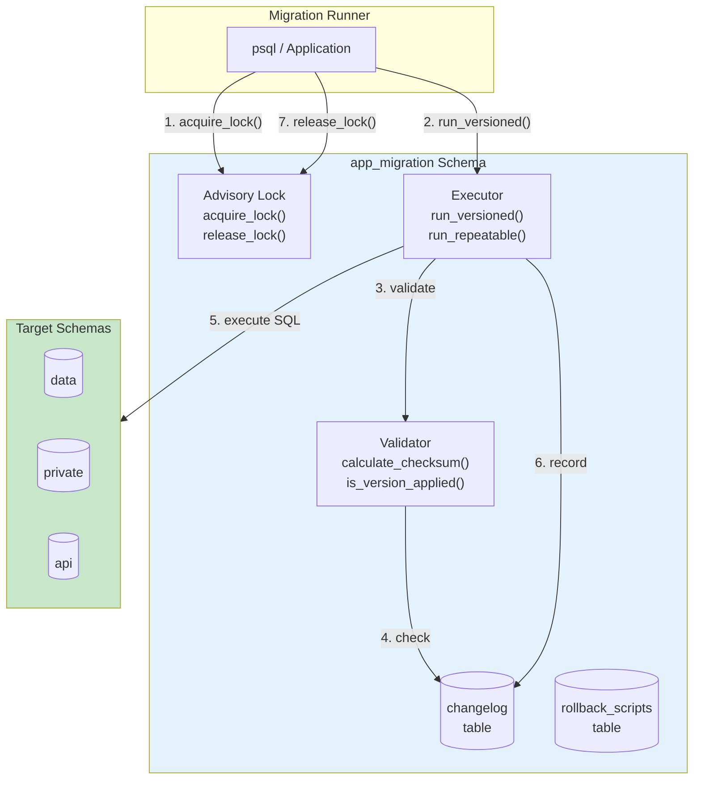
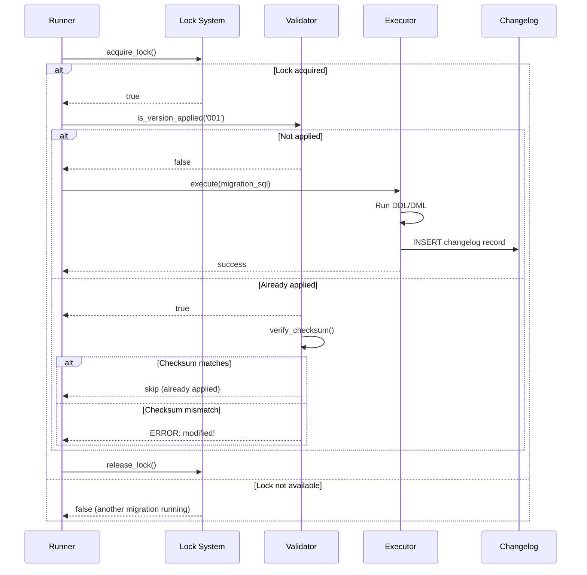
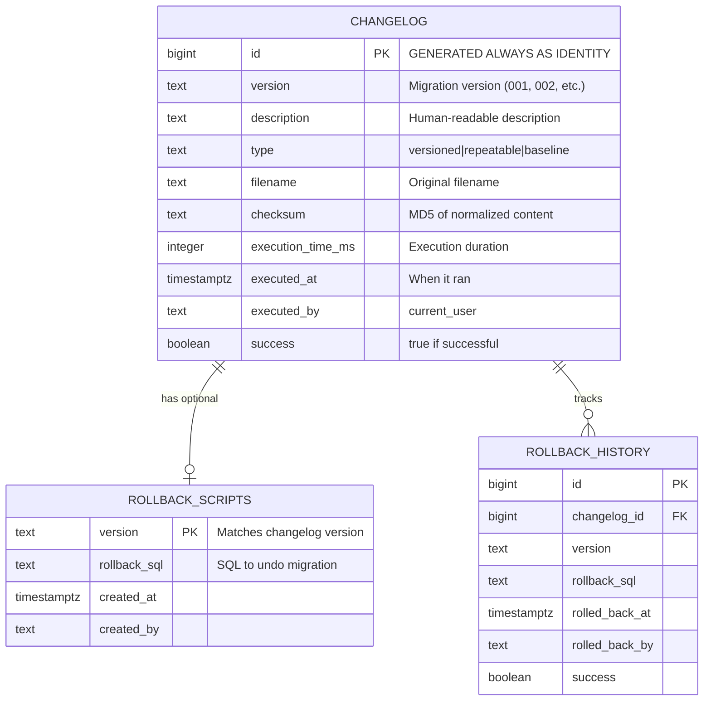
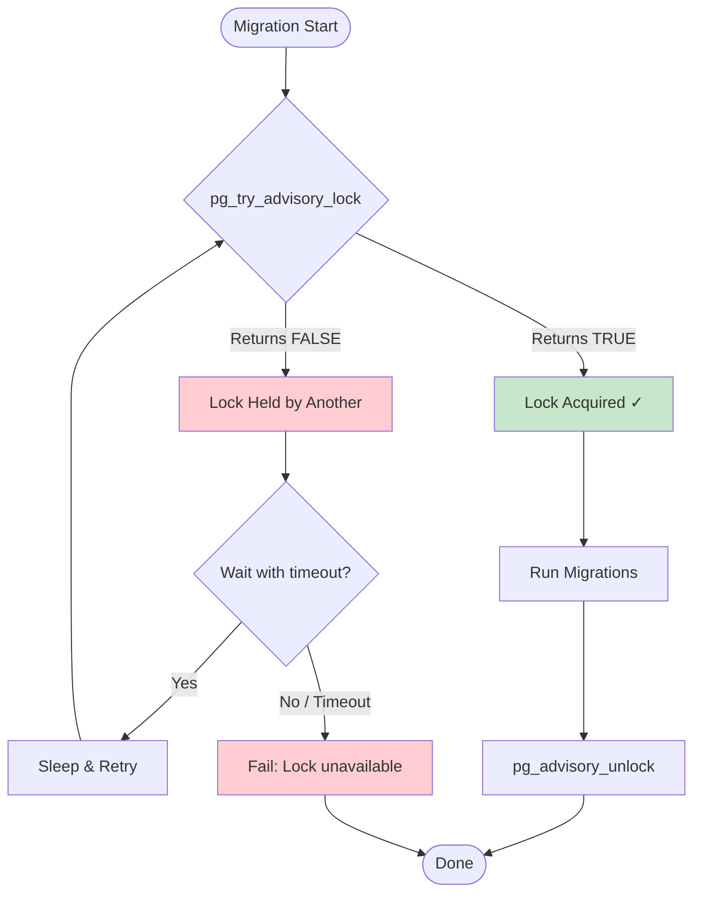

# Database Migrations System

## Table of Contents
1. [Overview](#overview)
2. [Migration Schema Setup](#migration-schema-setup)
3. [Migration Log Table](#migration-log-table)
4. [Locking Mechanism](#locking-mechanism)
5. [Checksum Validation](#checksum-validation)
6. [Migration Types](#migration-types)
7. [Core Migration Functions](#core-migration-functions)
8. [Migration File Conventions](#migration-file-conventions)
9. [Rollback Support](#rollback-support)
10. [Complete Implementation](#complete-implementation)

## Overview

A pure PL/pgSQL migration system that provides:
- Version-controlled schema changes
- Concurrent execution protection via advisory locks
- Checksum validation to detect modified migrations
- Versioned and repeatable migration support
- Rollback capability
- Full execution history

### System Architecture



### Migration Execution Flow



## Migration Schema Setup

```sql
-- Create dedicated schema for migration system
CREATE SCHEMA IF NOT EXISTS app_migration;

COMMENT ON SCHEMA app_migration IS 'Database migration management system';
```

## Migration Log Table

Track all executed migrations:



```sql
CREATE TABLE app_migration.changelog (
    id                  bigint GENERATED ALWAYS AS IDENTITY PRIMARY KEY,
    version             text NOT NULL,
    description         text NOT NULL,
    type                text NOT NULL DEFAULT 'versioned',  -- 'versioned', 'repeatable', 'baseline'
    filename            text NOT NULL,
    checksum            text NOT NULL,
    execution_time_ms   integer,
    executed_at         timestamptz NOT NULL DEFAULT now(),
    executed_by         text NOT NULL DEFAULT current_user,
    success             boolean NOT NULL DEFAULT true,
    
    CONSTRAINT changelog_type_check 
        CHECK (type IN ('versioned', 'repeatable', 'baseline'))
);

-- Unique constraint for versioned migrations
CREATE UNIQUE INDEX changelog_version_key 
    ON app_migration.changelog(version) 
    WHERE type = 'versioned';

-- Index for ordering
CREATE INDEX changelog_executed_idx ON app_migration.changelog(executed_at);

COMMENT ON TABLE app_migration.changelog IS 'Records all migration executions';
```

## Locking Mechanism

### Advisory Lock Flow



Use PostgreSQL advisory locks to prevent concurrent migrations:

```sql
-- Lock configuration
CREATE TABLE app_migration.lock_config (
    id          integer PRIMARY KEY DEFAULT 1,
    lock_id     bigint NOT NULL DEFAULT 123456789,  -- Advisory lock identifier
    
    CONSTRAINT lock_config_single_row CHECK (id = 1)
);

INSERT INTO app_migration.lock_config DEFAULT VALUES;

-- Acquire migration lock
CREATE FUNCTION app_migration.acquire_lock()
RETURNS boolean
LANGUAGE plpgsql
AS $$
DECLARE
    l_lock_id bigint;
    l_acquired boolean;
BEGIN
    SELECT lock_id INTO l_lock_id FROM app_migration.lock_config;

    -- Try to acquire advisory lock (non-blocking)
    l_acquired := pg_try_advisory_lock(l_lock_id);

    IF NOT l_acquired THEN
        RAISE NOTICE 'Migration lock not available - another migration is running';
    END IF;

    RETURN l_acquired;
END;
$$;

-- Acquire lock with wait
CREATE FUNCTION app_migration.acquire_lock_wait(in_timeout_seconds integer DEFAULT 30)
RETURNS boolean
LANGUAGE plpgsql
AS $$
DECLARE
    l_lock_id bigint;
    l_start_time timestamptz := clock_timestamp();
BEGIN
    SELECT lock_id INTO l_lock_id FROM app_migration.lock_config;

    -- Try to acquire, with timeout
    LOOP
        IF pg_try_advisory_lock(l_lock_id) THEN
            RETURN true;
        END IF;

        IF clock_timestamp() > l_start_time + make_interval(secs := in_timeout_seconds) THEN
            RAISE EXCEPTION 'Timeout acquiring migration lock after % seconds', in_timeout_seconds;
        END IF;

        -- Wait 100ms before retry
        PERFORM pg_sleep(0.1);
    END LOOP;
END;
$$;

-- Release migration lock
CREATE FUNCTION app_migration.release_lock()
RETURNS boolean
LANGUAGE plpgsql
AS $$
DECLARE
    l_lock_id bigint;
BEGIN
    SELECT lock_id INTO l_lock_id FROM app_migration.lock_config;
    RETURN pg_advisory_unlock(l_lock_id);
END;
$$;

-- Check if lock is held
CREATE FUNCTION app_migration.is_locked()
RETURNS boolean
LANGUAGE sql
STABLE
AS $$
    SELECT EXISTS (
        SELECT 1 FROM pg_locks 
        WHERE locktype = 'advisory' 
          AND classid = (SELECT (lock_id >> 32)::integer FROM app_migration.lock_config)
          AND objid = (SELECT (lock_id & x'FFFFFFFF'::bigint)::integer FROM app_migration.lock_config)
    );
$$;
```

## Checksum Validation

Detect if migrations have been modified after execution:

```sql
-- Calculate checksum for migration content
CREATE FUNCTION app_migration.calculate_checksum(in_content text)
RETURNS text
LANGUAGE sql
IMMUTABLE
PARALLEL SAFE
AS $$
    -- Strip whitespace normalization and compute MD5
    SELECT md5(
        regexp_replace(
            regexp_replace(in_content, '\s+', ' ', 'g'),  -- Normalize whitespace
            '^\s+|\s+$', '', 'g'  -- Trim
        )
    );
$$;

-- Validate all executed migration checksums
CREATE FUNCTION app_migration.validate_checksums()
RETURNS TABLE (
    version text,
    filename text,
    status text,
    stored_checksum text,
    current_checksum text
)
LANGUAGE plpgsql
STABLE
AS $$
BEGIN
    -- This function should be called after loading migration files
    -- Implementation depends on how migrations are stored/accessed
    -- Return empty set as placeholder - actual validation happens during run
    RETURN;
END;
$$;
```

## Migration Types

### Versioned Migrations

Applied exactly once, in order:

```sql
-- Migration file naming: V{version}__{description}.sql
-- Example: V001__create_users_table.sql

-- Check if version already applied
CREATE FUNCTION app_migration.is_version_applied(in_version text)
RETURNS boolean
LANGUAGE sql
STABLE
AS $$
    SELECT EXISTS (
        SELECT 1 FROM app_migration.changelog 
        WHERE version = in_version 
          AND type = 'versioned' 
          AND success = true
    );
$$;
```

### Repeatable Migrations

Re-applied whenever content changes:

```sql
-- Migration file naming: R__{description}.sql
-- Example: R__views.sql

-- Get stored checksum for repeatable migration
CREATE FUNCTION app_migration.get_repeatable_checksum(in_filename text)
RETURNS text
LANGUAGE sql
STABLE
AS $$
    SELECT checksum
    FROM app_migration.changelog
    WHERE filename = in_filename
      AND type = 'repeatable'
      AND success = true
    ORDER BY executed_at DESC
    LIMIT 1;
$$;

-- Check if repeatable needs to run
CREATE FUNCTION app_migration.repeatable_needs_run(
    in_filename text,
    in_content text
)
RETURNS boolean
LANGUAGE sql
STABLE
AS $$
    SELECT COALESCE(
        app_migration.get_repeatable_checksum(in_filename) 
            != app_migration.calculate_checksum(in_content),
        true  -- Never run before
    );
$$;
```

### Baseline

Mark existing database as starting point:

```sql
-- Set baseline version
CREATE PROCEDURE app_migration.set_baseline(
    in_version text,
    in_description text DEFAULT 'Baseline'
)
LANGUAGE plpgsql
AS $$
BEGIN
    -- Clear any existing changelog
    DELETE FROM app_migration.changelog;
    
    -- Insert baseline marker
    INSERT INTO app_migration.changelog (
        version, description, type, filename, checksum
    ) VALUES (
        in_version, 
        in_description, 
        'baseline', 
        'BASELINE',
        'BASELINE'
    );
    
    RAISE NOTICE 'Baseline set to version %', in_version;
END;
$$;
```

## Core Migration Functions

### Get Current Version

```sql
CREATE FUNCTION app_migration.get_current_version()
RETURNS text
LANGUAGE sql
STABLE
AS $$
    SELECT COALESCE(
        (SELECT version 
         FROM app_migration.changelog 
         WHERE type IN ('versioned', 'baseline') 
           AND success = true
         ORDER BY executed_at DESC 
         LIMIT 1),
        '0'
    );
$$;
```

### Register Migration Execution

```sql
CREATE PROCEDURE app_migration.register_migration(
    in_version text,
    in_description text,
    in_type text,
    in_filename text,
    in_checksum text,
    in_execution_time_ms integer DEFAULT NULL,
    in_success boolean DEFAULT true
)
LANGUAGE plpgsql
AS $$
BEGIN
    INSERT INTO app_migration.changelog (
        version, description, type, filename, checksum, 
        execution_time_ms, success
    ) VALUES (
        in_version, in_description, in_type, in_filename,
        in_checksum, in_execution_time_ms, in_success
    );
END;
$$;
```

### Execute Single Migration

```sql
CREATE PROCEDURE app_migration.execute_migration(
    in_version text,
    in_description text,
    in_type text,
    in_filename text,
    in_sql text,
    in_validate_checksum boolean DEFAULT true
)
LANGUAGE plpgsql
AS $$
DECLARE
    l_checksum text;
    l_stored_checksum text;
    l_start_time timestamptz;
    l_execution_time_ms integer;
BEGIN
    -- Calculate checksum
    l_checksum := app_migration.calculate_checksum(in_sql);

    -- For versioned migrations, check if already applied
    IF in_type = 'versioned' THEN
        IF app_migration.is_version_applied(in_version) THEN
            -- Verify checksum hasn't changed
            SELECT checksum INTO l_stored_checksum
            FROM app_migration.changelog
            WHERE version = in_version AND type = 'versioned' AND success = true;

            IF in_validate_checksum AND l_stored_checksum != l_checksum THEN
                RAISE EXCEPTION 'Checksum mismatch for version %: stored=%, current=%',
                    in_version, l_stored_checksum, l_checksum;
            END IF;

            RAISE NOTICE 'Version % already applied, skipping', in_version;
            RETURN;
        END IF;
    END IF;

    -- For repeatable migrations, check if content changed
    IF in_type = 'repeatable' THEN
        IF NOT app_migration.repeatable_needs_run(in_filename, in_sql) THEN
            RAISE NOTICE 'Repeatable migration % unchanged, skipping', in_filename;
            RETURN;
        END IF;
    END IF;

    -- Execute migration
    l_start_time := clock_timestamp();

    BEGIN
        EXECUTE in_sql;

        l_execution_time_ms := extract(milliseconds from clock_timestamp() - l_start_time)::integer;

        -- Register successful execution
        CALL app_migration.register_migration(
            in_version, in_description, in_type, in_filename,
            l_checksum, l_execution_time_ms, true
        );

        RAISE NOTICE 'Applied % migration: % (% ms)',
            in_type, in_version, l_execution_time_ms;

    EXCEPTION WHEN OTHERS THEN
        -- Register failed execution
        CALL app_migration.register_migration(
            in_version, in_description, in_type, in_filename,
            l_checksum, NULL, false
        );

        RAISE EXCEPTION 'Migration % failed: %', in_version, SQLERRM;
    END;
END;
$$;
```

### Get Pending Migrations

```sql
CREATE FUNCTION app_migration.get_pending(in_versions text[] DEFAULT NULL)
RETURNS TABLE (
    version text,
    is_new boolean
)
LANGUAGE sql
STABLE
AS $$
    -- Return versions from input array that haven't been applied
    -- Implementation depends on how versions are provided
    SELECT 
        unnest(in_versions),
        true
    WHERE unnest(in_versions) NOT IN (
        SELECT version 
        FROM app_migration.changelog 
        WHERE type = 'versioned' AND success = true
    );
$$;
```

### Get Migration History

```sql
CREATE FUNCTION app_migration.get_history(in_limit integer DEFAULT 50)
RETURNS TABLE (
    id bigint,
    version text,
    description text,
    type text,
    filename text,
    checksum text,
    execution_time_ms integer,
    executed_at timestamptz,
    executed_by text,
    success boolean
)
LANGUAGE sql
STABLE
AS $$
    SELECT 
        id, version, description, type, filename, checksum,
        execution_time_ms, executed_at, executed_by, success
    FROM app_migration.changelog
    ORDER BY executed_at DESC
    LIMIT in_limit;
$$;
```

### Migration Info (Summary)

```sql
CREATE FUNCTION app_migration.info()
RETURNS TABLE (
    current_version text,
    total_migrations bigint,
    last_migration_at timestamptz,
    is_locked boolean
)
LANGUAGE sql
STABLE
AS $$
    SELECT
        app_migration.get_current_version(),
        (SELECT count(*) FROM app_migration.changelog WHERE success = true),
        (SELECT max(executed_at) FROM app_migration.changelog WHERE success = true),
        app_migration.is_locked();
$$;
```

## Migration File Conventions

### Versioned Migration Files

```
migrations/
├── V001__initial_schema.sql
├── V002__create_users_table.sql
├── V003__add_orders_table.sql
├── V004__add_user_email_index.sql
└── ...
```

**Naming Pattern**: `V{version}__{description}.sql`
- Version: Zero-padded number (001, 002, ...) or timestamp (20240101120000)
- Double underscore separator
- Description: snake_case, no special characters

### Repeatable Migration Files

```
migrations/
├── R__functions.sql
├── R__views.sql
├── R__triggers.sql
└── R__permissions.sql
```

**Naming Pattern**: `R__{description}.sql`
- No version number
- Re-run whenever content changes
- Applied after all versioned migrations

### Example Versioned Migration

```sql
-- V001__initial_schema.sql
-- Description: Create initial application schema and base tables
-- Author: team
-- Date: 2024-01-15

-- Create schemas
CREATE SCHEMA IF NOT EXISTS app;
CREATE SCHEMA IF NOT EXISTS app_audit;

-- Create customers table
CREATE TABLE data.customers (
    id uuid PRIMARY KEY DEFAULT uuidv7(),
    email text NOT NULL,
    name text NOT NULL,
    is_active boolean NOT NULL DEFAULT true,
    created_at timestamptz NOT NULL DEFAULT now(),
    updated_at timestamptz NOT NULL DEFAULT now()
);

CREATE UNIQUE INDEX customers_email_key ON data.customers(lower(email));
CREATE INDEX customers_is_active_idx ON data.customers(is_active) WHERE is_active = true;

COMMENT ON TABLE data.customers IS 'Customer accounts';
```

### Example Repeatable Migration

```sql
-- R__views.sql
-- Description: Application views (re-applied on change)

-- Drop and recreate views to handle definition changes
DROP VIEW IF EXISTS api.v_active_customers CASCADE;

CREATE VIEW api.v_active_customers AS
SELECT id, email, name, created_at
FROM data.customers
WHERE is_active = true;

DROP VIEW IF EXISTS api.v_order_summary CASCADE;

CREATE VIEW api.v_order_summary AS
SELECT 
    o.id,
    o.customer_id,
    c.email AS customer_email,
    o.status,
    o.total,
    o.created_at
FROM data.orders o
JOIN data.customers c ON c.id = o.customer_id;
```

## Rollback Support

### Rollback History Table

```sql
CREATE TABLE app_migration.rollback_log (
    id                  bigint GENERATED ALWAYS AS IDENTITY PRIMARY KEY,
    changelog_id        bigint NOT NULL REFERENCES app_migration.changelog(id),
    version             text NOT NULL,
    rollback_sql        text,
    rolled_back_at      timestamptz NOT NULL DEFAULT now(),
    rolled_back_by      text NOT NULL DEFAULT current_user,
    success             boolean NOT NULL DEFAULT true
);
```

### Store Rollback SQL

```sql
-- Optional: Store rollback SQL with migration
CREATE TABLE app_migration.rollback_scripts (
    version             text PRIMARY KEY,
    rollback_sql        text NOT NULL,
    created_at          timestamptz NOT NULL DEFAULT now()
);

-- Register rollback script
CREATE PROCEDURE app_migration.register_rollback(
    in_version text,
    in_rollback_sql text
)
LANGUAGE sql
AS $$
    INSERT INTO app_migration.rollback_scripts (version, rollback_sql)
    VALUES (in_version, in_rollback_sql)
    ON CONFLICT (version) DO UPDATE SET rollback_sql = EXCLUDED.rollback_sql;
$$;
```

### Execute Rollback

```sql
CREATE PROCEDURE app_migration.rollback_version(in_version text)
LANGUAGE plpgsql
AS $$
DECLARE
    l_rollback_sql text;
    l_changelog_id bigint;
BEGIN
    -- Get changelog entry
    SELECT id INTO l_changelog_id
    FROM app_migration.changelog
    WHERE version = in_version AND type = 'versioned' AND success = true
    ORDER BY executed_at DESC
    LIMIT 1;

    IF l_changelog_id IS NULL THEN
        RAISE EXCEPTION 'Version % not found in changelog', in_version;
    END IF;

    -- Get rollback SQL
    SELECT rollback_sql INTO l_rollback_sql
    FROM app_migration.rollback_scripts
    WHERE version = in_version;

    IF l_rollback_sql IS NULL THEN
        RAISE EXCEPTION 'No rollback script for version %', in_version;
    END IF;

    -- Execute rollback
    BEGIN
        EXECUTE l_rollback_sql;

        -- Log successful rollback
        INSERT INTO app_migration.rollback_log (changelog_id, version, rollback_sql, success)
        VALUES (l_changelog_id, in_version, l_rollback_sql, true);

        -- Mark original migration as rolled back (keep in history)
        UPDATE app_migration.changelog
        SET success = false
        WHERE id = l_changelog_id;

        RAISE NOTICE 'Rolled back version %', in_version;

    EXCEPTION WHEN OTHERS THEN
        -- Log failed rollback
        INSERT INTO app_migration.rollback_log (changelog_id, version, rollback_sql, success)
        VALUES (l_changelog_id, in_version, l_rollback_sql, false);

        RAISE EXCEPTION 'Rollback of version % failed: %', in_version, SQLERRM;
    END;
END;
$$;
```

## Blue-Green Deployment Patterns

### Overview

Blue-green deployment for database schema changes ensures zero-downtime migrations by maintaining backward compatibility during transitions.

### Key Principles

```markdown
1. **Expand-Contract Pattern**: Add new → migrate data → remove old
2. **Backward Compatible**: Old app version must work with new schema
3. **Forward Compatible**: New app version must work with old schema
4. **Non-Blocking**: Avoid long-running locks on tables
```

### Adding a Column

```sql
-- Phase 1: Add nullable column (backward compatible)
ALTER TABLE data.users ADD COLUMN phone text;

-- Phase 2: Deploy new app that writes to both old and new
-- Phase 3: Backfill data
UPDATE data.users SET phone = extract_phone_from_profile(profile) WHERE phone IS NULL;

-- Phase 4: Add NOT NULL constraint (after all data migrated)
ALTER TABLE data.users ALTER COLUMN phone SET NOT NULL;
```

### Renaming a Column

```sql
-- ❌ Bad: Breaks old app immediately
ALTER TABLE data.users RENAME COLUMN name TO full_name;

-- ✅ Good: Expand-contract pattern

-- Phase 1: Add new column
ALTER TABLE data.users ADD COLUMN full_name text;

-- Phase 2: Create trigger to sync both columns
CREATE FUNCTION private.sync_user_names()
RETURNS trigger LANGUAGE plpgsql AS $$
BEGIN
    IF TG_OP = 'INSERT' OR NEW.name IS DISTINCT FROM OLD.name THEN
        NEW.full_name := NEW.name;
    END IF;
    IF TG_OP = 'INSERT' OR NEW.full_name IS DISTINCT FROM OLD.full_name THEN
        NEW.name := NEW.full_name;
    END IF;
    RETURN NEW;
END;
$$;

CREATE TRIGGER users_sync_names_trg
    BEFORE INSERT OR UPDATE ON data.users
    FOR EACH ROW EXECUTE FUNCTION private.sync_user_names();

-- Phase 3: Backfill
UPDATE data.users SET full_name = name WHERE full_name IS NULL;

-- Phase 4: Deploy new app using full_name
-- Phase 5: Remove old column and trigger (after old app retired)
DROP TRIGGER users_sync_names_trg ON data.users;
DROP FUNCTION private.sync_user_names();
ALTER TABLE data.users DROP COLUMN name;
```

### Changing Column Type

```sql
-- ❌ Bad: Locks table, may fail with data
ALTER TABLE data.orders ALTER COLUMN status TYPE integer USING status::integer;

-- ✅ Good: Add new column, migrate, swap

-- Phase 1: Add new column
ALTER TABLE data.orders ADD COLUMN status_new integer;

-- Phase 2: Sync trigger
CREATE FUNCTION private.sync_order_status()
RETURNS trigger LANGUAGE plpgsql AS $$
BEGIN
    NEW.status_new := CASE NEW.status
        WHEN 'pending' THEN 1
        WHEN 'processing' THEN 2
        WHEN 'completed' THEN 3
        ELSE 0
    END;
    RETURN NEW;
END;
$$;

CREATE TRIGGER orders_sync_status_trg
    BEFORE INSERT OR UPDATE OF status ON data.orders
    FOR EACH ROW EXECUTE FUNCTION private.sync_order_status();

-- Phase 3: Backfill
UPDATE data.orders SET status_new = CASE status
    WHEN 'pending' THEN 1 WHEN 'processing' THEN 2 WHEN 'completed' THEN 3 ELSE 0
END WHERE status_new IS NULL;

-- Phase 4: Update API functions to use status_new
-- Phase 5: Drop old column
```

### Adding NOT NULL Constraint

```sql
-- ❌ Bad: Full table scan with exclusive lock
ALTER TABLE data.large_table ALTER COLUMN email SET NOT NULL;

-- ✅ Good: NOT VALID then validate separately

-- Phase 1: Add constraint without validation (no lock)
ALTER TABLE data.large_table
    ADD CONSTRAINT large_table_email_not_null
    CHECK (email IS NOT NULL) NOT VALID;

-- Phase 2: Ensure no NULLs in new data (app/trigger enforces)

-- Phase 3: Validate existing data (ShareUpdateExclusiveLock, allows reads/writes)
ALTER TABLE data.large_table VALIDATE CONSTRAINT large_table_email_not_null;

-- Phase 4: Optionally convert to true NOT NULL
-- (Requires PG18 or accept the CHECK constraint)
```

### Creating Index Without Downtime

```sql
-- ❌ Bad: Blocks writes
CREATE INDEX orders_email_idx ON data.orders(email);

-- ✅ Good: CONCURRENTLY (allows writes during build)
CREATE INDEX CONCURRENTLY orders_email_idx ON data.orders(email);

-- Note: CONCURRENTLY cannot be in a transaction
-- If it fails, the index may be left invalid:
SELECT indexrelid::regclass, indisvalid
FROM pg_index
WHERE NOT indisvalid;

-- Rebuild invalid index
REINDEX INDEX CONCURRENTLY orders_email_idx;
```

### Dropping a Column

```sql
-- ❌ Bad: Immediate drop may break old app
ALTER TABLE data.users DROP COLUMN legacy_field;

-- ✅ Good: Mark unused, then drop later

-- Phase 1: Stop writing to column (app change)
-- Phase 2: Deprecate in comments
COMMENT ON COLUMN data.users.legacy_field IS 'DEPRECATED: Do not use. Will be removed.';

-- Phase 3: (Optional) Rename to make usage obvious
ALTER TABLE data.users RENAME COLUMN legacy_field TO _deprecated_legacy_field;

-- Phase 4: Drop after verification period
ALTER TABLE data.users DROP COLUMN _deprecated_legacy_field;
```

### Migration Checklist for Zero-Downtime

```markdown
## Pre-Migration
- [ ] Schema change is backward compatible
- [ ] Schema change is forward compatible
- [ ] No exclusive locks on large tables
- [ ] Tested in staging with production-like data
- [ ] Rollback plan documented

## During Migration
- [ ] Monitor query performance
- [ ] Monitor lock waits
- [ ] Monitor replication lag

## Post-Migration
- [ ] Verify data integrity
- [ ] Clean up temporary objects
- [ ] Update documentation
```

## Complete Implementation

### Full Migration System Setup Script

```sql
-- ============================================================
-- DATABASE MIGRATION SYSTEM
-- ============================================================
-- Run this script to initialize the migration system
-- ============================================================

BEGIN;

-- Create migration schema
CREATE SCHEMA IF NOT EXISTS app_migration;

-- Changelog table
CREATE TABLE IF NOT EXISTS app_migration.changelog (
    id                  bigint GENERATED ALWAYS AS IDENTITY PRIMARY KEY,
    version             text NOT NULL,
    description         text NOT NULL,
    type                text NOT NULL DEFAULT 'versioned',
    filename            text NOT NULL,
    checksum            text NOT NULL,
    execution_time_ms   integer,
    executed_at         timestamptz NOT NULL DEFAULT now(),
    executed_by         text NOT NULL DEFAULT current_user,
    success             boolean NOT NULL DEFAULT true,
    
    CONSTRAINT changelog_type_check 
        CHECK (type IN ('versioned', 'repeatable', 'baseline'))
);

CREATE UNIQUE INDEX IF NOT EXISTS changelog_version_key 
    ON app_migration.changelog(version) 
    WHERE type = 'versioned' AND success = true;

-- Lock configuration
CREATE TABLE IF NOT EXISTS app_migration.lock_config (
    id          integer PRIMARY KEY DEFAULT 1,
    lock_id     bigint NOT NULL DEFAULT 123456789,
    CONSTRAINT lock_config_single_row CHECK (id = 1)
);

INSERT INTO app_migration.lock_config DEFAULT VALUES
ON CONFLICT DO NOTHING;

-- Rollback scripts storage
CREATE TABLE IF NOT EXISTS app_migration.rollback_scripts (
    version             text PRIMARY KEY,
    rollback_sql        text NOT NULL,
    created_at          timestamptz NOT NULL DEFAULT now()
);

-- Rollback history
CREATE TABLE IF NOT EXISTS app_migration.rollback_log (
    id                  bigint GENERATED ALWAYS AS IDENTITY PRIMARY KEY,
    changelog_id        bigint NOT NULL,
    version             text NOT NULL,
    rollback_sql        text,
    rolled_back_at      timestamptz NOT NULL DEFAULT now(),
    rolled_back_by      text NOT NULL DEFAULT current_user,
    success             boolean NOT NULL DEFAULT true
);

-- [Include all functions and procedures from above sections]

COMMIT;

-- Verify installation
SELECT * FROM app_migration.info();
```

### Usage Example

```sql
-- 1. Acquire lock before running migrations
SELECT app_migration.acquire_lock();

-- 2. Run a versioned migration (simple helper)
CALL app_migration.run_versioned(
    in_version := '001',
    in_description := 'Create users table',
    in_sql := $mig$
        CREATE TABLE data.users (
            id uuid PRIMARY KEY DEFAULT uuidv7(),
            email text NOT NULL UNIQUE,
            created_at timestamptz NOT NULL DEFAULT now()
        );
    $mig$,
    in_rollback_sql := 'DROP TABLE data.users;'
);

-- 3. Run repeatable migration
CALL app_migration.run_repeatable(
    in_filename := 'R__views.sql',
    in_description := 'Application views',
    in_sql := $mig$
        DROP VIEW IF EXISTS api.v_active_users CASCADE;
        CREATE VIEW api.v_active_users AS
        SELECT * FROM data.users WHERE is_active = true;
    $mig$
);

-- 4. Check migration status
SELECT * FROM app_migration.info();
SELECT * FROM app_migration.get_history(10);

-- 5. Release lock
SELECT app_migration.release_lock();

-- To rollback if needed:
-- SELECT app_migration.acquire_lock();
-- CALL app_migration.rollback('001');
-- SELECT app_migration.release_lock();
```

> **Note**: The `run_versioned()` and `run_repeatable()` helpers are provided by `002_migration_runner_helpers.sql`. The core `app_migration.execute()` procedure is available from `001_install_migration_system.sql`.
