# Partitioning Strategies

This document covers PostgreSQL declarative partitioning including range, list, and hash partitioning, partition management, and migration strategies.

## Table of Contents

1. [Overview](#overview)
2. [Partitioning Types](#partitioning-types)
3. [Range Partitioning](#range-partitioning)
4. [List Partitioning](#list-partitioning)
5. [Hash Partitioning](#hash-partitioning)
6. [Partition Management](#partition-management)
7. [Indexes on Partitioned Tables](#indexes-on-partitioned-tables)
8. [Migrating to Partitioned Tables](#migrating-to-partitioned-tables)
9. [Performance Optimization](#performance-optimization)
10. [Common Patterns](#common-patterns)

## Overview

### When to Use Partitioning

| Use Case | Benefit | Partitioning Type |
|----------|---------|-------------------|
| Time-series data | Fast old data deletion, query pruning | Range |
| Multi-tenant isolation | Per-tenant management | List |
| Large table distribution | Parallel operations | Hash |
| Archival/retention | Drop old partitions | Range |
| Geographic sharding | Regional queries | List |

### Partitioning Decision Tree

```mermaid
flowchart TD
    START([Table > 100GB?]) -->|No| SKIP["Skip partitioning<br/>(overhead not worth it)"]
    START -->|Yes| Q1{Data access pattern?}

    Q1 -->|"Time-based queries"| RANGE["Range Partitioning<br/>(by date/timestamp)"]
    Q1 -->|"Category-based"| LIST["List Partitioning<br/>(by status, region, tenant)"]
    Q1 -->|"Even distribution"| HASH["Hash Partitioning<br/>(by ID for parallelism)"]
    Q1 -->|"Multiple patterns"| MULTI["Sub-partitioning"]

    RANGE --> RETENTION{Need data retention?}
    RETENTION -->|Yes| RANGE_IDEAL["✅ Ideal: DROP partition<br/>instead of DELETE"]
    RETENTION -->|No| RANGE_OK["Good for query pruning"]

    style RANGE_IDEAL fill:#c8e6c9
    style SKIP fill:#fff3e0
```



### Partitioning Limits

- Maximum 2^14 (16,384) partitions per table
- Partition key must be included in primary key and unique constraints
- Foreign keys referencing partitioned tables supported (PostgreSQL 12+)
- Cross-partition updates require PostgreSQL 11+

## Partitioning Types

### Comparison

| Type | Best For | Key Requirement | Partition Pruning |
|------|----------|-----------------|-------------------|
| Range | Time-series, continuous values | Ordered values | Equality, range |
| List | Categories, regions, tenants | Discrete values | Equality only |
| Hash | Even distribution | Any hashable type | Equality only |

## Range Partitioning

### Basic Range Partitioning (Time-Based)

```sql
-- Create partitioned table
CREATE TABLE data.events (
    id              uuid NOT NULL DEFAULT uuidv7(),
    event_type      text NOT NULL,
    payload         jsonb NOT NULL DEFAULT '{}',
    created_at      timestamptz NOT NULL DEFAULT now(),

    -- Partition key must be in primary key
    PRIMARY KEY (id, created_at)
) PARTITION BY RANGE (created_at);

-- Create partitions for each month
CREATE TABLE data.events_2024_01 PARTITION OF data.events
    FOR VALUES FROM ('2024-01-01') TO ('2024-02-01');

CREATE TABLE data.events_2024_02 PARTITION OF data.events
    FOR VALUES FROM ('2024-02-01') TO ('2024-03-01');

CREATE TABLE data.events_2024_03 PARTITION OF data.events
    FOR VALUES FROM ('2024-03-01') TO ('2024-04-01');

-- Default partition catches any out-of-range values
CREATE TABLE data.events_default PARTITION OF data.events DEFAULT;
```

### Range Partition with Tablespaces

```sql
-- Different tablespaces for hot/cold data
CREATE TABLE data.events_2024_12 PARTITION OF data.events
    FOR VALUES FROM ('2024-12-01') TO ('2025-01-01')
    TABLESPACE fast_ssd;

CREATE TABLE data.events_2024_01 PARTITION OF data.events
    FOR VALUES FROM ('2024-01-01') TO ('2024-02-01')
    TABLESPACE archive_hdd;
```

### Numeric Range Partitioning

```sql
-- Partition by ID range (for sharding-like behavior)
CREATE TABLE data.users (
    id              bigint GENERATED ALWAYS AS IDENTITY,
    email           text NOT NULL,
    created_at      timestamptz NOT NULL DEFAULT now(),

    PRIMARY KEY (id)
) PARTITION BY RANGE (id);

CREATE TABLE data.users_p0 PARTITION OF data.users
    FOR VALUES FROM (1) TO (1000001);
CREATE TABLE data.users_p1 PARTITION OF data.users
    FOR VALUES FROM (1000001) TO (2000001);
CREATE TABLE data.users_p2 PARTITION OF data.users
    FOR VALUES FROM (2000001) TO (3000001);
```

## List Partitioning

### Basic List Partitioning

```sql
-- Partition by region
CREATE TABLE data.orders (
    id              uuid NOT NULL DEFAULT uuidv7(),
    customer_id     uuid NOT NULL,
    region          text NOT NULL,
    total           numeric(15,2) NOT NULL,
    created_at      timestamptz NOT NULL DEFAULT now(),

    PRIMARY KEY (id, region)
) PARTITION BY LIST (region);

CREATE TABLE data.orders_us PARTITION OF data.orders
    FOR VALUES IN ('us-east', 'us-west', 'us-central');

CREATE TABLE data.orders_eu PARTITION OF data.orders
    FOR VALUES IN ('eu-west', 'eu-central', 'eu-north');

CREATE TABLE data.orders_apac PARTITION OF data.orders
    FOR VALUES IN ('apac-east', 'apac-south', 'apac-north');

CREATE TABLE data.orders_other PARTITION OF data.orders DEFAULT;
```

### Multi-Tenant Partitioning

```sql
-- Each tenant gets its own partition
CREATE TABLE data.tenant_data (
    id              uuid NOT NULL DEFAULT uuidv7(),
    tenant_id       uuid NOT NULL,
    data            jsonb NOT NULL,
    created_at      timestamptz NOT NULL DEFAULT now(),

    PRIMARY KEY (id, tenant_id)
) PARTITION BY LIST (tenant_id);

-- Function to create tenant partition
CREATE FUNCTION private.create_tenant_partition(in_tenant_id uuid)
RETURNS void
LANGUAGE plpgsql
AS $$
DECLARE
    l_partition_name text;
BEGIN
    l_partition_name := 'tenant_data_' || replace(in_tenant_id::text, '-', '_');

    EXECUTE format(
        'CREATE TABLE data.%I PARTITION OF data.tenant_data FOR VALUES IN (%L)',
        l_partition_name,
        in_tenant_id
    );

    RAISE NOTICE 'Created partition: %', l_partition_name;
END;
$$;

-- Create partitions for existing tenants
SELECT private.create_tenant_partition(id) FROM data.tenants;
```

### Status-Based Partitioning

```sql
-- Partition by order status (hot/cold separation)
CREATE TABLE data.orders (
    id              uuid NOT NULL DEFAULT uuidv7(),
    status          text NOT NULL DEFAULT 'pending',
    total           numeric(15,2) NOT NULL,
    created_at      timestamptz NOT NULL DEFAULT now(),

    PRIMARY KEY (id, status),
    CONSTRAINT orders_status_check CHECK (status IN ('pending', 'processing', 'shipped', 'delivered', 'cancelled'))
) PARTITION BY LIST (status);

-- Active orders (frequently accessed)
CREATE TABLE data.orders_active PARTITION OF data.orders
    FOR VALUES IN ('pending', 'processing', 'shipped')
    TABLESPACE fast_ssd;

-- Completed orders (rarely accessed)
CREATE TABLE data.orders_completed PARTITION OF data.orders
    FOR VALUES IN ('delivered', 'cancelled')
    TABLESPACE archive_hdd;
```

## Hash Partitioning

### Basic Hash Partitioning

```sql
-- Distribute by customer_id for parallel processing
CREATE TABLE data.order_items (
    id              uuid NOT NULL DEFAULT uuidv7(),
    order_id        uuid NOT NULL,
    customer_id     uuid NOT NULL,
    product_id      uuid NOT NULL,
    quantity        integer NOT NULL,

    PRIMARY KEY (id, customer_id)
) PARTITION BY HASH (customer_id);

-- Create 8 partitions (power of 2 recommended)
CREATE TABLE data.order_items_p0 PARTITION OF data.order_items
    FOR VALUES WITH (MODULUS 8, REMAINDER 0);
CREATE TABLE data.order_items_p1 PARTITION OF data.order_items
    FOR VALUES WITH (MODULUS 8, REMAINDER 1);
CREATE TABLE data.order_items_p2 PARTITION OF data.order_items
    FOR VALUES WITH (MODULUS 8, REMAINDER 2);
CREATE TABLE data.order_items_p3 PARTITION OF data.order_items
    FOR VALUES WITH (MODULUS 8, REMAINDER 3);
CREATE TABLE data.order_items_p4 PARTITION OF data.order_items
    FOR VALUES WITH (MODULUS 8, REMAINDER 4);
CREATE TABLE data.order_items_p5 PARTITION OF data.order_items
    FOR VALUES WITH (MODULUS 8, REMAINDER 5);
CREATE TABLE data.order_items_p6 PARTITION OF data.order_items
    FOR VALUES WITH (MODULUS 8, REMAINDER 6);
CREATE TABLE data.order_items_p7 PARTITION OF data.order_items
    FOR VALUES WITH (MODULUS 8, REMAINDER 7);
```

### Generate Hash Partitions

```sql
-- Function to create N hash partitions
CREATE FUNCTION private.create_hash_partitions(
    in_parent_table text,
    in_partition_count integer
)
RETURNS void
LANGUAGE plpgsql
AS $$
DECLARE
    l_i integer;
    l_partition_name text;
BEGIN
    FOR l_i IN 0..(in_partition_count - 1) LOOP
        l_partition_name := in_parent_table || '_p' || l_i;

        EXECUTE format(
            'CREATE TABLE data.%I PARTITION OF data.%I FOR VALUES WITH (MODULUS %s, REMAINDER %s)',
            l_partition_name,
            in_parent_table,
            in_partition_count,
            l_i
        );
    END LOOP;
END;
$$;

-- Usage
SELECT private.create_hash_partitions('order_items', 16);
```

## Partition Management

### Automatic Partition Creation (Time-Based)

```sql
-- Function to create next month's partition
CREATE FUNCTION private.create_monthly_partition(
    in_table_name text,
    in_target_date date DEFAULT (date_trunc('month', now()) + interval '1 month')::date
)
RETURNS text
LANGUAGE plpgsql
AS $$
DECLARE
    l_partition_name text;
    l_start_date date;
    l_end_date date;
BEGIN
    l_start_date := date_trunc('month', in_target_date);
    l_end_date := l_start_date + interval '1 month';
    l_partition_name := in_table_name || '_' || to_char(l_start_date, 'YYYY_MM');

    -- Check if partition already exists
    IF EXISTS (
        SELECT 1 FROM pg_tables
        WHERE schemaname = 'data' AND tablename = l_partition_name
    ) THEN
        RAISE NOTICE 'Partition % already exists', l_partition_name;
        RETURN l_partition_name;
    END IF;

    -- Create partition
    EXECUTE format(
        'CREATE TABLE data.%I PARTITION OF data.%I FOR VALUES FROM (%L) TO (%L)',
        l_partition_name,
        in_table_name,
        l_start_date,
        l_end_date
    );

    RAISE NOTICE 'Created partition: data.%', l_partition_name;
    RETURN l_partition_name;
END;
$$;

-- Schedule with pg_cron (run on 25th of each month)
SELECT cron.schedule(
    'create-events-partition',
    '0 0 25 * *',
    $$SELECT private.create_monthly_partition('events')$$
);
```

### Partition Retention (Drop Old Partitions)

```sql
-- Function to drop partitions older than retention period
CREATE FUNCTION private.drop_old_partitions(
    in_table_name text,
    in_retention_months integer
)
RETURNS integer
LANGUAGE plpgsql
AS $$
DECLARE
    l_cutoff_date date;
    l_partition record;
    l_dropped_count integer := 0;
BEGIN
    l_cutoff_date := date_trunc('month', now() - (in_retention_months || ' months')::interval);

    FOR l_partition IN
        SELECT
            c.relname AS partition_name,
            pg_get_expr(c.relpartbound, c.oid) AS bounds
        FROM pg_class p
        JOIN pg_inherits i ON p.oid = i.inhparent
        JOIN pg_class c ON i.inhrelid = c.oid
        WHERE p.relname = in_table_name
          AND p.relnamespace = 'data'::regnamespace
          AND c.relname != in_table_name || '_default'
    LOOP
        -- Extract start date from partition bounds
        -- Bounds format: FOR VALUES FROM ('2024-01-01') TO ('2024-02-01')
        IF l_partition.bounds ~ 'FROM \(''(\d{4}-\d{2}-\d{2})' THEN
            DECLARE
                l_partition_start date;
            BEGIN
                l_partition_start := (regexp_match(l_partition.bounds, 'FROM \(''(\d{4}-\d{2}-\d{2})'))[1]::date;

                IF l_partition_start < l_cutoff_date THEN
                    EXECUTE format('DROP TABLE data.%I', l_partition.partition_name);
                    RAISE NOTICE 'Dropped partition: %', l_partition.partition_name;
                    l_dropped_count := l_dropped_count + 1;
                END IF;
            END;
        END IF;
    END LOOP;

    RETURN l_dropped_count;
END;
$$;

-- Keep 12 months of data
SELECT private.drop_old_partitions('events', 12);

-- Schedule monthly cleanup
SELECT cron.schedule(
    'cleanup-events-partitions',
    '0 2 1 * *',  -- 2 AM on 1st of month
    $$SELECT private.drop_old_partitions('events', 12)$$
);
```

### Detach Partition (Archive)

```sql
-- Detach partition for archiving (without dropping)
ALTER TABLE data.events DETACH PARTITION data.events_2023_01;

-- Can now move to archive tablespace
ALTER TABLE data.events_2023_01 SET TABLESPACE archive_hdd;

-- Or dump and remove
-- pg_dump -t data.events_2023_01 > events_2023_01.sql
-- DROP TABLE data.events_2023_01;

-- Reattach if needed
ALTER TABLE data.events ATTACH PARTITION data.events_2023_01
    FOR VALUES FROM ('2023-01-01') TO ('2023-02-01');
```

### Detach Partition Concurrently (PostgreSQL 14+)

```sql
-- Non-blocking detach
ALTER TABLE data.events DETACH PARTITION data.events_2023_01 CONCURRENTLY;

-- Note: Cannot be in a transaction block
-- Note: Partition is still visible until detach completes
```

## Indexes on Partitioned Tables

### Partition-Local Indexes

```sql
-- Index created on parent applies to all partitions
CREATE INDEX events_event_type_idx ON data.events(event_type);

-- Each partition gets its own copy of the index
-- Verify:
SELECT
    tablename,
    indexname
FROM pg_indexes
WHERE tablename LIKE 'events%'
ORDER BY tablename, indexname;
```

### Per-Partition Index Customization

```sql
-- Create index only on specific partition
CREATE INDEX events_2024_01_payload_idx
    ON data.events_2024_01 USING gin(payload);

-- Index on hot partition only
CREATE INDEX events_active_customer_idx
    ON data.orders_active(customer_id);
```

### Unique Constraints with Partition Key

```sql
-- Unique constraint MUST include partition key
CREATE TABLE data.users (
    id              uuid NOT NULL DEFAULT uuidv7(),
    email           text NOT NULL,
    region          text NOT NULL,
    created_at      timestamptz NOT NULL DEFAULT now(),

    -- Works: includes partition key
    PRIMARY KEY (id, region),

    -- Works: includes partition key
    UNIQUE (email, region)
) PARTITION BY LIST (region);

-- Will NOT work:
-- UNIQUE (email)  -- Error: missing partition key
```

### Foreign Keys

```sql
-- Foreign key TO partitioned table (PostgreSQL 12+)
CREATE TABLE data.order_items (
    id              uuid PRIMARY KEY DEFAULT uuidv7(),
    order_id        uuid NOT NULL,
    order_region    text NOT NULL,
    product_id      uuid NOT NULL,

    FOREIGN KEY (order_id, order_region)
        REFERENCES data.orders(id, region)
        ON DELETE CASCADE
);

-- Foreign key FROM partitioned table works normally
CREATE TABLE data.events (
    id              uuid NOT NULL DEFAULT uuidv7(),
    user_id         uuid REFERENCES data.users_non_partitioned(id),
    created_at      timestamptz NOT NULL,

    PRIMARY KEY (id, created_at)
) PARTITION BY RANGE (created_at);
```

## Migrating to Partitioned Tables

### Online Migration Strategy

```sql
-- Step 1: Create new partitioned table
CREATE TABLE data.events_new (
    id              uuid NOT NULL DEFAULT uuidv7(),
    event_type      text NOT NULL,
    payload         jsonb NOT NULL DEFAULT '{}',
    created_at      timestamptz NOT NULL DEFAULT now(),

    PRIMARY KEY (id, created_at)
) PARTITION BY RANGE (created_at);

-- Create partitions covering existing data
CREATE TABLE data.events_new_2023_01 PARTITION OF data.events_new
    FOR VALUES FROM ('2023-01-01') TO ('2023-02-01');
-- ... create all needed partitions

CREATE TABLE data.events_new_default PARTITION OF data.events_new DEFAULT;

-- Step 2: Create trigger to dual-write
CREATE FUNCTION private.events_dual_write_trigger()
RETURNS trigger
LANGUAGE plpgsql
AS $$
BEGIN
    IF TG_OP = 'INSERT' THEN
        INSERT INTO data.events_new VALUES (NEW.*);
    ELSIF TG_OP = 'UPDATE' THEN
        UPDATE data.events_new SET
            event_type = NEW.event_type,
            payload = NEW.payload,
            created_at = NEW.created_at
        WHERE id = NEW.id AND created_at = NEW.created_at;
    ELSIF TG_OP = 'DELETE' THEN
        DELETE FROM data.events_new
        WHERE id = OLD.id AND created_at = OLD.created_at;
    END IF;
    RETURN NULL;
END;
$$;

CREATE TRIGGER events_dual_write_trg
    AFTER INSERT OR UPDATE OR DELETE ON data.events
    FOR EACH ROW EXECUTE FUNCTION private.events_dual_write_trigger();

-- Step 3: Backfill historical data (in batches)
INSERT INTO data.events_new
SELECT * FROM data.events
WHERE created_at < '2024-01-01'  -- Before trigger was enabled
ON CONFLICT DO NOTHING;

-- Step 4: Verify row counts match
SELECT
    (SELECT count(*) FROM data.events) AS old_count,
    (SELECT count(*) FROM data.events_new) AS new_count;

-- Step 5: Swap tables (brief lock)
BEGIN;
DROP TRIGGER events_dual_write_trg ON data.events;
ALTER TABLE data.events RENAME TO events_old;
ALTER TABLE data.events_new RENAME TO events;
COMMIT;

-- Step 6: Update dependent objects (views, functions)
-- Then drop old table when confident
-- DROP TABLE data.events_old;
```

### Convert Existing Table to Partition

```sql
-- Convert existing table to become a partition of new parent
-- (When existing table matches desired partition range)

-- Step 1: Create partitioned parent with same structure
CREATE TABLE data.events_partitioned (
    LIKE data.events INCLUDING ALL
) PARTITION BY RANGE (created_at);

-- Step 2: Attach existing table as partition
ALTER TABLE data.events_partitioned
    ATTACH PARTITION data.events
    FOR VALUES FROM ('2024-01-01') TO ('2024-02-01');

-- Note: This validates all rows match the partition constraint
-- For large tables, use:
ALTER TABLE data.events ADD CONSTRAINT events_partition_check
    CHECK (created_at >= '2024-01-01' AND created_at < '2024-02-01')
    NOT VALID;
ALTER TABLE data.events VALIDATE CONSTRAINT events_partition_check;

-- Then attach (validation is skipped because constraint exists)
ALTER TABLE data.events_partitioned
    ATTACH PARTITION data.events
    FOR VALUES FROM ('2024-01-01') TO ('2024-02-01');
```

## Performance Optimization

### Partition Pruning

```sql
-- Enable partition pruning (on by default)
SET enable_partition_pruning = on;

-- Query that benefits from pruning
EXPLAIN (ANALYZE)
SELECT * FROM data.events
WHERE created_at >= '2024-03-01' AND created_at < '2024-03-15';
-- Shows: Scans only events_2024_03 partition

-- Pruning works with prepared statements (PostgreSQL 11+)
PREPARE events_query(timestamptz, timestamptz) AS
    SELECT * FROM data.events WHERE created_at >= $1 AND created_at < $2;

EXECUTE events_query('2024-03-01', '2024-03-15');
```

### Partition-Wise Aggregation

```sql
-- Enable partition-wise aggregation
SET enable_partitionwise_aggregate = on;

-- Aggregates run in parallel per partition
EXPLAIN (ANALYZE)
SELECT date_trunc('day', created_at), count(*)
FROM data.events
WHERE created_at >= '2024-01-01'
GROUP BY 1;
-- Shows: Partial aggregates per partition, then combine
```

### Partition-Wise Joins

```sql
-- Enable partition-wise joins
SET enable_partitionwise_join = on;

-- Both tables partitioned same way
CREATE TABLE data.event_details (
    event_id        uuid NOT NULL,
    created_at      timestamptz NOT NULL,
    details         jsonb,

    PRIMARY KEY (event_id, created_at)
) PARTITION BY RANGE (created_at);

-- Join can be done per-partition
EXPLAIN (ANALYZE)
SELECT e.*, d.details
FROM data.events e
JOIN data.event_details d ON e.id = d.event_id AND e.created_at = d.created_at
WHERE e.created_at >= '2024-03-01' AND e.created_at < '2024-04-01';
```

### Monitor Partition Usage

```sql
-- Check partition sizes
SELECT
    c.relname AS partition_name,
    pg_size_pretty(pg_relation_size(c.oid)) AS size,
    pg_size_pretty(pg_total_relation_size(c.oid)) AS total_size
FROM pg_class p
JOIN pg_inherits i ON p.oid = i.inhparent
JOIN pg_class c ON i.inhrelid = c.oid
WHERE p.relname = 'events'
  AND p.relnamespace = 'data'::regnamespace
ORDER BY pg_relation_size(c.oid) DESC;

-- Check partition row counts
SELECT
    c.relname AS partition_name,
    c.reltuples::bigint AS estimated_rows
FROM pg_class p
JOIN pg_inherits i ON p.oid = i.inhparent
JOIN pg_class c ON i.inhrelid = c.oid
WHERE p.relname = 'events'
  AND p.relnamespace = 'data'::regnamespace
ORDER BY c.reltuples DESC;
```

## Common Patterns

### Sub-Partitioning

```sql
-- Two-level partitioning: first by region, then by date
CREATE TABLE data.sales (
    id              uuid NOT NULL DEFAULT uuidv7(),
    region          text NOT NULL,
    amount          numeric(15,2) NOT NULL,
    sale_date       date NOT NULL,

    PRIMARY KEY (id, region, sale_date)
) PARTITION BY LIST (region);

-- Create region partitions
CREATE TABLE data.sales_us PARTITION OF data.sales
    FOR VALUES IN ('US')
    PARTITION BY RANGE (sale_date);

CREATE TABLE data.sales_eu PARTITION OF data.sales
    FOR VALUES IN ('EU')
    PARTITION BY RANGE (sale_date);

-- Create date sub-partitions
CREATE TABLE data.sales_us_2024_q1 PARTITION OF data.sales_us
    FOR VALUES FROM ('2024-01-01') TO ('2024-04-01');
CREATE TABLE data.sales_us_2024_q2 PARTITION OF data.sales_us
    FOR VALUES FROM ('2024-04-01') TO ('2024-07-01');

CREATE TABLE data.sales_eu_2024_q1 PARTITION OF data.sales_eu
    FOR VALUES FROM ('2024-01-01') TO ('2024-04-01');
CREATE TABLE data.sales_eu_2024_q2 PARTITION OF data.sales_eu
    FOR VALUES FROM ('2024-04-01') TO ('2024-07-01');
```

### Default Partition Handling

```sql
-- Always create default partition for unexpected values
CREATE TABLE data.events_default PARTITION OF data.events DEFAULT;

-- Monitor default partition (should stay empty/small)
SELECT count(*) FROM data.events_default;

-- Split out rows from default when creating new partition
-- Step 1: Create new partition
CREATE TABLE data.events_2024_04 PARTITION OF data.events
    FOR VALUES FROM ('2024-04-01') TO ('2024-05-01');
-- If default has matching rows, they're automatically moved

-- Or explicitly handle before creating:
BEGIN;
-- Detach default
ALTER TABLE data.events DETACH PARTITION data.events_default;

-- Create new partition
CREATE TABLE data.events_2024_04 PARTITION OF data.events
    FOR VALUES FROM ('2024-04-01') TO ('2024-05-01');

-- Move matching rows
INSERT INTO data.events_2024_04
SELECT * FROM data.events_default
WHERE created_at >= '2024-04-01' AND created_at < '2024-05-01';

DELETE FROM data.events_default
WHERE created_at >= '2024-04-01' AND created_at < '2024-05-01';

-- Reattach default
ALTER TABLE data.events ATTACH PARTITION data.events_default DEFAULT;
COMMIT;
```

### API Functions for Partitioned Tables

```sql
-- Select function with partition pruning hint
CREATE FUNCTION api.select_events(
    in_start_date timestamptz,
    in_end_date timestamptz,
    in_event_type text DEFAULT NULL,
    in_limit integer DEFAULT 100
)
RETURNS TABLE (
    id uuid,
    event_type text,
    payload jsonb,
    created_at timestamptz
)
LANGUAGE sql
STABLE
SECURITY DEFINER
SET search_path = data, private, pg_temp
AS $$
    SELECT id, event_type, payload, created_at
    FROM data.events
    WHERE created_at >= in_start_date
      AND created_at < in_end_date
      AND (in_event_type IS NULL OR event_type = in_event_type)
    ORDER BY created_at DESC
    LIMIT in_limit;
$$;

-- Insert procedure (partition selected automatically)
CREATE PROCEDURE api.insert_event(
    in_event_type text,
    in_payload jsonb,
    INOUT io_id uuid DEFAULT NULL
)
LANGUAGE plpgsql
SECURITY DEFINER
SET search_path = data, private, pg_temp
AS $$
BEGIN
    INSERT INTO data.events (event_type, payload)
    VALUES (in_event_type, in_payload)
    RETURNING id INTO io_id;
END;
$$;
```
