# PL/pgSQL & Table API Patterns

## Table of Contents
1. [Table API Philosophy](#table-api-philosophy)
2. [Schema Organization](#schema-organization)
3. [Functions vs Procedures](#functions-vs-procedures)
4. [Function Structure](#function-structure)
5. [Parameter Conventions](#parameter-conventions)
6. [Return Types](#return-types)
7. [Error Handling](#error-handling)
8. [Trigger Patterns](#trigger-patterns)
9. [Security Patterns](#security-patterns)
10. [Performance Attributes](#performance-attributes)
11. [Complete Examples](#complete-examples)

## Table API Philosophy

### Core Principle

Applications should never access tables directly. All data access flows through a procedural API:

```mermaid
flowchart LR
    APP["🖥️ Application"] -->|"CALL/SELECT"| API["api schema<br/>Functions &<br/>Procedures"]
    API -->|"SECURITY<br/>DEFINER"| DATA[("data schema<br/>Tables")]
    API -->|"uses"| PRIV["private schema<br/>Helpers"]
    PRIV -->|"triggers"| DATA
    
    APP x-.-x|"❌ NO DIRECT<br/>ACCESS"| DATA
    
    style API fill:#c8e6c9
    style DATA fill:#fff3e0
    style PRIV fill:#e1bee7
```



### Benefits
- **Encapsulation**: Schema changes don't break applications
- **Security**: Grant EXECUTE on functions, not SELECT/INSERT on tables
- **Performance**: Logic executes close to data, reducing round-trips
- **Consistency**: Business rules enforced in one place
- **Auditability**: Single point for logging all data access

## Schema Organization

### Three-Schema Pattern


```sql
-- data schema: Tables only (no direct access)
CREATE SCHEMA data;

-- private schema: Internal functions, triggers
CREATE SCHEMA private;

-- api schema: External interface (Table API)
CREATE SCHEMA api;
```

### What Goes Where

| Schema | Contains | Access |
|--------|----------|--------|
| `data` | Tables, indexes, constraints | Internal only |
| `private` | Triggers, internal helpers, password hashing | Internal only |
| `api` | Public functions, procedures, views | Applications |

### API Structure

```sql
-- Read operations: Functions (in api schema)
api.select_orders_by_customer(in_customer_id)
api.get_order(in_order_id)

-- Write operations: Procedures (in api schema)
api.insert_order(in_customer_id, in_items, INOUT io_id)
api.update_order_status(in_order_id, in_status)
api.delete_order(in_order_id)

-- Grant access to api schema only
GRANT USAGE ON SCHEMA api TO app_role;
GRANT EXECUTE ON ALL FUNCTIONS IN SCHEMA api TO app_role;
GRANT EXECUTE ON ALL PROCEDURES IN SCHEMA api TO app_role;

-- NO grants on data or private schemas!
```

## Functions vs Procedures

### Decision Flowchart

```mermaid
flowchart TD
    START([What do you need?]) --> Q1{Modifies data?}
    
    Q1 -->|No - Read only| Q2{Returns data?}
    Q1 -->|Yes - INSERT/UPDATE/DELETE| PROC[Use PROCEDURE]
    
    Q2 -->|Yes| FUNC[Use FUNCTION]
    Q2 -->|No - Side effect only| PROC
    
    FUNC --> F_ATTRS["Add attributes:<br/>• STABLE or IMMUTABLE<br/>• SECURITY DEFINER<br/>• SET search_path"]
    
    PROC --> P_ATTRS["Add attributes:<br/>• SECURITY DEFINER<br/>• SET search_path<br/>• Use INOUT for return values"]
    
    style FUNC fill:#c8e6c9
    style PROC fill:#bbdefb
```



### Functions (SELECT operations)

```sql
-- Use functions for:
-- - Query operations (SELECT)
-- - Returning data
-- - Pure computations
-- - Can be used in SQL expressions

CREATE FUNCTION api.get_customer_balance(in_customer_id uuid)
RETURNS numeric
LANGUAGE sql
STABLE  -- Doesn't modify data
SECURITY DEFINER
SET search_path = data, private, pg_temp
AS $$
    SELECT COALESCE(SUM(amount), 0)
    FROM data.transactions
    WHERE customer_id = in_customer_id;
$$;

-- Usage
SELECT api.get_customer_balance('...');
```

### Procedures (Mutations)

```sql
-- Use procedures for:
-- - INSERT, UPDATE, DELETE operations
-- - Transaction control (COMMIT, ROLLBACK)
-- - Multiple DML statements
-- - Cannot be used in SQL expressions

CREATE PROCEDURE api.transfer_funds(
    in_from_account uuid,
    in_to_account uuid,
    in_amount numeric
)
LANGUAGE plpgsql
SECURITY DEFINER
SET search_path = data, private, pg_temp
AS $$
BEGIN
    -- Debit source
    UPDATE data.accounts 
    SET balance = balance - in_amount 
    WHERE id = in_from_account;
    
    -- Credit destination
    UPDATE data.accounts 
    SET balance = balance + in_amount 
    WHERE id = in_to_account;
    
    -- Log transfer
    INSERT INTO data.transfers (from_account, to_account, amount)
    VALUES (in_from_account, in_to_account, in_amount);
    
    COMMIT;
END;
$$;

-- Usage
CALL api.transfer_funds('...', '...', 100.00);
```

## Function Structure

### Standard Template

```sql
CREATE OR REPLACE FUNCTION api.action_entity_by_filter(
    -- Input parameters (prefix with in_)
    in_param1 type,
    in_param2 type DEFAULT default_value
)
RETURNS return_type
LANGUAGE plpgsql  -- or sql for simple queries
VOLATILITY        -- IMMUTABLE, STABLE, or VOLATILE
PARALLEL SAFETY   -- PARALLEL SAFE, PARALLEL RESTRICTED, PARALLEL UNSAFE
SECURITY DEFINER  -- Required for api schema functions
SET search_path = data, private, pg_temp  -- Always set for SECURITY DEFINER
AS $$
DECLARE
    -- Variable declarations
    l_result type;
BEGIN
    -- Function body

    RETURN l_result;
END;
$$;

COMMENT ON FUNCTION api.action_entity_by_filter(type, type) 
    IS 'Brief description of what this function does';
```

### SQL Language (Preferred for Simple Queries)

```sql
-- Use LANGUAGE sql when function is a single query
CREATE FUNCTION api.select_active_customers()
RETURNS TABLE (id uuid, email text, name text, created_at timestamptz)
LANGUAGE sql
STABLE
SECURITY DEFINER
SET search_path = data, private, pg_temp
AS $$
    SELECT id, email, name, created_at 
    FROM data.customers 
    WHERE is_active = true 
    ORDER BY name;
$$;
```

## Parameter Conventions

### Naming

```sql
-- Always prefix parameters with in_ to avoid column name conflicts
CREATE FUNCTION api.select_orders_by_customer(
    in_customer_id uuid,           -- Required parameter
    in_status text DEFAULT NULL,   -- Optional filter
    in_limit integer DEFAULT 100,  -- Pagination
    in_offset integer DEFAULT 0
)
```

### Parameter Modes

```sql
-- IN: Input only (default)
-- OUT: Output only (for procedures returning values)
-- INOUT: Both input and output

CREATE PROCEDURE api.insert_order(
    in_customer_id uuid,              -- IN (input)
    in_subtotal numeric,              -- IN (input)
    INOUT io_id uuid DEFAULT NULL    -- INOUT (returns generated ID)
)
LANGUAGE plpgsql
AS $$
BEGIN
    INSERT INTO data.orders (customer_id, subtotal)
    VALUES (in_customer_id, in_subtotal)
    RETURNING id INTO io_id;
END;
$$;

-- Usage: returns the generated ID
CALL api.insert_order('customer-uuid', 99.99, NULL);
```

### Named Parameter Calls

```sql
-- Always use named parameters for clarity
SELECT * FROM api.select_orders_by_customer(
    in_customer_id := 'uuid-here',
    in_status := 'pending',
    in_limit := 50
);

CALL api.insert_order(
    in_customer_id := 'uuid-here',
    in_subtotal := 199.99,
    io_id := NULL
);
```

## Return Types

> **Note**: Examples below are simplified for clarity. In production, all `api` schema functions should include `SECURITY DEFINER` and `SET search_path = data, private, pg_temp`. See [Security Patterns](#security-patterns) for complete templates.

### Single Value

```sql
CREATE FUNCTION api.get_order_total(in_order_id uuid)
RETURNS numeric
LANGUAGE sql
STABLE
SECURITY DEFINER
SET search_path = data, private, pg_temp
AS $$
    SELECT total FROM data.orders WHERE id = in_order_id;
$$;
```

### Single Row (Avoid RETURNS table_type)

```sql
-- AVOID: Returning entire row type exposes all columns including sensitive ones
-- CREATE FUNCTION api.get_order(in_id uuid) RETURNS data.orders ...

-- BETTER: Return explicit columns only
CREATE FUNCTION api.get_order(in_id uuid)
RETURNS TABLE (id uuid, status text, total numeric, created_at timestamptz)
LANGUAGE sql
STABLE
SECURITY DEFINER
SET search_path = data, private, pg_temp
AS $$
    SELECT id, status, total, created_at FROM data.orders WHERE id = in_id;
$$;
```

### Multiple Rows

```sql
-- Return custom columns (preferred - explicit control)
CREATE FUNCTION api.select_order_summary(in_customer_id uuid)
RETURNS TABLE (
    order_id uuid,
    total numeric,
    status text,
    item_count bigint
)
LANGUAGE sql
STABLE
SECURITY DEFINER
SET search_path = data, private, pg_temp
AS $$
    SELECT 
        o.id,
        o.total,
        o.status,
        COUNT(oi.id)
    FROM data.orders o
    LEFT JOIN data.order_items oi ON oi.order_id = o.id
    WHERE o.customer_id = in_customer_id
    GROUP BY o.id;
$$;
```

### Void (No Return)

```sql
CREATE PROCEDURE api.delete_expired_sessions()
LANGUAGE sql
SECURITY DEFINER
SET search_path = data, private, pg_temp
AS $$
    DELETE FROM data.sessions WHERE expires_at < now();
$$;
```

## Error Handling

### Raising Exceptions

```sql
CREATE PROCEDURE api.update_order_status(
    in_order_id uuid,
    in_new_status text
)
LANGUAGE plpgsql
SECURITY DEFINER
SET search_path = data, private, pg_temp
AS $$
DECLARE
    l_current_status text;
BEGIN
    -- Get current status
    SELECT status INTO l_current_status
    FROM data.orders
    WHERE id = in_order_id;

    -- Check order exists
    IF NOT FOUND THEN
        RAISE EXCEPTION 'Order not found: %', in_order_id
            USING ERRCODE = 'P0002';  -- no_data_found
    END IF;

    -- Validate state transition
    IF l_current_status = 'cancelled' THEN
        RAISE EXCEPTION 'Cannot modify cancelled order: %', in_order_id
            USING ERRCODE = 'P0001',  -- Custom error code
                  HINT = 'Create a new order instead';
    END IF;

    -- Perform update
    UPDATE data.orders
    SET status = in_new_status,
        updated_at = now()
    WHERE id = in_order_id;
END;
$$;
```

### Exception Handling

```sql
CREATE PROCEDURE api.safe_transfer_funds(
    in_from_account uuid,
    in_to_account uuid,
    in_amount numeric
)
LANGUAGE plpgsql
SECURITY DEFINER
SET search_path = data, private, pg_temp
AS $$
DECLARE
    l_from_balance numeric;
BEGIN
    -- Lock source account
    SELECT balance INTO l_from_balance
    FROM data.accounts
    WHERE id = in_from_account
    FOR UPDATE;

    IF NOT FOUND THEN
        RAISE EXCEPTION 'Source account not found';
    END IF;

    IF l_from_balance < in_amount THEN
        RAISE EXCEPTION 'Insufficient funds: have %, need %',
            l_from_balance, in_amount;
    END IF;

    -- Perform transfer
    UPDATE data.accounts SET balance = balance - in_amount
    WHERE id = in_from_account;

    UPDATE data.accounts SET balance = balance + in_amount
    WHERE id = in_to_account;

EXCEPTION
    WHEN foreign_key_violation THEN
        RAISE EXCEPTION 'Destination account not found';
    WHEN OTHERS THEN
        RAISE EXCEPTION 'Transfer failed: %', SQLERRM;
END;
$$;
```

## Trigger Patterns

### Trigger Functions Go in `private` Schema

Trigger functions are internal implementation details and belong in the `private` schema:

```sql
-- Trigger function in private schema
CREATE FUNCTION private.set_updated_at()
RETURNS trigger
LANGUAGE plpgsql
AS $$
BEGIN
    NEW.updated_at := now();
    RETURN NEW;
END;
$$;

-- Apply to tables in data schema
CREATE TRIGGER orders_bu_updated_trg
    BEFORE UPDATE ON data.orders
    FOR EACH ROW
    EXECUTE FUNCTION private.set_updated_at();

CREATE TRIGGER customers_bu_updated_trg
    BEFORE UPDATE ON data.customers
    FOR EACH ROW
    EXECUTE FUNCTION private.set_updated_at();
```

### Audit Logging Trigger

```sql
-- Audit trigger in private schema
CREATE FUNCTION private.log_changes()
RETURNS trigger
LANGUAGE plpgsql
SECURITY DEFINER  -- Run as owner to write to audit schema
SET search_path = app_audit, pg_temp
AS $$
BEGIN
    IF TG_OP = 'DELETE' THEN
        INSERT INTO app_audit.changelog (
            table_name, operation, old_data, changed_by
        ) VALUES (
            TG_TABLE_NAME, TG_OP, to_jsonb(OLD), current_user
        );
        RETURN OLD;
    ELSE
        INSERT INTO app_audit.changelog (
            table_name, operation, old_data, new_data, changed_by
        ) VALUES (
            TG_TABLE_NAME, 
            TG_OP, 
            CASE WHEN TG_OP = 'UPDATE' THEN to_jsonb(OLD) END,
            to_jsonb(NEW), 
            current_user
        );
        RETURN NEW;
    END IF;
END;
$$;

CREATE TRIGGER orders_audit_trg
    AFTER INSERT OR UPDATE OR DELETE ON data.orders
    FOR EACH ROW
    EXECUTE FUNCTION app_audit.log_changes();
```

### Validation Trigger

```sql
CREATE FUNCTION api.validate_order_transition()
RETURNS trigger
LANGUAGE plpgsql
AS $$
DECLARE
    co_valid_transitions jsonb := '{
        "draft": ["pending", "cancelled"],
        "pending": ["confirmed", "cancelled"],
        "confirmed": ["shipped", "cancelled"],
        "shipped": ["delivered"],
        "delivered": [],
        "cancelled": []
    }'::jsonb;
BEGIN
    IF TG_OP = 'UPDATE' AND OLD.status != NEW.status THEN
        IF NOT (co_valid_transitions->OLD.status) ? NEW.status THEN
            RAISE EXCEPTION 'Invalid status transition: % -> %',
                OLD.status, NEW.status;
        END IF;
    END IF;
    RETURN NEW;
END;
$$;
```

## Security Patterns

### API Functions: Always Use SECURITY DEFINER

For the Table API pattern with schema separation, API functions **must** use `SECURITY DEFINER`:

```sql
-- API functions need SECURITY DEFINER to access data schema
CREATE FUNCTION api.select_my_orders(in_customer_id uuid)
RETURNS TABLE (id uuid, status text, total numeric, created_at timestamptz)
LANGUAGE sql
STABLE
SECURITY DEFINER  -- Required: caller has no direct data access
SET search_path = data, private, pg_temp  -- Required with SECURITY DEFINER
AS $$
    SELECT id, status, total, created_at
    FROM data.orders 
    WHERE customer_id = in_customer_id;
$$;
```

### Critical: Always Set search_path

```sql
-- WRONG: Vulnerable to search_path attacks
CREATE FUNCTION api.get_customer(in_id uuid)
RETURNS TABLE (...)
SECURITY DEFINER
AS $$ ... $$;  -- Missing SET search_path!

-- CORRECT: Explicit search_path
CREATE FUNCTION api.get_customer(in_id uuid)
RETURNS TABLE (id uuid, email text, name text)
SECURITY DEFINER
SET search_path = data, private, pg_temp  -- Always include pg_temp last
AS $$
    SELECT id, email, name FROM data.customers WHERE id = in_id;
$$;
```

### Internal Functions: Use SECURITY INVOKER

Functions in `private` schema that are called by other functions can use INVOKER:

```sql
-- Internal helper (called by api functions, not directly)
CREATE FUNCTION private.hash_password(in_password text)
RETURNS text
LANGUAGE sql
IMMUTABLE
SECURITY INVOKER  -- Inherits caller's permissions (the api function)
AS $$
    SELECT crypt(in_password, gen_salt('bf', 10));
$$;
```

### Permission Model

```sql
-- Grant execute on api schema only
GRANT USAGE ON SCHEMA api TO app_service;
GRANT EXECUTE ON ALL FUNCTIONS IN SCHEMA api TO app_service;
GRANT EXECUTE ON ALL PROCEDURES IN SCHEMA api TO app_service;

-- NO grants on data or private schemas
-- api functions access them via SECURITY DEFINER

-- Set default search_path for application connections
ALTER ROLE app_service SET search_path = api, pg_temp;
```

## Performance Attributes

### Volatility

```sql
-- IMMUTABLE: Same inputs always produce same output, no DB access
CREATE FUNCTION api.calculate_tax(in_amount numeric, in_rate numeric)
RETURNS numeric
LANGUAGE sql
IMMUTABLE  -- Can be used in indexes, optimized heavily
PARALLEL SAFE
AS $$
    SELECT in_amount * in_rate;
$$;

-- STABLE: Same inputs produce same output within single query
-- Can read DB but results don't change during query
CREATE FUNCTION api.get_current_rate(in_product_id uuid)
RETURNS numeric
LANGUAGE sql
STABLE  -- Safe for use in WHERE clauses
PARALLEL SAFE
AS $$
    SELECT rate FROM data.rates WHERE product_id = in_product_id;
$$;

-- VOLATILE: May return different results on each call (default)
CREATE FUNCTION api.get_next_order_number()
RETURNS bigint
LANGUAGE sql
VOLATILE  -- Uses sequence, changes state
AS $$
    SELECT nextval('data.order_number_seq');
$$;
```

### Parallel Safety

```sql
-- PARALLEL SAFE: Can run in parallel workers
-- PARALLEL RESTRICTED: Must run in leader (references parallel-unsafe state)
-- PARALLEL UNSAFE: Forces entire query to run sequentially

CREATE FUNCTION api.expensive_calculation(in_data jsonb)
RETURNS jsonb
LANGUAGE plpgsql
STABLE
PARALLEL SAFE  -- Enable parallel execution when in parallel query
AS $$
-- ...
$$;
```

### Other Attributes

```sql
CREATE FUNCTION api.validate_email(in_email text)
RETURNS boolean
LANGUAGE sql
IMMUTABLE
PARALLEL SAFE
RETURNS NULL ON NULL INPUT  -- Skip function if any arg is NULL
LEAKPROOF  -- Doesn't reveal info about inputs (for security)
COST 10  -- Planner hint: relative execution cost
AS $$
    SELECT in_email ~* '^[A-Za-z0-9._%+-]+@[A-Za-z0-9.-]+\.[A-Z]{2,}$';
$$;
```

## Complete Examples

### Full CRUD Table API

```sql
-- ============================================
-- Customer Table API (in api schema)
-- ============================================

-- SELECT: Get by ID (excludes sensitive fields)
CREATE FUNCTION api.get_customer(in_id uuid)
RETURNS TABLE (
    id uuid, email text, name text, 
    is_active boolean, created_at timestamptz
)
LANGUAGE sql
STABLE
SECURITY DEFINER
SET search_path = data, private, pg_temp
AS $$
    SELECT id, email, name, is_active, created_at
    FROM data.customers 
    WHERE id = in_id;
$$;

-- SELECT: Get by email
CREATE FUNCTION api.get_customer_by_email(in_email text)
RETURNS TABLE (
    id uuid, email text, name text,
    is_active boolean, created_at timestamptz
)
LANGUAGE sql
STABLE
SECURITY DEFINER
SET search_path = data, private, pg_temp
AS $$
    SELECT id, email, name, is_active, created_at
    FROM data.customers 
    WHERE lower(email) = lower(in_email);
$$;

-- SELECT: Search with pagination
CREATE FUNCTION api.select_customers(
    in_search text DEFAULT NULL,
    in_is_active boolean DEFAULT NULL,
    in_limit integer DEFAULT 100,
    in_offset integer DEFAULT 0
)
RETURNS TABLE (
    id uuid, email text, name text,
    is_active boolean, created_at timestamptz
)
LANGUAGE sql
STABLE
SECURITY DEFINER
SET search_path = data, private, pg_temp
AS $$
    SELECT id, email, name, is_active, created_at
    FROM data.customers
    WHERE (in_search IS NULL OR name ILIKE '%' || in_search || '%')
      AND (in_is_active IS NULL OR is_active = in_is_active)
    ORDER BY name
    LIMIT in_limit
    OFFSET in_offset;
$$;

-- INSERT
CREATE PROCEDURE api.insert_customer(
    in_email text,
    in_name text,
    in_password text,
    INOUT io_id uuid DEFAULT NULL
)
LANGUAGE plpgsql
SECURITY DEFINER
SET search_path = data, private, pg_temp
AS $$
BEGIN
    INSERT INTO data.customers (email, name, password_hash)
    VALUES (lower(trim(in_email)), trim(in_name), private.hash_password(in_password))
    RETURNING id INTO io_id;
END;
$$;

-- UPDATE
CREATE PROCEDURE api.update_customer(
    in_id uuid,
    in_name text DEFAULT NULL,
    in_email text DEFAULT NULL,
    in_is_active boolean DEFAULT NULL
)
LANGUAGE plpgsql
SECURITY DEFINER
SET search_path = data, private, pg_temp
AS $$
BEGIN
    UPDATE data.customers
    SET name = COALESCE(trim(in_name), name),
        email = COALESCE(lower(trim(in_email)), email),
        is_active = COALESCE(in_is_active, is_active)
    WHERE id = in_id;
    
    IF NOT FOUND THEN
        RAISE EXCEPTION 'Customer not found: %', in_id
            USING ERRCODE = 'P0002';
    END IF;
END;
$$;

-- DELETE (soft delete)
CREATE PROCEDURE api.delete_customer(in_id uuid)
LANGUAGE plpgsql
SECURITY DEFINER
SET search_path = data, private, pg_temp
AS $$
BEGIN
    UPDATE data.customers
    SET is_active = false,
        deleted_at = now()
    WHERE id = in_id;
    
    IF NOT FOUND THEN
        RAISE EXCEPTION 'Customer not found: %', in_id
            USING ERRCODE = 'P0002';
    END IF;
END;
$$;

-- UPSERT
CREATE PROCEDURE api.upsert_customer(
    in_email text,
    in_name text,
    INOUT io_id uuid DEFAULT NULL
)
LANGUAGE plpgsql
SECURITY DEFINER
SET search_path = data, private, pg_temp
AS $$
BEGIN
    INSERT INTO data.customers (email, name)
    VALUES (lower(trim(in_email)), trim(in_name))
    ON CONFLICT (lower(email)) DO UPDATE
    SET name = EXCLUDED.name
    RETURNING id INTO io_id;
END;
$$;
```

### Using PostgreSQL 18 RETURNING with OLD/NEW

```sql
-- Track changes using PG18 OLD/NEW in RETURNING
CREATE FUNCTION api.update_order_with_history(
    in_order_id uuid,
    in_new_status text
)
RETURNS TABLE (
    order_id uuid,
    old_status text,
    new_status text,
    changed_at timestamptz
)
LANGUAGE sql
AS $$
    UPDATE data.orders
    SET status = in_new_status,
        updated_at = now()
    WHERE id = in_order_id
    RETURNING 
        id,
        OLD.status,
        NEW.status,
        NEW.updated_at;
$$;
```
