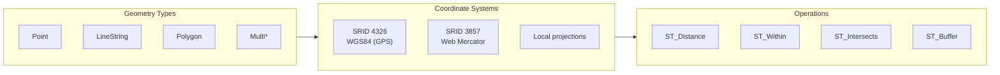

# PostGIS Spatial Patterns

This document covers PostGIS integration for geographic data including spatial types, indexing, common queries, and performance optimization.

## Table of Contents

1. [Overview](#overview)
2. [Installation & Setup](#installation--setup)
3. [Spatial Data Types](#spatial-data-types)
4. [Schema Design](#schema-design)
5. [Spatial Indexing](#spatial-indexing)
6. [Query Patterns](#query-patterns)
7. [Performance Optimization](#performance-optimization)
8. [Common Use Cases](#common-use-cases)

## Overview

### When to Use PostGIS

| Use Case | PostGIS | Alternative |
|----------|---------|-------------|
| Store locations | ✅ Native | Point columns work |
| Distance queries | ✅ Optimized | Can use formulas |
| Polygon/area operations | ✅ Required | Not feasible |
| Route planning | ⚠️ Limited | Dedicated routing |
| Map rendering | ⚠️ Data storage | Map servers |

### Core Concepts



## Installation & Setup

### Install PostGIS

```sql
-- Install PostGIS extension
CREATE EXTENSION IF NOT EXISTS postgis;

-- Optional: Additional extensions
CREATE EXTENSION IF NOT EXISTS postgis_topology;
CREATE EXTENSION IF NOT EXISTS postgis_raster;
CREATE EXTENSION IF NOT EXISTS fuzzystrmatch;  -- For geocoding
CREATE EXTENSION IF NOT EXISTS postgis_tiger_geocoder;

-- Verify installation
SELECT PostGIS_Version();
SELECT PostGIS_Full_Version();
```

### Spatial Reference Systems

```sql
-- Common SRIDs
-- 4326: WGS84 (GPS coordinates, lat/lon in degrees)
-- 3857: Web Mercator (Google Maps, units in meters)
-- Local: State Plane, UTM zones

-- View available SRIDs
SELECT srid, auth_name, auth_srid, srtext
FROM spatial_ref_sys
WHERE auth_name = 'EPSG'
LIMIT 10;

-- Add custom SRID if needed
INSERT INTO spatial_ref_sys (srid, auth_name, auth_srid, srtext, proj4text)
VALUES (900913, 'EPSG', 900913, 'WGS 84 / Pseudo-Mercator', '+proj=merc...');
```

## Spatial Data Types

### Geometry vs Geography

```sql
-- Geometry: Planar coordinates, faster, use for local areas
-- Geography: Spherical coordinates, accurate for global data

-- Geometry column (flat earth math)
CREATE TABLE data.buildings (
    id      uuid PRIMARY KEY DEFAULT uuidv7(),
    name    text NOT NULL,
    location geometry(Point, 4326)  -- 2D point in WGS84
);

-- Geography column (spherical earth math)
CREATE TABLE data.cities (
    id      uuid PRIMARY KEY DEFAULT uuidv7(),
    name    text NOT NULL,
    location geography(Point, 4326)  -- Accurate global distances
);

-- Comparison
-- Geometry: ST_Distance returns units of SRID (degrees for 4326)
-- Geography: ST_Distance returns meters (always accurate)
```

### Geometry Types

```sql
-- Point
SELECT ST_GeomFromText('POINT(-122.4194 37.7749)', 4326);
SELECT ST_MakePoint(-122.4194, 37.7749);  -- Shorthand

-- LineString
SELECT ST_GeomFromText('LINESTRING(-122.4 37.7, -122.5 37.8, -122.6 37.9)', 4326);

-- Polygon
SELECT ST_GeomFromText('POLYGON((-122.4 37.7, -122.5 37.7, -122.5 37.8, -122.4 37.8, -122.4 37.7))', 4326);

-- MultiPoint, MultiLineString, MultiPolygon
SELECT ST_GeomFromText('MULTIPOINT((-122.4 37.7), (-122.5 37.8))', 4326);

-- GeometryCollection
SELECT ST_GeomFromText('GEOMETRYCOLLECTION(POINT(-122.4 37.7), LINESTRING(-122.4 37.7, -122.5 37.8))', 4326);
```

## Schema Design

### Location Table

```sql
CREATE TABLE data.locations (
    id              uuid PRIMARY KEY DEFAULT uuidv7(),
    name            text NOT NULL,
    address         text,

    -- Geographic point (accurate global distances)
    location        geography(Point, 4326) NOT NULL,

    -- Derived columns for convenience
    latitude        double precision GENERATED ALWAYS AS (ST_Y(location::geometry)) STORED,
    longitude       double precision GENERATED ALWAYS AS (ST_X(location::geometry)) STORED,

    created_at      timestamptz NOT NULL DEFAULT now(),
    updated_at      timestamptz NOT NULL DEFAULT now()
);

-- Spatial index
CREATE INDEX locations_location_idx ON data.locations USING gist (location);

-- B-tree indexes for sorting by lat/lon
CREATE INDEX locations_lat_idx ON data.locations (latitude);
CREATE INDEX locations_lon_idx ON data.locations (longitude);
```

### Areas/Regions Table

```sql
CREATE TABLE data.regions (
    id              uuid PRIMARY KEY DEFAULT uuidv7(),
    name            text NOT NULL,
    region_type     text NOT NULL,  -- 'city', 'state', 'country', 'custom'

    -- Polygon boundary
    boundary        geography(Polygon, 4326) NOT NULL,

    -- Cached calculations
    area_sq_km      double precision GENERATED ALWAYS AS (
        ST_Area(boundary::geography) / 1000000
    ) STORED,

    created_at      timestamptz NOT NULL DEFAULT now()
);

CREATE INDEX regions_boundary_idx ON data.regions USING gist (boundary);
```

### Points of Interest

```sql
CREATE TABLE data.pois (
    id              uuid PRIMARY KEY DEFAULT uuidv7(),
    name            text NOT NULL,
    category        text NOT NULL,
    location        geography(Point, 4326) NOT NULL,
    metadata        jsonb NOT NULL DEFAULT '{}',
    created_at      timestamptz NOT NULL DEFAULT now()
);

CREATE INDEX pois_location_idx ON data.pois USING gist (location);
CREATE INDEX pois_category_idx ON data.pois (category);

-- Composite spatial + category index
CREATE INDEX pois_category_location_idx ON data.pois USING gist (location)
    WHERE category IS NOT NULL;
```

## Spatial Indexing

### GiST Index (General)

```sql
-- GiST: Default spatial index, good for most use cases
CREATE INDEX locations_geom_idx ON data.locations USING gist (location);

-- Supports: &&, @, ~, <->, ST_Intersects, ST_Contains, ST_Within, ST_DWithin
```

### SP-GiST Index (Space-Partitioned)

```sql
-- SP-GiST: Better for highly clustered point data
CREATE INDEX locations_spgist_idx ON data.locations USING spgist (location);

-- Good for quad-tree type queries
```

### BRIN Index (Block Range)

```sql
-- BRIN: For very large tables with spatial locality
-- Much smaller than GiST, but less precise
CREATE INDEX locations_brin_idx ON data.locations USING brin (location)
    WITH (pages_per_range = 128);

-- Best when data is physically ordered by location
```

### Index Selection Guide

| Scenario | Index Type | Notes |
|----------|------------|-------|
| General spatial queries | GiST | Default choice |
| Clustered points | SP-GiST | Quad-tree efficient |
| Very large, ordered data | BRIN | Smallest size |
| K-nearest neighbor | GiST | Only GiST supports <-> |

## Query Patterns

### Distance Queries

```sql
-- Find locations within distance (geography - meters)
SELECT id, name, ST_Distance(location, ST_MakePoint(-122.4194, 37.7749)::geography) AS distance_m
FROM data.locations
WHERE ST_DWithin(location, ST_MakePoint(-122.4194, 37.7749)::geography, 5000)  -- 5km
ORDER BY distance_m;

-- K-Nearest Neighbors (KNN)
SELECT id, name, location <-> ST_MakePoint(-122.4194, 37.7749)::geography AS distance
FROM data.locations
ORDER BY location <-> ST_MakePoint(-122.4194, 37.7749)::geography
LIMIT 10;
```

### Containment Queries

```sql
-- Find all POIs within a region
SELECT p.id, p.name, p.category
FROM data.pois p
JOIN data.regions r ON ST_Within(p.location::geometry, r.boundary::geometry)
WHERE r.name = 'San Francisco';

-- Find which region contains a point
SELECT id, name
FROM data.regions
WHERE ST_Contains(boundary::geometry, ST_MakePoint(-122.4194, 37.7749)::geometry);
```

### Intersection Queries

```sql
-- Find regions that intersect with a bounding box
SELECT id, name
FROM data.regions
WHERE ST_Intersects(
    boundary::geometry,
    ST_MakeEnvelope(-122.5, 37.7, -122.3, 37.9, 4326)
);

-- Find overlapping regions
SELECT a.name AS region_a, b.name AS region_b
FROM data.regions a
JOIN data.regions b ON ST_Intersects(a.boundary::geometry, b.boundary::geometry)
WHERE a.id < b.id;  -- Avoid duplicates
```

### API Functions

```sql
-- Find nearby locations
CREATE FUNCTION api.find_nearby_locations(
    in_lat double precision,
    in_lon double precision,
    in_radius_meters integer DEFAULT 1000,
    in_limit integer DEFAULT 20
)
RETURNS TABLE (
    id uuid,
    name text,
    distance_meters double precision,
    latitude double precision,
    longitude double precision
)
LANGUAGE sql
STABLE
SECURITY DEFINER
SET search_path = data, private, pg_temp
AS $$
    SELECT
        id,
        name,
        ST_Distance(location, ST_MakePoint(in_lon, in_lat)::geography) AS distance_meters,
        ST_Y(location::geometry) AS latitude,
        ST_X(location::geometry) AS longitude
    FROM data.locations
    WHERE ST_DWithin(location, ST_MakePoint(in_lon, in_lat)::geography, in_radius_meters)
    ORDER BY location <-> ST_MakePoint(in_lon, in_lat)::geography
    LIMIT in_limit;
$$;

-- Find POIs by category near a point
CREATE FUNCTION api.find_pois_nearby(
    in_lat double precision,
    in_lon double precision,
    in_categories text[],
    in_radius_meters integer DEFAULT 500
)
RETURNS TABLE (
    id uuid,
    name text,
    category text,
    distance_meters double precision
)
LANGUAGE sql
STABLE
SECURITY DEFINER
SET search_path = data, private, pg_temp
AS $$
    SELECT
        id,
        name,
        category,
        ST_Distance(location, ST_MakePoint(in_lon, in_lat)::geography) AS distance_meters
    FROM data.pois
    WHERE ST_DWithin(location, ST_MakePoint(in_lon, in_lat)::geography, in_radius_meters)
      AND (in_categories IS NULL OR category = ANY(in_categories))
    ORDER BY location <-> ST_MakePoint(in_lon, in_lat)::geography;
$$;
```

## Performance Optimization

### Query Optimization

```sql
-- 1. Use ST_DWithin instead of ST_Distance < X
-- ❌ Bad: Calculates distance for all rows
SELECT * FROM data.locations
WHERE ST_Distance(location, ref_point) < 5000;

-- ✅ Good: Uses spatial index
SELECT * FROM data.locations
WHERE ST_DWithin(location, ref_point, 5000);

-- 2. Use && (bounding box) for pre-filtering
SELECT * FROM data.regions
WHERE boundary && ST_MakeEnvelope(-122.5, 37.7, -122.3, 37.9, 4326)
  AND ST_Intersects(boundary::geometry, query_polygon);

-- 3. Avoid coordinate system conversions in WHERE clause
-- ❌ Bad: Converts every row
SELECT * FROM data.locations
WHERE ST_Distance(ST_Transform(location::geometry, 3857), ref_point_3857) < 5000;

-- ✅ Good: Store in target SRID or convert reference point
SELECT * FROM data.locations
WHERE ST_DWithin(location, ST_Transform(ref_point_3857, 4326)::geography, 5000);
```

### Clustering

```sql
-- Cluster table by spatial index (physical reordering)
CLUSTER data.locations USING locations_location_idx;

-- Or use geohash for ordering
ALTER TABLE data.locations ADD COLUMN geohash text
    GENERATED ALWAYS AS (ST_GeoHash(location::geometry, 8)) STORED;

CREATE INDEX locations_geohash_idx ON data.locations (geohash);
```

### Simplification for Large Polygons

```sql
-- Simplify complex geometries for faster queries
UPDATE data.regions
SET boundary_simplified = ST_Simplify(boundary::geometry, 0.001)::geography;

-- Use simplified version for display, original for precise queries
```

## Common Use Cases

### Geofencing

```sql
-- Check if a point is within a geofence
CREATE FUNCTION api.check_geofence(
    in_device_id uuid,
    in_lat double precision,
    in_lon double precision
)
RETURNS TABLE (
    geofence_id uuid,
    geofence_name text,
    is_inside boolean
)
LANGUAGE sql
STABLE
SECURITY DEFINER
SET search_path = data, private, pg_temp
AS $$
    SELECT
        g.id AS geofence_id,
        g.name AS geofence_name,
        ST_Within(
            ST_MakePoint(in_lon, in_lat)::geometry,
            g.boundary::geometry
        ) AS is_inside
    FROM data.geofences g
    WHERE g.device_id = in_device_id
       OR g.is_global = true;
$$;
```

### Store Locator

```sql
CREATE FUNCTION api.find_stores(
    in_lat double precision,
    in_lon double precision,
    in_max_results integer DEFAULT 10
)
RETURNS TABLE (
    store_id uuid,
    store_name text,
    address text,
    distance_km double precision,
    latitude double precision,
    longitude double precision
)
LANGUAGE sql
STABLE
SECURITY DEFINER
SET search_path = data, private, pg_temp
AS $$
    SELECT
        s.id,
        s.name,
        s.address,
        round((ST_Distance(s.location, ST_MakePoint(in_lon, in_lat)::geography) / 1000)::numeric, 2) AS distance_km,
        ST_Y(s.location::geometry),
        ST_X(s.location::geometry)
    FROM data.stores s
    WHERE s.is_active = true
    ORDER BY s.location <-> ST_MakePoint(in_lon, in_lat)::geography
    LIMIT in_max_results;
$$;
```

### Coverage Analysis

```sql
-- Calculate coverage area for service regions
SELECT
    r.name,
    ST_Area(r.boundary::geography) / 1000000 AS area_sq_km,
    (SELECT count(*) FROM data.customers c
     WHERE ST_Within(c.location::geometry, r.boundary::geometry)) AS customers_in_region
FROM data.service_regions r;

-- Find uncovered areas
SELECT ST_AsGeoJSON(
    ST_Difference(
        (SELECT ST_Union(boundary::geometry) FROM data.target_area),
        (SELECT ST_Union(boundary::geometry) FROM data.service_regions)
    )
) AS uncovered_geojson;
```

### Route/Path Storage

```sql
CREATE TABLE data.routes (
    id              uuid PRIMARY KEY DEFAULT uuidv7(),
    name            text NOT NULL,
    path            geography(LineString, 4326) NOT NULL,
    length_km       double precision GENERATED ALWAYS AS (
        ST_Length(path) / 1000
    ) STORED,
    created_at      timestamptz NOT NULL DEFAULT now()
);

-- Find routes passing through a point
SELECT id, name, length_km
FROM data.routes
WHERE ST_DWithin(path, ST_MakePoint(-122.4, 37.7)::geography, 100);  -- 100m buffer
```
