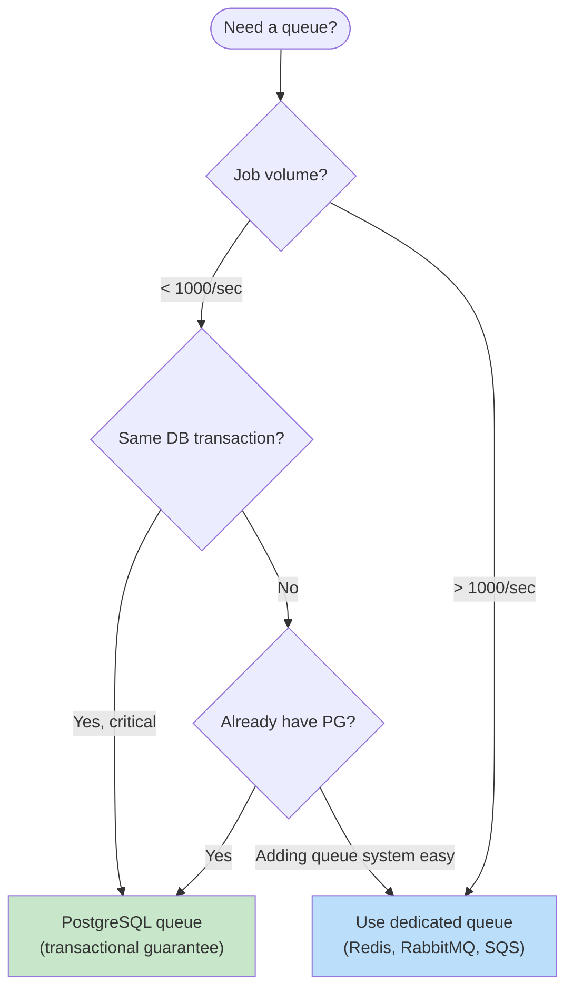

# Database as Queue Patterns

This document covers using PostgreSQL as a job queue including SKIP LOCKED patterns, LISTEN/NOTIFY, competing consumers, and when to use dedicated queue systems.

## Table of Contents

1. [Overview](#overview)
2. [Basic Queue Table](#basic-queue-table)
3. [SKIP LOCKED Pattern](#skip-locked-pattern)
4. [LISTEN/NOTIFY](#listennotify)
5. [Competing Consumers](#competing-consumers)
6. [Retry and Dead Letter](#retry-and-dead-letter)
7. [Scheduled Jobs](#scheduled-jobs)
8. [When to Use Dedicated Queues](#when-to-use-dedicated-queues)

## Overview

### PostgreSQL Queue vs Dedicated Queue

| Feature | PostgreSQL Queue | Redis/RabbitMQ/SQS |
|---------|-----------------|-------------------|
| Transactional | ✅ Same transaction | ❌ Separate system |
| Setup complexity | ✅ Already have PG | ❌ Another service |
| Throughput | ⚠️ Moderate | ✅ High |
| Durability | ✅ Built-in | ⚠️ Configurable |
| Exactly-once | ✅ With SKIP LOCKED | ⚠️ At-least-once |
| Pub/Sub | ⚠️ LISTEN/NOTIFY | ✅ Native |

### When PostgreSQL Queue is Good



## Basic Queue Table

### Queue Table Design

```sql
CREATE TABLE data.job_queue (
    id              uuid PRIMARY KEY DEFAULT uuidv7(),
    queue_name      text NOT NULL DEFAULT 'default',
    job_type        text NOT NULL,
    payload         jsonb NOT NULL,
    status          text NOT NULL DEFAULT 'pending',
    priority        integer NOT NULL DEFAULT 0,

    -- Scheduling
    scheduled_at    timestamptz NOT NULL DEFAULT now(),
    started_at      timestamptz,
    completed_at    timestamptz,

    -- Processing
    worker_id       text,
    attempts        integer NOT NULL DEFAULT 0,
    max_attempts    integer NOT NULL DEFAULT 3,
    last_error      text,

    -- Timestamps
    created_at      timestamptz NOT NULL DEFAULT now(),
    updated_at      timestamptz NOT NULL DEFAULT now(),

    -- Constraints
    CONSTRAINT job_queue_status_check CHECK (
        status IN ('pending', 'processing', 'completed', 'failed', 'dead')
    )
);

-- Indexes for queue operations
CREATE INDEX job_queue_pending_idx ON data.job_queue (queue_name, scheduled_at, priority DESC)
    WHERE status = 'pending';

CREATE INDEX job_queue_processing_idx ON data.job_queue (worker_id, started_at)
    WHERE status = 'processing';

CREATE INDEX job_queue_failed_idx ON data.job_queue (scheduled_at)
    WHERE status = 'failed' AND attempts < max_attempts;
```

### Enqueue Job

```sql
CREATE PROCEDURE api.enqueue_job(
    in_job_type text,
    in_payload jsonb,
    in_queue_name text DEFAULT 'default',
    in_priority integer DEFAULT 0,
    in_scheduled_at timestamptz DEFAULT now(),
    INOUT io_job_id uuid DEFAULT NULL
)
LANGUAGE plpgsql
SECURITY DEFINER
SET search_path = data, private, pg_temp
AS $$
BEGIN
    INSERT INTO data.job_queue (job_type, payload, queue_name, priority, scheduled_at)
    VALUES (in_job_type, in_payload, in_queue_name, in_priority, in_scheduled_at)
    RETURNING id INTO io_job_id;

    -- Notify listeners
    PERFORM pg_notify('job_queue_' || in_queue_name, io_job_id::text);
END;
$$;
```

## SKIP LOCKED Pattern

### Fetch and Lock Job

```sql
CREATE FUNCTION api.fetch_job(
    in_queue_name text DEFAULT 'default',
    in_worker_id text DEFAULT NULL
)
RETURNS TABLE (
    job_id uuid,
    job_type text,
    payload jsonb,
    attempts integer
)
LANGUAGE plpgsql
SECURITY DEFINER
SET search_path = data, private, pg_temp
AS $$
DECLARE
    l_worker_id text := COALESCE(in_worker_id, 'worker_' || pg_backend_pid());
BEGIN
    RETURN QUERY
    WITH claimed AS (
        SELECT j.id
        FROM data.job_queue j
        WHERE j.queue_name = in_queue_name
          AND j.status = 'pending'
          AND j.scheduled_at <= now()
        ORDER BY j.priority DESC, j.scheduled_at
        LIMIT 1
        FOR UPDATE SKIP LOCKED
    )
    UPDATE data.job_queue
    SET status = 'processing',
        worker_id = l_worker_id,
        started_at = now(),
        attempts = attempts + 1,
        updated_at = now()
    FROM claimed
    WHERE job_queue.id = claimed.id
    RETURNING job_queue.id, job_queue.job_type, job_queue.payload, job_queue.attempts;
END;
$$;
```

### Complete Job

```sql
CREATE PROCEDURE api.complete_job(
    in_job_id uuid,
    in_result jsonb DEFAULT NULL
)
LANGUAGE plpgsql
SECURITY DEFINER
SET search_path = data, private, pg_temp
AS $$
BEGIN
    UPDATE data.job_queue
    SET status = 'completed',
        completed_at = now(),
        updated_at = now()
    WHERE id = in_job_id
      AND status = 'processing';

    IF NOT FOUND THEN
        RAISE EXCEPTION 'Job not found or not processing: %', in_job_id
            USING ERRCODE = 'P0002';
    END IF;
END;
$$;
```

### Fail Job

```sql
CREATE PROCEDURE api.fail_job(
    in_job_id uuid,
    in_error text,
    in_retry boolean DEFAULT true
)
LANGUAGE plpgsql
SECURITY DEFINER
SET search_path = data, private, pg_temp
AS $$
DECLARE
    l_job record;
BEGIN
    SELECT * INTO l_job
    FROM data.job_queue
    WHERE id = in_job_id
      AND status = 'processing'
    FOR UPDATE;

    IF NOT FOUND THEN
        RAISE EXCEPTION 'Job not found or not processing: %', in_job_id
            USING ERRCODE = 'P0002';
    END IF;

    IF in_retry AND l_job.attempts < l_job.max_attempts THEN
        -- Retry with exponential backoff
        UPDATE data.job_queue
        SET status = 'pending',
            worker_id = NULL,
            started_at = NULL,
            last_error = in_error,
            scheduled_at = now() + (power(2, l_job.attempts) || ' minutes')::interval,
            updated_at = now()
        WHERE id = in_job_id;
    ELSE
        -- Mark as dead (no more retries)
        UPDATE data.job_queue
        SET status = 'dead',
            last_error = in_error,
            completed_at = now(),
            updated_at = now()
        WHERE id = in_job_id;
    END IF;
END;
$$;
```

### Batch Fetch

```sql
CREATE FUNCTION api.fetch_jobs(
    in_queue_name text DEFAULT 'default',
    in_worker_id text DEFAULT NULL,
    in_batch_size integer DEFAULT 10
)
RETURNS TABLE (
    job_id uuid,
    job_type text,
    payload jsonb
)
LANGUAGE plpgsql
SECURITY DEFINER
SET search_path = data, private, pg_temp
AS $$
DECLARE
    l_worker_id text := COALESCE(in_worker_id, 'worker_' || pg_backend_pid());
BEGIN
    RETURN QUERY
    WITH claimed AS (
        SELECT j.id
        FROM data.job_queue j
        WHERE j.queue_name = in_queue_name
          AND j.status = 'pending'
          AND j.scheduled_at <= now()
        ORDER BY j.priority DESC, j.scheduled_at
        LIMIT in_batch_size
        FOR UPDATE SKIP LOCKED
    )
    UPDATE data.job_queue
    SET status = 'processing',
        worker_id = l_worker_id,
        started_at = now(),
        attempts = attempts + 1,
        updated_at = now()
    FROM claimed
    WHERE job_queue.id = claimed.id
    RETURNING job_queue.id, job_queue.job_type, job_queue.payload;
END;
$$;
```

## LISTEN/NOTIFY

### Real-Time Notifications

```sql
-- Worker listens for new jobs
LISTEN job_queue_default;
LISTEN job_queue_high_priority;

-- Check for notifications (in application)
-- SELECT * FROM pg_notification_queue();

-- Producer notifies on enqueue (already in enqueue_job)
-- PERFORM pg_notify('job_queue_' || queue_name, job_id::text);
```

### Notification Trigger

```sql
CREATE FUNCTION private.job_queue_notify()
RETURNS trigger
LANGUAGE plpgsql
AS $$
BEGIN
    IF NEW.status = 'pending' THEN
        PERFORM pg_notify('job_queue_' || NEW.queue_name, NEW.id::text);
    END IF;
    RETURN NEW;
END;
$$;

CREATE TRIGGER job_queue_notify_trg
    AFTER INSERT OR UPDATE OF status ON data.job_queue
    FOR EACH ROW
    EXECUTE FUNCTION private.job_queue_notify();
```

### Application Pattern (Python Example)

```python
import psycopg
import select

conn = psycopg.connect("postgresql://...")
conn.execute("LISTEN job_queue_default")

while True:
    # Wait for notification or timeout
    if select.select([conn.fileno()], [], [], 5.0) != ([], [], []):
        conn.poll()
        while conn.notifies:
            notify = conn.notifies.pop()
            print(f"New job: {notify.payload}")
            # Process job
            process_job(notify.payload)
    else:
        # Timeout: poll for any missed jobs
        poll_for_jobs()
```

## Competing Consumers

### Multiple Workers

```sql
-- Each worker has unique ID
-- SKIP LOCKED ensures each job is processed by one worker only

-- Worker 1
SELECT * FROM api.fetch_job('default', 'worker-1');

-- Worker 2 (concurrent)
SELECT * FROM api.fetch_job('default', 'worker-2');
-- Gets different job (or nothing if no pending jobs)
```

### Worker Heartbeat

```sql
-- Add heartbeat column
ALTER TABLE data.job_queue ADD COLUMN heartbeat_at timestamptz;

-- Worker updates heartbeat during processing
CREATE PROCEDURE api.heartbeat_job(in_job_id uuid)
LANGUAGE sql
SECURITY DEFINER
SET search_path = data, private, pg_temp
AS $$
    UPDATE data.job_queue
    SET heartbeat_at = now()
    WHERE id = in_job_id AND status = 'processing';
$$;

-- Recover stuck jobs (worker died)
CREATE PROCEDURE private.recover_stuck_jobs(in_timeout interval DEFAULT '5 minutes')
LANGUAGE plpgsql
AS $$
BEGIN
    UPDATE data.job_queue
    SET status = 'pending',
        worker_id = NULL,
        started_at = NULL,
        updated_at = now()
    WHERE status = 'processing'
      AND (heartbeat_at IS NULL OR heartbeat_at < now() - in_timeout)
      AND started_at < now() - in_timeout;

    RAISE NOTICE 'Recovered % stuck jobs', (SELECT count(*) FROM data.job_queue WHERE status = 'pending');
END;
$$;

-- Schedule recovery check
SELECT cron.schedule('recover-stuck-jobs', '*/5 * * * *',
    $$CALL private.recover_stuck_jobs()$$);
```

## Retry and Dead Letter

### Retry Configuration

```sql
-- Per-job retry settings
CREATE TABLE data.job_retry_config (
    job_type        text PRIMARY KEY,
    max_attempts    integer NOT NULL DEFAULT 3,
    backoff_base    interval NOT NULL DEFAULT '1 minute',
    backoff_factor  real NOT NULL DEFAULT 2.0,
    max_backoff     interval NOT NULL DEFAULT '1 hour'
);

-- Default configurations
INSERT INTO data.job_retry_config (job_type, max_attempts, backoff_base)
VALUES
    ('email_send', 5, '30 seconds'),
    ('webhook_call', 3, '1 minute'),
    ('report_generate', 2, '5 minutes');
```

### Calculate Retry Delay

```sql
CREATE FUNCTION private.calculate_retry_delay(
    in_job_type text,
    in_attempt integer
)
RETURNS interval
LANGUAGE sql
STABLE
AS $$
    SELECT LEAST(
        c.backoff_base * power(c.backoff_factor, in_attempt - 1),
        c.max_backoff
    )
    FROM data.job_retry_config c
    WHERE c.job_type = in_job_type
    UNION ALL
    SELECT '1 minute'::interval * power(2, in_attempt - 1)  -- Default
    LIMIT 1;
$$;
```

### Dead Letter Queue

```sql
-- Separate table for dead jobs (keeps main queue lean)
CREATE TABLE data.dead_letter_queue (
    id              uuid PRIMARY KEY,
    queue_name      text NOT NULL,
    job_type        text NOT NULL,
    payload         jsonb NOT NULL,
    attempts        integer NOT NULL,
    last_error      text,
    failed_at       timestamptz NOT NULL DEFAULT now(),
    original_created_at timestamptz NOT NULL
);

-- Move to dead letter
CREATE PROCEDURE private.move_to_dead_letter(in_job_id uuid)
LANGUAGE plpgsql
AS $$
BEGIN
    INSERT INTO data.dead_letter_queue (id, queue_name, job_type, payload, attempts, last_error, original_created_at)
    SELECT id, queue_name, job_type, payload, attempts, last_error, created_at
    FROM data.job_queue
    WHERE id = in_job_id;

    DELETE FROM data.job_queue WHERE id = in_job_id;
END;
$$;

-- Replay dead letter job
CREATE PROCEDURE api.replay_dead_letter(in_job_id uuid)
LANGUAGE plpgsql
SECURITY DEFINER
SET search_path = data, private, pg_temp
AS $$
BEGIN
    INSERT INTO data.job_queue (id, queue_name, job_type, payload, attempts)
    SELECT id, queue_name, job_type, payload, 0
    FROM data.dead_letter_queue
    WHERE id = in_job_id;

    DELETE FROM data.dead_letter_queue WHERE id = in_job_id;
END;
$$;
```

## Scheduled Jobs

### Cron-Style Scheduling

```sql
CREATE TABLE data.scheduled_jobs (
    id              uuid PRIMARY KEY DEFAULT uuidv7(),
    name            text NOT NULL UNIQUE,
    job_type        text NOT NULL,
    payload         jsonb NOT NULL DEFAULT '{}',
    cron_expression text NOT NULL,  -- '0 * * * *' = every hour
    queue_name      text NOT NULL DEFAULT 'default',
    is_active       boolean NOT NULL DEFAULT true,
    last_run_at     timestamptz,
    next_run_at     timestamptz NOT NULL,
    created_at      timestamptz NOT NULL DEFAULT now()
);

CREATE INDEX scheduled_jobs_next_run_idx ON data.scheduled_jobs (next_run_at)
    WHERE is_active = true;
```

### Schedule Executor

```sql
-- Run scheduled jobs that are due
CREATE PROCEDURE private.run_scheduled_jobs()
LANGUAGE plpgsql
AS $$
DECLARE
    l_job record;
    l_job_id uuid;
BEGIN
    FOR l_job IN
        SELECT *
        FROM data.scheduled_jobs
        WHERE is_active = true
          AND next_run_at <= now()
        FOR UPDATE SKIP LOCKED
    LOOP
        -- Enqueue the job
        CALL api.enqueue_job(
            in_job_type := l_job.job_type,
            in_payload := l_job.payload,
            in_queue_name := l_job.queue_name,
            io_job_id := l_job_id
        );

        -- Update next run time (using pg_cron's cron parser or custom)
        UPDATE data.scheduled_jobs
        SET last_run_at = now(),
            next_run_at = private.next_cron_occurrence(l_job.cron_expression)
        WHERE id = l_job.id;
    END LOOP;
END;
$$;

-- Schedule the scheduler (meta!)
SELECT cron.schedule('run-scheduled-jobs', '* * * * *',
    $$CALL private.run_scheduled_jobs()$$);
```

### Delayed Jobs

```sql
-- Enqueue job for future execution
CALL api.enqueue_job(
    in_job_type := 'send_reminder',
    in_payload := '{"user_id": "..."}'::jsonb,
    in_scheduled_at := now() + interval '1 day'
);

-- Enqueue job for specific time
CALL api.enqueue_job(
    in_job_type := 'generate_report',
    in_payload := '{"report_id": "..."}'::jsonb,
    in_scheduled_at := '2024-04-01 09:00:00 UTC'
);
```

## When to Use Dedicated Queues

### Signs You Need a Dedicated Queue

```markdown
1. **High throughput**: > 1000 jobs/second
2. **Complex routing**: Multiple consumers, topic-based routing
3. **Priority queues**: Many priority levels needed
4. **Message patterns**: Pub/sub, fan-out required
5. **External producers**: Non-database systems need to enqueue
6. **Acknowledgment patterns**: Need at-most-once or exactly-once guarantees
```

### Hybrid Approach

```sql
-- Use PostgreSQL for transactional jobs
-- (Must complete with database transaction)
BEGIN;
INSERT INTO data.orders (customer_id, total) VALUES ($1, $2);
CALL api.enqueue_job('send_confirmation', '{"order_id": "..."}'::jsonb);
COMMIT;

-- Use Redis/RabbitMQ for high-volume, non-transactional jobs
-- (Push to external queue from application)
```

### Queue Monitoring

```sql
-- Queue statistics view
CREATE VIEW api.v_queue_stats AS
SELECT
    queue_name,
    status,
    COUNT(*) AS job_count,
    MIN(scheduled_at) AS oldest_job,
    AVG(EXTRACT(EPOCH FROM (now() - scheduled_at))) AS avg_wait_seconds
FROM data.job_queue
WHERE status IN ('pending', 'processing')
GROUP BY queue_name, status

UNION ALL

SELECT
    queue_name,
    'completed_last_hour' AS status,
    COUNT(*) AS job_count,
    NULL AS oldest_job,
    AVG(EXTRACT(EPOCH FROM (completed_at - created_at))) AS avg_processing_seconds
FROM data.job_queue
WHERE status = 'completed'
  AND completed_at > now() - interval '1 hour'
GROUP BY queue_name;

-- Alert on queue backup
CREATE FUNCTION app_monitoring.check_queue_health()
RETURNS TABLE (queue_name text, status text, message text)
LANGUAGE sql
STABLE
AS $$
    SELECT
        queue_name,
        CASE
            WHEN COUNT(*) > 1000 THEN 'CRITICAL'
            WHEN COUNT(*) > 100 THEN 'WARNING'
            ELSE 'OK'
        END,
        format('%s pending jobs, oldest: %s',
            COUNT(*),
            MIN(scheduled_at))
    FROM data.job_queue
    WHERE status = 'pending'
    GROUP BY queue_name;
$$;
```
