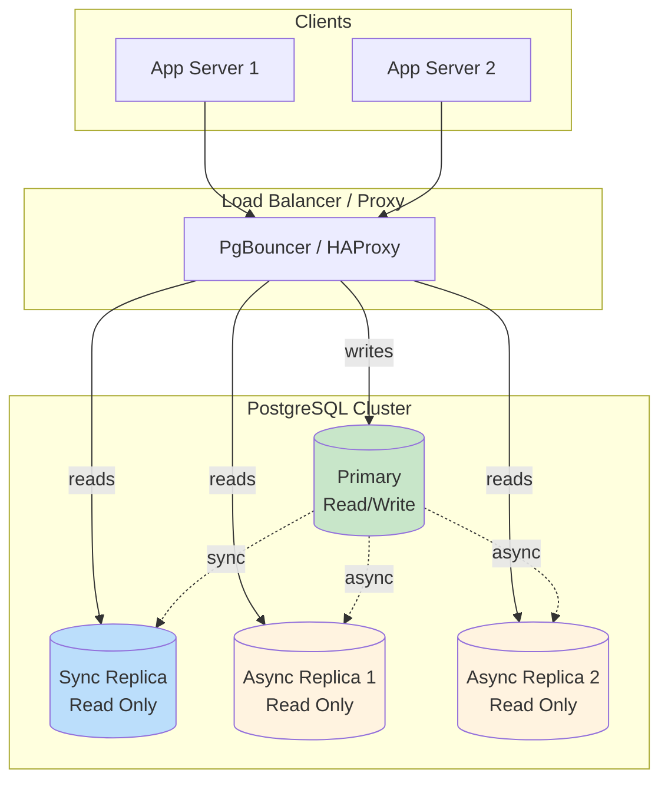

# Replication & High Availability

This document covers PostgreSQL replication strategies including streaming replication, logical replication, and high availability configurations.

## Table of Contents

1. [Overview](#overview)
2. [Streaming Replication](#streaming-replication)
3. [Logical Replication](#logical-replication)
4. [Synchronous Replication](#synchronous-replication)
5. [Read Replica Patterns](#read-replica-patterns)
6. [Failover Strategies](#failover-strategies)
7. [Connection Routing](#connection-routing)
8. [Monitoring Replication](#monitoring-replication)
9. [Common Configurations](#common-configurations)

## Overview

### Replication Types Comparison

| Feature | Streaming Replication | Logical Replication |
|---------|----------------------|---------------------|
| Granularity | Full cluster | Per-table |
| Cross-version | No | Yes |
| Selective tables | No | Yes |
| Write to replica | No | Yes (different tables) |
| Performance | Better | Good |
| Setup complexity | Lower | Higher |
| Use case | HA, read scaling | Data distribution, upgrades |

### High Availability Architecture



## Streaming Replication

### Primary Server Configuration

```sql
-- postgresql.conf on PRIMARY

# Replication settings
wal_level = replica                    # Required for replication
max_wal_senders = 10                   # Max replication connections
wal_keep_size = 1GB                    # WAL to keep for slow replicas
max_replication_slots = 10             # Replication slots

# Optional: Hot standby feedback
hot_standby_feedback = on              # Prevent vacuum conflicts

# Archive settings (for PITR)
archive_mode = on
archive_command = 'cp %p /var/backups/wal/%f'
```

```sql
-- pg_hba.conf on PRIMARY
# Allow replication connections
host replication replicator 10.0.0.0/8 scram-sha-256
host replication replicator replica1.example.com scram-sha-256
```

### Create Replication User

```sql
-- On PRIMARY
CREATE USER replicator WITH REPLICATION ENCRYPTED PASSWORD 'secure_password';

-- Grant necessary permissions
GRANT pg_read_all_data TO replicator;
```

### Create Replication Slot

```sql
-- On PRIMARY: Create slot to prevent WAL removal
SELECT pg_create_physical_replication_slot('replica1_slot');

-- View slots
SELECT slot_name, slot_type, active, restart_lsn
FROM pg_replication_slots;
```

### Setup Replica Server

```bash
# On REPLICA: Stop PostgreSQL
sudo systemctl stop postgresql

# Remove existing data
sudo rm -rf /var/lib/postgresql/data/*

# Base backup from primary
pg_basebackup \
    -h primary.example.com \
    -U replicator \
    -D /var/lib/postgresql/data \
    -P \
    --wal-method=stream \
    --slot=replica1_slot \
    --write-recovery-conf

# Fix ownership
sudo chown -R postgres:postgres /var/lib/postgresql/data

# Start PostgreSQL
sudo systemctl start postgresql
```

### Replica Configuration

```sql
-- postgresql.conf on REPLICA

# Standby settings
hot_standby = on                       # Allow read queries
primary_conninfo = 'host=primary.example.com port=5432 user=replicator password=secure_password'
primary_slot_name = 'replica1_slot'

# Performance tuning
max_standby_streaming_delay = 30s      # Max delay before canceling queries
max_standby_archive_delay = 300s       # Max delay for archive recovery
wal_receiver_timeout = 60s             # Timeout for WAL receiver
```

### Verify Replication

```sql
-- On PRIMARY: Check replication status
SELECT
    client_addr,
    state,
    sent_lsn,
    write_lsn,
    flush_lsn,
    replay_lsn,
    sync_state
FROM pg_stat_replication;

-- On REPLICA: Check standby status
SELECT
    pg_is_in_recovery() AS is_replica,
    pg_last_wal_receive_lsn() AS receive_lsn,
    pg_last_wal_replay_lsn() AS replay_lsn,
    pg_last_xact_replay_timestamp() AS last_replay_time,
    now() - pg_last_xact_replay_timestamp() AS replication_lag;
```

## Logical Replication

### Publisher Configuration

```sql
-- postgresql.conf on PUBLISHER
wal_level = logical
max_replication_slots = 10
max_wal_senders = 10
```

### Create Publication

```sql
-- On PUBLISHER: Create publication for specific tables
CREATE PUBLICATION my_publication
    FOR TABLE data.orders, data.customers;

-- Or for all tables in schema
CREATE PUBLICATION my_publication
    FOR TABLES IN SCHEMA data;

-- Or for all tables
CREATE PUBLICATION my_publication
    FOR ALL TABLES;

-- With options
CREATE PUBLICATION my_publication
    FOR TABLE data.orders, data.customers
    WITH (publish = 'insert, update, delete');

-- View publications
SELECT * FROM pg_publication;
SELECT * FROM pg_publication_tables;
```

### Subscriber Configuration

```sql
-- On SUBSCRIBER: Create the tables first (same structure)
-- Tables must exist before subscription

-- Create subscription
CREATE SUBSCRIPTION my_subscription
    CONNECTION 'host=publisher.example.com port=5432 dbname=mydb user=replicator password=xxx'
    PUBLICATION my_publication;

-- With options
CREATE SUBSCRIPTION my_subscription
    CONNECTION 'host=publisher.example.com port=5432 dbname=mydb user=replicator password=xxx'
    PUBLICATION my_publication
    WITH (
        copy_data = true,           -- Initial data sync
        create_slot = true,         -- Create replication slot
        enabled = true,             -- Start immediately
        synchronous_commit = 'off'  -- Performance tuning
    );

-- View subscriptions
SELECT * FROM pg_subscription;
SELECT * FROM pg_stat_subscription;
```

### Manage Logical Replication

```sql
-- Add table to publication
ALTER PUBLICATION my_publication ADD TABLE data.new_table;

-- Remove table from publication
ALTER PUBLICATION my_publication DROP TABLE data.old_table;

-- Refresh subscription (after adding tables)
ALTER SUBSCRIPTION my_subscription REFRESH PUBLICATION;

-- Disable/enable subscription
ALTER SUBSCRIPTION my_subscription DISABLE;
ALTER SUBSCRIPTION my_subscription ENABLE;

-- Drop subscription
DROP SUBSCRIPTION my_subscription;
```

### Logical Replication for Zero-Downtime Upgrades

```sql
-- Step 1: Setup logical replication from old to new version
-- On NEW (subscriber)
CREATE SUBSCRIPTION upgrade_sub
    CONNECTION 'host=old-server dbname=mydb user=replicator password=xxx'
    PUBLICATION all_tables;

-- Step 2: Wait for initial sync
SELECT * FROM pg_stat_subscription;
-- Wait until srsubstate = 'r' (ready) for all tables

-- Step 3: Verify data sync
-- Compare row counts between old and new

-- Step 4: Switch applications to new server

-- Step 5: Drop subscription and publication
-- On NEW
DROP SUBSCRIPTION upgrade_sub;
-- On OLD
DROP PUBLICATION all_tables;
```

## Synchronous Replication

### Configure Synchronous Standby

```sql
-- postgresql.conf on PRIMARY

# Synchronous replication
synchronous_standby_names = 'FIRST 1 (replica1, replica2)'
synchronous_commit = on

# Options:
# 'replica1'                     - Specific standby
# 'FIRST 1 (r1, r2, r3)'        - First to respond
# 'ANY 2 (r1, r2, r3)'          - Any 2 must confirm
# '*'                            - Any standby
```

### Synchronous Commit Levels

```sql
-- Per-transaction override
SET synchronous_commit = 'off';         -- No durability (fastest)
SET synchronous_commit = 'local';       -- Local WAL flush only
SET synchronous_commit = 'remote_write';-- Remote received
SET synchronous_commit = 'on';          -- Remote WAL flush (default)
SET synchronous_commit = 'remote_apply';-- Remote WAL applied

-- For specific transactions
BEGIN;
SET LOCAL synchronous_commit = 'remote_apply';
INSERT INTO critical_data ...;
COMMIT;
```

### Application Name for Sync Identification

```sql
-- On REPLICA: Set application name
-- primary_conninfo in postgresql.conf or recovery.conf
primary_conninfo = 'host=primary port=5432 user=replicator application_name=replica1'

-- Or via connection string
-- postgresql://replicator@primary:5432/mydb?application_name=replica1
```

## Read Replica Patterns

### Query Routing in Application

```sql
-- API function that reads from replica
CREATE FUNCTION api.select_orders_readonly(in_customer_id uuid)
RETURNS TABLE (
    id uuid,
    total numeric,
    created_at timestamptz
)
LANGUAGE sql
STABLE
SECURITY DEFINER
SET search_path = data, private, pg_temp
AS $$
    -- This function can run on replica
    SELECT id, total, created_at
    FROM data.orders
    WHERE customer_id = in_customer_id
    ORDER BY created_at DESC;
$$;
```

### Handle Replication Lag

```sql
-- Check acceptable lag before querying replica
CREATE FUNCTION api.select_with_lag_check(
    in_max_lag_seconds integer DEFAULT 5
)
RETURNS TABLE (...)
LANGUAGE plpgsql
STABLE
SECURITY DEFINER
SET search_path = data, private, pg_temp
AS $$
DECLARE
    l_lag interval;
BEGIN
    -- Check replication lag
    SELECT now() - pg_last_xact_replay_timestamp()
    INTO l_lag;

    IF l_lag > make_interval(secs := in_max_lag_seconds) THEN
        RAISE EXCEPTION 'Replication lag too high: %', l_lag
            USING ERRCODE = 'P0001';
    END IF;

    RETURN QUERY SELECT ...;
END;
$$;
```

### Read Your Own Writes Pattern

```sql
-- Track last write LSN for session
CREATE TABLE private.session_write_lsn (
    session_id text PRIMARY KEY,
    last_lsn pg_lsn NOT NULL,
    updated_at timestamptz NOT NULL DEFAULT now()
);

-- After write on primary
CREATE FUNCTION private.record_write_lsn()
RETURNS trigger
LANGUAGE plpgsql
AS $$
BEGIN
    INSERT INTO private.session_write_lsn (session_id, last_lsn)
    VALUES (current_setting('app.session_id'), pg_current_wal_lsn())
    ON CONFLICT (session_id) DO UPDATE
    SET last_lsn = EXCLUDED.last_lsn, updated_at = now();
    RETURN NULL;
END;
$$;

-- On replica: wait for LSN before reading
CREATE FUNCTION api.wait_for_lsn(in_session_id text, in_timeout_ms integer DEFAULT 5000)
RETURNS boolean
LANGUAGE plpgsql
AS $$
DECLARE
    l_target_lsn pg_lsn;
BEGIN
    -- Get target LSN from session tracking
    SELECT last_lsn INTO l_target_lsn
    FROM private.session_write_lsn
    WHERE session_id = in_session_id;

    IF l_target_lsn IS NULL THEN
        RETURN true;  -- No write to wait for
    END IF;

    -- Wait for replay to catch up
    RETURN pg_wal_replay_wait(l_target_lsn, in_timeout_ms);
END;
$$;
```

## Failover Strategies

### Manual Failover

```sql
-- On REPLICA: Promote to primary
SELECT pg_promote();

-- Or via command line
pg_ctl promote -D /var/lib/postgresql/data

-- Or create trigger file (legacy)
-- touch /var/lib/postgresql/data/standby.signal
```

### Automatic Failover with Patroni

```yaml
# patroni.yml
scope: postgres-cluster
name: node1

restapi:
  listen: 0.0.0.0:8008
  connect_address: node1.example.com:8008

etcd:
  hosts: etcd1:2379,etcd2:2379,etcd3:2379

bootstrap:
  dcs:
    ttl: 30
    loop_wait: 10
    retry_timeout: 10
    maximum_lag_on_failover: 1048576
    postgresql:
      use_pg_rewind: true
      parameters:
        wal_level: replica
        hot_standby: on
        max_wal_senders: 10
        max_replication_slots: 10

  initdb:
    - encoding: UTF8
    - data-checksums

postgresql:
  listen: 0.0.0.0:5432
  connect_address: node1.example.com:5432
  data_dir: /var/lib/postgresql/data
  authentication:
    superuser:
      username: postgres
      password: xxx
    replication:
      username: replicator
      password: xxx
```

### Repmgr Failover

```bash
# repmgr.conf
node_id=1
node_name='node1'
conninfo='host=node1.example.com user=repmgr dbname=repmgr'
data_directory='/var/lib/postgresql/data'
failover='automatic'
promote_command='/usr/bin/repmgr standby promote -f /etc/repmgr.conf'
follow_command='/usr/bin/repmgr standby follow -f /etc/repmgr.conf'
```

### Failover Checklist

```markdown
## Failover Procedure

### Pre-Failover
- [ ] Verify primary is truly unavailable
- [ ] Check replica sync status
- [ ] Notify stakeholders

### Failover Steps
1. [ ] Promote replica to primary
   ```sql
   SELECT pg_promote();
   ```

2. [ ] Update connection strings/DNS
3. [ ] Verify new primary accepts writes
4. [ ] Update monitoring

### Post-Failover
- [ ] Investigate old primary failure
- [ ] Rebuild old primary as replica (if recoverable)
- [ ] Update documentation
- [ ] Post-mortem report
```

## Connection Routing

### HAProxy Configuration

```
# haproxy.cfg
global
    maxconn 1000

defaults
    mode tcp
    timeout connect 10s
    timeout client 30m
    timeout server 30m

listen postgres-primary
    bind *:5432
    option httpchk GET /primary
    http-check expect status 200
    default-server inter 3s fall 3 rise 2 on-marked-down shutdown-sessions
    server node1 node1:5432 check port 8008
    server node2 node2:5432 check port 8008
    server node3 node3:5432 check port 8008

listen postgres-replica
    bind *:5433
    balance roundrobin
    option httpchk GET /replica
    http-check expect status 200
    default-server inter 3s fall 3 rise 2
    server node1 node1:5432 check port 8008
    server node2 node2:5432 check port 8008
    server node3 node3:5432 check port 8008
```

### PgBouncer with Multiple Databases

```ini
# pgbouncer.ini
[databases]
# Write database (primary)
mydb = host=primary.example.com port=5432 dbname=mydb

# Read database (replica)
mydb_ro = host=replica.example.com port=5432 dbname=mydb

[pgbouncer]
listen_port = 6432
listen_addr = *
auth_type = scram-sha-256
auth_file = /etc/pgbouncer/userlist.txt
pool_mode = transaction
max_client_conn = 1000
default_pool_size = 20
```

### Application Connection String

```python
# Python example with read/write splitting
import psycopg

# Write connection
write_conn = psycopg.connect(
    "host=pgbouncer port=6432 dbname=mydb user=app"
)

# Read connection (to replica)
read_conn = psycopg.connect(
    "host=pgbouncer port=6432 dbname=mydb_ro user=app"
)

# Or using target_session_attrs
auto_conn = psycopg.connect(
    "host=node1,node2,node3 port=5432 dbname=mydb target_session_attrs=read-write"
)
```

## Monitoring Replication

### Replication Lag Monitoring

```sql
-- On PRIMARY: Check all replicas
SELECT
    application_name,
    client_addr,
    state,
    sync_state,
    pg_wal_lsn_diff(pg_current_wal_lsn(), replay_lsn) AS replay_lag_bytes,
    pg_wal_lsn_diff(pg_current_wal_lsn(), flush_lsn) AS flush_lag_bytes,
    pg_wal_lsn_diff(pg_current_wal_lsn(), write_lsn) AS write_lag_bytes
FROM pg_stat_replication;

-- On REPLICA: Check lag
SELECT
    CASE
        WHEN pg_last_wal_receive_lsn() = pg_last_wal_replay_lsn() THEN 0
        ELSE EXTRACT(EPOCH FROM now() - pg_last_xact_replay_timestamp())
    END AS lag_seconds;
```

### Create Monitoring View

```sql
CREATE VIEW api.v_replication_status AS
SELECT
    'primary' AS role,
    NULL AS receive_lsn,
    pg_current_wal_lsn() AS current_lsn,
    NULL AS replay_lsn,
    NULL AS lag_seconds
WHERE NOT pg_is_in_recovery()

UNION ALL

SELECT
    'replica' AS role,
    pg_last_wal_receive_lsn() AS receive_lsn,
    NULL AS current_lsn,
    pg_last_wal_replay_lsn() AS replay_lsn,
    EXTRACT(EPOCH FROM now() - pg_last_xact_replay_timestamp()) AS lag_seconds
WHERE pg_is_in_recovery();
```

### Alerting on Replication Issues

```sql
-- Function to check replication health
CREATE FUNCTION app_monitoring.check_replication_health()
RETURNS TABLE (
    check_name text,
    status text,
    message text
)
LANGUAGE plpgsql
AS $$
BEGIN
    -- Check if primary
    IF NOT pg_is_in_recovery() THEN
        -- Check connected replicas
        RETURN QUERY
        SELECT
            'replica_connected'::text,
            CASE WHEN count(*) > 0 THEN 'OK' ELSE 'WARNING' END,
            format('%s replicas connected', count(*))
        FROM pg_stat_replication;

        -- Check for lagging replicas
        RETURN QUERY
        SELECT
            'replica_lag'::text,
            CASE
                WHEN max(pg_wal_lsn_diff(pg_current_wal_lsn(), replay_lsn)) > 100000000
                THEN 'CRITICAL'
                WHEN max(pg_wal_lsn_diff(pg_current_wal_lsn(), replay_lsn)) > 10000000
                THEN 'WARNING'
                ELSE 'OK'
            END,
            format('Max lag: %s bytes', max(pg_wal_lsn_diff(pg_current_wal_lsn(), replay_lsn)))
        FROM pg_stat_replication;
    ELSE
        -- Check replica lag
        RETURN QUERY
        SELECT
            'replication_lag'::text,
            CASE
                WHEN extract(epoch from now() - pg_last_xact_replay_timestamp()) > 60
                THEN 'CRITICAL'
                WHEN extract(epoch from now() - pg_last_xact_replay_timestamp()) > 10
                THEN 'WARNING'
                ELSE 'OK'
            END,
            format('Lag: %s seconds',
                round(extract(epoch from now() - pg_last_xact_replay_timestamp())::numeric, 2));
    END IF;
END;
$$;
```

## Common Configurations

### Two-Node HA (Async)

```
Primary <--(async)--> Replica (hot standby)

- Simple setup
- Potential data loss on failover
- Use for non-critical data
```

### Three-Node HA (Sync)

```
Primary <--(sync)--> Sync Replica
    ^
    |
    └--(async)--> Async Replica

- No data loss with sync replica
- Async replica for read scaling
- Use for critical data
```

### Multi-Region

```
Region A:
  Primary <--(sync)--> Local Replica

Region B:
  Primary(A) <--(async)--> DR Replica

- Local sync for zero data loss
- Async to DR for disaster recovery
- Accept lag for cross-region
```

### Read Scaling

```
Primary
    |
    ├--(async)--> Replica 1 (reads)
    ├--(async)--> Replica 2 (reads)
    └--(async)--> Replica 3 (reporting)

- Multiple replicas for read load
- Dedicated replica for heavy queries
- Load balancer distributes reads
```
