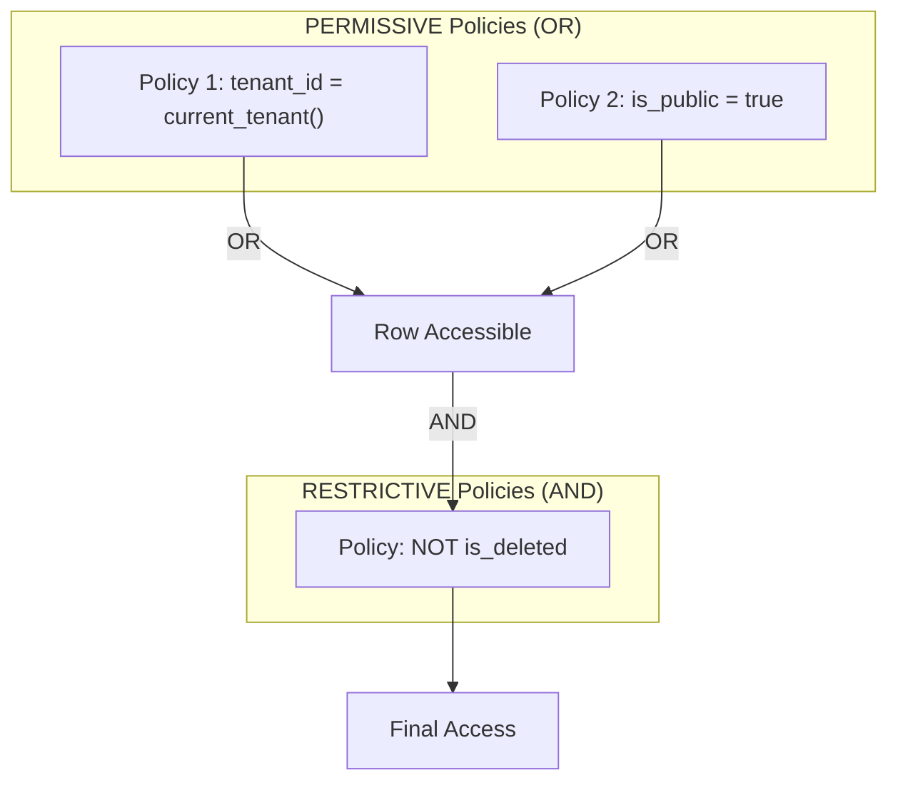
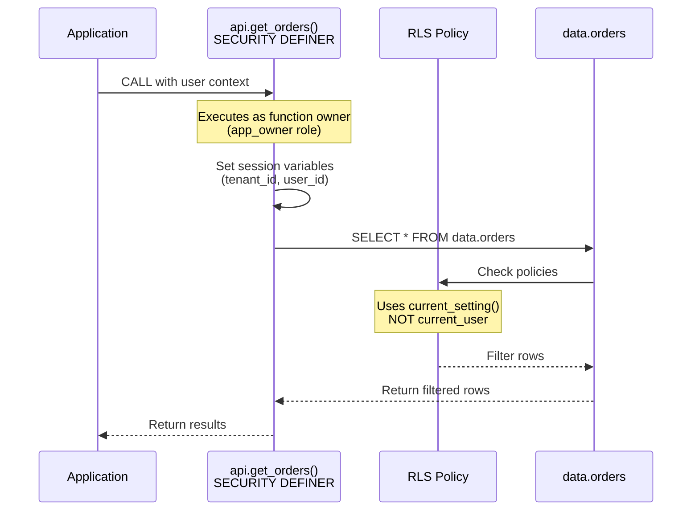

# Row-Level Security (RLS) Patterns

Row-Level Security provides fine-grained access control at the row level, complementing our schema separation pattern. This document covers multi-tenant isolation, user-specific access, and integration with SECURITY DEFINER functions.

## Table of Contents

1. [RLS Fundamentals](#rls-fundamentals)
2. [Multi-Tenant Patterns](#multi-tenant-patterns)
3. [User-Specific Access](#user-specific-access)
4. [RLS with SECURITY DEFINER](#rls-with-security-definer)
5. [Policy Patterns](#policy-patterns)
6. [Performance Considerations](#performance-considerations)
7. [Testing RLS](#testing-rls)
8. [Common Pitfalls](#common-pitfalls)

## RLS Fundamentals

### Enabling RLS

```sql
-- Enable RLS on a table
ALTER TABLE data.orders ENABLE ROW LEVEL SECURITY;

-- Force RLS for table owner too (important for testing)
ALTER TABLE data.orders FORCE ROW LEVEL SECURITY;

-- Check RLS status
SELECT 
    tablename,
    rowsecurity,
    forcerowsecurity
FROM pg_tables
WHERE schemaname = 'data';
```

### Basic Policy Structure

```sql
-- Policy syntax
CREATE POLICY policy_name
    ON schema.table
    AS {PERMISSIVE | RESTRICTIVE}  -- Default: PERMISSIVE
    FOR {ALL | SELECT | INSERT | UPDATE | DELETE}
    TO {role_name | PUBLIC | CURRENT_USER}
    USING (condition_for_existing_rows)      -- For SELECT, UPDATE, DELETE
    WITH CHECK (condition_for_new_rows);     -- For INSERT, UPDATE
```

### Policy Types



```sql
-- Multiple PERMISSIVE policies are OR'd together
-- RESTRICTIVE policies are AND'd with the result

-- Example: User can see own data OR public data
CREATE POLICY see_own_data ON data.documents
    AS PERMISSIVE
    FOR SELECT
    USING (owner_id = current_user_id());

CREATE POLICY see_public_data ON data.documents
    AS PERMISSIVE
    FOR SELECT
    USING (is_public = true);

-- Must also pass: not deleted (RESTRICTIVE)
CREATE POLICY hide_deleted ON data.documents
    AS RESTRICTIVE
    FOR SELECT
    USING (NOT is_deleted);
```

## Multi-Tenant Patterns

### Session-Based Tenant Context

```sql
-- Set tenant context at connection/transaction start
CREATE OR REPLACE FUNCTION private.set_tenant(in_tenant_id uuid)
RETURNS void
LANGUAGE plpgsql
AS $$
BEGIN
    PERFORM set_config('app.current_tenant_id', in_tenant_id::text, false);
END;
$$;

-- Get current tenant (used in policies)
CREATE OR REPLACE FUNCTION private.current_tenant_id()
RETURNS uuid
LANGUAGE sql
STABLE
AS $$
    SELECT NULLIF(current_setting('app.current_tenant_id', true), '')::uuid;
$$;

-- Tables with tenant_id
CREATE TABLE data.customers (
    id          uuid PRIMARY KEY DEFAULT uuidv7(),
    tenant_id   uuid NOT NULL,
    email       text NOT NULL,
    name        text NOT NULL,
    created_at  timestamptz NOT NULL DEFAULT now()
);

-- Enable RLS
ALTER TABLE data.customers ENABLE ROW LEVEL SECURITY;
ALTER TABLE data.customers FORCE ROW LEVEL SECURITY;

-- Tenant isolation policy
CREATE POLICY tenant_isolation ON data.customers
    FOR ALL
    USING (tenant_id = private.current_tenant_id())
    WITH CHECK (tenant_id = private.current_tenant_id());

-- Index for policy performance
CREATE INDEX customers_tenant_idx ON data.customers(tenant_id);
```

### API Functions with Tenant Context

```sql
-- Option 1: Tenant passed explicitly
CREATE FUNCTION api.get_customer(in_tenant_id uuid, in_customer_id uuid)
RETURNS TABLE (id uuid, email text, name text)
LANGUAGE plpgsql
STABLE
SECURITY DEFINER
SET search_path = data, private, pg_temp
AS $$
BEGIN
    -- Set tenant context for RLS
    PERFORM set_config('app.current_tenant_id', in_tenant_id::text, true);
    
    RETURN QUERY
    SELECT c.id, c.email, c.name
    FROM data.customers c
    WHERE c.id = in_customer_id;
    -- RLS automatically filters by tenant_id
END;
$$;

-- Option 2: Tenant from session (set by connection middleware)
CREATE FUNCTION api.get_customer(in_customer_id uuid)
RETURNS TABLE (id uuid, email text, name text)
LANGUAGE sql
STABLE
SECURITY DEFINER
SET search_path = data, private, pg_temp
AS $$
    SELECT id, email, name
    FROM data.customers
    WHERE id = in_customer_id;
    -- RLS uses current_setting('app.current_tenant_id')
$$;
```

### Tenant Hierarchy (Parent/Child Tenants)

```sql
-- Tenant table with hierarchy
CREATE TABLE data.tenants (
    id          uuid PRIMARY KEY DEFAULT uuidv7(),
    parent_id   uuid REFERENCES data.tenants(id),
    name        text NOT NULL,
    is_active   boolean NOT NULL DEFAULT true
);

-- Function to get accessible tenant IDs (self + children)
CREATE OR REPLACE FUNCTION private.accessible_tenant_ids()
RETURNS uuid[]
LANGUAGE sql
STABLE
AS $$
    WITH RECURSIVE tenant_tree AS (
        SELECT id FROM data.tenants 
        WHERE id = private.current_tenant_id()
        
        UNION ALL
        
        SELECT t.id FROM data.tenants t
        JOIN tenant_tree tt ON t.parent_id = tt.id
    )
    SELECT array_agg(id) FROM tenant_tree;
$$;

-- Policy allowing access to child tenant data
CREATE POLICY tenant_hierarchy ON data.orders
    FOR SELECT
    USING (tenant_id = ANY(private.accessible_tenant_ids()));
```

## User-Specific Access

### Basic User Ownership

```sql
CREATE TABLE data.documents (
    id          uuid PRIMARY KEY DEFAULT uuidv7(),
    owner_id    uuid NOT NULL REFERENCES data.users(id),
    title       text NOT NULL,
    content     text,
    is_public   boolean NOT NULL DEFAULT false,
    created_at  timestamptz NOT NULL DEFAULT now()
);

ALTER TABLE data.documents ENABLE ROW LEVEL SECURITY;

-- Get current user from session
CREATE OR REPLACE FUNCTION private.current_user_id()
RETURNS uuid
LANGUAGE sql
STABLE
AS $$
    SELECT NULLIF(current_setting('app.current_user_id', true), '')::uuid;
$$;

-- Owner can do everything
CREATE POLICY owner_all ON data.documents
    FOR ALL
    USING (owner_id = private.current_user_id())
    WITH CHECK (owner_id = private.current_user_id());

-- Anyone can read public documents
CREATE POLICY public_read ON data.documents
    FOR SELECT
    USING (is_public = true);
```

### Role-Based Access

```sql
-- Users table with role
CREATE TABLE data.users (
    id          uuid PRIMARY KEY DEFAULT uuidv7(),
    tenant_id   uuid NOT NULL,
    email       text NOT NULL,
    role        text NOT NULL DEFAULT 'user',  -- 'admin', 'manager', 'user'
    created_at  timestamptz NOT NULL DEFAULT now()
);

-- Get current user's role
CREATE OR REPLACE FUNCTION private.current_user_role()
RETURNS text
LANGUAGE sql
STABLE
AS $$
    SELECT role FROM data.users WHERE id = private.current_user_id();
$$;

-- Admins can see all within tenant
CREATE POLICY admin_all ON data.orders
    FOR ALL
    USING (
        tenant_id = private.current_tenant_id()
        AND private.current_user_role() = 'admin'
    );

-- Managers can see their team's orders
CREATE POLICY manager_team ON data.orders
    FOR SELECT
    USING (
        tenant_id = private.current_tenant_id()
        AND private.current_user_role() = 'manager'
        AND created_by IN (
            SELECT id FROM data.users 
            WHERE manager_id = private.current_user_id()
        )
    );

-- Users can only see own orders
CREATE POLICY user_own ON data.orders
    FOR ALL
    USING (
        tenant_id = private.current_tenant_id()
        AND created_by = private.current_user_id()
    )
    WITH CHECK (
        tenant_id = private.current_tenant_id()
        AND created_by = private.current_user_id()
    );
```

### Shared Access (Many-to-Many)

```sql
-- Document sharing table
CREATE TABLE data.document_shares (
    document_id uuid NOT NULL REFERENCES data.documents(id) ON DELETE CASCADE,
    user_id     uuid NOT NULL REFERENCES data.users(id) ON DELETE CASCADE,
    permission  text NOT NULL DEFAULT 'read',  -- 'read', 'write', 'admin'
    created_at  timestamptz NOT NULL DEFAULT now(),
    PRIMARY KEY (document_id, user_id)
);

-- Policy: owner OR shared with me
CREATE POLICY can_read ON data.documents
    FOR SELECT
    USING (
        owner_id = private.current_user_id()
        OR is_public = true
        OR EXISTS (
            SELECT 1 FROM data.document_shares
            WHERE document_id = documents.id
              AND user_id = private.current_user_id()
        )
    );

-- Policy: owner OR shared with write permission
CREATE POLICY can_write ON data.documents
    FOR UPDATE
    USING (
        owner_id = private.current_user_id()
        OR EXISTS (
            SELECT 1 FROM data.document_shares
            WHERE document_id = documents.id
              AND user_id = private.current_user_id()
              AND permission IN ('write', 'admin')
        )
    );
```

## RLS with SECURITY DEFINER

### Understanding the Interaction



### Key Insight: RLS Context

With `SECURITY DEFINER`:
- The query runs as the **function owner** (e.g., `app_owner`)
- RLS policies should use **session variables**, not `current_user`
- Policies checking `current_user` will see the function owner, not the actual user!

```sql
-- WRONG: Uses current_user (will be function owner)
CREATE POLICY wrong_policy ON data.orders
    FOR SELECT
    USING (created_by = current_user);  -- ❌ Returns function owner!

-- CORRECT: Uses session variable
CREATE POLICY correct_policy ON data.orders
    FOR SELECT
    USING (created_by = private.current_user_id());  -- ✅ Returns actual user
```

### Bypassing RLS for Administrative Functions

```sql
-- Some functions need to bypass RLS (e.g., admin reports)
-- Use SECURITY DEFINER + function owner has BYPASSRLS

-- Create a special role with BYPASSRLS
CREATE ROLE app_admin NOLOGIN BYPASSRLS;
GRANT app_admin TO app_owner;

-- Admin function that bypasses RLS
CREATE FUNCTION api.admin_get_all_orders(in_tenant_id uuid)
RETURNS TABLE (id uuid, customer_name text, total numeric)
LANGUAGE plpgsql
SECURITY DEFINER
SET search_path = data, private, pg_temp
SET ROLE = app_admin  -- Switch to role with BYPASSRLS
AS $$
BEGIN
    -- Verify caller is admin
    IF NOT private.is_current_user_admin() THEN
        RAISE EXCEPTION 'Unauthorized' USING ERRCODE = 'P0050';
    END IF;
    
    RETURN QUERY
    SELECT o.id, c.name, o.total
    FROM data.orders o
    JOIN data.customers c ON c.id = o.customer_id
    WHERE o.tenant_id = in_tenant_id;  -- Manual filter, RLS bypassed
END;
$$;
```

## Policy Patterns

### Soft Delete with RLS

```sql
-- Add deleted flag
ALTER TABLE data.customers ADD COLUMN deleted_at timestamptz;

-- Restrictive policy hides deleted rows
CREATE POLICY hide_deleted ON data.customers
    AS RESTRICTIVE
    FOR SELECT
    USING (deleted_at IS NULL);

-- Soft delete procedure
CREATE PROCEDURE api.delete_customer(in_customer_id uuid)
LANGUAGE plpgsql
SECURITY DEFINER
SET search_path = data, private, pg_temp
AS $$
BEGIN
    UPDATE data.customers
    SET deleted_at = now()
    WHERE id = in_customer_id
      AND tenant_id = private.current_tenant_id();  -- RLS would also enforce this
END;
$$;

-- Admin function to see deleted records
CREATE FUNCTION api.admin_list_deleted_customers()
RETURNS TABLE (id uuid, email text, deleted_at timestamptz)
LANGUAGE plpgsql
SECURITY DEFINER
SET search_path = data, private, pg_temp
SET ROLE = app_admin
AS $$
BEGIN
    -- Bypasses RLS, can see deleted_at IS NOT NULL
    RETURN QUERY
    SELECT c.id, c.email, c.deleted_at
    FROM data.customers c
    WHERE c.tenant_id = private.current_tenant_id()
      AND c.deleted_at IS NOT NULL;
END;
$$;
```

### Time-Based Access

```sql
-- Documents with expiration
CREATE TABLE data.shared_links (
    id          uuid PRIMARY KEY DEFAULT uuidv7(),
    document_id uuid NOT NULL REFERENCES data.documents(id),
    token       text NOT NULL UNIQUE,
    expires_at  timestamptz NOT NULL,
    created_at  timestamptz NOT NULL DEFAULT now()
);

-- Policy: only non-expired links
CREATE POLICY valid_links ON data.shared_links
    FOR SELECT
    USING (expires_at > now());

-- Access via link token
CREATE FUNCTION api.get_document_by_link(in_token text)
RETURNS TABLE (id uuid, title text, content text)
LANGUAGE sql
STABLE
SECURITY DEFINER
SET search_path = data, private, pg_temp
AS $$
    SELECT d.id, d.title, d.content
    FROM data.documents d
    JOIN data.shared_links sl ON sl.document_id = d.id
    WHERE sl.token = in_token;
    -- RLS on shared_links filters expired automatically
$$;
```

### IP-Based Restrictions

```sql
-- Store allowed IPs per tenant
CREATE TABLE data.tenant_allowed_ips (
    tenant_id   uuid NOT NULL REFERENCES data.tenants(id),
    ip_range    inet NOT NULL,
    PRIMARY KEY (tenant_id, ip_range)
);

-- Function to check IP
CREATE OR REPLACE FUNCTION private.is_ip_allowed()
RETURNS boolean
LANGUAGE sql
STABLE
AS $$
    SELECT EXISTS (
        SELECT 1 FROM data.tenant_allowed_ips
        WHERE tenant_id = private.current_tenant_id()
          AND inet_client_addr() <<= ip_range
    ) OR NOT EXISTS (
        -- If no IPs configured, allow all
        SELECT 1 FROM data.tenant_allowed_ips
        WHERE tenant_id = private.current_tenant_id()
    );
$$;

-- Restrictive policy for IP check
CREATE POLICY ip_restriction ON data.sensitive_data
    AS RESTRICTIVE
    FOR ALL
    USING (private.is_ip_allowed());
```

## Performance Considerations

### Index for Policy Conditions

```sql
-- Always index columns used in RLS policies
CREATE INDEX orders_tenant_idx ON data.orders(tenant_id);
CREATE INDEX orders_created_by_idx ON data.orders(created_by);
CREATE INDEX documents_owner_idx ON data.documents(owner_id);

-- Composite index for common policy patterns
CREATE INDEX orders_tenant_created_idx ON data.orders(tenant_id, created_by);
```

### Cache Function Results with Subselect

When a policy calls a function (e.g., to get the current user or tenant), PostgreSQL may evaluate it **once per row**. Wrapping the call in a scalar subselect causes the planner to evaluate it once and cache the result.

```sql
-- BAD: Function called for every row in the table
CREATE POLICY tenant_isolation ON data.orders
    FOR ALL
    USING (tenant_id = private.current_tenant_id());
-- On a 1M-row table, private.current_tenant_id() is called 1M times

-- GOOD: Subselect evaluated once, result cached
CREATE POLICY tenant_isolation ON data.orders
    FOR ALL
    USING (tenant_id = (SELECT private.current_tenant_id()));
-- 100x+ faster on large tables
```

Apply the same pattern to any function used in a policy expression:

```sql
-- BAD
CREATE POLICY user_data ON data.documents
    FOR SELECT
    USING (owner_id = private.current_user_id());

-- GOOD
CREATE POLICY user_data ON data.documents
    FOR SELECT
    USING (owner_id = (SELECT private.current_user_id()));
```

For complex access checks, combine the subselect pattern with a `SECURITY DEFINER` helper function that performs an indexed lookup instead of a per-row check:

```sql
-- Helper function: runs as definer, bypasses RLS, does indexed lookup
CREATE FUNCTION private.is_team_member(in_team_id uuid)
RETURNS boolean
LANGUAGE sql
STABLE
SECURITY DEFINER
SET search_path = data, private, pg_temp
AS $$
    SELECT EXISTS (
        SELECT 1 FROM data.team_members
        WHERE team_id = in_team_id
          AND user_id = (SELECT private.current_user_id())
    );
$$;

-- Policy uses subselect-wrapped helper
CREATE POLICY team_orders ON data.orders
    FOR SELECT
    USING ((SELECT private.is_team_member(team_id)));
```

### Avoid Expensive Policy Functions

```sql
-- BAD: Subquery in every row check
CREATE POLICY bad_policy ON data.documents
    FOR SELECT
    USING (
        owner_id IN (
            SELECT user_id FROM data.team_members
            WHERE team_id IN (
                SELECT team_id FROM data.team_members
                WHERE user_id = private.current_user_id()
            )
        )
    );

-- GOOD: Use materialized/cached data
CREATE TABLE data.user_accessible_teams (
    user_id uuid NOT NULL,
    accessible_user_id uuid NOT NULL,
    PRIMARY KEY (user_id, accessible_user_id)
);

-- Refresh periodically
CREATE OR REPLACE FUNCTION private.refresh_team_access()
RETURNS void
LANGUAGE sql
AS $$
    TRUNCATE data.user_accessible_teams;
    INSERT INTO data.user_accessible_teams
    SELECT DISTINCT 
        tm1.user_id,
        tm2.user_id AS accessible_user_id
    FROM data.team_members tm1
    JOIN data.team_members tm2 ON tm1.team_id = tm2.team_id;
$$;

-- Fast policy
CREATE POLICY good_policy ON data.documents
    FOR SELECT
    USING (
        owner_id IN (
            SELECT accessible_user_id 
            FROM data.user_accessible_teams
            WHERE user_id = private.current_user_id()
        )
    );
```

### Policy Performance Testing

```sql
-- Compare query plans with and without RLS
SET row_security = off;
EXPLAIN ANALYZE SELECT * FROM data.orders WHERE id = 'uuid';

SET row_security = on;
EXPLAIN ANALYZE SELECT * FROM data.orders WHERE id = 'uuid';

-- Check if policy adds expensive operations
```

## Testing RLS

### Test Helper Functions

```sql
CREATE OR REPLACE FUNCTION test.set_test_context(
    in_tenant_id uuid,
    in_user_id uuid
)
RETURNS void
LANGUAGE plpgsql
AS $$
BEGIN
    PERFORM set_config('app.current_tenant_id', in_tenant_id::text, true);
    PERFORM set_config('app.current_user_id', in_user_id::text, true);
END;
$$;

CREATE OR REPLACE FUNCTION test.test_rls_tenant_isolation()
RETURNS SETOF text
LANGUAGE plpgsql
AS $$
DECLARE
    l_tenant1_id uuid;
    l_tenant2_id uuid;
    l_customer_id uuid;
    l_count integer;
BEGIN
    -- Create two tenants
    INSERT INTO data.tenants (name) VALUES ('Tenant 1') RETURNING id INTO l_tenant1_id;
    INSERT INTO data.tenants (name) VALUES ('Tenant 2') RETURNING id INTO l_tenant2_id;
    
    -- Create customer in tenant 1
    PERFORM test.set_test_context(l_tenant1_id, gen_random_uuid());
    INSERT INTO data.customers (tenant_id, email, name)
    VALUES (l_tenant1_id, 'test@tenant1.com', 'Tenant 1 Customer')
    RETURNING id INTO l_customer_id;
    
    -- Verify tenant 1 can see it
    SELECT COUNT(*) INTO l_count FROM data.customers WHERE id = l_customer_id;
    RETURN NEXT is(l_count, 1, 'Tenant 1 should see own customer');
    
    -- Switch to tenant 2
    PERFORM test.set_test_context(l_tenant2_id, gen_random_uuid());
    
    -- Verify tenant 2 cannot see it
    SELECT COUNT(*) INTO l_count FROM data.customers WHERE id = l_customer_id;
    RETURN NEXT is(l_count, 0, 'Tenant 2 should NOT see tenant 1 customer');
    
END;
$$;
```

## Common Pitfalls

### 1. Forgetting to Enable RLS

```sql
-- Table without RLS is visible to all!
CREATE TABLE data.secrets (
    id uuid PRIMARY KEY,
    value text
);
-- Missing: ALTER TABLE data.secrets ENABLE ROW LEVEL SECURITY;

-- Check all tables have RLS enabled
SELECT 
    schemaname || '.' || tablename AS table_name,
    CASE WHEN rowsecurity THEN '✅ Enabled' ELSE '❌ DISABLED' END AS rls_status
FROM pg_tables
WHERE schemaname = 'data'
ORDER BY rowsecurity, tablename;
```

### 2. Policy Allows Nothing (Locked Out)

```sql
-- If no policy matches, access is denied!
ALTER TABLE data.orders ENABLE ROW LEVEL SECURITY;
-- No policies created = no one can access

-- Always create at least one policy
CREATE POLICY default_deny ON data.orders
    FOR ALL
    USING (false);  -- Explicit deny

CREATE POLICY tenant_access ON data.orders
    FOR ALL
    USING (tenant_id = private.current_tenant_id());
```

### 3. UPDATE/DELETE Without Proper Policy

```sql
-- SELECT policy doesn't cover UPDATE/DELETE
CREATE POLICY read_own ON data.documents
    FOR SELECT
    USING (owner_id = private.current_user_id());

-- Need separate policies for modifications
CREATE POLICY write_own ON data.documents
    FOR UPDATE
    USING (owner_id = private.current_user_id())
    WITH CHECK (owner_id = private.current_user_id());

CREATE POLICY delete_own ON data.documents
    FOR DELETE
    USING (owner_id = private.current_user_id());
```

### 4. INSERT Without WITH CHECK

```sql
-- USING only checks existing rows
-- Need WITH CHECK for new rows
CREATE POLICY insert_own ON data.documents
    FOR INSERT
    WITH CHECK (
        owner_id = private.current_user_id()
        AND tenant_id = private.current_tenant_id()
    );
```

### 5. Leaking Data Through Functions

```sql
-- BAD: Function exposes row count even for inaccessible rows
CREATE FUNCTION api.count_all_orders()
RETURNS bigint
LANGUAGE sql
SECURITY DEFINER
SET ROLE = app_admin  -- Bypasses RLS!
AS $$
    SELECT COUNT(*) FROM data.orders;
$$;

-- GOOD: Respect RLS
CREATE FUNCTION api.count_my_orders()
RETURNS bigint
LANGUAGE sql
STABLE
SECURITY DEFINER
SET search_path = data, private, pg_temp
AS $$
    SELECT COUNT(*) FROM data.orders;  -- RLS filters automatically
$$;
```
