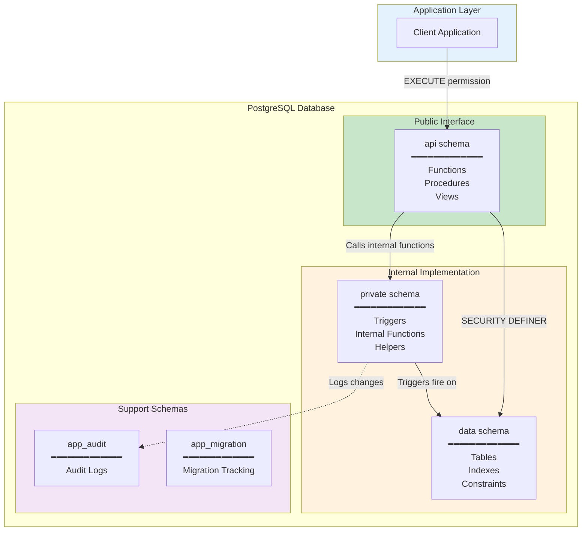
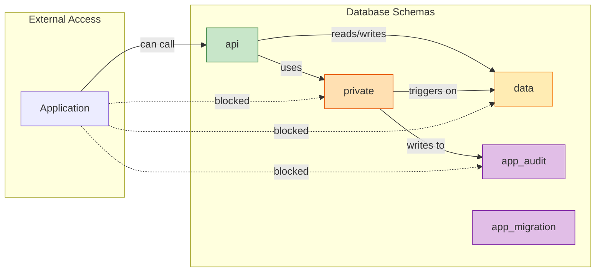
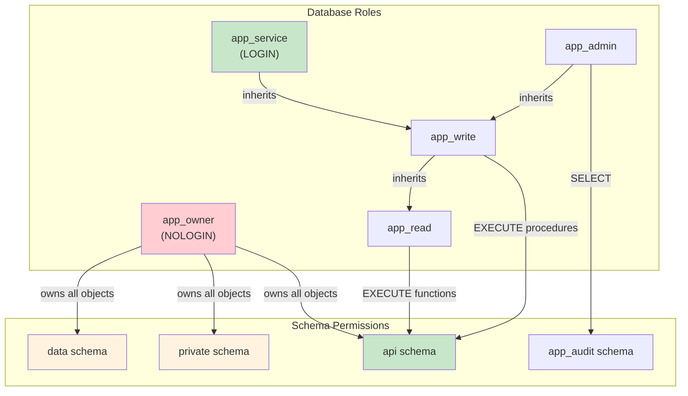

# Schema Architecture Best Practices

## Philosophy

PostgreSQL schemas provide namespaces for organizing database objects. Best practices recommend separating concerns into distinct schemas rather than placing everything in the `public` schema.

**Core Principle**: Use schema separation to:
1. Isolate internal implementation from external interfaces
2. Control access at the schema level
3. Enable API versioning without breaking changes
4. Protect sensitive data and internal logic

## Recommended Schema Structure

### High-Level Architecture



### Schema Dependency Graph



### Permission Model



## Schema Definitions

### 1. `data` Schema - Raw Tables

The `data` schema contains all base tables. No functions, no views—just tables and their constraints.

```sql
CREATE SCHEMA data;
COMMENT ON SCHEMA data IS 'Base tables - no direct external access';

-- Tables only
CREATE TABLE data.customers (
    id uuid PRIMARY KEY DEFAULT uuidv7(),
    email text NOT NULL,
    name text NOT NULL,
    password_hash text NOT NULL,  -- Sensitive!
    is_active boolean NOT NULL DEFAULT true,
    created_at timestamptz NOT NULL DEFAULT now(),
    updated_at timestamptz NOT NULL DEFAULT now()
);

CREATE TABLE data.orders (
    id uuid PRIMARY KEY DEFAULT uuidv7(),
    customer_id uuid NOT NULL REFERENCES data.customers(id),
    status text NOT NULL DEFAULT 'pending',
    total numeric(15,2) NOT NULL,
    created_at timestamptz NOT NULL DEFAULT now(),
    updated_at timestamptz NOT NULL DEFAULT now()
);

-- Indexes
CREATE UNIQUE INDEX customers_email_key ON data.customers(lower(email));
CREATE INDEX orders_customer_id_idx ON data.orders(customer_id);
CREATE INDEX orders_status_idx ON data.orders(status) WHERE status NOT IN ('completed', 'cancelled');
```

**Rules for `data` schema:**
- Contains ONLY tables, indexes, and constraints
- No functions, procedures, triggers, or views
- No direct grants to application roles
- Accessed only through `api` schema functions (which use SECURITY DEFINER)

### 2. `private` Schema - Internal Logic

The `private` schema contains:
- Trigger functions
- Internal business logic functions
- Helper functions
- Anything the application shouldn't call directly

```sql
CREATE SCHEMA private;
COMMENT ON SCHEMA private IS 'Internal functions and triggers - not exposed externally';

-- Trigger function (internal)
CREATE OR REPLACE FUNCTION private.set_updated_at()
RETURNS trigger
LANGUAGE plpgsql
AS $$
BEGIN
    NEW.updated_at := now();
    RETURN NEW;
END;
$$;

-- Apply triggers
CREATE TRIGGER customers_bu_updated_trg
    BEFORE UPDATE ON data.customers
    FOR EACH ROW
    EXECUTE FUNCTION private.set_updated_at();

CREATE TRIGGER orders_bu_updated_trg
    BEFORE UPDATE ON data.orders
    FOR EACH ROW
    EXECUTE FUNCTION private.set_updated_at();

-- Internal helper function
CREATE OR REPLACE FUNCTION private.hash_password(in_password text)
RETURNS text
LANGUAGE sql
IMMUTABLE
PARALLEL SAFE
AS $$
    SELECT crypt(in_password, gen_salt('bf', 10));
$$;

-- Internal validation
CREATE OR REPLACE FUNCTION private.verify_password(
    in_password text,
    in_hash text
)
RETURNS boolean
LANGUAGE sql
IMMUTABLE
PARALLEL SAFE
AS $$
    SELECT in_hash = crypt(in_password, in_hash);
$$;

-- Internal audit logging
CREATE OR REPLACE FUNCTION private.log_audit(
    in_table_name text,
    in_operation text,
    in_old_data jsonb,
    in_new_data jsonb
)
RETURNS void
LANGUAGE sql
AS $$
    INSERT INTO app_audit.changelog (table_name, operation, old_data, new_data)
    VALUES (in_table_name, in_operation, in_old_data, in_new_data);
$$;
```

**Rules for `private` schema:**
- Contains internal logic only
- Not exposed to API or external access
- Houses trigger functions
- Contains helper functions used by `api` schema
- May access `data` schema directly

### 3. `api` Schema - External Interface (Table API)

The `api` schema is the **only** schema exposed to applications. It contains:
- Functions and procedures (Table API)
- Views (for read-only access where appropriate)
- No direct table access

```sql
CREATE SCHEMA api;
COMMENT ON SCHEMA api IS 'Public API - external interface for applications';

-- ============================================================================
-- CUSTOMER API
-- ============================================================================

-- Read: Get customer by ID (excludes sensitive fields)
CREATE OR REPLACE FUNCTION api.get_customer(in_id uuid)
RETURNS TABLE (
    id uuid,
    email text,
    name text,
    is_active boolean,
    created_at timestamptz,
    updated_at timestamptz
)
LANGUAGE sql
STABLE
SECURITY DEFINER
SET search_path = data, private, pg_temp
AS $$
    SELECT id, email, name, is_active, created_at, updated_at
    FROM data.customers
    WHERE id = in_id;
$$;

-- Read: List customers with pagination
CREATE OR REPLACE FUNCTION api.select_customers(
    in_is_active boolean DEFAULT NULL,
    in_limit integer DEFAULT 100,
    in_offset integer DEFAULT 0
)
RETURNS TABLE (
    id uuid,
    email text,
    name text,
    is_active boolean,
    created_at timestamptz
)
LANGUAGE sql
STABLE
SECURITY DEFINER
SET search_path = data, private, pg_temp
AS $$
    SELECT id, email, name, is_active, created_at
    FROM data.customers
    WHERE in_is_active IS NULL OR is_active = in_is_active
    ORDER BY created_at DESC
    LIMIT in_limit OFFSET in_offset;
$$;

-- Write: Insert customer
CREATE OR REPLACE PROCEDURE api.insert_customer(
    in_email text,
    in_name text,
    in_password text,
    INOUT io_id uuid DEFAULT NULL
)
LANGUAGE plpgsql
SECURITY DEFINER
SET search_path = data, private, pg_temp
AS $$
BEGIN
    INSERT INTO data.customers (email, name, password_hash)
    VALUES (
        lower(trim(in_email)), 
        trim(in_name), 
        private.hash_password(in_password)
    )
    RETURNING id INTO io_id;
END;
$$;

-- Write: Update customer
CREATE OR REPLACE PROCEDURE api.update_customer(
    in_id uuid,
    in_name text DEFAULT NULL,
    in_email text DEFAULT NULL,
    in_is_active boolean DEFAULT NULL
)
LANGUAGE plpgsql
SECURITY DEFINER
SET search_path = data, private, pg_temp
AS $$
BEGIN
    UPDATE data.customers
    SET 
        name = COALESCE(trim(in_name), name),
        email = COALESCE(lower(trim(in_email)), email),
        is_active = COALESCE(in_is_active, is_active)
    WHERE id = in_id;
    
    IF NOT FOUND THEN
        RAISE EXCEPTION 'Customer not found: %', in_id
            USING ERRCODE = 'P0002';  -- no_data_found
    END IF;
END;
$$;

-- Write: Authenticate customer (returns customer data or NULL)
CREATE OR REPLACE FUNCTION api.authenticate_customer(
    in_email text,
    in_password text
)
RETURNS TABLE (
    id uuid,
    email text,
    name text
)
LANGUAGE sql
STABLE
SECURITY DEFINER
SET search_path = data, private, pg_temp
AS $$
    SELECT c.id, c.email, c.name
    FROM data.customers c
    WHERE c.email = lower(trim(in_email))
      AND c.is_active = true
      AND private.verify_password(in_password, c.password_hash);
$$;

-- ============================================================================
-- ORDER API
-- ============================================================================

-- Read: Get order with customer info
CREATE OR REPLACE FUNCTION api.get_order(in_id uuid)
RETURNS TABLE (
    id uuid,
    customer_id uuid,
    customer_email text,
    customer_name text,
    status text,
    total numeric,
    created_at timestamptz
)
LANGUAGE sql
STABLE
SECURITY DEFINER
SET search_path = data, private, pg_temp
AS $$
    SELECT 
        o.id, o.customer_id, c.email, c.name,
        o.status, o.total, o.created_at
    FROM data.orders o
    JOIN data.customers c ON c.id = o.customer_id
    WHERE o.id = in_id;
$$;

-- Read: List orders for customer
CREATE OR REPLACE FUNCTION api.select_orders_by_customer(
    in_customer_id uuid,
    in_status text DEFAULT NULL,
    in_limit integer DEFAULT 100
)
RETURNS TABLE (
    id uuid,
    status text,
    total numeric,
    created_at timestamptz
)
LANGUAGE sql
STABLE
SECURITY DEFINER
SET search_path = data, private, pg_temp
AS $$
    SELECT id, status, total, created_at
    FROM data.orders
    WHERE customer_id = in_customer_id
      AND (in_status IS NULL OR status = in_status)
    ORDER BY created_at DESC
    LIMIT in_limit;
$$;

-- Write: Create order
CREATE OR REPLACE PROCEDURE api.insert_order(
    in_customer_id uuid,
    in_total numeric,
    INOUT io_id uuid DEFAULT NULL
)
LANGUAGE plpgsql
SECURITY DEFINER
SET search_path = data, private, pg_temp
AS $$
BEGIN
    -- Verify customer exists and is active
    IF NOT EXISTS (
        SELECT 1 FROM data.customers 
        WHERE id = in_customer_id AND is_active = true
    ) THEN
        RAISE EXCEPTION 'Customer not found or inactive: %', in_customer_id
            USING ERRCODE = 'P0002';
    END IF;
    
    INSERT INTO data.orders (customer_id, total)
    VALUES (in_customer_id, in_total)
    RETURNING id INTO io_id;
END;
$$;

-- Write: Update order status
CREATE OR REPLACE PROCEDURE api.update_order_status(
    in_id uuid,
    in_status text
)
LANGUAGE plpgsql
SECURITY DEFINER
SET search_path = data, private, pg_temp
AS $$
DECLARE
    l_current_status text;
BEGIN
    SELECT status INTO l_current_status
    FROM data.orders WHERE id = in_id;

    IF NOT FOUND THEN
        RAISE EXCEPTION 'Order not found: %', in_id
            USING ERRCODE = 'P0002';
    END IF;

    -- Business rule: Can't change completed/cancelled orders
    IF l_current_status IN ('completed', 'cancelled') THEN
        RAISE EXCEPTION 'Cannot modify % order', l_current_status
            USING ERRCODE = 'P0001';
    END IF;

    UPDATE data.orders
    SET status = in_status
    WHERE id = in_id;
END;
$$;
```

**Rules for `api` schema:**
- Contains ONLY functions, procedures, and views
- No tables
- All functions use `SECURITY DEFINER` with explicit `search_path`
- Never exposes sensitive columns (passwords, internal IDs, etc.)
- All write operations are procedures, reads are functions
- Validates business rules before data access

### 4. `app_audit` Schema - Audit Logs

```sql
CREATE SCHEMA app_audit;
COMMENT ON SCHEMA app_audit IS 'Audit logging - append-only';

CREATE TABLE app_audit.changelog (
    id bigint GENERATED ALWAYS AS IDENTITY PRIMARY KEY,
    table_name text NOT NULL,
    operation text NOT NULL,
    old_data jsonb,
    new_data jsonb,
    changed_at timestamptz NOT NULL DEFAULT now(),
    changed_by text NOT NULL DEFAULT current_user
);

CREATE INDEX changelog_table_idx ON app_audit.changelog(table_name, changed_at DESC);
```

### 5. `app_migration` Schema - Migrations

See [migrations.md](migrations.md) for the complete migration system implementation.

## Security Configuration

### Role Setup

```sql
-- Schema owner (cannot login)
CREATE ROLE app_owner NOLOGIN;

-- Application roles
CREATE ROLE app_read;   -- Read-only access
CREATE ROLE app_write;  -- Read + write access
CREATE ROLE app_admin;  -- Full access

-- Inheritance
GRANT app_read TO app_write;
GRANT app_write TO app_admin;
```

### Schema Permissions

```sql
-- Revoke public access to public schema
REVOKE ALL ON SCHEMA public FROM PUBLIC;

-- data schema: No direct access
REVOKE ALL ON SCHEMA data FROM PUBLIC;
GRANT USAGE ON SCHEMA data TO app_owner;

-- private schema: No direct access  
REVOKE ALL ON SCHEMA private FROM PUBLIC;
GRANT USAGE ON SCHEMA private TO app_owner;

-- api schema: Application access
GRANT USAGE ON SCHEMA api TO app_read, app_write;

-- Grant execute on all API functions
GRANT EXECUTE ON ALL FUNCTIONS IN SCHEMA api TO app_read;
GRANT EXECUTE ON ALL PROCEDURES IN SCHEMA api TO app_write;

-- Set defaults for future objects
ALTER DEFAULT PRIVILEGES IN SCHEMA api 
    GRANT EXECUTE ON FUNCTIONS TO app_read;
ALTER DEFAULT PRIVILEGES IN SCHEMA api 
    GRANT EXECUTE ON PROCEDURES TO app_write;

-- audit schema: Read for admins only
GRANT USAGE ON SCHEMA app_audit TO app_admin;
GRANT SELECT ON ALL TABLES IN SCHEMA app_audit TO app_admin;
```

### Application Connection Role

```sql
-- Application connection role
CREATE ROLE app_service LOGIN PASSWORD 'secure_password';
GRANT app_write TO app_service;

-- Set search path for application
ALTER ROLE app_service SET search_path = api, pg_temp;
```

## Search Path Configuration

### For SECURITY DEFINER Functions

Always set explicit search_path:

```sql
CREATE FUNCTION api.some_function()
RETURNS void
SECURITY DEFINER
SET search_path = data, private, pg_temp  -- Explicit, secure
AS $$ ... $$;
```

### For Application Connections

```sql
-- In connection string or role configuration
SET search_path = api, pg_temp;
```

## API Versioning

When you need breaking changes:

```sql
-- Create new API version
CREATE SCHEMA api_v2;

-- Copy and modify functions
CREATE FUNCTION api_v2.get_customer(...) ...;

-- Maintain both versions
GRANT USAGE ON SCHEMA api_v1 TO app_read;
GRANT USAGE ON SCHEMA api_v2 TO app_read;

-- Deprecate old version eventually
COMMENT ON SCHEMA api_v1 IS 'DEPRECATED: Use api_v2. Will be removed 2025-01-01';
```

## File Organization

Organize SQL files by schema:

```
migrations/
├── V001__create_schemas.sql
├── V002__create_data_tables.sql
├── V003__create_audit_tables.sql
├── V004__create_roles.sql
├── V005__grant_permissions.sql
└── repeatable/
    ├── R__data_indexes.sql
    ├── R__private_functions.sql
    ├── R__private_triggers.sql
    ├── R__api_customer_functions.sql
    ├── R__api_order_functions.sql
    └── R__api_views.sql
```

## Quick Reference

| Schema | Contains | Direct Access | Purpose |
|--------|----------|---------------|---------|
| `data` | Tables, indexes, constraints | None (app_owner only) | Data storage |
| `private` | Triggers, internal functions | None (app_owner only) | Internal logic |
| `api` | Functions, procedures, views | app_read, app_write | External interface |
| `app_audit` | Audit tables | app_admin (read only) | Audit trail |
| `app_migration` | Migration tracking | app_admin | Schema versioning |

## Benefits of This Approach

1. **Security**: Sensitive data (passwords, internal IDs) never exposed
2. **Encapsulation**: Internal changes don't break external interfaces
3. **Versioning**: API schemas can be versioned independently
4. **Permissions**: Grant access at schema level, not object level
5. **Clarity**: Clear separation of concerns
6. **Auditability**: All changes flow through controlled functions
