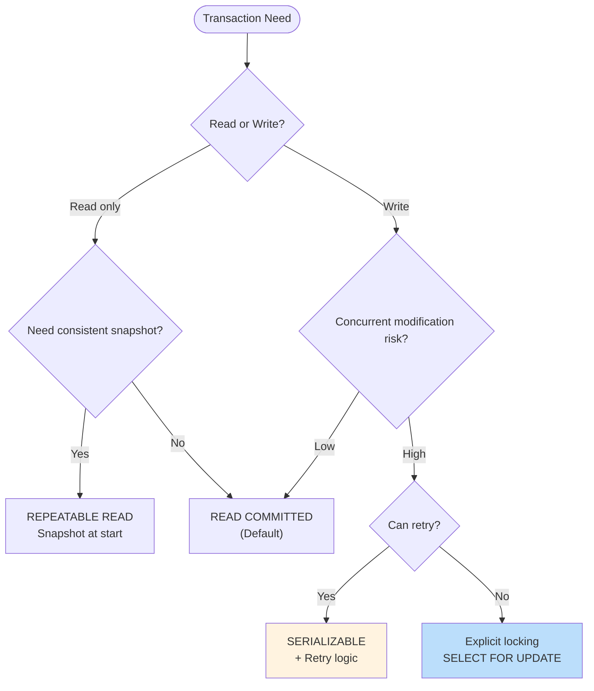

# Advanced Transaction Patterns

This document covers PostgreSQL transaction management including isolation levels, locking strategies, deadlock prevention, and savepoints.

## Table of Contents

1. [Overview](#overview)
2. [Isolation Levels](#isolation-levels)
3. [Locking Strategies](#locking-strategies)
4. [Advisory Locks](#advisory-locks)
5. [Deadlock Prevention](#deadlock-prevention)
6. [Savepoints](#savepoints)
7. [Long-Running Transactions](#long-running-transactions)
8. [Transaction Patterns](#transaction-patterns)

## Overview

### Transaction Properties (ACID)

| Property | Meaning | PostgreSQL Support |
|----------|---------|-------------------|
| **A**tomicity | All or nothing | ✅ Full |
| **C**onsistency | Valid state to valid state | ✅ Constraints |
| **I**solation | Concurrent transactions isolated | ✅ 4 levels |
| **D**urability | Committed = permanent | ✅ WAL |

### Transaction Decision Tree



## Isolation Levels

### Isolation Level Comparison

| Phenomenon | Read Uncommitted | Read Committed | Repeatable Read | Serializable |
|------------|-----------------|----------------|-----------------|--------------|
| Dirty read | Possible | ❌ No | ❌ No | ❌ No |
| Non-repeatable read | Possible | Possible | ❌ No | ❌ No |
| Phantom read | Possible | Possible | ❌ No* | ❌ No |
| Serialization anomaly | Possible | Possible | Possible | ❌ No |

*PostgreSQL's Repeatable Read prevents phantoms (uses MVCC).

### Read Committed (Default)

```sql
-- Default isolation level
-- Each statement sees committed data as of statement start
BEGIN;
SET TRANSACTION ISOLATION LEVEL READ COMMITTED;

SELECT * FROM data.accounts WHERE id = 1;
-- Another transaction commits change to account 1
SELECT * FROM data.accounts WHERE id = 1;  -- Sees new value!

COMMIT;
```

### Repeatable Read

```sql
-- Snapshot at transaction start
-- Same query always returns same results within transaction
BEGIN;
SET TRANSACTION ISOLATION LEVEL REPEATABLE READ;

SELECT * FROM data.accounts WHERE id = 1;  -- Sees balance = 100
-- Another transaction commits: balance = 50
SELECT * FROM data.accounts WHERE id = 1;  -- Still sees balance = 100!

-- But: Write conflict causes error
UPDATE data.accounts SET balance = balance - 10 WHERE id = 1;
-- ERROR: could not serialize access due to concurrent update

ROLLBACK;
```

### Serializable

```sql
-- Full serializability - as if transactions ran sequentially
-- May cause serialization_failure errors - must retry
BEGIN;
SET TRANSACTION ISOLATION LEVEL SERIALIZABLE;

-- Transaction 1: Sum and insert
SELECT SUM(balance) FROM data.accounts;
INSERT INTO data.totals (amount) VALUES (sum_result);

-- Transaction 2: Same operations concurrently
-- One will succeed, other gets serialization_failure

COMMIT;
```

### Set Isolation Level

```sql
-- Per transaction
BEGIN;
SET TRANSACTION ISOLATION LEVEL SERIALIZABLE;
-- Or
BEGIN ISOLATION LEVEL SERIALIZABLE;

-- Per session (default for all transactions)
SET SESSION CHARACTERISTICS AS TRANSACTION ISOLATION LEVEL REPEATABLE READ;

-- Check current level
SHOW transaction_isolation;
```

## Locking Strategies

### Row-Level Locks

```sql
-- FOR UPDATE: Exclusive lock, blocks other FOR UPDATE and modifications
SELECT * FROM data.accounts WHERE id = 1 FOR UPDATE;

-- FOR NO KEY UPDATE: Like FOR UPDATE but allows FOR KEY SHARE
SELECT * FROM data.accounts WHERE id = 1 FOR NO KEY UPDATE;

-- FOR SHARE: Shared lock, blocks modifications but allows other FOR SHARE
SELECT * FROM data.accounts WHERE id = 1 FOR SHARE;

-- FOR KEY SHARE: Weakest lock, blocks only modifications to key columns
SELECT * FROM data.accounts WHERE id = 1 FOR KEY SHARE;
```

### NOWAIT and SKIP LOCKED

```sql
-- NOWAIT: Fail immediately if lock not available
BEGIN;
SELECT * FROM data.accounts WHERE id = 1 FOR UPDATE NOWAIT;
-- ERROR: could not obtain lock on row in relation "accounts"
ROLLBACK;

-- SKIP LOCKED: Skip locked rows (perfect for job queues)
SELECT * FROM data.jobs
WHERE status = 'pending'
ORDER BY created_at
LIMIT 1
FOR UPDATE SKIP LOCKED;
```

### Table-Level Locks

```sql
-- Explicit table lock (rarely needed)
LOCK TABLE data.accounts IN SHARE MODE;
LOCK TABLE data.accounts IN EXCLUSIVE MODE;

-- ACCESS SHARE (SELECT): Conflicts only with ACCESS EXCLUSIVE
-- ROW SHARE (SELECT FOR UPDATE/SHARE): Conflicts with EXCLUSIVE
-- ROW EXCLUSIVE (UPDATE, DELETE, INSERT): Conflicts with SHARE, EXCLUSIVE
-- SHARE: Conflicts with ROW EXCLUSIVE
-- EXCLUSIVE: Conflicts with everything except ACCESS SHARE
-- ACCESS EXCLUSIVE (ALTER TABLE, DROP): Conflicts with everything
```

### Optimistic Locking Pattern

```sql
-- Add version column
ALTER TABLE data.orders ADD COLUMN version integer NOT NULL DEFAULT 1;

-- Update with version check
CREATE PROCEDURE api.update_order_optimistic(
    in_order_id uuid,
    in_expected_version integer,
    in_status text,
    INOUT io_new_version integer DEFAULT NULL
)
LANGUAGE plpgsql
SECURITY DEFINER
SET search_path = data, private, pg_temp
AS $$
DECLARE
    l_updated integer;
BEGIN
    UPDATE data.orders
    SET status = in_status,
        version = version + 1,
        updated_at = now()
    WHERE id = in_order_id
      AND version = in_expected_version
    RETURNING version INTO io_new_version;

    GET DIAGNOSTICS l_updated = ROW_COUNT;

    IF l_updated = 0 THEN
        -- Check if exists
        IF EXISTS (SELECT 1 FROM data.orders WHERE id = in_order_id) THEN
            RAISE EXCEPTION 'Concurrent modification detected'
                USING ERRCODE = 'P0002';
        ELSE
            RAISE EXCEPTION 'Order not found: %', in_order_id
                USING ERRCODE = 'P0002';
        END IF;
    END IF;
END;
$$;
```

### Pessimistic Locking Pattern

```sql
-- Lock row for entire transaction
CREATE PROCEDURE api.transfer_funds(
    in_from_account uuid,
    in_to_account uuid,
    in_amount numeric
)
LANGUAGE plpgsql
SECURITY DEFINER
SET search_path = data, private, pg_temp
AS $$
DECLARE
    l_from_balance numeric;
BEGIN
    -- Lock both accounts in consistent order (prevents deadlock)
    -- Always lock by sorted ID
    IF in_from_account < in_to_account THEN
        PERFORM 1 FROM data.accounts WHERE id = in_from_account FOR UPDATE;
        PERFORM 1 FROM data.accounts WHERE id = in_to_account FOR UPDATE;
    ELSE
        PERFORM 1 FROM data.accounts WHERE id = in_to_account FOR UPDATE;
        PERFORM 1 FROM data.accounts WHERE id = in_from_account FOR UPDATE;
    END IF;

    -- Check balance
    SELECT balance INTO l_from_balance
    FROM data.accounts WHERE id = in_from_account;

    IF l_from_balance < in_amount THEN
        RAISE EXCEPTION 'Insufficient funds'
            USING ERRCODE = 'P0001';
    END IF;

    -- Perform transfer
    UPDATE data.accounts SET balance = balance - in_amount
    WHERE id = in_from_account;

    UPDATE data.accounts SET balance = balance + in_amount
    WHERE id = in_to_account;
END;
$$;
```

## Advisory Locks

### Session-Level Advisory Locks

```sql
-- Acquire lock (blocks until available)
SELECT pg_advisory_lock(12345);

-- Try to acquire (returns immediately)
SELECT pg_try_advisory_lock(12345);  -- Returns true/false

-- Release lock
SELECT pg_advisory_unlock(12345);

-- Two-argument form (for namespacing)
SELECT pg_advisory_lock(1, 100);  -- Namespace 1, ID 100
```

### Transaction-Level Advisory Locks

```sql
-- Automatically released at transaction end
BEGIN;
SELECT pg_advisory_xact_lock(12345);
-- Do work...
COMMIT;  -- Lock automatically released
```

### Advisory Lock Patterns

```sql
-- Prevent concurrent execution of a function
CREATE FUNCTION api.singleton_task()
RETURNS void
LANGUAGE plpgsql
SECURITY DEFINER
SET search_path = data, private, pg_temp
AS $$
DECLARE
    co_lock_id constant bigint := 999999;
BEGIN
    -- Try to get exclusive lock
    IF NOT pg_try_advisory_lock(co_lock_id) THEN
        RAISE NOTICE 'Task already running, skipping';
        RETURN;
    END IF;

    BEGIN
        -- Do exclusive work
        RAISE NOTICE 'Running singleton task';
        PERFORM pg_sleep(5);
    EXCEPTION WHEN OTHERS THEN
        -- Ensure lock is released on error
        PERFORM pg_advisory_unlock(co_lock_id);
        RAISE;
    END;

    PERFORM pg_advisory_unlock(co_lock_id);
END;
$$;

-- Entity-specific lock
CREATE FUNCTION private.get_lock_id(in_entity_type text, in_entity_id uuid)
RETURNS bigint
LANGUAGE sql
IMMUTABLE
AS $$
    -- Generate consistent lock ID from entity
    SELECT abs(hashtext(in_entity_type || ':' || in_entity_id::text))::bigint;
$$;

-- Use for entity-level locking
SELECT pg_advisory_xact_lock(private.get_lock_id('order', 'order-uuid'));
```

## Deadlock Prevention

### Deadlock Detection

```sql
-- PostgreSQL automatically detects deadlocks
-- One transaction is aborted with:
-- ERROR: deadlock detected
-- DETAIL: Process 12345 waits for ShareLock on transaction 67890; blocked by process 67891.

-- Configure deadlock detection timeout
SET deadlock_timeout = '1s';  -- Default
```

### Prevention Strategies

```sql
-- 1. Always lock resources in same order
CREATE PROCEDURE api.update_related_entities(
    in_entity_ids uuid[]
)
LANGUAGE plpgsql
AS $$
DECLARE
    l_sorted_ids uuid[];
BEGIN
    -- Sort IDs for consistent lock order
    SELECT array_agg(id ORDER BY id) INTO l_sorted_ids
    FROM unnest(in_entity_ids) AS id;

    -- Lock in sorted order
    PERFORM 1 FROM data.entities
    WHERE id = ANY(l_sorted_ids)
    ORDER BY id
    FOR UPDATE;

    -- Now safe to update
    -- ...
END;
$$;

-- 2. Use NOWAIT with retry
CREATE FUNCTION private.acquire_lock_with_retry(
    in_table text,
    in_id uuid,
    in_max_attempts integer DEFAULT 3
)
RETURNS boolean
LANGUAGE plpgsql
AS $$
DECLARE
    l_attempt integer := 0;
BEGIN
    LOOP
        l_attempt := l_attempt + 1;

        BEGIN
            EXECUTE format(
                'SELECT 1 FROM %I WHERE id = $1 FOR UPDATE NOWAIT',
                in_table
            ) USING in_id;
            RETURN true;
        EXCEPTION
            WHEN lock_not_available THEN
                IF l_attempt >= in_max_attempts THEN
                    RETURN false;
                END IF;
                PERFORM pg_sleep(0.1 * l_attempt);  -- Exponential backoff
        END;
    END LOOP;
END;
$$;

-- 3. Reduce lock scope
-- BAD: Lock entire table
LOCK TABLE data.accounts;

-- GOOD: Lock only needed rows
SELECT 1 FROM data.accounts WHERE id = in_id FOR UPDATE;
```

### Monitor for Deadlocks

```sql
-- Check for blocked queries
SELECT
    blocked.pid AS blocked_pid,
    blocked.usename AS blocked_user,
    blocked.query AS blocked_query,
    blocking.pid AS blocking_pid,
    blocking.usename AS blocking_user,
    blocking.query AS blocking_query
FROM pg_stat_activity AS blocked
JOIN pg_locks AS blocked_locks ON blocked.pid = blocked_locks.pid
JOIN pg_locks AS blocking_locks ON blocked_locks.locktype = blocking_locks.locktype
    AND blocked_locks.database IS NOT DISTINCT FROM blocking_locks.database
    AND blocked_locks.relation IS NOT DISTINCT FROM blocking_locks.relation
    AND blocked_locks.page IS NOT DISTINCT FROM blocking_locks.page
    AND blocked_locks.tuple IS NOT DISTINCT FROM blocking_locks.tuple
    AND blocked_locks.transactionid IS NOT DISTINCT FROM blocking_locks.transactionid
    AND blocked_locks.classid IS NOT DISTINCT FROM blocking_locks.classid
    AND blocked_locks.objid IS NOT DISTINCT FROM blocking_locks.objid
    AND blocked_locks.objsubid IS NOT DISTINCT FROM blocking_locks.objsubid
    AND blocked_locks.pid != blocking_locks.pid
JOIN pg_stat_activity AS blocking ON blocking.pid = blocking_locks.pid
WHERE NOT blocked_locks.granted;

-- Deadlock statistics
SELECT * FROM pg_stat_database WHERE datname = current_database();
-- Check: deadlocks column
```

## Savepoints

### Basic Savepoints

```sql
BEGIN;

INSERT INTO data.orders (customer_id) VALUES ('cust-1');
SAVEPOINT order_created;

INSERT INTO data.order_items (order_id, product_id) VALUES ('order-1', 'prod-1');
SAVEPOINT items_added;

-- Something goes wrong
INSERT INTO data.order_items (order_id, product_id) VALUES ('order-1', 'invalid');
-- ERROR!

-- Rollback to savepoint (not entire transaction)
ROLLBACK TO SAVEPOINT items_added;

-- Continue with valid data
INSERT INTO data.order_items (order_id, product_id) VALUES ('order-1', 'prod-2');

COMMIT;  -- Order and valid items are committed
```

### Savepoint Pattern for Batch Processing

```sql
CREATE PROCEDURE api.process_batch(in_items jsonb)
LANGUAGE plpgsql
SECURITY DEFINER
SET search_path = data, private, pg_temp
AS $$
DECLARE
    l_item jsonb;
    l_success_count integer := 0;
    l_error_count integer := 0;
BEGIN
    FOR l_item IN SELECT * FROM jsonb_array_elements(in_items)
    LOOP
        -- Savepoint for each item
        BEGIN
            SAVEPOINT process_item;

            -- Process item
            INSERT INTO data.processed_items (data)
            VALUES (l_item);

            l_success_count := l_success_count + 1;

        EXCEPTION WHEN OTHERS THEN
            -- Rollback just this item
            ROLLBACK TO SAVEPOINT process_item;
            l_error_count := l_error_count + 1;

            -- Log error
            INSERT INTO data.processing_errors (item_data, error_message)
            VALUES (l_item, SQLERRM);
        END;
    END LOOP;

    RAISE NOTICE 'Processed: % success, % errors', l_success_count, l_error_count;
END;
$$;
```

### Nested Transaction Simulation

```sql
-- PostgreSQL doesn't have true nested transactions
-- Use savepoints to simulate

CREATE PROCEDURE api.outer_procedure()
LANGUAGE plpgsql
AS $$
BEGIN
    INSERT INTO data.log (message) VALUES ('Outer started');

    -- "Nested transaction" via savepoint
    BEGIN
        SAVEPOINT nested;
        CALL private.inner_procedure();
    EXCEPTION WHEN OTHERS THEN
        ROLLBACK TO SAVEPOINT nested;
        INSERT INTO data.log (message) VALUES ('Inner failed, continuing');
    END;

    INSERT INTO data.log (message) VALUES ('Outer completed');
END;
$$;
```

## Long-Running Transactions

### Problems with Long Transactions

```sql
-- Long transactions cause:
-- 1. Lock contention
-- 2. MVCC bloat (old versions retained)
-- 3. Replication lag
-- 4. Autovacuum blocked
```

### Chunked Processing Pattern

```sql
CREATE PROCEDURE api.process_large_table()
LANGUAGE plpgsql
AS $$
DECLARE
    l_batch_size constant integer := 1000;
    l_last_id uuid := '00000000-0000-0000-0000-000000000000';
    l_processed integer;
BEGIN
    LOOP
        -- Process one batch in its own transaction
        WITH batch AS (
            SELECT id
            FROM data.large_table
            WHERE id > l_last_id
              AND processed = false
            ORDER BY id
            LIMIT l_batch_size
            FOR UPDATE SKIP LOCKED
        )
        UPDATE data.large_table t
        SET processed = true
        FROM batch
        WHERE t.id = batch.id
        RETURNING t.id INTO l_last_id;

        GET DIAGNOSTICS l_processed = ROW_COUNT;

        -- Exit when no more rows
        EXIT WHEN l_processed = 0;

        -- Commit batch (implicit in procedure)
        COMMIT;

        RAISE NOTICE 'Processed batch, last_id: %', l_last_id;

        -- Optional: Small delay to reduce load
        PERFORM pg_sleep(0.1);
    END LOOP;
END;
$$;
```

### Monitor Long Transactions

```sql
-- Find long-running transactions
SELECT
    pid,
    now() - xact_start AS duration,
    state,
    query
FROM pg_stat_activity
WHERE xact_start IS NOT NULL
  AND state != 'idle'
ORDER BY xact_start;

-- Kill long transaction (if needed)
SELECT pg_terminate_backend(pid);
```

## Transaction Patterns

### Retry Pattern for Serialization Failures

```sql
CREATE FUNCTION api.execute_with_retry(
    in_sql text,
    in_max_retries integer DEFAULT 3
)
RETURNS void
LANGUAGE plpgsql
AS $$
DECLARE
    l_retry integer := 0;
BEGIN
    LOOP
        BEGIN
            EXECUTE in_sql;
            RETURN;  -- Success
        EXCEPTION
            WHEN serialization_failure OR deadlock_detected THEN
                l_retry := l_retry + 1;
                IF l_retry > in_max_retries THEN
                    RAISE;  -- Give up
                END IF;
                RAISE NOTICE 'Retry % after %', l_retry, SQLERRM;
                PERFORM pg_sleep(0.1 * power(2, l_retry));  -- Exponential backoff
        END;
    END LOOP;
END;
$$;
```

### Two-Phase Commit (for distributed transactions)

```sql
-- Prepare transaction (rarely used, for distributed systems)
BEGIN;
-- Do work
PREPARE TRANSACTION 'my_transaction_id';

-- Later, commit or rollback
COMMIT PREPARED 'my_transaction_id';
-- Or
ROLLBACK PREPARED 'my_transaction_id';

-- View prepared transactions
SELECT * FROM pg_prepared_xacts;
```

### Read-Only Transaction

```sql
-- Explicitly read-only (optimization hint)
BEGIN READ ONLY;
SELECT * FROM data.accounts;
-- UPDATE would fail: ERROR: cannot execute UPDATE in a read-only transaction
COMMIT;

-- Deferrable (can wait for clean snapshot in serializable)
BEGIN ISOLATION LEVEL SERIALIZABLE READ ONLY DEFERRABLE;
-- Good for long-running reports
COMMIT;
```
