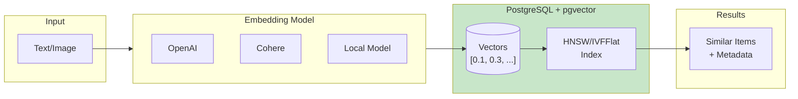

# Vector Search with pgvector

This document covers vector similarity search using the pgvector extension, including embedding storage, indexing strategies, and hybrid search patterns.

## Table of Contents

1. [Overview](#overview)
2. [Installation & Setup](#installation--setup)
3. [Schema Design](#schema-design)
4. [Index Types](#index-types)
5. [Query Patterns](#query-patterns)
6. [Hybrid Search](#hybrid-search)
7. [Performance Optimization](#performance-optimization)
8. [Integration Patterns](#integration-patterns)

## Overview

### When to Use pgvector

| Use Case | pgvector | Dedicated Vector DB |
|----------|----------|---------------------|
| < 10M vectors | ✅ Excellent | Overkill |
| Combined with SQL data | ✅ Natural fit | Requires sync |
| Operational simplicity | ✅ One database | Multiple systems |
| > 100M vectors | ⚠️ Consider limits | ✅ Better |
| Real-time updates | ✅ Good | ✅ Good |
| Filtering + similarity | ✅ Excellent | ⚠️ Varies |

### Vector Search Concepts



## Installation & Setup

### Install pgvector Extension

```sql
-- Install extension (requires PostgreSQL 11+)
CREATE EXTENSION IF NOT EXISTS vector;

-- Verify installation
SELECT * FROM pg_extension WHERE extname = 'vector';
```

### Vector Dimensions

```sql
-- Common embedding dimensions:
-- OpenAI text-embedding-ada-002: 1536
-- OpenAI text-embedding-3-small: 1536
-- OpenAI text-embedding-3-large: 3072
-- Cohere embed-english-v3.0: 1024
-- sentence-transformers/all-MiniLM-L6-v2: 384
-- CLIP: 512

-- Maximum dimensions: 16,000 (pgvector 0.5+)
```

## Schema Design

### Basic Vector Table

```sql
CREATE TABLE data.documents (
    id              uuid PRIMARY KEY DEFAULT uuidv7(),
    title           text NOT NULL,
    content         text NOT NULL,
    embedding       vector(1536),  -- OpenAI ada-002 dimensions

    created_at      timestamptz NOT NULL DEFAULT now(),
    updated_at      timestamptz NOT NULL DEFAULT now()
);

-- Comment on dimension choice
COMMENT ON COLUMN data.documents.embedding IS 'OpenAI text-embedding-ada-002 (1536 dimensions)';
```

### Multi-Vector Design (Different Embeddings)

```sql
CREATE TABLE data.products (
    id              uuid PRIMARY KEY DEFAULT uuidv7(),
    name            text NOT NULL,
    description     text,
    image_url       text,

    -- Different embeddings for different modalities
    name_embedding      vector(1536),   -- Text embedding
    desc_embedding      vector(1536),   -- Text embedding
    image_embedding     vector(512),    -- CLIP image embedding

    created_at      timestamptz NOT NULL DEFAULT now(),
    updated_at      timestamptz NOT NULL DEFAULT now()
);

-- Index each embedding type separately
CREATE INDEX products_name_embedding_idx ON data.products
    USING hnsw (name_embedding vector_cosine_ops);

CREATE INDEX products_image_embedding_idx ON data.products
    USING hnsw (image_embedding vector_cosine_ops);
```

### Chunked Documents Pattern

```sql
-- Main document table
CREATE TABLE data.documents (
    id              uuid PRIMARY KEY DEFAULT uuidv7(),
    title           text NOT NULL,
    source_url      text,
    metadata        jsonb NOT NULL DEFAULT '{}',
    created_at      timestamptz NOT NULL DEFAULT now()
);

-- Chunks with embeddings
CREATE TABLE data.document_chunks (
    id              uuid PRIMARY KEY DEFAULT uuidv7(),
    document_id     uuid NOT NULL REFERENCES data.documents(id) ON DELETE CASCADE,
    chunk_index     integer NOT NULL,
    content         text NOT NULL,
    token_count     integer NOT NULL,
    embedding       vector(1536) NOT NULL,

    UNIQUE (document_id, chunk_index)
);

CREATE INDEX document_chunks_document_id_idx ON data.document_chunks(document_id);
CREATE INDEX document_chunks_embedding_idx ON data.document_chunks
    USING hnsw (embedding vector_cosine_ops);
```

### Embedding with Metadata

```sql
CREATE TABLE data.embeddings (
    id              uuid PRIMARY KEY DEFAULT uuidv7(),
    source_type     text NOT NULL,  -- 'document', 'product', 'user'
    source_id       uuid NOT NULL,
    embedding       vector(1536) NOT NULL,

    -- Metadata for filtering
    category        text,
    language        text,
    created_at      timestamptz NOT NULL DEFAULT now(),

    UNIQUE (source_type, source_id)
);

-- Partial indexes for common filters
CREATE INDEX embeddings_docs_idx ON data.embeddings
    USING hnsw (embedding vector_cosine_ops)
    WHERE source_type = 'document';

CREATE INDEX embeddings_products_idx ON data.embeddings
    USING hnsw (embedding vector_cosine_ops)
    WHERE source_type = 'product';
```

## Index Types

### HNSW (Hierarchical Navigable Small World)

```sql
-- HNSW: Best for most use cases
-- Pros: Faster queries, better recall
-- Cons: Slower build, more memory

CREATE INDEX documents_embedding_hnsw_idx ON data.documents
    USING hnsw (embedding vector_cosine_ops);

-- With tuning parameters
CREATE INDEX documents_embedding_hnsw_idx ON data.documents
    USING hnsw (embedding vector_cosine_ops)
    WITH (m = 16, ef_construction = 64);

-- Parameters:
-- m: Max connections per node (default 16, higher = better recall, more memory)
-- ef_construction: Build-time beam width (default 64, higher = slower build, better index)
```

### IVFFlat (Inverted File with Flat Compression)

```sql
-- IVFFlat: Faster to build, less memory
-- Pros: Faster index creation, smaller size
-- Cons: Requires training, lower recall

-- Create index (requires data in table first)
CREATE INDEX documents_embedding_ivf_idx ON data.documents
    USING ivfflat (embedding vector_cosine_ops)
    WITH (lists = 100);

-- Rule of thumb for lists:
-- lists = sqrt(row_count) for < 1M rows
-- lists = sqrt(row_count) to row_count/1000 for > 1M rows
```

### Distance Functions

```sql
-- Cosine distance (most common for text embeddings)
CREATE INDEX idx_cosine ON data.documents
    USING hnsw (embedding vector_cosine_ops);

-- L2 (Euclidean) distance
CREATE INDEX idx_l2 ON data.documents
    USING hnsw (embedding vector_l2_ops);

-- Inner product (for normalized vectors)
CREATE INDEX idx_ip ON data.documents
    USING hnsw (embedding vector_ip_ops);

-- Query operators:
-- <=> cosine distance
-- <-> L2 distance
-- <#> inner product (negative)
```

### Index Selection Guide

| Scenario | Index Type | Distance | Parameters |
|----------|------------|----------|------------|
| General text search | HNSW | cosine | m=16, ef_construction=64 |
| Large dataset (>10M) | IVFFlat | cosine | lists=sqrt(n) |
| High recall needed | HNSW | cosine | m=32, ef_construction=128 |
| Memory constrained | IVFFlat | cosine | lists=n/1000 |
| Normalized vectors | HNSW | inner product | default |

## Query Patterns

### Basic Similarity Search

```sql
-- Find 10 most similar documents
SELECT id, title, content, embedding <=> '[0.1, 0.2, ...]'::vector AS distance
FROM data.documents
ORDER BY embedding <=> '[0.1, 0.2, ...]'::vector
LIMIT 10;
```

### Similarity Search with Threshold

```sql
-- Find documents within distance threshold
SELECT id, title, 1 - (embedding <=> $1) AS similarity
FROM data.documents
WHERE embedding <=> $1 < 0.3  -- Distance threshold
ORDER BY embedding <=> $1
LIMIT 20;
```

### API Function for Similarity Search

```sql
CREATE FUNCTION api.search_similar_documents(
    in_query_embedding vector(1536),
    in_limit integer DEFAULT 10,
    in_min_similarity real DEFAULT 0.7
)
RETURNS TABLE (
    id uuid,
    title text,
    content text,
    similarity real
)
LANGUAGE sql
STABLE
SECURITY DEFINER
SET search_path = data, private, pg_temp
AS $$
    SELECT
        id,
        title,
        content,
        1 - (embedding <=> in_query_embedding) AS similarity
    FROM data.documents
    WHERE 1 - (embedding <=> in_query_embedding) >= in_min_similarity
    ORDER BY embedding <=> in_query_embedding
    LIMIT in_limit;
$$;
```

### K-Nearest Neighbors with Filter

```sql
-- Similarity search with category filter
SELECT id, title, embedding <=> $1 AS distance
FROM data.documents
WHERE category = 'technical'
  AND language = 'en'
ORDER BY embedding <=> $1
LIMIT 10;

-- Note: Filter reduces index effectiveness
-- Consider partial indexes for common filters
```

### Chunked Document Search with Context

```sql
CREATE FUNCTION api.search_documents(
    in_query_embedding vector(1536),
    in_limit integer DEFAULT 5
)
RETURNS TABLE (
    document_id uuid,
    document_title text,
    chunk_content text,
    similarity real,
    context_before text,
    context_after text
)
LANGUAGE sql
STABLE
SECURITY DEFINER
SET search_path = data, private, pg_temp
AS $$
    WITH ranked_chunks AS (
        SELECT
            c.document_id,
            c.chunk_index,
            c.content,
            1 - (c.embedding <=> in_query_embedding) AS similarity,
            ROW_NUMBER() OVER (PARTITION BY c.document_id ORDER BY c.embedding <=> in_query_embedding) AS rn
        FROM data.document_chunks c
        ORDER BY c.embedding <=> in_query_embedding
        LIMIT in_limit * 3  -- Get more for deduplication
    )
    SELECT
        d.id AS document_id,
        d.title AS document_title,
        rc.content AS chunk_content,
        rc.similarity,
        prev.content AS context_before,
        next.content AS context_after
    FROM ranked_chunks rc
    JOIN data.documents d ON d.id = rc.document_id
    LEFT JOIN data.document_chunks prev ON prev.document_id = rc.document_id
        AND prev.chunk_index = rc.chunk_index - 1
    LEFT JOIN data.document_chunks next ON next.document_id = rc.document_id
        AND next.chunk_index = rc.chunk_index + 1
    WHERE rc.rn = 1  -- Best chunk per document
    ORDER BY rc.similarity DESC
    LIMIT in_limit;
$$;
```

## Hybrid Search

### Combine FTS with Vector Search

```sql
-- Table with both FTS and vector
CREATE TABLE data.articles (
    id              uuid PRIMARY KEY DEFAULT uuidv7(),
    title           text NOT NULL,
    content         text NOT NULL,
    embedding       vector(1536),

    -- Full-text search vector
    search_vector   tsvector GENERATED ALWAYS AS (
        setweight(to_tsvector('english', coalesce(title, '')), 'A') ||
        setweight(to_tsvector('english', coalesce(content, '')), 'B')
    ) STORED,

    created_at      timestamptz NOT NULL DEFAULT now()
);

CREATE INDEX articles_embedding_idx ON data.articles
    USING hnsw (embedding vector_cosine_ops);
CREATE INDEX articles_search_idx ON data.articles
    USING gin (search_vector);
```

### Hybrid Search Function

```sql
CREATE FUNCTION api.hybrid_search(
    in_query_text text,
    in_query_embedding vector(1536),
    in_limit integer DEFAULT 10,
    in_vector_weight real DEFAULT 0.5  -- Balance between FTS and vector
)
RETURNS TABLE (
    id uuid,
    title text,
    content text,
    combined_score real,
    fts_score real,
    vector_score real
)
LANGUAGE sql
STABLE
SECURITY DEFINER
SET search_path = data, private, pg_temp
AS $$
    WITH fts_results AS (
        SELECT
            id,
            ts_rank(search_vector, websearch_to_tsquery('english', in_query_text)) AS score
        FROM data.articles
        WHERE search_vector @@ websearch_to_tsquery('english', in_query_text)
    ),
    vector_results AS (
        SELECT
            id,
            1 - (embedding <=> in_query_embedding) AS score
        FROM data.articles
        ORDER BY embedding <=> in_query_embedding
        LIMIT 100  -- Pre-filter for performance
    ),
    combined AS (
        SELECT
            COALESCE(f.id, v.id) AS id,
            COALESCE(f.score, 0) AS fts_score,
            COALESCE(v.score, 0) AS vector_score
        FROM fts_results f
        FULL OUTER JOIN vector_results v ON f.id = v.id
    )
    SELECT
        a.id,
        a.title,
        a.content,
        (c.fts_score * (1 - in_vector_weight) + c.vector_score * in_vector_weight) AS combined_score,
        c.fts_score,
        c.vector_score
    FROM combined c
    JOIN data.articles a ON a.id = c.id
    ORDER BY combined_score DESC
    LIMIT in_limit;
$$;
```

### Reciprocal Rank Fusion (RRF)

```sql
CREATE FUNCTION api.rrf_search(
    in_query_text text,
    in_query_embedding vector(1536),
    in_limit integer DEFAULT 10,
    in_k integer DEFAULT 60  -- RRF constant
)
RETURNS TABLE (
    id uuid,
    title text,
    rrf_score real
)
LANGUAGE sql
STABLE
SECURITY DEFINER
SET search_path = data, private, pg_temp
AS $$
    WITH fts_ranked AS (
        SELECT
            id,
            ROW_NUMBER() OVER (ORDER BY ts_rank(search_vector, q) DESC) AS rank
        FROM data.articles, websearch_to_tsquery('english', in_query_text) AS q
        WHERE search_vector @@ q
        LIMIT 100
    ),
    vector_ranked AS (
        SELECT
            id,
            ROW_NUMBER() OVER (ORDER BY embedding <=> in_query_embedding) AS rank
        FROM data.articles
        ORDER BY embedding <=> in_query_embedding
        LIMIT 100
    ),
    rrf_scores AS (
        SELECT
            COALESCE(f.id, v.id) AS id,
            COALESCE(1.0 / (in_k + f.rank), 0) +
            COALESCE(1.0 / (in_k + v.rank), 0) AS rrf_score
        FROM fts_ranked f
        FULL OUTER JOIN vector_ranked v ON f.id = v.id
    )
    SELECT
        a.id,
        a.title,
        r.rrf_score
    FROM rrf_scores r
    JOIN data.articles a ON a.id = r.id
    ORDER BY r.rrf_score DESC
    LIMIT in_limit;
$$;
```

## Performance Optimization

### Query Tuning

```sql
-- Set HNSW search parameters (per query)
SET hnsw.ef_search = 100;  -- Default 40, higher = better recall, slower

-- Set IVFFlat search parameters
SET ivfflat.probes = 10;  -- Default 1, higher = better recall, slower

-- For specific query
BEGIN;
SET LOCAL hnsw.ef_search = 200;
SELECT * FROM api.search_similar_documents($1, 10);
COMMIT;
```

### Batch Vector Operations

```sql
-- Batch insert with COPY
COPY data.documents (id, title, content, embedding)
FROM STDIN WITH (FORMAT csv);

-- Batch similarity search
CREATE FUNCTION api.batch_similarity_search(
    in_query_embeddings vector(1536)[],
    in_limit_per_query integer DEFAULT 5
)
RETURNS TABLE (
    query_index integer,
    document_id uuid,
    similarity real
)
LANGUAGE sql
STABLE
AS $$
    SELECT
        q.idx AS query_index,
        d.id AS document_id,
        1 - (d.embedding <=> q.embedding) AS similarity
    FROM unnest(in_query_embeddings) WITH ORDINALITY AS q(embedding, idx)
    CROSS JOIN LATERAL (
        SELECT id, embedding
        FROM data.documents
        ORDER BY embedding <=> q.embedding
        LIMIT in_limit_per_query
    ) d
    ORDER BY q.idx, similarity DESC;
$$;
```

### Index Maintenance

```sql
-- Check index size
SELECT
    indexrelname,
    pg_size_pretty(pg_relation_size(indexrelid)) AS size
FROM pg_stat_user_indexes
WHERE indexrelname LIKE '%embedding%';

-- Rebuild index (if needed after many updates)
REINDEX INDEX CONCURRENTLY documents_embedding_hnsw_idx;

-- Vacuum to reclaim space
VACUUM ANALYZE data.documents;
```

### Monitor Query Performance

```sql
-- Explain analyze vector query
EXPLAIN (ANALYZE, BUFFERS)
SELECT id, embedding <=> '[...]'::vector AS distance
FROM data.documents
ORDER BY embedding <=> '[...]'::vector
LIMIT 10;

-- Should show: Index Scan using documents_embedding_hnsw_idx
```

## Integration Patterns

### Store Embeddings from Application

```sql
CREATE PROCEDURE api.upsert_document_embedding(
    in_document_id uuid,
    in_title text,
    in_content text,
    in_embedding vector(1536)
)
LANGUAGE plpgsql
SECURITY DEFINER
SET search_path = data, private, pg_temp
AS $$
BEGIN
    INSERT INTO data.documents (id, title, content, embedding)
    VALUES (in_document_id, in_title, in_content, in_embedding)
    ON CONFLICT (id) DO UPDATE
    SET title = EXCLUDED.title,
        content = EXCLUDED.content,
        embedding = EXCLUDED.embedding,
        updated_at = now();
END;
$$;
```

### Python Integration Example

```python
import psycopg
from openai import OpenAI

# Generate embedding
client = OpenAI()
response = client.embeddings.create(
    input="Your text here",
    model="text-embedding-ada-002"
)
embedding = response.data[0].embedding

# Store in PostgreSQL
with psycopg.connect("postgresql://...") as conn:
    conn.execute("""
        INSERT INTO data.documents (title, content, embedding)
        VALUES (%s, %s, %s)
    """, ("Title", "Content", embedding))

# Search
with psycopg.connect("postgresql://...") as conn:
    results = conn.execute("""
        SELECT id, title, 1 - (embedding <=> %s) AS similarity
        FROM data.documents
        ORDER BY embedding <=> %s
        LIMIT 10
    """, (embedding, embedding)).fetchall()
```

### RAG (Retrieval Augmented Generation) Pattern

```sql
-- Function for RAG context retrieval
CREATE FUNCTION api.get_rag_context(
    in_query_embedding vector(1536),
    in_max_chunks integer DEFAULT 5,
    in_max_tokens integer DEFAULT 4000
)
RETURNS TABLE (
    context text,
    sources jsonb
)
LANGUAGE sql
STABLE
SECURITY DEFINER
SET search_path = data, private, pg_temp
AS $$
    WITH relevant_chunks AS (
        SELECT
            c.content,
            c.token_count,
            d.title AS source_title,
            d.source_url,
            1 - (c.embedding <=> in_query_embedding) AS similarity,
            SUM(c.token_count) OVER (ORDER BY c.embedding <=> in_query_embedding) AS cumulative_tokens
        FROM data.document_chunks c
        JOIN data.documents d ON d.id = c.document_id
        ORDER BY c.embedding <=> in_query_embedding
        LIMIT in_max_chunks * 2
    ),
    filtered_chunks AS (
        SELECT *
        FROM relevant_chunks
        WHERE cumulative_tokens <= in_max_tokens
        LIMIT in_max_chunks
    )
    SELECT
        string_agg(content, E'\n\n---\n\n' ORDER BY similarity DESC) AS context,
        jsonb_agg(DISTINCT jsonb_build_object(
            'title', source_title,
            'url', source_url
        )) AS sources
    FROM filtered_chunks;
$$;
```
